## 一、文档信息

| 项目名称 | 智能AI考试平台 |
|---------|-----------|
| 文档版本 | V1.0 |
| 编制日期 | 2026-07-11 |
| 编制人 | 项目组 |
| 审核人 | - |
| 批准人 | - |
| 客户单位 | - |
| 编制单位 | 智能AI考试平台项目组 |
| 适用范围 | 职业资格认证、企业培训考核、技能测评等在线考试与练习场景 |
| 核心目标 | 以人工智能赋能出题、组卷、阅卷全流程，覆盖多终端考试与认证发证 |
| 文档状态 | 草稿 |

**历史版本**

| 版本 | 日期 | 作者 | 更改说明 |
|-----|------|------|---------|
| V1.0 | 2026-07-11 | 项目组 | 初始版本 |

---

## 二、项目概述

### 2.1 项目背景

随着职业资格认证、企业技能培训、在线测评需求的持续增长，传统考试组织方式面临以下挑战：

1. **命题效率低、题库更新慢**：人工出题耗时耗力，题目质量参差不齐，难以快速扩充题库并保证覆盖各知识点。
2. **组卷依赖人工、难以兼顾均衡**：人工组卷需反复权衡题型、难度、知识点分布，效率低且不同卷面难度不一致。
3. **主观题阅卷成本高、标准不统一**：主观题依赖人工评卷，工作量大、周期长，且不同评卷人的评分尺度存在差异。
4. **在线考试作弊风险高**：远程考试缺乏有效的身份核验与行为监控手段，考试严肃性和公平性难以保障。
5. **多终端场景割裂**：考生在不同设备上的考试与练习体验不统一，缺乏一体化的平台支撑。

为解决上述问题，建设智能AI考试平台，引入人工智能辅助出题、组卷、阅卷，结合全链路防作弊技术，实现从命题到认证发证的一体化管理，提升考试组织效率与公平性。

### 2.2 项目建设目标

本项目旨在建设一套以人工智能为核心能力的在线考试与认证平台，实现以下目标：

1. **AI赋能命题与阅卷**：通过人工智能辅助批量出题、智能组卷、主观题自动阅卷，显著降低命题与评卷的人工成本，缩短考试组织周期。
2. **多终端一体化考试**：提供管理后台、监考端、网页考生端、桌面考试端、移动端多终端支持，满足不同场景下的考试与练习需求，数据统一管理。
3. **全链路防作弊保障**：集成防切屏检测、人脸核身、音视频与屏幕监控、操作限制、题目乱序等手段，配合实时监考，保障考试公平与严肃性。
4. **认证发证闭环管理**：支持资格认证项目管理、报考审核、考试通过后自动颁发可查验的电子证书，形成完整的认证业务闭环。
5. **数据驱动的学情分析**：基于考试与练习数据生成学情分析报告和统计报表，为教学与考核决策提供数据支撑。

### 2.3 项目建设范围

本项目建设范围包括：

**系统端**：

- 管理后台（Web应用）：面向管理与业务人员的全平台管理
- 监考端（Web应用）：面向监考人员的实时监控与异常处置
- 网页考生端（Web应用）：面向考生的在线考试与练习
- 桌面考试端（桌面应用）：面向考生的强防作弊考试
- 移动端（移动应用）：面向考生的移动考试与练习

**功能模块**：

- 题库管理：题目、题型、难度、知识点维护，AI出题与解析生成
- 试卷管理：固定试卷（手动组卷、AI组卷）与随机试卷（抽题规则）两种类型
- 考试管理：选择试卷创建考试、考生分配、防作弊策略配置
- 阅卷中心：客观题自动判分、主观题AI阅卷、人工复核
- 资格认证：认证项目、报考审核
- 监考中心：监考安排、异常处置、录像回放
- 证书管理：证书模板、颁发、查验
- 外部考生管理：外部单位考生信息维护与考试账号生成
- 报表中心：统计分析、学情分析
- 组织管理、用户管理、角色管理、系统管理

**数据范围**：

- 题库数据、试卷数据、考试与答卷数据、成绩与证书数据、认证与报考数据、考试行为与监考数据、系统配置数据

**不包含的功能**：

- 线下考场硬件对接（如闸机、专用摄像头）：预留接口，后续迭代实现
- 第三方支付与收费：本期不含考试收费相关功能

### 2.4 业务流程图

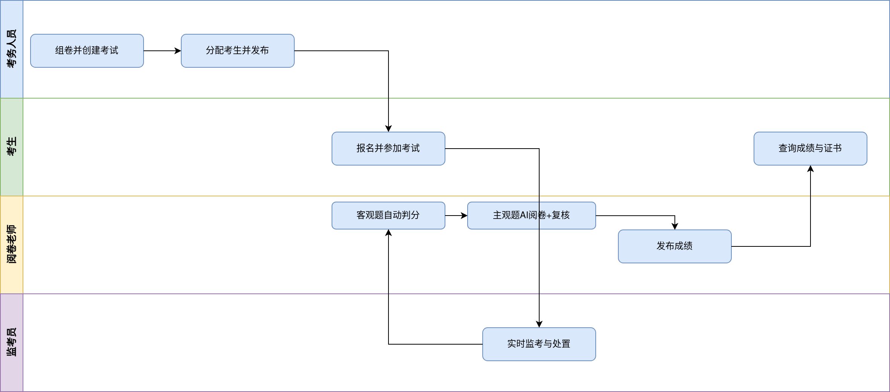

### 2.5 业务角色定义

| 角色名称 | 角色描述 | 主要职责 | 权限范围 |
|---------|---------|---------|---------|
| 系统管理员 | 负责平台配置与系统管理 | 用户管理、角色权限配置、AI模型配置、系统参数维护 | 全部功能 |
| 考务人员 | 负责命题与考试组织 | 题库维护、组卷、创建考试、考生分配、认证与证书管理 | 命题与考试组织相关功能 |
| 阅卷老师 | 负责主观题评卷 | 主观题AI阅卷结果复核、评分修正 | 阅卷中心相关功能 |
| 监考员 | 负责考试实时监控 | 实时监控考生、处置异常事件、远程提醒或终止考试 | 监考端与监考中心相关功能 |
| 内部考生 | 本组织内参加考试与练习的用户，来源于用户管理 | 报考、参加考试、在线练习、查看成绩与证书 | 考生端相关功能 |
| 外部考生 | 外部单位参加考试的用户，来源于外部考生管理，由系统生成考试账号 | 参加考试、查看成绩与证书 | 考生端相关功能 |

---

## 三、项目建设内容

### 3.1 总体功能架构

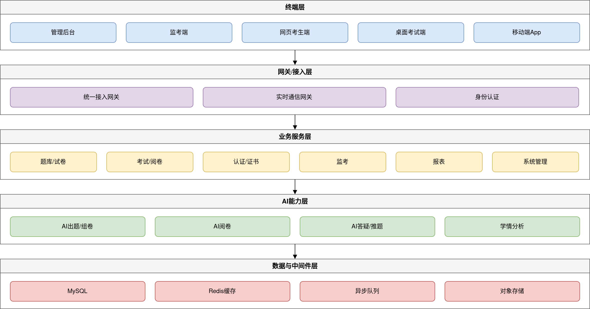

平台由五个终端与统一的业务服务组成，各终端共享同一套业务数据。菜单结构分端描述如下：

**PC 端（管理后台）**

- 题库管理（一级菜单）
  - 题目管理（二级菜单）
  - 题型管理（二级菜单）
  - 难度管理（二级菜单）
  - 知识点分类（二级菜单）
- 试卷管理（一级菜单）
- 考试管理（一级菜单）
- 阅卷中心（一级菜单）
- 资格认证（一级菜单）
  - 认证项目（二级菜单）
  - 报考审核（二级菜单）
- 监考中心（一级菜单）
  - 监考安排（二级菜单）
  - 异常事件（二级菜单）
  - 录像回放（二级菜单）
- 证书管理（一级菜单）
  - 证书模板（二级菜单）
  - 证书发放（二级菜单）
  - 证书查验（二级菜单）
- 外部考生管理（一级菜单）
- 报表中心（一级菜单）
  - 考试统计（二级菜单）
  - 成绩分析（二级菜单）
  - 学情分析（二级菜单）
- 组织管理（一级菜单）
  - 组织架构（二级菜单）
  - 考点管理（二级菜单）
- 用户管理（一级菜单）
- 角色管理（一级菜单）
- 系统管理（一级菜单）
  - 参数配置（二级菜单）
  - AI模型配置（二级菜单）
  - 数据字典（二级菜单）
  - 操作日志（二级菜单）

**监考端（Web）**

- 实时监控（一级菜单）
- 异常事件（一级菜单）
- 录像回放（一级菜单）

**考生端（网页 / 桌面）**

- 考试（一级菜单）
- 练习（一级菜单）
- 错题本（一级菜单）
- 成绩查询（一级菜单）
- 我的证书（一级菜单）

**移动端**

- 首页（底部导航 Tab）
- 工作台（底部导航 Tab）
- 消息（底部导航 Tab）
- 我的（底部导航 Tab）

### 3.2 需求功能清单

| 序号 | 业务需求 | 需求概述 | 优先级 |
|-----|---------|---------|-------|
| 1 | 用户身份认证 | 用户通过账号密码登录，不同角色拥有不同功能权限 | P0 |
| 2 | 题库管理 | 维护题目、题型、难度、知识点分类，支持批量导入，作为组卷与练习的基础数据 | P0 |
| 3 | AI辅助出题 | 按知识点、题型、难度自动生成题目草稿，经人工审核后入库 | P0 |
| 4 | AI文档导入出题 | 上传资料自动抽取知识点并批量生成题目草稿 | P1 |
| 5 | AI生成解析 | 为题目自动生成答案解析 | P1 |
| 6 | 试卷管理 | 维护固定试卷与随机试卷（抽题规则），供创建考试选用 | P0 |
| 7 | AI智能组卷 | 按总分、时长、知识点分布自动推荐固定试卷组卷方案 | P1 |
| 8 | 随机试卷抽题规则 | 按题型、难度、知识点维度设置抽题数量与分值，考试时随机抽题 | P0 |
| 9 | 考试管理 | 选择试卷创建考试，分配考生，配置防作弊策略 | P0 |
| 10 | 客观题自动阅卷 | 交卷后按标准答案自动判分 | P0 |
| 11 | 主观题AI阅卷 | 按评分标准对主观题自动评分并给出评语 | P0 |
| 12 | 人工阅卷复核 | 阅卷老师复核并修正AI评分，保留复核记录 | P0 |
| 13 | 资格认证管理 | 维护认证项目，审核考生报考资格，关联对应考试 | P1 |
| 14 | 实时监考 | 监考员实时监控考生画面与行为，处置异常事件 | P0 |
| 15 | 防作弊管控 | 通过防切屏、人脸核身、音视频监控、操作限制、题目乱序保障考试公平 | P0 |
| 16 | 证书管理 | 维护证书模板，考试通过后颁发可查验的电子证书 | P1 |
| 17 | 外部考生管理 | 维护外部单位考生信息并生成考试账号，供考试分配选用 | P1 |
| 18 | 报表统计 | 提供考试统计、成绩分析、通过率等报表 | P1 |
| 19 | AI学情分析 | 基于考试与练习数据生成个人或群体学情分析报告 | P1 |
| 20 | 在线考试 | 考生在线作答，支持倒计时、自动保存、断线续考 | P0 |
| 21 | 在线练习 | 考生按题库或知识点练习，支持AI答疑、错题本、AI推题 | P1 |
| 22 | 组织管理 | 维护组织架构、部门、考点 | P1 |
| 23 | 角色权限管理 | 基于角色配置功能访问权限 | P0 |
| 24 | AI模型配置 | 配置并切换AI服务所用的大模型及参数 | P1 |
| 25 | 系统管理 | 维护系统参数、数据字典，记录操作日志 | P1 |

### 3.3 页面功能清单

| 终端 | 一级菜单 | 二级菜单 | 子功能 | 功能描述 |
|-----|---------|---------|-------|---------|
| PC端 | 题库管理 | 题目管理 | 筛选 | 按题干关键词、题型、难度、知识点筛选题目 |
| ^ | ^ | ^ | 列表 | 分页展示题目列表 |
| ^ | ^ | ^ | 新增 | 录入题目内容、选项、答案、解析、分类信息 |
| ^ | ^ | ^ | 编辑 | 修改已有题目信息 |
| ^ | ^ | ^ | 删除 | 删除指定题目 |
| ^ | ^ | ^ | 批量导入 | 按模板批量导入题目 |
| ^ | ^ | ^ | AI出题 | 按知识点、题型、难度、数量生成题目草稿 |
| ^ | ^ | ^ | AI文档导入出题 | 上传资料自动抽取知识点并生成题目草稿 |
| ^ | ^ | ^ | AI生成解析 | 为指定题目生成答案解析 |
| ^ | ^ | ^ | 待审题目审核 | 审核AI生成的题目草稿，通过后入正式题库 |
| ^ | ^ | 题型管理 | 列表 | 查看系统支持的题型 |
| ^ | ^ | ^ | 启用/停用 | 切换题型可用状态 |
| ^ | ^ | 难度管理 | 列表 | 查看难度等级 |
| ^ | ^ | ^ | 新增 | 新增难度等级 |
| ^ | ^ | ^ | 编辑 | 修改难度等级 |
| ^ | ^ | ^ | 删除 | 删除难度等级 |
| ^ | ^ | 知识点分类 | 列表 | 按层级查看知识点分类 |
| ^ | ^ | ^ | 新增 | 新增知识点分类 |
| ^ | ^ | ^ | 编辑 | 修改知识点分类 |
| ^ | ^ | ^ | 删除 | 删除知识点分类 |
| ^ | 试卷管理 | - | 筛选 | 按试卷名称、类型、状态筛选试卷 |
| ^ | ^ | - | 列表 | 分页展示固定试卷与随机试卷 |
| ^ | ^ | - | 新增固定试卷（手动组卷） | 选择具体题目组合为固定试卷并设置分值 |
| ^ | ^ | - | 新增固定试卷（AI组卷） | 按总分、时长、知识点分布生成固定试卷组卷方案 |
| ^ | ^ | - | 新增随机试卷（抽题规则） | 按题型、难度、知识点维度设置抽题数量与分值 |
| ^ | ^ | - | 预览 | 查看试卷完整内容或抽题配置 |
| ^ | ^ | - | 编辑 | 修改试卷题目分值或抽题规则 |
| ^ | ^ | - | 删除 | 删除指定试卷 |
| ^ | 考试管理 | - | 筛选 | 按考试名称、状态、时间筛选考试 |
| ^ | ^ | - | 列表 | 分页展示考试列表 |
| ^ | ^ | - | 创建考试 | 选择一份试卷（固定或随机）创建考试，设置时间与时长 |
| ^ | ^ | - | 分配考生 | 为考试指定参加考试的内部与外部考生 |
| ^ | ^ | - | 配置防作弊策略 | 设置防切屏、人脸核身、监控、乱序等策略 |
| ^ | ^ | - | 编辑 | 修改未开始考试的配置 |
| ^ | ^ | - | 发布 | 发布考试使考生可见 |
| ^ | ^ | - | 撤回 | 撤回未开始的考试 |
| ^ | ^ | - | 删除 | 删除指定考试 |
| ^ | 阅卷中心 | - | 筛选 | 按考试、阅卷状态筛选阅卷任务 |
| ^ | ^ | - | 列表 | 分页展示阅卷任务列表 |
| ^ | ^ | - | 客观题判分查看 | 查看客观题自动判分结果 |
| ^ | ^ | - | 主观题AI阅卷 | 触发主观题AI评分并查看评分与评语 |
| ^ | ^ | - | 人工复核 | 复核并修正AI评分 |
| ^ | ^ | - | 复核记录查看 | 查看复核人、时间与评分修改记录 |
| ^ | ^ | - | 成绩发布 | 汇总总分并发布成绩 |
| ^ | ^ | - | 成绩撤回 | 撤回已发布成绩 |
| ^ | 资格认证 | 认证项目 | 筛选 | 按认证名称、状态筛选认证项目 |
| ^ | ^ | ^ | 列表 | 分页展示认证项目列表 |
| ^ | ^ | ^ | 新增 | 新增认证项目并关联考试 |
| ^ | ^ | ^ | 编辑 | 修改认证项目信息 |
| ^ | ^ | ^ | 删除 | 删除认证项目 |
| ^ | ^ | 报考审核 | 列表 | 查看考生报考记录 |
| ^ | ^ | ^ | 审核 | 审核考生报考资格 |
| ^ | 监考中心 | 监考安排 | 列表 | 查看各考试的监考安排 |
| ^ | ^ | ^ | 分配监考员 | 为考试指定监考员 |
| ^ | ^ | 异常事件 | 列表 | 查看考试异常事件记录 |
| ^ | ^ | ^ | 处置 | 对异常事件进行标记与裁定 |
| ^ | ^ | 录像回放 | 查看 | 回放考生考试录像 |
| ^ | 证书管理 | 证书模板 | 列表 | 查看证书模板 |
| ^ | ^ | ^ | 新增 | 新增证书模板 |
| ^ | ^ | ^ | 编辑 | 修改证书模板 |
| ^ | ^ | ^ | 删除 | 删除证书模板 |
| ^ | ^ | 证书发放 | 列表 | 查看已颁发证书 |
| ^ | ^ | ^ | 颁发 | 为通过考试的考生颁发证书 |
| ^ | ^ | ^ | 作废 | 作废指定证书 |
| ^ | ^ | 证书查验 | 查验 | 通过编号或查验码验证证书真伪 |
| ^ | 外部考生管理 | - | 筛选 | 按姓名、所属单位、准考证号筛选外部考生 |
| ^ | ^ | - | 列表 | 分页展示外部考生列表 |
| ^ | ^ | - | 新增 | 录入外部考生信息并生成考试账号 |
| ^ | ^ | - | 编辑 | 修改外部考生信息 |
| ^ | ^ | - | 删除 | 删除外部考生 |
| ^ | ^ | - | 批量导入 | 按模板批量导入外部考生并生成账号 |
| ^ | ^ | - | 重置密码 | 重置外部考生考试账号密码 |
| ^ | 报表中心 | 考试统计 | 指标统计 | 查看考试场次、参考人数、平均分、通过率等指标 |
| ^ | ^ | ^ | 趋势分析 | 按时间维度查看考试数据变化趋势 |
| ^ | ^ | 成绩分析 | 分布分析 | 按分数段查看成绩分布 |
| ^ | ^ | ^ | 排名对比 | 按成绩查看考生排名 |
| ^ | ^ | 学情分析 | AI学情报告 | 生成个人或群体学情分析报告 |
| ^ | ^ | ^ | 导出 | 导出报表数据 |
| ^ | 组织管理 | 组织架构 | 列表 | 按层级查看组织与部门 |
| ^ | ^ | ^ | 新增 | 新增组织或部门 |
| ^ | ^ | ^ | 编辑 | 修改组织或部门信息 |
| ^ | ^ | ^ | 删除 | 删除组织或部门 |
| ^ | ^ | 考点管理 | 列表 | 查看考点列表 |
| ^ | ^ | ^ | 新增 | 新增考点 |
| ^ | ^ | ^ | 编辑 | 修改考点信息 |
| ^ | ^ | ^ | 删除 | 删除考点 |
| ^ | 用户管理 | - | 筛选 | 按用户名、角色、状态筛选用户 |
| ^ | ^ | - | 列表 | 分页展示用户列表 |
| ^ | ^ | - | 新增 | 新增用户并分配角色 |
| ^ | ^ | - | 编辑 | 修改用户信息与角色 |
| ^ | ^ | - | 启用/停用 | 切换用户可用状态 |
| ^ | ^ | - | 重置密码 | 重置用户登录密码 |
| ^ | 角色管理 | - | 列表 | 查看角色列表 |
| ^ | ^ | - | 新增 | 新增角色 |
| ^ | ^ | - | 编辑 | 修改角色信息 |
| ^ | ^ | - | 分配权限 | 为角色配置功能访问权限 |
| ^ | ^ | - | 删除 | 删除角色 |
| ^ | 系统管理 | 参数配置 | 列表 | 查看与修改系统参数 |
| ^ | ^ | AI模型配置 | 列表 | 查看已配置的AI模型 |
| ^ | ^ | ^ | 新增 | 新增AI模型配置 |
| ^ | ^ | ^ | 编辑 | 修改模型参数与密钥 |
| ^ | ^ | ^ | 切换启用 | 切换当前启用的AI模型 |
| ^ | ^ | ^ | 连接测试 | 测试AI模型连通性 |
| ^ | ^ | 数据字典 | 列表 | 维护系统枚举字典 |
| ^ | ^ | 操作日志 | 列表 | 查看系统操作日志 |
| 监考端 | 实时监控 | - | 画面墙 | 集中查看所在考试全部考生的实时画面 |
| ^ | ^ | - | 异常告警 | 接收并查看考生异常行为告警 |
| ^ | ^ | - | 远程提醒 | 向指定考生发送提醒 |
| ^ | ^ | - | 强制交卷 | 对违规考生强制结束考试 |
| ^ | 异常事件 | - | 事件流 | 按时间查看异常事件明细 |
| ^ | ^ | - | 标记 | 标记异常事件处理结果 |
| ^ | 录像回放 | - | 回放 | 回放指定考生的考试录像 |
| 网页考生端 | 考试 | - | 考试列表 | 查看可参加的考试 |
| ^ | ^ | - | 身份核验 | 开考前进行身份核验 |
| ^ | ^ | - | 在线答题 | 作答题目，支持倒计时与自动保存 |
| ^ | ^ | - | 断线续考 | 断线重连后恢复答题进度 |
| ^ | ^ | - | 交卷 | 提交答卷 |
| ^ | 练习 | - | 练习列表 | 按题库或知识点选择练习 |
| ^ | ^ | - | 在线练习 | 作答练习题并查看解析 |
| ^ | ^ | - | AI答疑 | 就题目向AI提问获取解答 |
| ^ | ^ | - | AI推题 | 按薄弱知识点获取推荐练习 |
| ^ | 错题本 | - | 错题列表 | 查看历史错题 |
| ^ | ^ | - | 错题练习 | 针对错题进行再练习 |
| ^ | 成绩查询 | - | 成绩列表 | 查看历次考试成绩 |
| ^ | ^ | - | 成绩详情 | 查看单次考试的作答与得分详情 |
| ^ | 我的证书 | - | 证书列表 | 查看已获得的证书 |
| ^ | ^ | - | 证书详情 | 查看证书详情与查验码 |
| 桌面考试端 | 考试 | - | 考试列表 | 查看可参加的考试 |
| ^ | ^ | - | 身份核验 | 开考前进行身份核验 |
| ^ | ^ | - | 全屏考试 | 在强制全屏环境下作答，屏蔽切屏与快捷键 |
| ^ | ^ | - | 断线续考 | 断线重连后恢复答题进度 |
| ^ | ^ | - | 交卷 | 提交答卷 |
| ^ | 练习 | - | 在线练习 | 作答练习题并查看解析 |
| 移动端 | 首页 | - | 待考提醒 | 查看待参加考试与报考提醒 |
| ^ | ^ | - | 数据概览 | 查看个人考试与练习概况 |
| ^ | 工作台 | - | 参加考试 | 选择考试完成身份核验并作答 |
| ^ | ^ | - | 在线练习 | 按题库或知识点练习并查看解析 |
| ^ | ^ | - | AI答疑 | 就题目向AI提问获取解答 |
| ^ | ^ | - | 错题本 | 查看并再练习历史错题 |
| ^ | ^ | - | 拍照抓拍 | 考试中按要求进行人脸抓拍上传 |
| ^ | 消息 | - | 通知列表 | 查看考试通知与提醒 |
| ^ | 我的 | - | 个人信息 | 查看与维护个人信息 |
| ^ | ^ | - | 我的成绩 | 查看历次成绩 |
| ^ | ^ | - | 我的证书 | 查看已获得的证书 |
| ^ | ^ | - | 退出登录 | 退出当前账号 |

### 3.4 页面访问权限

| 功能模块 | 系统管理员 | 考务人员 | 阅卷老师 | 监考员 | 考生 |
|---------|-----------|---------|---------|-------|------|
| 题库管理 | 全部权限 | 全部权限 | 无 | 无 | 无 |
| 试卷管理 | 全部权限 | 全部权限 | 无 | 无 | 无 |
| 考试管理 | 全部权限 | 全部权限 | 无 | 无 | 无 |
| 阅卷中心 | 全部权限 | 查看 | 全部权限 | 无 | 无 |
| 资格认证 | 全部权限 | 全部权限 | 无 | 无 | 无 |
| 监考中心 | 全部权限 | 查看 | 无 | 全部权限 | 无 |
| 证书管理 | 全部权限 | 全部权限 | 无 | 无 | 无 |
| 外部考生管理 | 全部权限 | 全部权限 | 无 | 无 | 无 |
| 报表中心 | 全部权限 | 查看 | 无 | 无 | 无 |
| 组织管理 | 全部权限 | 无 | 无 | 无 | 无 |
| 用户管理 | 全部权限 | 无 | 无 | 无 | 无 |
| 角色管理 | 全部权限 | 无 | 无 | 无 | 无 |
| 系统管理 | 全部权限 | 无 | 无 | 无 | 无 |
| 监考端 | 全部权限 | 无 | 无 | 全部权限 | 无 |
| 考生端（考试/练习/错题/成绩/证书） | 无 | 无 | 无 | 无 | 全部权限 |
| 移动端 | 无 | 无 | 无 | 无 | 全部权限 |

### 3.5 功能详细设计

### 3.5.1 题库管理

题库管理是命题的基础模块，维护题目及其分类体系，为组卷与练习提供题源。

#### 3.5.1.1 题目管理

**（一）功能需求概述**

题目管理用于维护考试系统的全部题目及其属性，支持人工录入、批量导入和 AI 辅助出题三种方式获取题源，并通过审核机制保障题目质量，为组卷与练习提供可靠的题目数据支撑。

**（二）功能设计**

**查询/筛选功能**

支持以下条件筛选，条件之间为"与"关系，点击搜索按钮触发查询：

| 筛选字段 | 类型 | 说明 |
|---------|------|------|
| 题干关键词 | 文本输入 | 支持模糊搜索 |
| 题型 | 单选 | 来源于题型管理中已启用的题型 |
| 难度 | 单选 | 来源于难度管理中已录入的难度等级 |
| 知识点 | 层级选择 | 来源于知识点分类中已维护的知识点 |

**列表功能**

| 列名 | 字段类型 | 说明 |
|-----|---------|------|
| 题干摘要 | 文本 | - |
| 题型 | 文本 | - |
| 难度 | 文本 | - |
| 所属知识点 | 文本 | - |
| 题目状态 | 状态标签 | 正式 / 待审 |
| 创建时间 | 日期时间 | - |
| 操作 | 操作按钮 | 编辑、删除（无权限时隐藏） |

分页默认每页10条，支持切换每页数量。列表为空时显示："暂无题目数据"。

**新增功能**

点击"新增题目"，弹出编辑窗口，填写题目信息。

| 字段名称 | 类型 | 长度限制 | 必填 | 默认值 | 说明 |
|---------|------|---------|------|-------|------|
| 题干 | 多行文本 | - | 是 | - | - |
| 题型 | 单选 | - | 是 | - | 枚举值：单选题 / 多选题 / 判断题 / 填空题 / 问答题 / 论述题 |
| 选项 | 多行文本 | - | 客观题必填 | - | 仅单选题、多选题、判断题、填空题需填写 |
| 标准答案 | 文本输入 | - | 是 | - | - |
| 答案解析 | 多行文本 | - | 否 | - | - |
| 难度 | 单选 | - | 是 | - | 来源于难度管理中已录入的难度等级 |
| 知识点 | 层级选择 | - | 是 | - | 来源于知识点分类中已维护的知识点 |
| 分值建议 | 数字输入 | - | 否 | - | - |

提交成功：新增题目成功。
提交失败：保留填写内容，显示具体错误原因。

**编辑功能**

点击"编辑"，弹出编辑窗口，自动填入当前记录数据，表单字段同新增。
提交成功：编辑题目成功。

**删除功能**

点击"删除"，弹出确认"确定删除该题目吗？"。
删除成功：删除题目成功。
该题目已被固定试卷引用时，阻止删除，提示"该题目已被试卷引用，无法删除"。

**批量导入功能**

点击"批量导入"，下载标准模板，按模板填写后上传文件，确认导入。
导入成功：提示"成功导入 X 道题目"。

**AI出题功能**

点击"AI出题"，填写生成条件后提交，由AI自动生成题目草稿，生成的题目进入"待审"状态。

| 字段名称 | 类型 | 长度限制 | 必填 | 默认值 | 说明 |
|---------|------|---------|------|-------|------|
| 知识点 | 层级选择 | - | 是 | - | 来源于知识点分类中已维护的知识点 |
| 题型 | 单选 | - | 是 | - | 来源于题型管理中已启用的题型 |
| 难度 | 单选 | - | 是 | - | 来源于难度管理中已录入的难度等级 |
| 生成数量 | 数字输入 | - | 是 | - | 不超过系统配置的单次AI出题最大数量 |

生成中：提示"正在生成，请稍候"。
生成成功：提示"已生成 X 道待审题目"，题目进入待审列表。
生成数量超出上限：阻止提交，提示"单次生成数量超出上限"。

**AI文档导入出题功能**

点击"AI文档导入出题"，上传资料文件后提交，由AI自动抽取知识点并生成题目草稿，生成的题目进入"待审"状态。

| 字段名称 | 类型 | 长度限制 | 必填 | 默认值 | 说明 |
|---------|------|---------|------|-------|------|
| 资料文件 | 文件上传 | 单个≤20MB | 是 | - | 支持文档、表格等文本类资料 |

解析成功：提示"已从资料生成 X 道待审题目"。
解析失败：提示"资料解析失败，请检查文件内容或格式"。

**AI生成解析功能**

对指定题目点击"生成解析"，由AI自动生成该题目的答案解析。
生成成功：提示"解析生成成功"，解析自动填入该题目。
生成失败：提示"解析生成失败，请稍后重试"。

**待审题目审核功能**

在题目列表筛选出"待审"状态的题目，进入待审题目详情，逐题审核。

- 点击"审核通过"：题目转为"正式"状态，正式入库，提示"审核通过，题目已转为正式状态"。
- 点击"退回"：需填写退回原因（文本输入，必填，≤200字，说明退回理由），退回后题目保持"待审"状态并记录退回原因，提示"已退回"。

审核通过是AI生成题目进入正式题库的唯一入口。

**业务规则**

- AI生成的题目（含AI出题和AI文档导入出题方式生成的题目）必须经人工审核通过后才能进入正式题库，审核通过前状态保持"待审"。
- 题目被固定试卷引用时，删除需先解除关联，提示"该题目已被试卷引用，无法删除"。
- 客观题（单选题、多选题、判断题、填空题）新增/编辑时选项为必填项；主观题（问答题、论述题）无需填写选项。

**边界与异常**

- **空数据**：列表无数据时，显示"暂无题目数据"。
- **权限不足**：新增、编辑、删除按钮对无权限角色完全隐藏（不渲染，非禁用）。
- **AI服务不可用**：AI出题、AI文档导入出题、AI生成解析功能降级为人工录入，提示"AI服务暂不可用，请稍后重试或手动录入"。

**（三）业务逻辑关联**

- 题型数据来源于题型管理中已启用的题型，题型停用后AI出题与手动录入均不可选该题型。
- 难度数据来源于难度管理中已录入的难度等级。
- 知识点数据来源于知识点分类中已维护的知识点。
- 正式状态的题目被固定试卷组卷选用，并作为随机试卷抽题规则的抽取题源。

**（四）用户操作流程图**

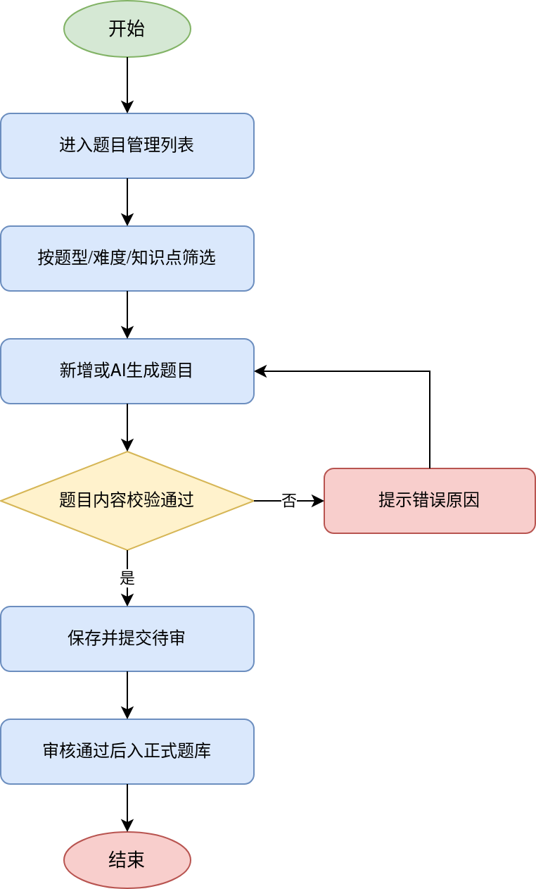

**（五）功能时序图**

#### 3.5.1.2 题型管理

**（一）功能需求概述**

题型管理用于维护系统支持的题目类型，管理员可对题型进行启用或停用，控制题目管理中题目录入和AI出题时可选择的题型范围。

**（二）功能设计**

**列表功能**

| 列名 | 字段类型 | 说明 |
|-----|---------|------|
| 题型名称 | 文本 | 枚举值：单选题 / 多选题 / 判断题 / 填空题 / 问答题 / 论述题 |
| 状态 | 状态标签 | 启用 / 停用 |
| 操作 | 操作按钮 | 启用/停用（无权限时隐藏） |

列表为空时显示："暂无题型数据"。

**启用/停用功能**

点击"停用"，弹出确认"确定停用该题型吗？停用后该题型将无法用于出题"，确认后题型状态变更为"停用"。
点击"启用"，题型状态变更为"启用"。

**业务规则**

- 题型停用后，题目管理中的AI出题与手动录入均不可选择该题型，提示"该题型已停用，无法选择"。

**边界与异常**

- **空数据**：列表无数据时，显示"暂无题型数据"。
- **权限不足**：启用/停用按钮对无权限角色完全隐藏（不渲染，非禁用）。

**（三）业务逻辑关联**

- 题型的启用状态被题目管理引用，控制新增题目和AI出题时可选择的题型范围。

**（四）用户操作流程图**

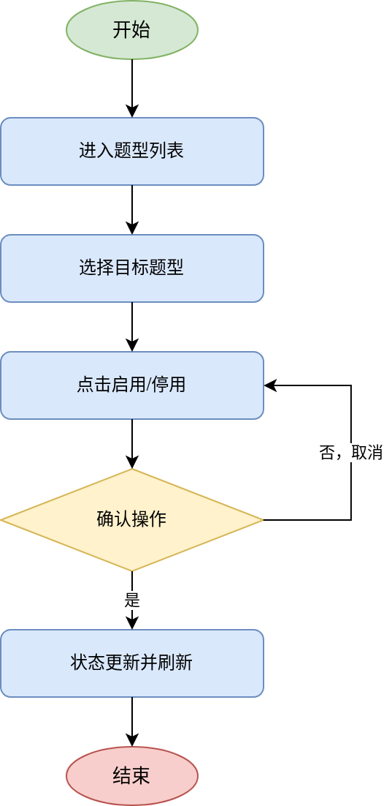

**（五）功能时序图**

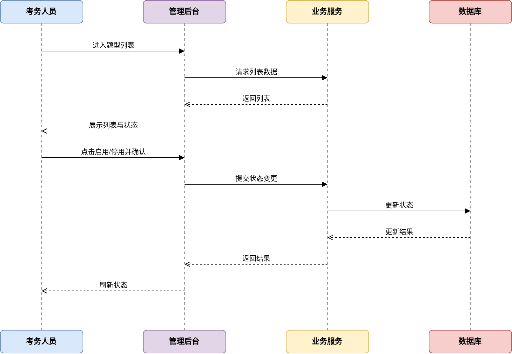

#### 3.5.1.3 难度管理

**（一）功能需求概述**

难度管理用于维护题目的难度等级体系（如简单、中等、困难），为题目管理中的难度字段提供统一的可选范围。

**（二）功能设计**

**列表功能**

| 列名 | 字段类型 | 说明 |
|-----|---------|------|
| 难度名称 | 文本 | 如：简单、中等、困难 |
| 操作 | 操作按钮 | 编辑、删除（无权限时隐藏） |

分页默认每页10条，支持切换每页数量。列表为空时显示："暂无难度数据"。

**新增功能**

点击"新增难度"，弹出编辑窗口，填写难度信息。

| 字段名称 | 类型 | 长度限制 | 必填 | 默认值 | 说明 |
|---------|------|---------|------|-------|------|
| 难度名称 | 文本输入 | ≤20字 | 是 | - | 全局唯一 |

提交成功：新增难度成功。
提交失败：保留填写内容，显示具体错误原因。

**编辑功能**

点击"编辑"，弹出编辑窗口，自动填入当前记录数据，表单字段同新增。
提交成功：编辑难度成功。

**删除功能**

点击"删除"，弹出确认"确定删除该难度吗？"。
删除成功：删除难度成功。
该难度被题目引用时，阻止删除，提示"该难度已被题目引用，无法删除"。

**业务规则**

- 难度名称在系统内全局唯一。新增/编辑时若重复，阻止提交，提示"难度【XXX】已存在，请更换名称"。
- 难度被题目引用时，删除需先解除关联，提示"该难度已被题目引用，无法删除"。

**边界与异常**

- **空数据**：列表无数据时，显示"暂无难度数据"。
- **权限不足**：新增、编辑、删除按钮对无权限角色完全隐藏（不渲染，非禁用）。

**（三）业务逻辑关联**

- 难度数据被题目管理引用，作为题目难度字段的可选范围。

**（四）用户操作流程图**

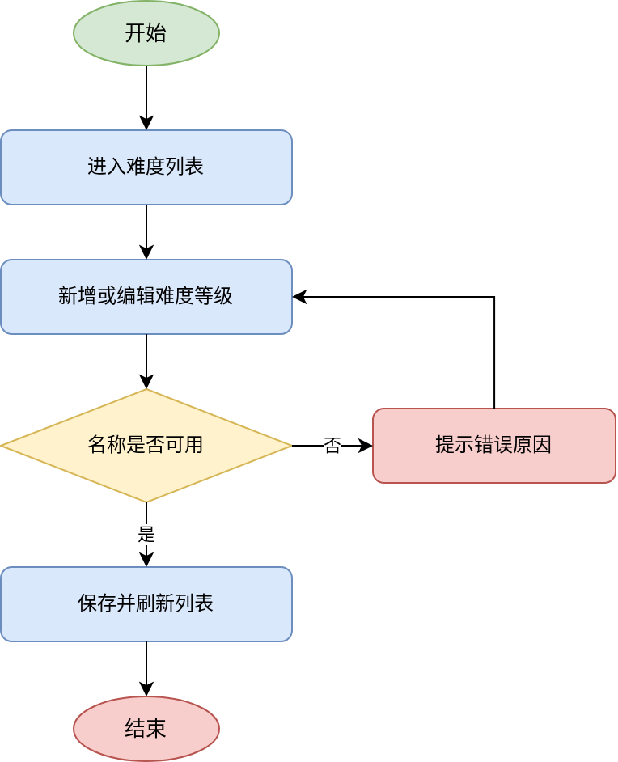

**（五）功能时序图**

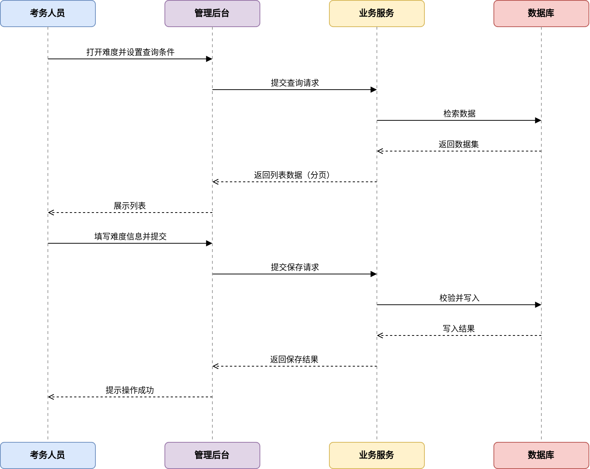

#### 3.5.1.4 知识点分类

**（一）功能需求概述**

知识点分类用于按层级维护题目所属的知识点体系，为题目管理中的知识点字段和题目筛选提供分类依据。

**（二）功能设计**

**列表功能**

| 列名 | 字段类型 | 说明 |
|-----|---------|------|
| 分类名称 | 文本 | 按层级展示 |
| 上级分类 | 文本 | 顶级分类显示"-" |
| 操作 | 操作按钮 | 编辑、删除（无权限时隐藏） |

列表为空时显示："暂无分类数据"。

**新增功能**

点击"新增分类"，弹出编辑窗口，填写分类信息。

| 字段名称 | 类型 | 长度限制 | 必填 | 默认值 | 说明 |
|---------|------|---------|------|-------|------|
| 分类名称 | 文本输入 | ≤50字 | 是 | - | 同级分类下唯一 |
| 上级分类 | 层级选择 | - | 否 | - | 不选则为顶级分类 |

提交成功：新增分类成功。
提交失败：保留填写内容，显示具体错误原因。

**编辑功能**

点击"编辑"，弹出编辑窗口，自动填入当前记录数据，表单字段同新增。
提交成功：编辑分类成功。

**删除功能**

点击"删除"，弹出确认"确定删除该分类吗？"。
删除成功：删除分类成功。
该分类下存在子分类或关联题目时，阻止删除，提示"该分类下存在子分类或题目，无法删除"。

**业务规则**

- 分类名称在同级分类下唯一。新增/编辑时若重复，阻止提交，提示"分类【XXX】已存在，请更换名称"。
- 分类下存在子分类或关联题目时，删除需先解除关联，提示"该分类下存在子分类或题目，无法删除"。

**边界与异常**

- **空数据**：列表无数据时，显示"暂无分类数据"。
- **权限不足**：新增、编辑、删除按钮对无权限角色完全隐藏（不渲染，非禁用）。

**（三）业务逻辑关联**

- 知识点分类数据被题目管理引用，作为题目知识点字段和题目筛选的层级选择来源。

**（四）用户操作流程图**

**（五）功能时序图**

### 3.5.2 试卷管理

试卷管理用于将题库中的题目组织为可用于考试的试卷。试卷分为两种类型：**固定试卷**（题目固定，通过手动组卷或AI组卷生成）和**随机试卷**（配置抽题规则，考试时按规则为每位考生随机抽题）。两类试卷统一在同一列表中维护，供考试管理直接选用。

**（一）功能需求概述**

试卷管理用于维护固定试卷与随机试卷，支持按名称、类型、状态查询已有试卷，通过手动组卷、AI组卷生成固定试卷，或通过配置抽题规则生成随机试卷，为考试安排提供可直接引用的试卷数据。

**（二）功能设计**

**查询/筛选功能**

支持以下条件筛选，条件之间为"与"关系，点击搜索按钮触发查询：

| 筛选字段 | 类型 | 说明 |
|---------|------|------|
| 试卷名称 | 文本输入 | 支持模糊搜索 |
| 试卷类型 | 单选 | 枚举值：固定试卷/随机试卷 |
| 试卷状态 | 单选 | 枚举值：草稿/已发布 |

**列表功能**

| 列名 | 字段类型 | 说明 |
|-----|---------|------|
| 试卷名称 | 文本 | - |
| 试卷类型 | 状态标签 | 固定试卷/随机试卷 |
| 总分 | 数值 | 固定试卷为各题分值之和；随机试卷为抽题规则各项分值合计，系统自动计算 |
| 题目数量 | 数值 | 固定试卷为实际题数；随机试卷为抽题规则的总抽取数量 |
| 时长建议 | 数值 | 单位：分钟 |
| 试卷状态 | 状态标签 | 草稿/已发布 |
| 创建时间 | 时间 | 系统自动记录 |
| 操作 | 操作按钮 | 预览、编辑（仅草稿状态可用）、删除（无权限时隐藏） |

分页默认每页10条，支持切换每页数量。列表为空时显示：暂无试卷数据。

**新增固定试卷（手动组卷）**

点击"手动组卷"进入新建试卷页面，从题库中选择具体题目组合，逐题设置分值，并设置试卷名称与时长建议，生成固定试卷。

| 字段名称 | 类型 | 长度限制 | 必填 | 默认值 | 说明 |
|---------|------|---------|------|-------|------|
| 试卷名称 | 文本输入 | 2-50字 | 是 | - | - |
| 时长建议 | 数值输入 | - | 是 | - | 单位：分钟 |
| 题目选择 | 多选 | 至少1题 | 是 | - | 来源于题库管理中已启用的题目 |
| 每题分值 | 数值输入 | - | 是 | - | 逐题设置，用于计算试卷总分 |

提交成功：试卷创建成功。
提交失败：保留填写内容，显示具体错误原因。

**新增固定试卷（AI组卷）**

点击"AI组卷"进入新建试卷页面，输入总分、时长、知识点分布要求，由AI自动推荐一套组卷方案，可采纳或调整方案后保存为固定试卷。

| 字段名称 | 类型 | 长度限制 | 必填 | 默认值 | 说明 |
|---------|------|---------|------|-------|------|
| 试卷名称 | 文本输入 | 2-50字 | 是 | - | - |
| 总分 | 数值输入 | - | 是 | - | AI按此总分生成推荐方案 |
| 时长建议 | 数值输入 | - | 是 | - | 单位：分钟 |
| 知识点分布要求 | 文本输入 | - | 否 | - | 描述各知识点占比或题量偏好 |

系统根据以上要求生成推荐题目方案，展示每道推荐题目及分值，支持对推荐方案进行调整（替换题目、调整分值）后保存。
提交成功：试卷创建成功。
提交失败：保留填写内容，显示具体错误原因。

**新增随机试卷（抽题规则）**

点击"新增随机试卷"进入新建试卷页面，设置试卷名称、时长建议，并按【题型 × 难度 × 知识点】维度逐条设置抽取数量与每题分值（如：单选题-简单-某知识点，抽5题每题2分）。考试时系统按此规则为每位考生随机抽题生成卷面。

| 字段名称 | 类型 | 长度限制 | 必填 | 默认值 | 说明 |
|---------|------|---------|------|-------|------|
| 试卷名称 | 文本输入 | 2-50字 | 是 | - | - |
| 时长建议 | 数值输入 | - | 是 | - | 单位：分钟 |
| 抽题配置 | 列表添加 | 至少1条 | 是 | - | 逐条设置题型、难度、知识点及对应抽取数量与分值 |

抽题配置字段表：

| 字段名称 | 类型 | 长度限制 | 必填 | 默认值 | 说明 |
|---------|------|---------|------|-------|------|
| 题型 | 单选 | - | 是 | - | 来源于题库管理中已启用的题型 |
| 难度 | 单选 | - | 是 | - | 来源于题库管理中已启用的难度等级 |
| 知识点 | 单选 | - | 是 | - | 来源于题库管理中已启用的知识点 |
| 抽取数量 | 数值输入 | - | 是 | - | 该题型/难度/知识点组合下抽取的题目数量 |
| 每题分值 | 数值输入 | - | 是 | - | 该组合下每道题的分值 |

提交成功：试卷创建成功。
提交失败：保留填写内容，显示具体错误原因。

**预览功能**

点击"预览"，固定试卷查看完整题目与答案；随机试卷查看抽题配置与预计卷面构成。

**编辑功能**

点击"编辑"（仅草稿状态可用），自动填入当前试卷数据：固定试卷填入题目与分值，随机试卷填入抽题配置，表单字段同对应的新增功能。
提交成功：试卷修改成功。

**删除功能**

点击"删除"，弹出确认"确定删除该试卷吗？"。
删除成功：删除成功。
有关联数据时阻止删除，提示"该试卷已被考试引用，无法删除"。

**业务规则**

- 固定试卷总分等于各题分值之和；随机试卷总分等于抽题规则各项（抽取数量×每题分值）之和，保存前系统自动校验。固定试卷题目为空时阻止保存，提示"请至少添加一道题目"；随机试卷抽题配置为空时阻止保存，提示"请至少添加一条抽题配置"。
- 随机试卷某题型/难度/知识点组合下可用题目数量不足抽取数量时，保存或使用时提示"[题型/难度/知识点]可用题目不足，请调整抽取数量或补充题目"。
- 试卷被考试引用后不可删除，提示"该试卷已被考试引用，无法删除"。
- 试卷状态为已发布时，题目、分值与抽题配置不可编辑，编辑入口不可用。

**边界与异常**

- **空数据**：列表无数据时，显示"暂无试卷数据"。
- **权限不足**：新增、编辑、删除按钮对无权限角色完全隐藏（不渲染，非禁用）。
- **AI组卷服务不可用**：AI组卷服务暂不可用时，降级为手动组卷，提示"AI组卷服务暂不可用，请手动组卷"。
- **随机试卷可用题目不足**：保存或使用时校验各维度可用题目数量，不足时阻止提交，提示"[题型/难度/知识点]可用题目不足，请调整抽取数量或补充题目"。

**（三）业务逻辑关联**

- 固定试卷的题目、随机试卷抽题配置中的题型/难度/知识点，均来源于题库管理中已启用的数据
- 试卷被考试管理引用后，删除需先解除关联
- 随机试卷在考试时按抽题规则从题库中实时抽取题目，为每位考生生成不同卷面
- 试卷状态影响考试创建时可选试卷的范围

**（四）用户操作流程图**

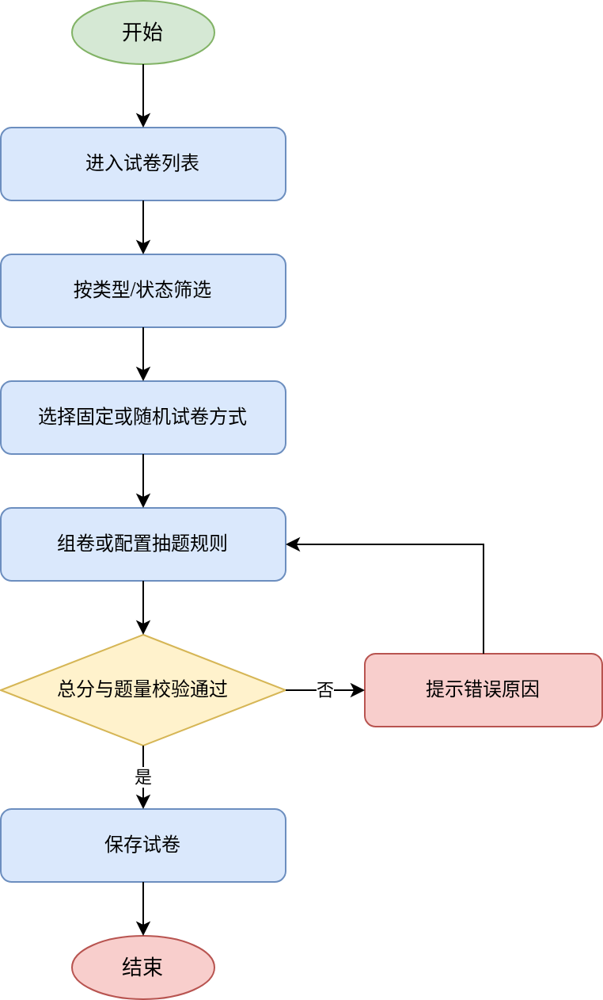

**（五）功能时序图**

### 3.5.3 考试管理

**（一）功能需求概述**

考试管理用于创建并组织考试，为考试选择一份试卷（固定试卷或随机试卷），并可为考试分配考生范围、配置防作弊策略，是连接命题与考试执行的核心环节。

**（二）功能设计**

**查询/筛选功能**

支持以下条件筛选，条件之间为"与"关系，点击搜索按钮触发查询：

| 筛选字段 | 类型 | 说明 |
|---------|------|------|
| 考试名称 | 文本输入 | 支持模糊搜索 |
| 考试状态 | 单选 | 枚举值：未发布/已发布/进行中/已结束 |
| 考试时间 | 日期范围 | 选择开始和结束日期 |

**列表功能**

| 列名 | 字段类型 | 说明 |
|-----|---------|------|
| 考试名称 | 文本 | - |
| 试卷 | 文本 | 展示所选试卷名称及类型（固定/随机） |
| 考试时间 | 文本 | 展示开始时间至结束时间 |
| 时长 | 文本 | 单位：分钟 |
| 参考人数 | 文本 | 已分配考生的数量 |
| 考试状态 | 状态标签 | 未发布/已发布/进行中/已结束 |
| 操作 | 操作按钮 | 编辑、发布、撤回、删除（按状态和权限显隐） |

分页默认每页10条，支持切换每页数量。列表为空时显示：暂无考试数据。

**创建考试**

点击"新增"进入创建考试页面，分为基本信息、选择试卷、分配考生、防作弊策略四部分填写。

*基本信息*

| 字段名称 | 类型 | 长度限制 | 必填 | 默认值 | 说明 |
|---------|------|---------|------|-------|------|
| 考试名称 | 文本输入 | ≤50字 | 是 | - | - |
| 考试说明 | 文本输入 | ≤500字 | 否 | - | - |
| 开始时间 | 日期时间选择 | - | 是 | - | - |
| 结束时间 | 日期时间选择 | - | 是 | - | 必须晚于开始时间 |
| 考试时长 | 数字输入 | - | 是 | - | 单位：分钟 |
| 及格分数 | 数字输入 | - | 是 | - | - |

*选择试卷*

| 字段名称 | 类型 | 长度限制 | 必填 | 默认值 | 说明 |
|---------|------|---------|------|-------|------|
| 试卷 | 单选 | - | 是 | - | 来源于试卷管理中已发布的试卷，可选固定试卷或随机试卷；固定试卷所有考生卷面相同，随机试卷按抽题规则为每位考生随机抽题 |
| 关联认证项目 | 单选 | - | 否 | - | 来源于资格认证中已启用的认证项目 |

*分配考生*

| 字段名称 | 类型 | 长度限制 | 必填 | 默认值 | 说明 |
|---------|------|---------|------|-------|------|
| 考生类型 | 单选 | - | 是 | 内部考生 | 枚举值：内部考生/外部考生，可同时添加两类考生 |
| 内部考生范围 | 层级多选 | - | 否 | - | 来源于组织管理中已启用的组织部门及用户管理中已启用的内部考生，支持按组织、部门或人员选择 |
| 外部考生范围 | 多选 | - | 否 | - | 来源于外部考生管理中已启用的外部考生，支持按所属单位或人员选择 |

*防作弊策略*

| 字段名称 | 类型 | 长度限制 | 必填 | 默认值 | 说明 |
|---------|------|---------|------|-------|------|
| 防切屏检测 | 开关 | - | 否 | 关闭 | 开启后记录切屏行为并告警，超过设定次数强制交卷 |
| 允许切屏次数 | 数字输入 | - | 防切屏检测开启时必填 | - | - |
| 人脸核身 | 开关 | - | 否 | 关闭 | 开启后开考前进行身份核验 |
| 考中定时抓拍 | 开关 | - | 否 | 关闭 | 开启后按设定间隔抓拍比对 |
| 音视频/屏幕监控 | 开关 | - | 否 | 关闭 | 开启后监考端可实时查看并录制 |
| 题目乱序 | 开关 | - | 否 | 关闭 | 开启后为每位考生打乱题目顺序与选项顺序 |
| 操作限制 | 开关 | - | 否 | 关闭 | 开启后禁止复制粘贴、禁止右键、禁止多屏 |

提交成功：创建考试成功。提交失败：保留填写内容，显示具体错误原因。

**编辑功能**

点击"编辑"，自动填入当前考试数据，表单字段同创建考试。仅未发布状态的考试可编辑。
提交成功：编辑考试成功。

**发布功能**

点击"发布"，考试状态变更为已发布，考生可见并可参加。

**撤回功能**

点击"撤回"，考试状态变更为未发布。仅未开始的考试可撤回。

**删除功能**

点击"删除"，弹出确认"确定删除该考试吗？"。
删除成功：删除考试成功。
已发布或进行中的考试不可删除，提示"考试已发布，无法删除，请先撤回"。

**业务规则**

- 结束时间必须晚于开始时间。保存时若不满足，阻止保存，提示"结束时间必须晚于开始时间"。
- 所选试卷为随机试卷时，若其抽题规则的可用题目数量不足，阻止发布，提示"随机试卷可用题目不足，无法发布考试"。
- 已发布或进行中的考试不可删除。删除时若命中该状态，阻止删除，提示"考试已发布，无法删除，请先撤回"。
- 考试到达开始时间后自动变更为进行中状态；到达结束时间后自动变更为已结束状态，并触发阅卷流程。
- 发布考试前必须已分配考生。发布时若未分配任何考生，阻止发布，提示"请先分配考生"。

**边界与异常**

- **空数据**：列表无数据时，显示"暂无考试数据"
- **权限不足**：创建、编辑、删除按钮对无权限角色完全隐藏（不渲染，非禁用）
- **考生未分配**：发布时若未分配任何考生，阻止发布，提示"请先分配考生"

**（三）业务逻辑关联**

- 试卷数据（固定试卷与随机试卷）来源于试卷管理中已发布的试卷，需先在试卷管理中完成试卷维护
- 内部考生范围数据来源于组织管理的组织部门数据和用户管理的内部考生数据；外部考生范围数据来源于外部考生管理，需先完成相应维护
- 关联认证项目数据来源于资格认证模块中已启用的认证项目
- 考试结束后，考试数据流向阅卷中心，触发阅卷流程

**（四）用户操作流程图**

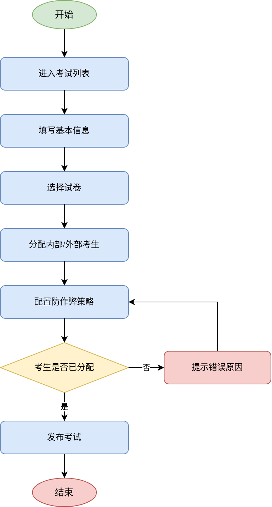

**（五）功能时序图**

### 3.5.4 阅卷中心

**（一）功能需求概述**

阅卷中心用于对考试答卷进行评分。客观题在考生交卷后由系统自动判分，主观题由AI按评分标准打分并生成评语，阅卷老师可对AI评分结果进行复核与修正，复核过程留痕，最终汇总客观题与主观题得分形成总分并发布，供考生查询。

**（二）功能设计**

**查询/筛选功能**

支持以下条件筛选，条件之间为"与"关系，点击搜索按钮触发查询：

| 筛选字段 | 类型 | 说明 |
|---------|------|------|
| 考试名称 | 文本输入 | 支持模糊搜索 |
| 阅卷状态 | 单选 | 枚举值：待阅卷 / AI阅卷中 / 待复核 / 已完成 |
| 考生关键词 | 文本输入 | 支持模糊搜索 |

**阅卷任务列表**

| 列名 | 字段类型 | 说明 |
|-----|---------|------|
| 考试名称 | 文本 | - |
| 考生 | 文本 | - |
| 题型构成 | 文本 | 展示该答卷客观题、主观题的题量构成 |
| 客观题得分 | 数字 | 系统自动判分汇总，未交卷时显示"-" |
| 主观题得分 | 数字 | AI评分或人工复核后的汇总分，未完成阅卷时显示"-" |
| 总分 | 数字 | 系统自动计算：客观题得分 + 主观题得分，成绩未发布时显示"-" |
| 阅卷状态 | 状态标签 | 待阅卷 / AI阅卷中 / 待复核 / 已完成 |
| 操作 | 操作按钮 | 查看客观题判分、AI阅卷、人工复核、查看复核记录、发布成绩、撤回成绩（按状态和权限显隐） |

分页默认每页10条，支持切换每页数量。列表为空时显示："暂无阅卷任务"。

**客观题判分查看**

考生交卷后，系统即时按标准答案自动完成客观题判分，无需人工触发。查看时展示每道客观题的得分和对错结果。

| 列名 | 字段类型 | 说明 |
|-----|---------|------|
| 题号 | 数字 | - |
| 考生答案 | 文本 | - |
| 标准答案 | 文本 | 数据来源：题库中该题配置的标准答案 |
| 得分 | 数字 | 系统自动判分 |
| 对错 | 状态标签 | 正确 / 错误 |

**主观题AI阅卷**

点击"AI阅卷"，系统对该答卷的主观题触发AI评分，点击后阅卷状态变更为"AI阅卷中"。AI按题目配置的评分标准逐题打分，并生成评语。

| 列名 | 字段类型 | 说明 |
|-----|---------|------|
| 题号 | 数字 | - |
| 考生答案 | 文本 | - |
| 评分标准 | 文本 | 数据来源：题库中该题配置的评分标准 |
| AI评分 | 数字 | AI按评分标准自动打分 |
| AI评语 | 文本 | AI针对该题作答生成的评语 |

AI阅卷完成后，答卷阅卷状态变更为"待复核"。

**人工复核**

阅卷老师查看AI给出的每题评分与评语，可修改分数并填写复核意见。

| 字段名称 | 类型 | 长度限制 | 必填 | 默认值 | 说明 |
|---------|------|---------|------|-------|------|
| AI评分 | 只读 | - | - | AI阅卷结果自动带入 | 修改前分数 |
| 修改后分数 | 数字输入 | - | 是 | AI评分 | 阅卷老师复核后填写的最终分数 |
| 复核意见 | 多行文本 | ≤500字 | 是 | - | 阅卷老师填写的复核说明 |

提交成功：提示"复核完成，成绩已更新"，该答卷阅卷状态变更为"已完成"。
提交失败：保留填写内容，显示具体错误原因。

**复核记录查看**

查看某答卷的完整复核历史，记录不可删除、不可篡改。

| 字段名称 | 类型 | 说明 |
|---------|------|------|
| 复核人 | 文本 | 系统自动记录 |
| 复核时间 | 日期时间 | 系统自动记录 |
| 修改前分数 | 数字 | 系统自动记录 |
| 修改后分数 | 数字 | 系统自动记录 |
| 复核意见 | 文本 | 阅卷老师填写内容的留存 |

**成绩发布**

客观题得分与主观题最终得分汇总为总分。点击"发布成绩"，弹出确认"成绩发布后不可修改，确定要发布吗？"，确认后完成发布，考生可查询。
发布成功：提示"成绩发布成功"。

**成绩撤回**

对已发布成绩的答卷，点击"撤回成绩"，弹出确认"确定撤回该成绩吗？撤回后考生将无法查询"，确认后成绩撤回，阅卷状态回退为"待复核"，考生不可再查询该成绩。
撤回成功：提示"成绩已撤回"。

**业务规则**

- 客观题在考生交卷后由系统自动判分，无需人工干预。
- 主观题必须完成AI阅卷或人工评分后，该答卷才能发布成绩，未完成时阻止发布，提示"存在未完成阅卷的主观题，无法发布成绩"。
- 阅卷老师修改AI评分时，必须记录复核人、复核时间、修改前分数、修改后分数，复核记录不可删除。
- AI阅卷失败时，该主观题转为待人工评分状态，提示"AI阅卷失败，请人工评分"。
- 成绩发布后不可修改，如需修改需撤回成绩，提示"成绩已发布，如需修改请先撤回"。

**边界与异常**

- **空数据**：阅卷任务列表无数据时，显示"暂无阅卷任务"。
- **权限不足**：主观题AI阅卷、人工复核、成绩发布按钮对无权限角色完全隐藏（不渲染，非禁用）。
- **AI服务不可用**：主观题AI阅卷降级为纯人工评分，提示"AI阅卷服务暂不可用，请人工评分"。

**（三）业务逻辑关联**

- 阅卷任务来源于考试管理中已结束的考试答卷。
- 主观题AI阅卷依赖AI模型配置（来源于系统管理中的AI模型配置）。
- 成绩发布后数据流向报表中心与证书管理，用于判断是否达到发证条件。

**（四）用户操作流程图**

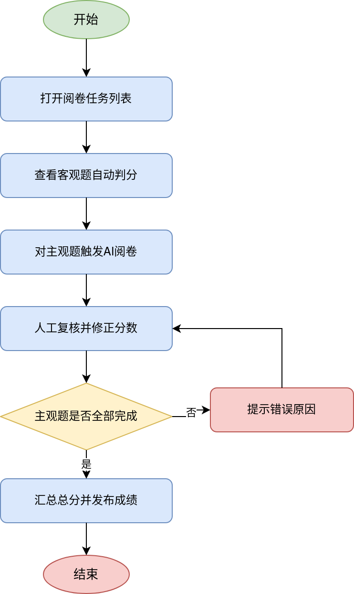

**（五）功能时序图**

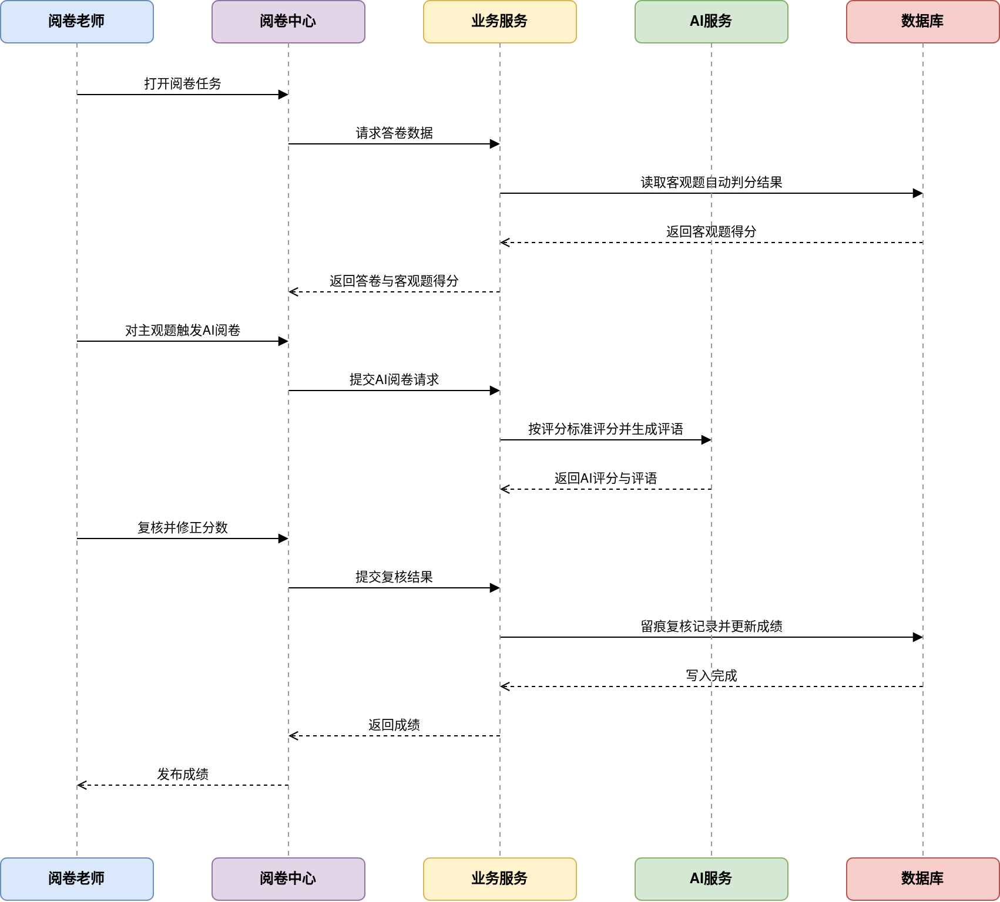

### 3.5.5 资格认证

资格认证用于管理各类资格认证项目，考生报考认证项目经资格审核通过后获得对应考试的参考资格，考试通过后按认证项目配置的证书模板与有效期获得证书。

#### 3.5.5.1 认证项目

**（一）功能需求概述**

认证项目功能用于维护各类资格认证项目的基本信息、关联考试和证书配置，为考生报考、资格审核及后续发证提供基础数据支撑。

**（二）功能设计**

**查询/筛选功能**

支持以下条件筛选，条件之间为"与"关系，点击搜索按钮触发查询：

| 筛选字段 | 类型 | 说明 |
|---------|------|------|
| 认证名称 | 文本输入 | 支持模糊搜索 |
| 状态 | 单选 | 枚举值：启用/停用 |

**列表功能**

| 列名 | 字段类型 | 说明 |
|-----|---------|------|
| 认证名称 | 文本 | - |
| 关联考试 | 文本 | 数据来源：新增认证项目时选择 |
| 报考条件说明 | 文本 | 无值显示"-" |
| 有效期(月) | 文本 | 数据来源：新增认证项目时填写 |
| 认证状态 | 状态标签 | 启用/停用 |
| 创建时间 | 文本 | 系统自动记录 |
| 操作 | 操作按钮 | 编辑、启用/停用、删除（无权限时隐藏） |

分页默认每页10条，支持切换每页数量。列表为空时显示：暂无认证项目数据。

**新增功能**

点击"新增"，弹出编辑窗口，填写认证项目信息。

| 字段名称 | 类型 | 长度限制 | 必填 | 默认值 | 说明 |
|---------|------|---------|------|-------|------|
| 认证名称 | 文本输入 | ≤50字 | 是 | - | 全局唯一 |
| 认证说明 | 文本输入 | ≤500字 | 否 | - | - |
| 关联考试 | 单选 | - | 是 | - | 来源于考试管理中已发布的考试 |
| 报考条件说明 | 文本输入 | ≤500字 | 否 | - | - |
| 证书有效期(月) | 数字输入 | - | 是 | - | 单位为月 |
| 关联证书模板 | 单选 | - | 是 | - | 来源于证书管理中已启用的证书模板 |

提交成功：新增认证项目成功。提交失败：保留填写内容，显示具体错误原因。

**编辑功能**

点击"编辑"，自动填入当前记录数据，表单字段同新增。
提交成功：编辑认证项目成功。

**删除功能**

点击"删除"，弹出确认"确定要删除该认证项目吗？删除后不可恢复"。
删除成功：删除认证项目成功。
该认证项目下存在报考记录时阻止删除，提示"该认证项目下存在报考记录，无法删除"。

**启用/停用功能**

点击"启用"或"停用"，切换认证项目状态。

**业务规则**

- 认证名称在系统内全局唯一。新增/编辑时若重复，阻止提交，提示"认证名称已存在，请更换名称"。
- 认证项目停用后，考生不可再报考该认证项目，提示"该认证项目已停用，暂不可报考"；已提交的报考记录不受影响，按原流程继续审核。
- 认证项目下存在报考记录时不可删除，提示"该认证项目下存在报考记录，无法删除"。

**边界与异常**

- **空数据**：认证项目列表无数据时，显示"暂无认证项目数据"。
- **权限不足**：新增、编辑、删除、启用/停用按钮对无权限角色完全隐藏（不渲染，非禁用）。

**（三）业务逻辑关联**

- 关联考试数据来源于考试管理中已发布的考试。
- 关联证书模板数据来源于证书管理中已启用的证书模板。
- 认证项目状态和证书配置为报考审核、证书发放提供基础数据依据。

**（四）用户操作流程图**

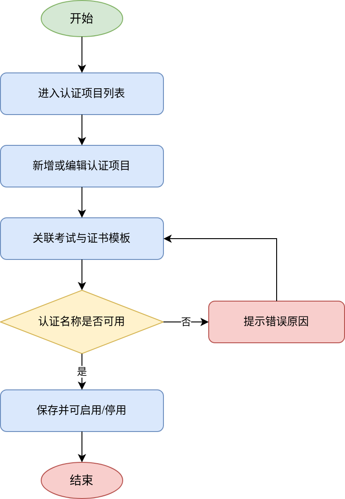

**（五）功能时序图**

#### 3.5.5.2 报考审核

**（一）功能需求概述**

报考审核功能用于审核考生的认证项目报考申请，审核通过后考生获得对应考试的参考资格，为资格认证流程提供把关环节。

**（二）功能设计**

**查询/筛选功能**

支持以下条件筛选，条件之间为"与"关系，点击搜索按钮触发查询：

| 筛选字段 | 类型 | 说明 |
|---------|------|------|
| 认证项目 | 单选 | 来源于认证项目中已配置的认证项目 |
| 审核状态 | 单选 | 枚举值：待审核/已通过/已驳回 |
| 考生关键词 | 文本输入 | 支持模糊搜索 |

**列表功能**

| 列名 | 字段类型 | 说明 |
|-----|---------|------|
| 考生姓名 | 文本 | 数据来源：考生提交报考时关联 |
| 报考认证项目 | 文本 | 数据来源：考生提交报考时选择 |
| 报考时间 | 文本 | 系统自动记录 |
| 审核状态 | 状态标签 | 待审核/已通过/已驳回 |
| 审核人 | 文本 | 数据来源：审核操作时自动记录，无值显示"-" |
| 操作 | 操作按钮 | 审核（无权限时隐藏） |

分页默认每页10条，支持切换每页数量。列表为空时显示：暂无报考记录。

**审核功能**

点击"审核"，查看考生报考资料，选择通过或驳回。驳回时需填写驳回原因。

审核通过：审核通过成功，考生获得对应考试的参考资格。
审核驳回：审核驳回成功，提示考生"您的报考已被驳回，原因：[驳回原因]"。

**业务规则**

- 审核通过后，考生获得对应认证项目关联考试的参考资格。
- 审核驳回时必须填写驳回原因，驳回后提示考生"您的报考已被驳回，原因：[驳回原因]"。
- 已通过审核的报考记录不可重复审核，提示"该报考已审核通过，无需重复操作"。

**边界与异常**

- **空数据**：报考记录列表无数据时，显示"暂无报考记录"。
- **权限不足**：审核按钮对无权限角色完全隐藏（不渲染，非禁用）。

**（三）业务逻辑关联**

- 报考记录数据来源于考生提交的报考申请，关联认证项目中已配置的认证项目。
- 审核通过赋予考生对应考试的参考资格，影响考试管理中的考生范围。
- 考生通过考试后，依据认证项目配置的证书模板与有效期，流向证书管理完成发证。

**（四）用户操作流程图**

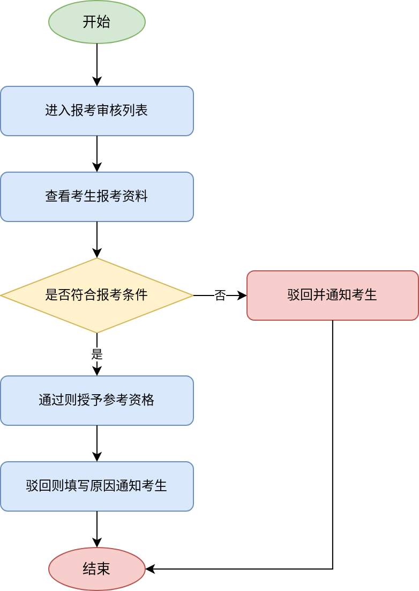

**（五）功能时序图**

### 3.5.6 监考中心

监考中心用于安排考试监考、管理考试异常事件台账、回放考生考试录像，配合独立监考端保障考试过程的公平监督。

#### 3.5.6.1 监考安排

**（一）功能需求概述**

监考安排功能用于为开启音视频/屏幕监控或需要实时监考的考试指定监考员，明确监考责任归属，为监考端实时监督和异常事件处置提供人员基础。

**（二）功能设计**

**查询/筛选功能**

支持以下条件筛选，条件之间为"与"关系，点击搜索按钮触发查询：

| 筛选字段 | 类型 | 说明 |
|---------|------|------|
| 考试名称 | 文本输入 | 支持模糊搜索 |
| 监考状态 | 单选 | 枚举值：未开始/进行中/已结束 |

**列表功能**

| 列名 | 字段类型 | 说明 |
|-----|---------|------|
| 考试名称 | 文本 | 数据来源：考试管理中已发布的考试 |
| 考试时间 | 文本 | 数据来源：考试管理中配置的考试起止时间 |
| 参考人数 | 数字 | 系统自动统计报名参加该考试的考生数量 |
| 监考员 | 文本 | 已分配的监考员姓名，逐个展示；未分配显示"-" |
| 监考状态 | 状态标签 | 枚举值：未开始/进行中/已结束，系统按考试时间自动判定 |
| 操作 | 操作按钮 | 分配监考员、编辑（无权限时隐藏） |

分页默认每页10条，支持切换每页数量。列表为空时显示：暂无监考安排。

**分配监考员**

点击"分配监考员"，为考试指定一名或多名监考员。

| 字段名称 | 类型 | 长度限制 | 必填 | 默认值 | 说明 |
|---------|------|---------|------|-------|------|
| 监考员 | 多选 | - | 是 | - | 来源于用户管理中角色为监考员的用户 |

提交成功：分配成功。
提交失败：保留已选内容，显示具体错误原因。

**编辑功能**

点击"编辑"，自动填入当前已分配的监考员，仅考试未结束时可调整。表单字段同分配监考员。
提交成功：调整成功。

**业务规则**

- 只有开启了音视频/屏幕监控或需实时监考的考试才需分配监考员，其余考试不展示分配入口。
- 考试进行中时不可移除全部监考员，若操作后监考员为空，阻止提交，提示"考试进行中，至少保留一名监考员"。

**边界与异常**

- **空数据**：列表无数据时，显示"暂无监考安排"
- **权限不足**：分配监考员、编辑按钮对无权限角色完全隐藏（不渲染，非禁用）

**（三）业务逻辑关联**

- 监考安排的考试来源于考试管理中已发布且开启监控的考试
- 监考员来源于用户管理中角色为监考员的用户
- 已分配的监考员在独立监考端获得对应考试的监考权限

**（四）用户操作流程图**

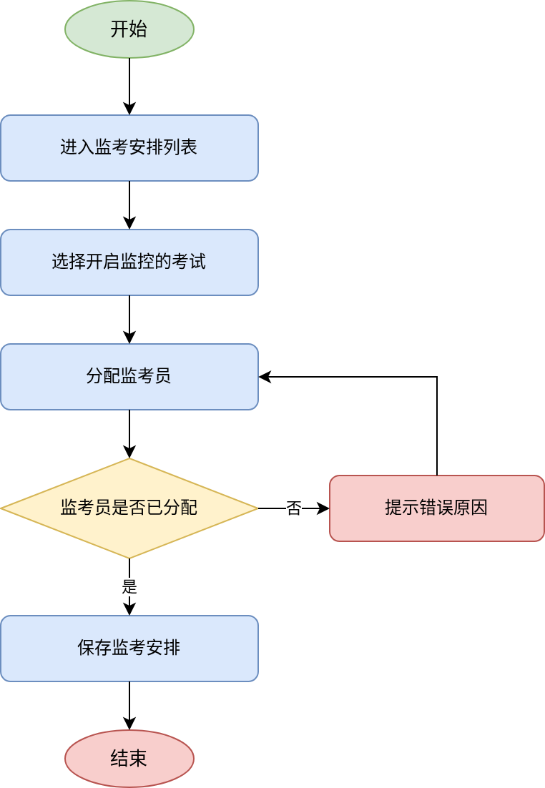

**（五）功能时序图**

#### 3.5.6.2 异常事件

**（一）功能需求概述**

异常事件功能用于集中管理考试过程中产生的违规异常记录，供管理员核实并裁定处置结果，作为成绩认定的参考依据。

**（二）功能设计**

**查询/筛选功能**

支持以下条件筛选，条件之间为"与"关系，点击搜索按钮触发查询：

| 筛选字段 | 类型 | 说明 |
|---------|------|------|
| 考试名称 | 单选 | 来源于考试管理中已发布的考试 |
| 事件类型 | 单选 | 枚举值：切屏/离屏/人脸不匹配/多屏/其他 |
| 处置状态 | 单选 | 枚举值：待处置/已处置 |
| 考生关键词 | 文本输入 | 支持按考生姓名模糊搜索 |

**列表功能**

| 列名 | 字段类型 | 说明 |
|-----|---------|------|
| 考生姓名 | 文本 | 数据来源：考生端防作弊检测与监考端上报时关联的考生信息 |
| 所属考试 | 文本 | 数据来源：事件发生时关联的考试 |
| 事件类型 | 状态标签 | 枚举值：切屏/离屏/人脸不匹配/多屏/其他 |
| 发生时间 | 文本 | 系统自动记录事件产生的时间 |
| 事件描述 | 文本 | 系统自动记录，说明事件具体情况 |
| 处置状态 | 状态标签 | 枚举值：待处置/已处置 |
| 处置人 | 文本 | 完成处置的管理员姓名；未处置显示"-" |
| 操作 | 操作按钮 | 处置（无权限时隐藏） |

分页默认每页10条，支持切换每页数量。列表为空时显示：暂无异常事件。

**处置功能**

点击"处置"，对异常事件进行裁定。

| 字段名称 | 类型 | 长度限制 | 必填 | 默认值 | 说明 |
|---------|------|---------|------|-------|------|
| 处置结果 | 单选 | - | 是 | - | 枚举值：确认违规/忽略 |
| 处置意见 | 文本输入 | ≤200字 | 是 | - | 说明裁定理由 |

提交成功：处置成功。
提交失败：保留填写内容，显示具体错误原因。

**业务规则**

- 事件处置结果影响考生成绩认定，标记为"确认违规"的记录汇总供成绩审核参考。
- 异常事件记录不可删除，仅可标记处置结果。

**边界与异常**

- **空数据**：列表无数据时，显示"暂无异常事件"
- **权限不足**：处置按钮对无权限角色完全隐藏（不渲染，非禁用）

**（三）业务逻辑关联**

- 异常事件来源于考生端防作弊检测与独立监考端上报，系统自动生成记录
- 处置结果影响成绩认定，供阅卷中心与成绩审核参考

**（四）用户操作流程图**

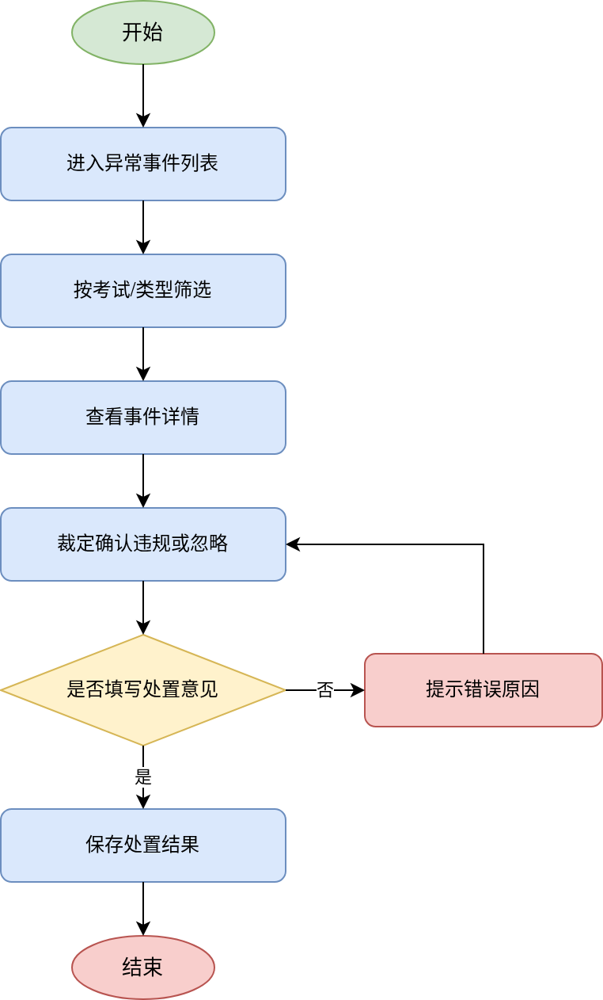

**（五）功能时序图**

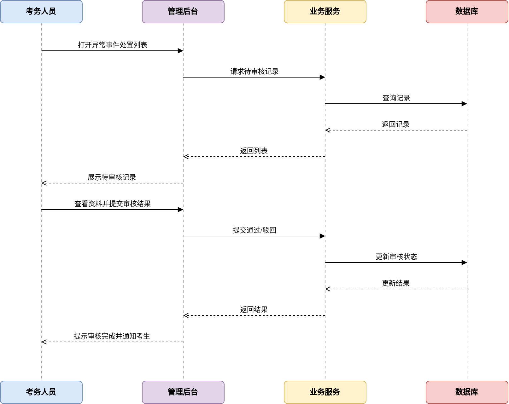

#### 3.5.6.3 录像回放

**（一）功能需求概述**

录像回放功能用于查看开启音视频/屏幕监控考试的考生录制内容，供管理员核实异常事件、复核考试过程。

**（二）功能设计**

**查询/筛选功能**

支持以下条件筛选，条件之间为"与"关系，点击搜索按钮触发查询：

| 筛选字段 | 类型 | 说明 |
|---------|------|------|
| 考试名称 | 单选 | 来源于考试管理中已发布的考试 |
| 考生关键词 | 文本输入 | 支持按考生姓名模糊搜索 |

**列表功能**

| 列名 | 字段类型 | 说明 |
|-----|---------|------|
| 考生姓名 | 文本 | 数据来源：考试报名信息 |
| 所属考试 | 文本 | 数据来源：录像录制时关联的考试 |
| 录像时长 | 文本 | 系统自动统计录制总时长 |
| 录制状态 | 状态标签 | 枚举值：录制中/已完成/无录像 |
| 操作 | 操作按钮 | 回放（无权限时隐藏） |

分页默认每页10条，支持切换每页数量。列表为空时显示：暂无录像数据。

**回放功能**

点击"回放"，查看指定考生考试全过程录像。

**业务规则**

- 仅开启音视频/屏幕监控的考试有录像，未开启监控的考试不生成录像。
- 录像按系统管理中配置的保留期限留存，超期自动清理。

**边界与异常**

- **空数据**：列表无数据时，显示"暂无录像数据"
- **权限不足**：回放按钮对无权限角色完全隐藏（不渲染，非禁用）
- **录像不存在**：未开启监控的考试点击回放时，提示"该考试未开启监控，无录像数据"

**（三）业务逻辑关联**

- 录像数据来源于开启音视频/屏幕监控的考试，由监考端在考试过程中录制
- 录像保留期限来源于系统管理中的参数配置，超期后系统自动清理

**（四）用户操作流程图**

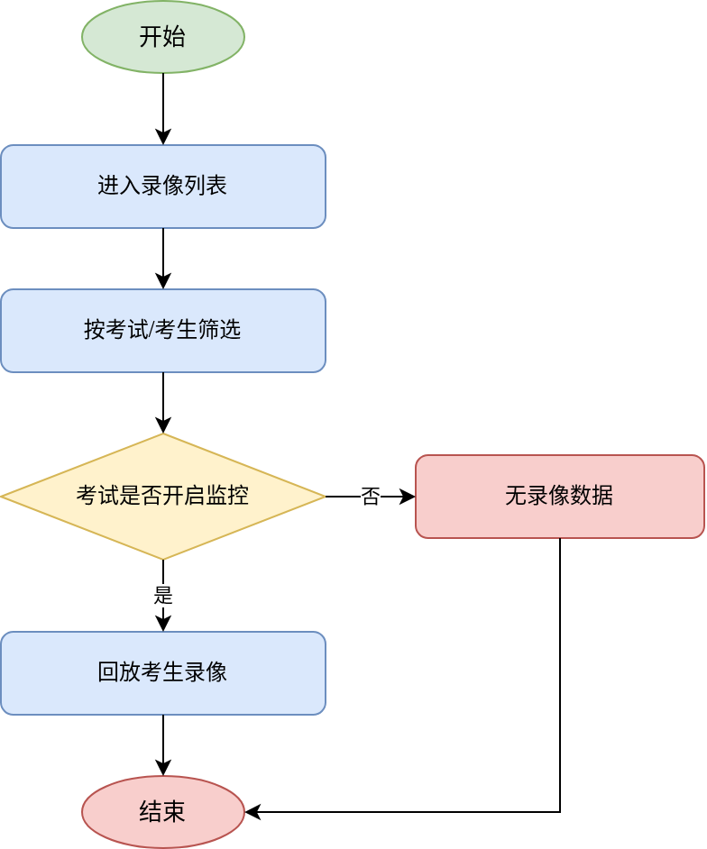

**（五）功能时序图**

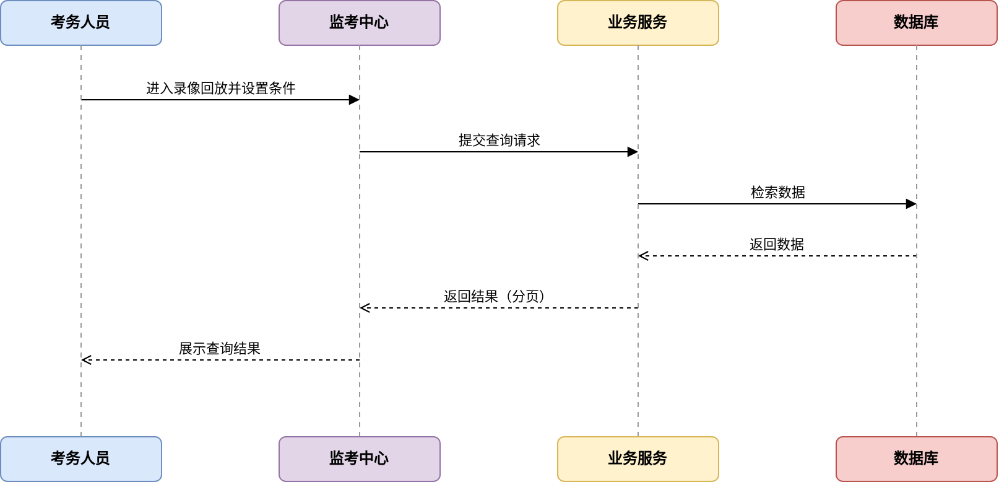

### 3.5.7 证书管理

证书管理用于维护证书模板、为通过考试的考生颁发电子证书，并提供社会公众可用的证书真伪查验入口。本模块承接资格认证的报考审核结果和阅卷中心的考试成绩，是认证项目全流程的最后一环。

#### 3.5.7.1 证书模板

**（一）功能需求概述**

证书模板管理用于统一维护证书的版式内容和编号规则，为证书发放提供模板依据，确保同一认证项目颁发的证书内容和编号规范一致。

**（二）功能设计**

**查询/筛选功能**

支持以下条件筛选，条件之间为"与"关系，点击搜索按钮触发查询：

| 筛选字段 | 类型 | 说明 |
|---------|------|------|
| 模板名称 | 文本输入 | 支持模糊搜索 |
| 状态 | 单选 | 枚举值：启用 / 停用 |

**列表功能**

| 列名 | 字段类型 | 说明 |
|-----|---------|------|
| 模板名称 | 文本 | - |
| 适用认证项目 | 文本 | 数据来源：被认证项目引用后自动关联；未被引用时显示"-" |
| 模板状态 | 状态标签 | 启用 / 停用 |
| 创建时间 | 日期时间 | 系统自动记录 |
| 操作 | 操作按钮 | 编辑、启用/停用、删除（无权限时隐藏） |

分页默认每页10条，支持切换每页数量。列表为空时显示：暂无证书模板数据。

**新增功能**

点击"新增模板"，弹出编辑窗口，填写模板信息。

| 字段名称 | 类型 | 长度限制 | 必填 | 默认值 | 说明 |
|---------|------|---------|------|-------|------|
| 模板名称 | 文本输入 | ≤50字 | 是 | - | 系统内唯一 |
| 证书标题 | 文本输入 | ≤100字 | 是 | - | 证书正文主标题 |
| 颁发机构名称 | 文本输入 | ≤100字 | 是 | - | - |
| 证书说明文案 | 多行文本 | ≤500字 | 否 | - | 证书正文说明性内容 |
| 印章图片 | 图片上传 | 单张≤5MB | 否 | - | 用于证书上的机构印章展示 |
| 编号规则 | 文本输入 | ≤50字 | 是 | - | 证书编号生成规则，如"年份+流水号" |

提交成功：新增证书模板成功。
提交失败：保留填写内容，显示具体错误原因。

**编辑功能**

点击"编辑"，弹出编辑窗口，自动填入当前记录数据，表单字段同新增。
提交成功：编辑证书模板成功。

**删除功能**

点击"删除"，弹出确认"确定要删除该证书模板吗？删除后不可恢复。"。
删除成功：删除证书模板成功。
该证书模板已被认证项目引用时阻止删除，提示"该证书模板已被认证项目引用，无法删除"。

**启用/停用功能**

点击"启用"或"停用"，切换模板状态。
停用成功：证书模板已停用。

**业务规则**

- 模板名称在系统内全局唯一。新增/编辑时若重复，阻止提交，提示"模板名称已存在，请更换"。
- 证书模板被认证项目引用时不可删除，阻止删除操作，提示"该证书模板已被认证项目引用，无法删除"。
- 模板停用后，不可再用于新的认证项目配置；已引用该模板的认证项目正常使用，不受影响。

**边界与异常**

- **空数据**：列表无数据时，显示"暂无证书模板数据"。
- **权限不足**：新增、编辑、删除、启用/停用按钮对无权限角色完全隐藏（不渲染，非禁用）。

**（三）业务逻辑关联**

- 证书模板被资格认证的认证项目引用，作为该认证项目发证时的证书内容和编号规则依据。
- 证书模板的编号规则被证书发放引用，用于生成证书编号。

**（四）用户操作流程图**

**（五）功能时序图**

#### 3.5.7.2 证书发放

**（一）功能需求概述**

证书发放用于为通过考试且达到发证条件的考生颁发电子证书，支持单个及批量颁发，并支持对已颁发证书的作废管理，为考生提供权威的资质证明。

**（二）功能设计**

**查询/筛选功能**

支持以下条件筛选，条件之间为"与"关系，点击搜索按钮触发查询：

| 筛选字段 | 类型 | 说明 |
|---------|------|------|
| 认证项目 | 单选 | 来源于资格认证中已配置的认证项目 |
| 考生关键词 | 文本输入 | 支持按考生姓名模糊搜索 |
| 证书状态 | 单选 | 枚举值：有效 / 已作废 |

**列表功能**

| 列名 | 字段类型 | 说明 |
|-----|---------|------|
| 证书编号 | 文本 | 系统按模板编号规则自动生成，全局唯一 |
| 考生姓名 | 文本 | - |
| 认证项目 | 文本 | - |
| 颁发日期 | 日期 | 颁发时系统自动记录 |
| 有效期至 | 日期 | 系统自动计算：颁发日期 + 认证项目配置的有效期月数 |
| 证书状态 | 状态标签 | 有效 / 已作废 |
| 操作 | 操作按钮 | 查看、下载、作废（无权限时隐藏） |

分页默认每页10条，支持切换每页数量。列表为空时显示：暂无证书数据。

**颁发功能**

对通过考试且达到发证条件的考生，点击"颁发证书"，系统按对应证书模板的编号规则自动生成唯一证书编号并颁发。
颁发成功：证书颁发成功。
考生未达到发证条件时阻止颁发，提示"该考生未达到发证条件，无法颁发证书"。

**批量颁发功能**

选择某场考试，点击"批量颁发"，对该场考试中通过考试的考生批量颁发证书。
批量颁发完成后提示："批量颁发完成，成功X条，失败Y条"。

**作废功能**

点击"作废"，弹出确认窗口，填写作废原因后提交。
作废成功：证书已作废。
已作废证书不可恢复，作废前需再次确认"确定要作废该证书吗？作废后不可恢复"。

**查看/下载功能**

点击"查看"，展示证书完整内容。点击"下载"，将证书保存为文件。

**业务规则**

- 只有考试通过（达到及格分数）且报考审核通过的考生才能被颁发证书。未达条件时阻止颁发，提示"该考生未达到发证条件，无法颁发证书"。
- 证书编号由系统按证书模板的编号规则自动生成，系统内全局唯一。
- 已作废证书不可恢复，作废操作须填写作废原因。
- 证书有效期由系统根据认证项目配置的有效期月数自动计算：有效期至 = 颁发日期 + 有效期月数。

**边界与异常**

- **空数据**：列表无数据时，显示"暂无证书数据"。
- **权限不足**：颁发、批量颁发、作废按钮对无权限角色完全隐藏（不渲染，非禁用）。
- **未达发证条件**：颁发时提示"该考生未达到发证条件，无法颁发证书"，阻止颁发。

**（三）业务逻辑关联**

- 证书发放依赖阅卷中心的考试成绩，只有达到及格分数的考生才具备发证资格。
- 证书发放依赖资格认证的报考审核结果，只有审核通过的考生才具备发证资格。
- 证书有效期依据认证项目中配置的有效期月数计算。
- 证书编号规则来源于证书模板管理。
- 考生颁发证书后，可在考生端"我的证书"中查看已获证书。

**（四）用户操作流程图**

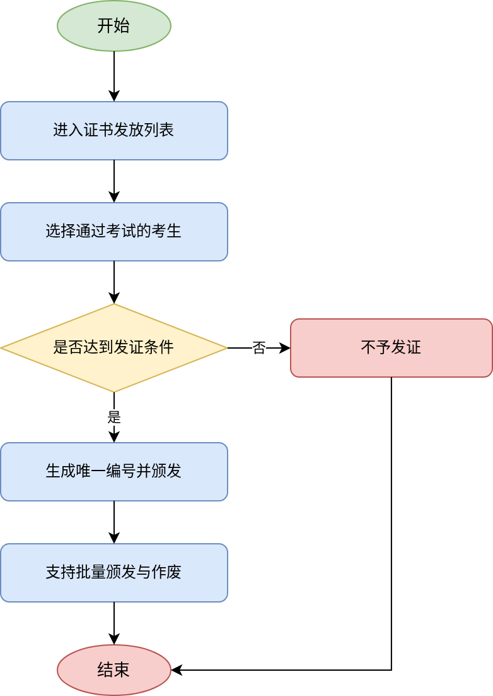

**（五）功能时序图**

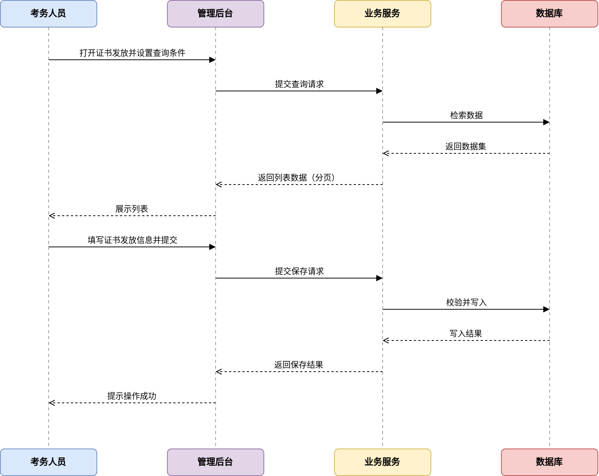

#### 3.5.7.3 证书查验

**（一）功能需求概述**

证书查验为社会公众提供公开的证书真伪核验入口，用户通过证书编号或查验码即可查询证书的真实性和有效状态，无需登录，提升证书的社会认可度。

**（二）功能设计**

**查验功能**

用户输入证书编号或查验码，点击查询，系统返回该证书的查验结果。

| 列名 | 字段类型 | 说明 |
|-----|---------|------|
| 证书编号 | 文本 | - |
| 持证人 | 文本 | - |
| 认证项目 | 文本 | - |
| 颁发机构 | 文本 | - |
| 颁发日期 | 日期 | - |
| 有效期至 | 日期 | - |
| 证书状态 | 状态标签 | 有效 / 已过期 / 已作废 / 不存在 |

查验为公开查询入口，无需登录即可使用。

**业务规则**

- 查验码错误或证书不存在时，提示"未查询到该证书，请核对编号"。
- 证书当前日期已超过有效期至时，查验结果显示"已过期"。
- 证书已被作废时，查验结果显示"已作废"。

**边界与异常**

- **输入为空**：证书编号或查验码未输入时，点击查询提示"请输入证书编号或查验码"。
- **查询无结果**：提示"未查询到该证书，请核对编号"。

**（三）业务逻辑关联**

- 查验结果数据来源于证书发放中已颁发的证书记录，证书状态实时同步。

**（四）用户操作流程图**

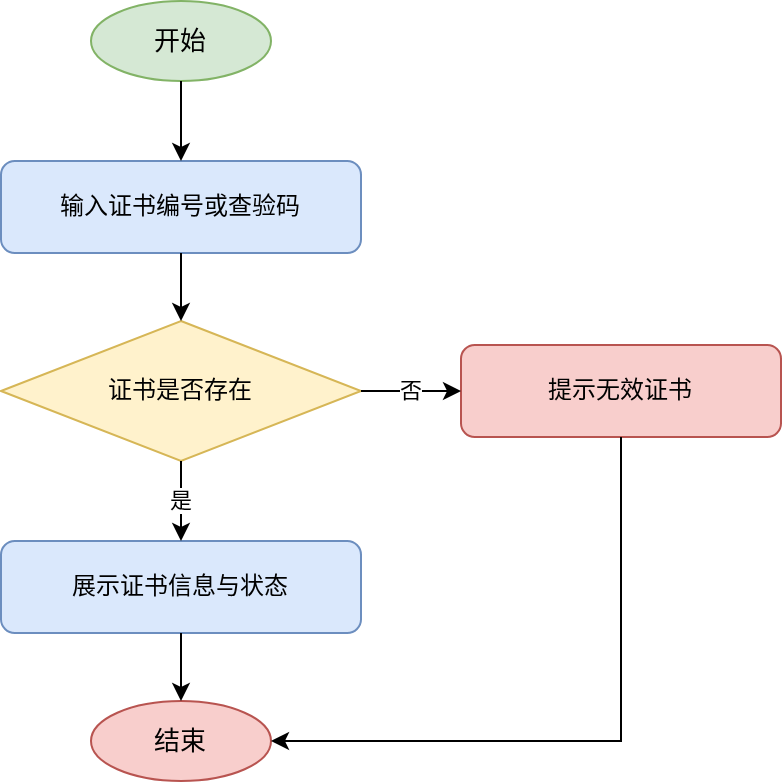

**（五）功能时序图**

### 3.5.8 外部考生管理

**（一）功能需求概述**

外部考生管理用于维护外部单位参加考试的考生信息，并为其生成考试账号。外部考生使用生成的账号登录考生端参加考试，与来源于用户管理的内部考生共同构成考试的考生来源。

**（二）功能设计**

**查询/筛选功能**

支持以下条件筛选，条件之间为"与"关系，点击搜索按钮触发查询：

| 筛选字段 | 类型 | 说明 |
|---------|------|------|
| 姓名 | 文本输入 | 支持模糊搜索 |
| 所属单位 | 文本输入 | 支持模糊搜索 |
| 准考证号 | 文本输入 | 支持模糊搜索 |
| 账号状态 | 单选 | 枚举值：启用/停用 |

**列表功能**

| 列名 | 字段类型 | 说明 |
|-----|---------|------|
| 姓名 | 文本 | - |
| 准考证号 | 文本 | 考试账号登录名，系统内唯一 |
| 所属单位 | 文本 | 无值显示"-" |
| 证件号 | 文本 | 无值显示"-" |
| 联系电话 | 文本 | - |
| 账号状态 | 状态标签 | 启用 / 停用 |
| 创建时间 | 文本 | 系统自动记录 |
| 操作 | 操作按钮 | 编辑、启用/停用、重置密码、删除（无权限时隐藏） |

分页默认每页10条，支持切换每页数量。列表为空时显示：暂无外部考生数据。

**新增功能**

点击"新增"，弹出编辑窗口，填写外部考生信息。提交后系统生成考试账号（以准考证号为登录名，生成初始密码）。

| 字段名称 | 类型 | 长度限制 | 必填 | 默认值 | 说明 |
|---------|------|---------|------|-------|------|
| 姓名 | 文本输入 | 2-20字 | 是 | - | - |
| 准考证号 | 文本输入 | ≤30字 | 是 | - | 考试账号登录名，系统内唯一 |
| 所属单位 | 文本输入 | ≤50字 | 否 | - | 外部考生所属的单位名称 |
| 证件号 | 文本输入 | ≤30字 | 否 | - | 用于身份核验的证件号码 |
| 联系电话 | 文本输入 | 11位 | 是 | - | 需符合手机号格式 |
| 电子邮箱 | 文本输入 | ≤50字 | 否 | - | 需符合邮箱格式 |

提交成功：提示"新增成功，考试账号已生成"。提交失败：保留填写内容，显示具体错误原因。

**编辑功能**

点击"编辑"，弹出编辑窗口，自动填入当前记录数据，表单字段同新增，准考证号不可修改。
提交成功：编辑外部考生成功。

**删除功能**

点击"删除"，弹出确认"确定删除该外部考生吗？删除后其考试账号一并失效"。
删除成功：删除外部考生成功。
该外部考生已被分配到考试时，阻止删除，提示"该考生已分配考试，无法删除"。

**批量导入功能**

点击"批量导入"，下载模板，按模板填写外部考生信息后上传文件，确认导入，系统为导入的考生批量生成考试账号。
导入成功：提示"成功导入 X 名外部考生，账号已生成"。
导入失败：提示具体错误行号和错误原因。

**启用/停用功能**

点击"启用"或"停用"，切换外部考生考试账号的可用状态。停用后该账号不可登录。

**重置密码功能**

点击"重置密码"，将该外部考生考试账号密码重置为系统默认或随机密码，并提示重置结果。

**业务规则**

- 准考证号在系统内全局唯一。新增/导入时若重复，阻止提交，提示"准考证号【XXX】已存在，请更换"。
- 联系电话需符合手机号格式，格式不正确时阻止提交，提示"请输入正确的联系电话"。
- 外部考生账号停用后，该考生不可登录考生端，登录时提示"账号已停用，请联系管理员"。
- 外部考生已被分配到考试时不可删除，提示"该考生已分配考试，无法删除"。

**边界与异常**

- **空数据**：列表无数据时，显示"暂无外部考生数据"
- **权限不足**：新增、编辑、删除、启用/停用、重置密码按钮对无权限角色完全隐藏（不渲染，非禁用）

**（三）业务逻辑关联**

- 外部考生生成的考试账号供其登录考生端参加考试
- 外部考生与用户管理中的内部考生共同构成考试管理中考生分配的可选范围
- 外部考生的考试成绩与证书同内部考生一样，流向阅卷中心与证书管理

**（四）用户操作流程图**

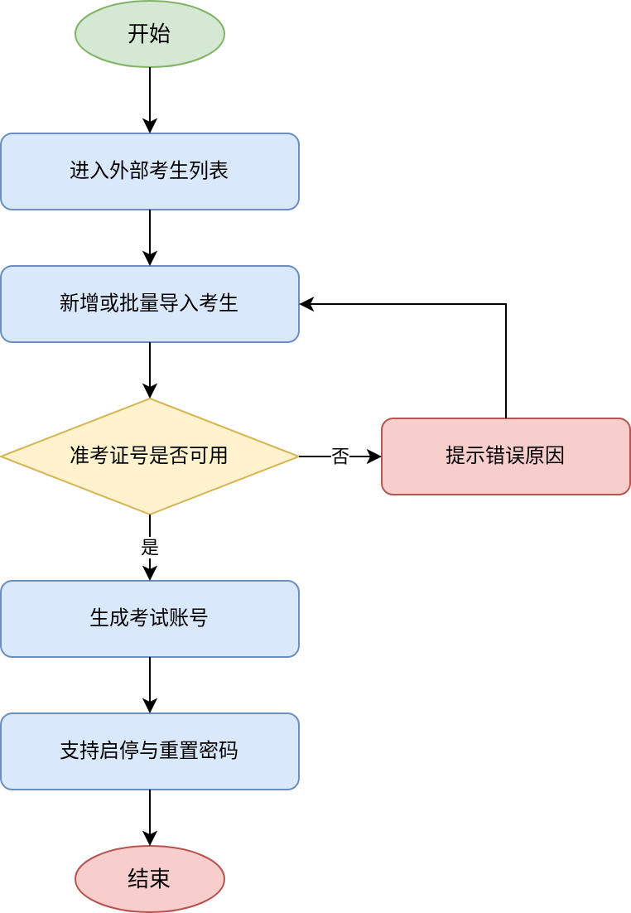

**（五）功能时序图**

### 3.5.9 报表中心

报表中心面向考试组织方和教学管理人员，提供考试与成绩的多维统计分析，并结合AI能力生成学情分析报告，为考试组织质量评估和教学决策提供数据支撑。报表中心下设考试统计、成绩分析、学情分析三个功能。

#### 3.5.9.1 考试统计

**（一）功能需求概述**

考试统计功能用于统计考试的整体组织情况，支持按考试、认证项目、时间范围查看场次、参考人数、成绩分布等核心指标，帮助管理人员掌握考试组织效果。

**（二）功能设计**

**查询/筛选功能**

支持以下条件筛选，条件之间为"与"关系，点击搜索按钮触发查询：

| 筛选字段 | 类型 | 说明 |
|---------|------|------|
| 考试名称 | 单选 | 来源于考试管理中已创建的考试 |
| 认证项目 | 单选 | 来源于资格认证中已启用的认证项目 |
| 时间范围 | 日期范围 | 选择开始和结束日期，按考试时间统计 |

**指标统计**

查看以下统计指标：

| 指标项 | 说明 |
|-------|------|
| 考试场次 | 统计范围内的考试场次总数；数据来源：考试管理与阅卷中心的成绩数据 |
| 参考人数 | 统计范围内实际参加考试的考生人数；数据来源：阅卷中心的成绩数据 |
| 平均分 | 统计范围内所有考生成绩的平均值；数据来源：阅卷中心的成绩数据 |
| 最高分 | 统计范围内的最高成绩；数据来源：阅卷中心的成绩数据 |
| 最低分 | 统计范围内的最低成绩；数据来源：阅卷中心的成绩数据 |
| 通过率 | 统计范围内成绩达到合格标准的考生占比；数据来源：阅卷中心的成绩数据及考试合格标准 |

**趋势分析**

支持按时间维度查看考试场次与参考人数随时间的变化趋势，帮助识别考试组织的周期性规律。

**导出功能**

点击"导出"，将当前筛选条件下的统计数据导出为电子表格文件。

**业务规则**

- 通过率根据各考试设定的合格标准自动计算，不同考试的合格标准可能不同，统计时按各考试自身标准分别判定后汇总。
- 时间范围未选择时，默认统计全部历史考试数据。

**边界与异常**

- **空数据**：筛选结果无匹配数据时，显示"暂无统计数据"。
- **权限不足**：考试统计菜单入口对无权限角色完全隐藏（不渲染，非禁用）。
- **导出无数据**：当前筛选条件下无可导出数据时，提示"当前无可导出数据"。

**（三）业务逻辑关联**

- 考试场次、参考人数、平均分等指标数据来源于考试管理与阅卷中心的成绩数据，需相关考试完成阅卷后数据方可统计。
- 认证项目筛选数据来源于资格认证中已启用的认证项目。

**（四）用户操作流程图**

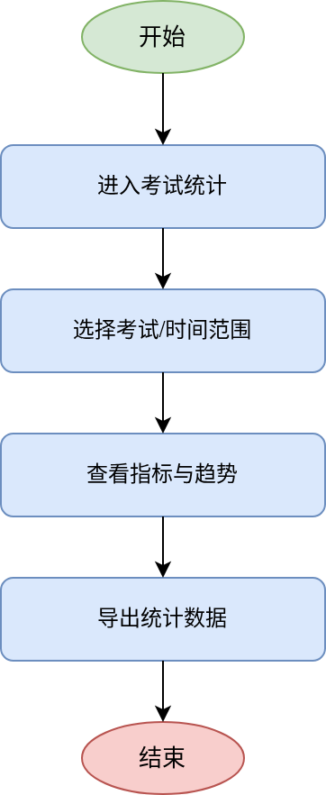

**（五）功能时序图**

#### 3.5.9.2 成绩分析

**（一）功能需求概述**

成绩分析功能用于对指定考试的成绩数据进行深入分析，支持按分数段查看人数分布、按成绩查看考生排名及通过情况，帮助管理人员评估考试整体质量和考生水平分布。

**（二）功能设计**

**查询/筛选功能**

支持以下条件筛选，条件之间为"与"关系，点击搜索按钮触发查询：

| 筛选字段 | 类型 | 说明 |
|---------|------|------|
| 考试 | 单选 | 来源于考试管理中已创建的考试 |
| 组织部门 | 层级选择 | 来源于组织管理中已启用的部门，按层级展示 |

**分布分析**

按分数段查看成绩人数分布，分数段划分为90-100、80-89、70-79、60-69、60分以下等区间。

| 分数段 | 说明 |
|-------|------|
| 90-100 | 该分数段的考生人数；数据来源：阅卷中心的成绩数据 |
| 80-89 | 该分数段的考生人数；数据来源：阅卷中心的成绩数据 |
| 70-79 | 该分数段的考生人数；数据来源：阅卷中心的成绩数据 |
| 60-69 | 该分数段的考生人数；数据来源：阅卷中心的成绩数据 |
| 60分以下 | 该分数段的考生人数；数据来源：阅卷中心的成绩数据 |

**排名对比**

按考试成绩查看考生排名。

| 列名 | 字段类型 | 说明 |
|-----|---------|------|
| 排名 | 数字 | 按成绩降序自动排列 |
| 考生姓名 | 文本 | 数据来源：用户管理中的考生信息 |
| 所属部门 | 文本 | 数据来源：组织管理中的部门信息 |
| 成绩 | 数字 | 数据来源：阅卷中心的成绩数据 |

**通过情况**

查看以下统计指标：

| 指标项 | 说明 |
|-------|------|
| 及格人数 | 成绩达到合格标准的考生人数；数据来源：阅卷中心的成绩数据及考试合格标准 |
| 不及格人数 | 成绩未达到合格标准的考生人数；数据来源：阅卷中心的成绩数据及考试合格标准 |
| 通过率 | 及格人数占参考总人数的比例；数据来源：阅卷中心的成绩数据 |

**导出功能**

点击"导出"，将当前筛选条件下的成绩分析数据导出为电子表格文件。

**业务规则**

- 分数段区间为系统固定划分（90-100、80-89、70-79、60-69、60分以下），不支持自定义调整。
- 排名对比仅统计已完成阅卷的考生成绩，未阅卷完成的考生不纳入排名。
- 及格人数、不及格人数、通过率按该考试设定的合格标准判定。

**边界与异常**

- **空数据**：所选考试无成绩数据时，显示"暂无统计数据"。
- **权限不足**：成绩分析菜单入口对无权限角色完全隐藏（不渲染，非禁用）。
- **导出无数据**：当前筛选条件下无可导出数据时，提示"当前无可导出数据"。

**（三）业务逻辑关联**

- 分布分析、排名对比、通过情况数据均来源于阅卷中心的成绩数据，需考试完成阅卷后数据方可统计。
- 组织部门筛选维度数据来源于组织管理中已启用的部门。

**（四）用户操作流程图**

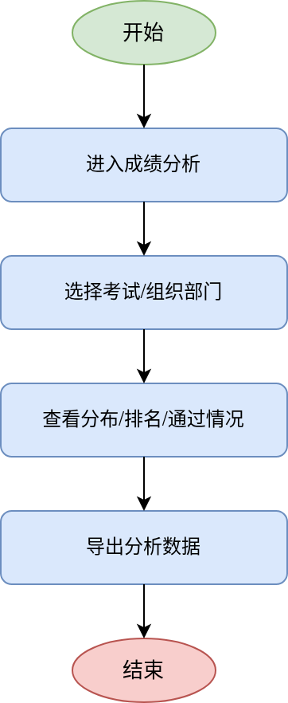

**（五）功能时序图**

#### 3.5.9.3 学情分析

**（一）功能需求概述**

学情分析功能基于考生的考试与练习数据，通过AI生成个人或群体的学情分析报告，识别薄弱知识点并给出能力评估与提升建议，为教学决策和个性化辅导提供依据。

**（二）功能设计**

**查询/筛选功能**

支持以下条件筛选，条件之间为"与"关系，点击搜索按钮触发查询：

| 筛选字段 | 类型 | 说明 |
|---------|------|------|
| 考生 | 单选 | 来源于用户管理中已注册的考生；与组织部门二选一 |
| 组织部门 | 层级选择 | 来源于组织管理中已启用的部门，按层级展示；与考生二选一 |
| 时间范围 | 日期范围 | 选择开始和结束日期，按考试与练习发生时间统计 |

**AI学情报告**

系统调用AI，基于考生在统计范围内的考试与练习数据，生成学情分析报告。报告内容包含：

| 报告内容 | 说明 |
|---------|------|
| 薄弱知识点分析 | 识别考生在各知识点上的掌握薄弱环节 |
| 能力评估 | 评估考生当前的整体能力水平 |
| 提升建议 | 针对薄弱环节给出的学习提升建议 |

选择单个考生时生成个人学情报告；选择组织部门（班级/部门）时生成群体学情报告，反映该群体的整体学情。

**导出功能**

点击"导出"，将当前生成的学情分析报告导出为文件。

**业务规则**

- 生成学情报告需考生具备足够的考试或练习数据，数据不足时阻止生成，提示"该考生练习数据不足，暂无法生成学情分析"。
- AI服务不可用时阻止生成，提示"AI学情分析服务暂不可用，请稍后重试"。
- 群体学情报告基于群体内各考生的数据综合生成，反映群体整体学情，不替代个人学情报告。

**边界与异常**

- **空数据**：统计范围内无考试或练习数据时，显示"暂无统计数据"。
- **权限不足**：学情分析菜单入口对无权限角色完全隐藏（不渲染，非禁用）。
- **导出无数据**：当前无已生成的学情分析报告时，提示"当前无可导出数据"。
- **数据不足**：考生练习数据不足时，提示"该考生练习数据不足，暂无法生成学情分析"。
- **AI服务异常**：AI服务不可用时，提示"AI学情分析服务暂不可用，请稍后重试"。

**（三）业务逻辑关联**

- 学情分析依赖系统管理中的AI模型配置，需完成AI模型配置后方可生成报告。
- 学情分析所需的考试成绩数据来源于阅卷中心，练习数据来源于考生端的练习记录。
- 组织部门维度数据来源于组织管理中已启用的部门。

**（四）用户操作流程图**

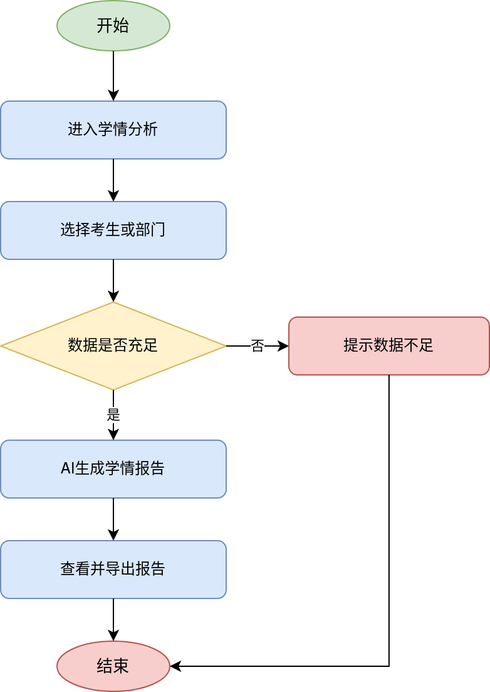

**（五）功能时序图**

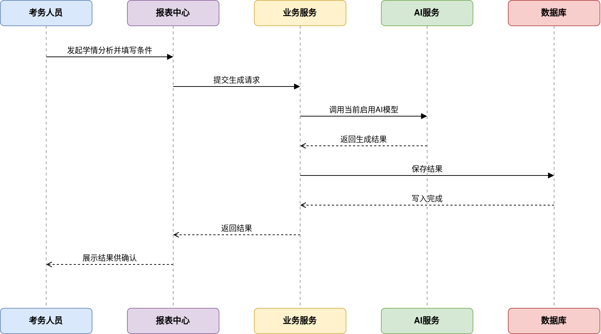

### 3.5.10 组织管理

组织管理用于维护平台的组织架构与考点信息，为用户归属、考生分配范围、成绩统计的组织维度提供基础数据支撑。

#### 3.5.10.1 组织架构

**（一）功能需求概述**

组织架构功能用于维护平台的组织与部门层级结构，为用户管理中的用户归属、考试管理中的考生分配范围、报表中心的组织维度统计提供基础数据。

**（二）功能设计**

**列表功能**

按层级展示组织与部门。

| 列名 | 字段类型 | 说明 |
|-----|---------|------|
| 组织/部门名称 | 文本 | 按层级缩进展示 |
| 上级组织 | 文本 | 顶级组织无值显示"-" |
| 负责人 | 文本 | 无值显示"-" |
| 排序 | 数字 | - |
| 状态 | 状态标签 | 启用 / 停用 |
| 操作 | 操作按钮 | 编辑、删除、启用/停用（无权限时隐藏） |

列表为空时显示：暂无组织数据。

**新增功能**

点击"新增"，弹出编辑窗口，填写组织信息。

| 字段名称 | 类型 | 长度限制 | 必填 | 默认值 | 说明 |
|---------|------|---------|------|-------|------|
| 名称 | 文本输入 | ≤50字 | 是 | - | 组织或部门名称 |
| 上级组织 | 层级选择 | - | 否 | 顶级 | 来源于组织架构中已有的组织，不选表示新增为顶级组织 |
| 负责人 | 文本输入 | ≤50字 | 否 | - | - |
| 排序 | 数字输入 | - | 否 | - | 数值越小越靠前 |
| 状态 | 单选 | - | 是 | 启用 | 枚举值：启用/停用 |

提交成功：新增组织成功。提交失败：保留填写内容，显示具体错误原因。

**编辑功能**

点击"编辑"，弹出编辑窗口，自动填入当前记录数据，表单字段同新增。
提交成功：编辑组织成功。

**删除功能**

点击"删除"，弹出确认"确定要删除该组织吗？删除后不可恢复"。
删除成功：删除组织成功。
存在子部门或关联用户时阻止删除，提示"该组织下存在子部门或用户，无法删除"。

**启用/停用功能**

点击"启用"或"停用"，切换组织状态。

**业务规则**

- 组织存在子部门或关联用户时不可删除，删除操作被阻止，提示"该组织下存在子部门或用户，无法删除"。
- 组织状态变更为停用后，该组织及其子部门在用户归属选择中不再可选，新用户无法归属到该组织及其子部门。

**边界与异常**

- **空数据**：组织列表无数据时，显示"暂无组织数据"。
- **权限不足**：新增、编辑、删除、启用/停用按钮对无权限角色完全隐藏（不渲染，非禁用）。

**（三）业务逻辑关联**

- 组织架构数据被用户管理引用，用户归属组织时选择范围来源于本模块中已启用的组织。
- 组织架构数据被考试管理引用，用于确定考生分配范围。
- 组织架构数据被报表中心引用，用于按组织维度统计成绩数据。

**（四）用户操作流程图**

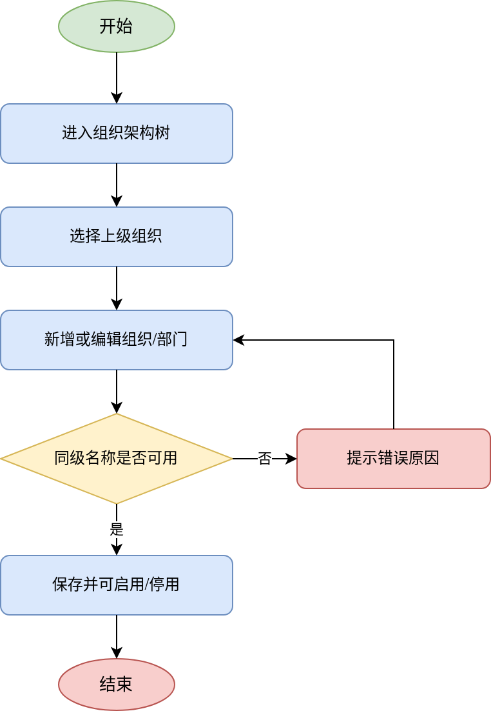

**（五）功能时序图**

#### 3.5.10.2 考点管理

**（一）功能需求概述**

考点管理功能用于维护平台的考点基础信息，支持按考点名称、状态查询，为考试管理中的考点安排提供基础数据。

**（二）功能设计**

**查询/筛选功能**

支持以下条件筛选，条件之间为"与"关系，点击搜索按钮触发查询：

| 筛选字段 | 类型 | 说明 |
|---------|------|------|
| 考点名称 | 文本输入 | 支持模糊搜索 |
| 状态 | 单选 | 枚举值：启用/停用 |

**列表功能**

| 列名 | 字段类型 | 说明 |
|-----|---------|------|
| 考点名称 | 文本 | - |
| 考点地址 | 文本 | 无值显示"-" |
| 容纳人数 | 数字 | 无值显示"-" |
| 状态 | 状态标签 | 启用 / 停用 |
| 操作 | 操作按钮 | 编辑、删除、启用/停用（无权限时隐藏） |

分页默认每页10条，支持切换每页数量。列表为空时显示：暂无考点数据。

**新增功能**

点击"新增"，弹出编辑窗口，填写考点信息。

| 字段名称 | 类型 | 长度限制 | 必填 | 默认值 | 说明 |
|---------|------|---------|------|-------|------|
| 考点名称 | 文本输入 | ≤50字 | 是 | - | - |
| 考点地址 | 文本输入 | ≤200字 | 是 | - | - |
| 容纳人数 | 数字输入 | - | 否 | - | 正整数 |
| 联系人 | 文本输入 | ≤50字 | 否 | - | - |
| 联系电话 | 文本输入 | 11位 | 否 | - | 手机号格式校验 |
| 状态 | 单选 | - | 是 | 启用 | 枚举值：启用/停用 |

提交成功：新增考点成功。提交失败：保留填写内容，显示具体错误原因。

**编辑功能**

点击"编辑"，弹出编辑窗口，自动填入当前记录数据，表单字段同新增。
提交成功：编辑考点成功。

**删除功能**

点击"删除"，弹出确认"确定要删除该考点吗？删除后不可恢复"。
删除成功：删除考点成功。
考点被考试引用时阻止删除，提示"该考点已被考试引用，无法删除"。

**启用/停用功能**

点击"启用"或"停用"，切换考点状态。

**业务规则**

- 考点被考试管理引用时不可删除，删除操作被阻止，提示"该考点已被考试引用，无法删除"。

**边界与异常**

- **空数据**：考点列表无数据时，显示"暂无考点数据"。
- **权限不足**：新增、编辑、删除、启用/停用按钮对无权限角色完全隐藏（不渲染，非禁用）。

**（三）业务逻辑关联**

- 考点数据被考试管理引用，用于考试的考点安排。

**（四）用户操作流程图**

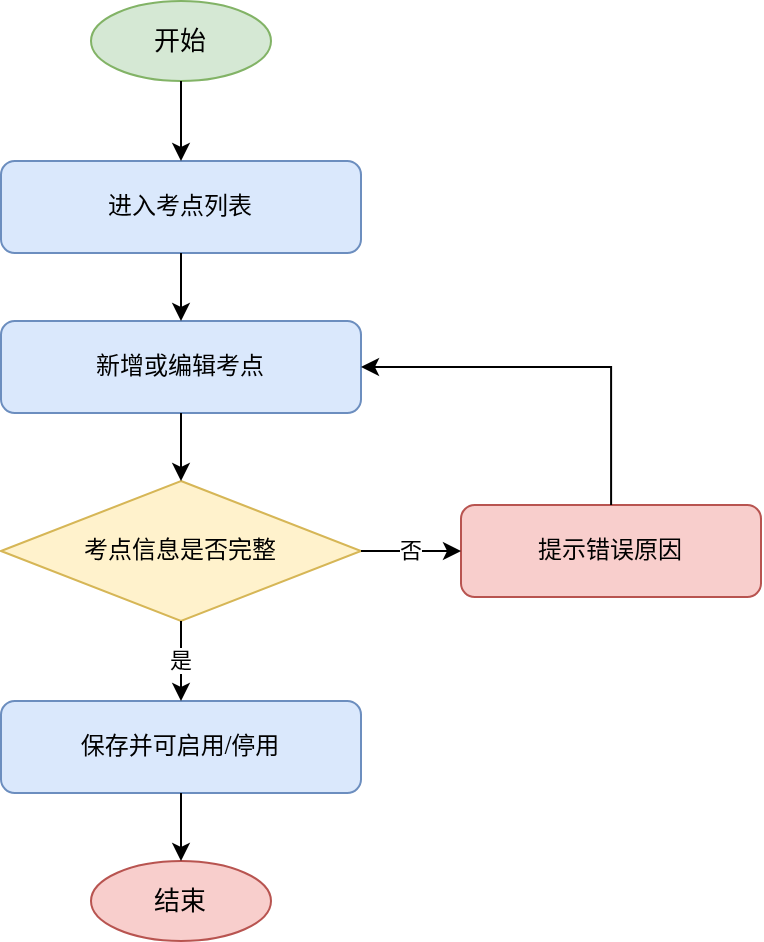

**（五）功能时序图**

### 3.5.11 用户管理

**（一）功能需求概述**

用户管理用于维护平台各类用户账号及其角色归属，是权限管理与身份认证的基础，为登录鉴权、功能授权和考试参与资格判定提供数据支撑。

**（二）功能设计**

**查询/筛选功能**

支持以下条件筛选，条件之间为"与"关系，点击搜索按钮触发查询：

| 筛选字段 | 类型 | 说明 |
|---------|------|------|
| 用户名/姓名 | 文本输入 | 支持模糊搜索 |
| 角色 | 单选 | 来源于角色管理中已配置的角色 |
| 状态 | 单选 | 枚举值：启用/停用 |
| 所属组织 | 层级选择 | 来源于组织管理中已配置的组织 |

**列表功能**

| 列名 | 字段类型 | 说明 |
|-----|---------|------|
| 用户名 | 文本 | 新增时填写 |
| 姓名 | 文本 | 新增时填写 |
| 所属组织 | 文本 | 新增时选择，未选择时显示"-" |
| 角色 | 文本 | 新增时选择，多个角色逐个展示 |
| 联系电话 | 文本 | 新增时填写，未填写时显示"-" |
| 状态 | 状态标签 | 启用/停用 |
| 创建时间 | 时间 | 系统自动记录，新增用户时生成 |
| 操作 | 操作按钮 | 编辑、启用/停用、重置密码（无权限时隐藏） |

分页默认每页10条，支持切换每页数量。列表为空时显示：暂无用户数据。

**新增功能**

点击"新增"进入新建用户页面。

| 字段名称 | 类型 | 长度限制 | 必填 | 默认值 | 说明 |
|---------|------|---------|------|-------|------|
| 用户名 | 文本输入 | 4-20字 | 是 | - | 登录账号，全局唯一 |
| 姓名 | 文本输入 | 2-20字 | 是 | - | - |
| 初始密码 | 文本输入 | 6-20字 | 是 | - | 密码加密保存 |
| 角色 | 多选 | - | 是 | - | 来源于角色管理中已配置的角色，至少选择一个 |
| 所属组织 | 层级选择 | - | 否 | - | 来源于组织管理中已配置的组织 |
| 联系电话 | 文本输入 | 11位 | 否 | - | 手机号格式校验 |
| 电子邮箱 | 文本输入 | - | 否 | - | 邮箱格式校验 |
| 状态 | 单选 | - | 是 | 启用 | 枚举值：启用/停用 |

提交成功：新增用户成功。
提交失败：保留填写内容，显示具体错误原因。

**编辑功能**

点击"编辑"，自动填入当前用户数据，表单字段同新增，用户名不可修改。
提交成功：编辑用户成功。

**启用/停用功能**

点击"启用"或"停用"，切换用户账号状态。
切换成功：状态切换成功。

**重置密码功能**

点击"重置密码"，将该用户密码重置为系统默认密码或随机密码，并提示重置结果。

**业务规则**

- 用户名在系统内全局唯一。新增时若用户名重复，阻止提交，提示"该用户名已存在，请更换"。
- 用户账号停用后，该用户不可登录，登录时提示"账号已停用，请联系管理员"。
- 考生角色的用户为内部考生，可参加考试与练习；外部考生在外部考生管理中维护，不在此模块。
- 每个用户至少分配一个角色。新增或编辑时若未分配角色，阻止提交，提示"请至少为用户分配一个角色"。

**边界与异常**

- **空数据**：列表无数据时，显示"暂无用户数据"
- **权限不足**：新增、编辑、启用/停用、重置密码按钮对无权限角色完全隐藏（不渲染，非禁用）
- **操作当前登录账号**：不可停用或删除当前登录的自己的账号，提示"无法操作当前登录账号"

**（三）业务逻辑关联**

- 角色数据来源于角色管理，需先在角色管理中完成角色配置
- 所属组织数据来源于组织管理，需先在组织管理中完成组织配置
- 用户的角色决定其可访问的功能范围，与权限矩阵联动
- 具有监考员角色的用户供监考中心分配监考任务
- 具有考生角色的用户参加考试与练习

**（四）用户操作流程图**

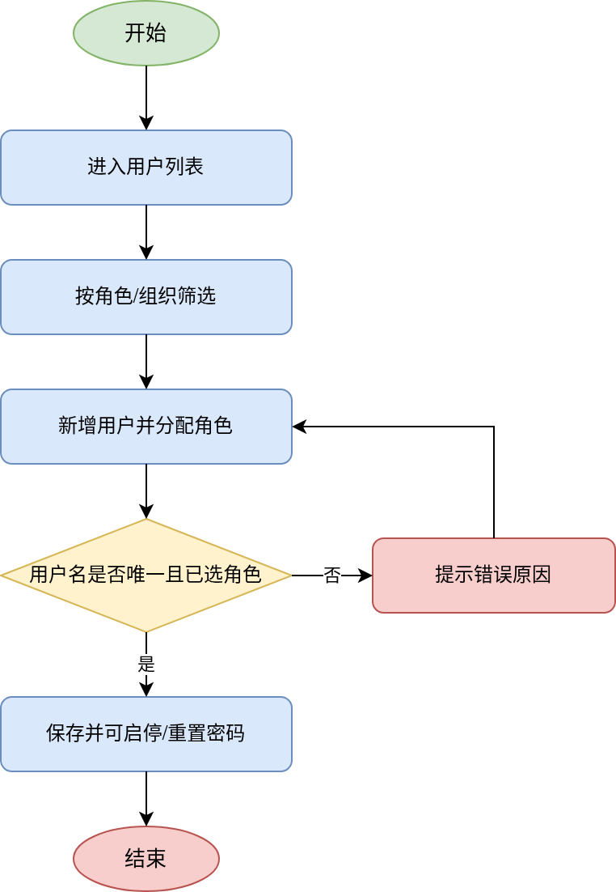

**（五）功能时序图**

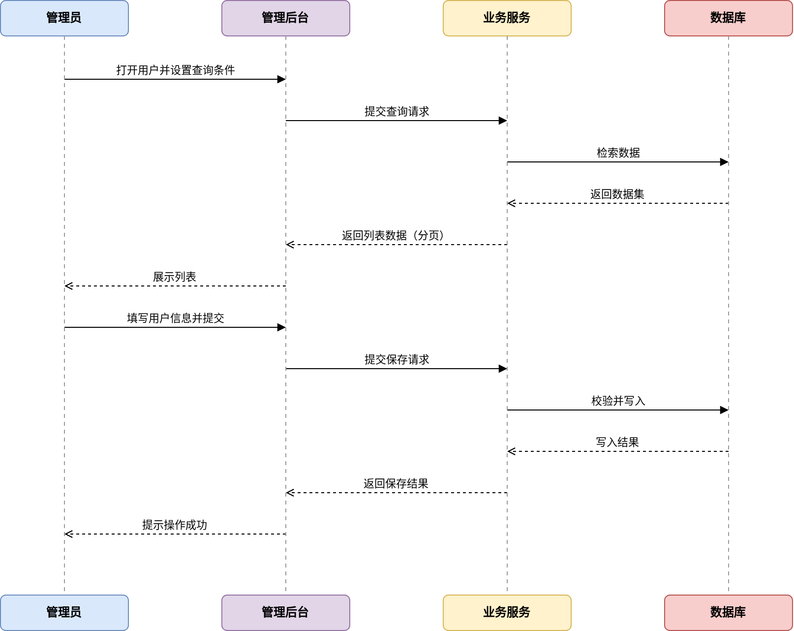

### 3.5.12 角色管理

**（一）功能需求概述**

角色管理用于统一配置平台的角色及其功能访问权限，通过角色实现用户操作权限的批量管理，支持系统预置角色（系统管理员、考务人员、阅卷老师、监考员、考生）及权限的灵活调整，为全平台的权限控制提供基础支撑。

**（二）功能设计**

**列表功能**

| 列名 | 字段类型 | 说明 |
|-----|---------|------|
| 角色名称 | 文本 | - |
| 角色说明 | 文本 | 无值显示"-" |
| 关联用户数 | 数字 | 数据来源：系统自动统计当前已分配该角色的用户数量 |
| 是否内置 | 状态标签 | 是 / 否，数据来源：系统预置标记，不可修改 |
| 操作 | 操作按钮 | 编辑、分配权限、删除（内置角色不显示删除按钮，无权限时隐藏） |

分页默认每页10条，支持切换每页数量。列表为空时显示："暂无角色数据"。

**新增功能**

点击"新增角色"，弹出编辑窗口。

| 字段名称 | 类型 | 长度限制 | 必填 | 默认值 | 说明 |
|---------|------|---------|------|-------|------|
| 角色名称 | 文本输入 | ≤50字 | 是 | - | 全局唯一 |
| 角色说明 | 文本输入 | ≤200字 | 否 | - | 角色用途说明 |

提交成功：新增角色成功。
提交失败：保留填写内容，显示具体错误原因。

**编辑功能**

点击"编辑"，弹出编辑窗口，自动填入当前角色数据，表单字段同新增。
提交成功：编辑角色成功。

**删除功能**

点击"删除"，弹出确认"确定要删除该角色吗？删除后不可恢复"。
删除成功：删除角色成功。
内置角色不支持删除，删除按钮不显示；若通过其他路径触发，提示"内置角色不可删除"。
角色下存在关联用户时阻止删除，提示"该角色下存在关联用户，无法删除，请先移除关联"。

**分配权限功能**

点击"分配权限"，进入该角色的权限配置页面，以菜单树形式逐项展示系统全部功能菜单，支持按菜单勾选可访问范围，并对每个菜单勾选具体操作权限（查看/新增/编辑/删除等），权限粒度到菜单与操作两级。
保存成功：权限配置已保存。

**业务规则**

- 角色名称在系统内全局唯一。新增/编辑时若名称重复，阻止提交，提示"该角色名称已存在，请更换"。
- 内置角色（系统管理员、考务人员、阅卷老师、监考员、考生）不可删除。点击删除时阻止操作，提示"内置角色不可删除"。
- 角色下存在关联用户时不可删除。删除时阻止操作，提示"该角色下存在关联用户，无法删除，请先移除关联"。
- 权限配置保存后，该角色下所有已关联用户的可访问功能范围实时更新，无需用户重新登录。

**边界与异常**

- **空数据**：列表无数据时，显示"暂无角色数据"。
- **权限不足**：新增、编辑、删除、分配权限按钮对无权限角色完全隐藏（不渲染，非禁用）。

**（三）业务逻辑关联**

- 角色被用户管理引用，用户创建或编辑时需选择所属角色。
- 角色的权限配置结果决定页面访问权限矩阵中各角色对功能模块的访问范围。
- 分配权限页面展示的菜单数据来源于系统全部功能菜单。

**（四）用户操作流程图**

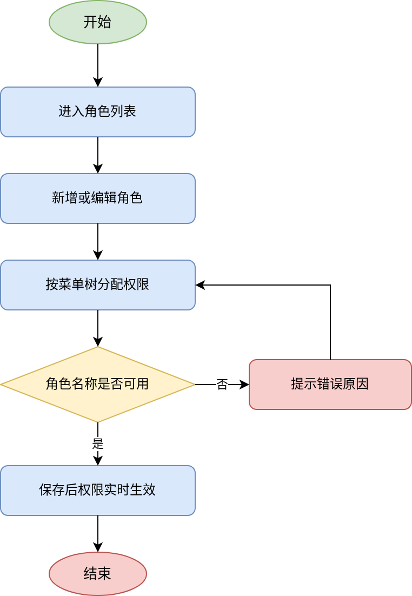

**（五）功能时序图**

### 3.5.13 系统管理

系统管理用于维护平台运行所需的基础配置，包括系统参数、AI模型配置、数据字典和操作日志，为出题、组卷、阅卷、学情分析、答疑等业务功能提供统一的配置支撑。系统管理仅系统管理员可访问，其他角色菜单入口隐藏。

#### 3.5.13.1 参数配置

**（一）功能需求概述**

参数配置用于维护平台运行相关的可配置系统参数，管理员通过调整参数值控制录像保留、交卷提醒、密码强度、AI出题数量等系统行为，无需改动系统即可适应业务变化。

**（二）功能设计**

**列表功能**

| 列名 | 字段类型 | 说明 |
|-----|---------|------|
| 参数名称 | 文本 | 如：录像保留期限(天)、考试自动交卷提前提醒时间(分钟)、登录密码最小长度、单次AI出题最大数量 |
| 参数值 | 文本 | 当前生效的参数取值 |
| 参数说明 | 文本 | 说明该参数的用途及取值范围 |
| 操作 | 操作按钮 | 编辑（无权限时隐藏） |

分页默认每页10条，支持切换每页数量。列表为空时显示："暂无参数配置数据"。

**编辑功能**

点击"编辑"，弹出编辑窗口，填写新的参数值，表单字段为参数值单项。
提交成功：显示"参数配置已更新"。
提交失败：保留填写内容，显示具体错误原因。

**业务规则**

- 参数值须符合该参数预设的数据类型与取值范围。提交时若超出允许范围，阻止提交，提示"参数值超出允许范围"。

**边界与异常**

- **空数据**：参数列表无数据时，显示"暂无参数配置数据"。
- **权限不足**：编辑按钮对无权限角色完全隐藏（不渲染，非禁用）；系统管理菜单对非系统管理员角色隐藏。

**（三）业务逻辑关联**

- 录像保留期限(天)参数被监考中心引用，用于控制监考录像的自动保留时长。

**（四）用户操作流程图**

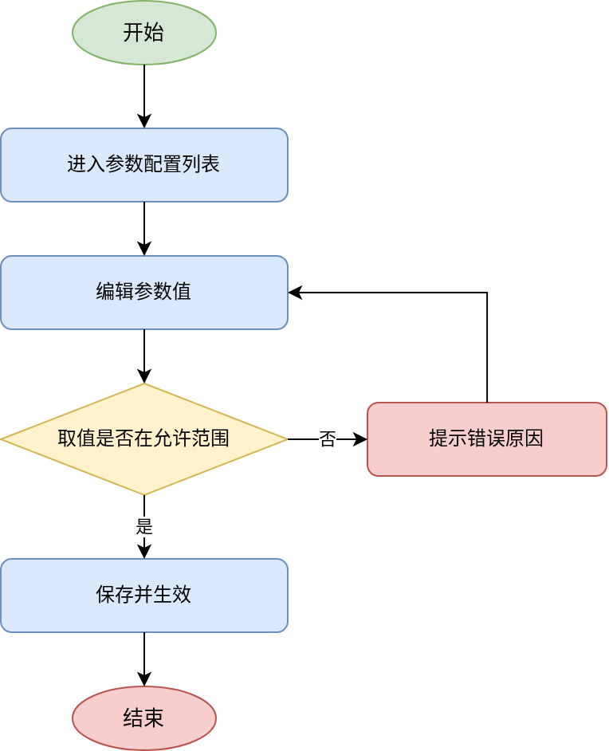

**（五）功能时序图**

#### 3.5.13.2 AI模型配置

**（一）功能需求概述**

AI模型配置用于维护平台对接的AI模型服务，管理员可新增、编辑、删除模型配置，并指定当前启用的模型。出题、组卷、阅卷、学情分析、答疑等AI功能统一使用当前启用的模型配置，实现模型服务的统一管理和便捷切换。

**（二）功能设计**

**列表功能**

| 列名 | 字段类型 | 说明 |
|-----|---------|------|
| 配置名称 | 文本 | - |
| 模型服务商 | 文本 | 通义千问 / DeepSeek / 智谱 / OpenAI / 其他 |
| 模型名称 | 文本 | - |
| 启用状态 | 状态标签 | 启用 / 停用，全局仅一项处于启用状态 |
| 连接状态 | 状态标签 | 正常 / 异常，由连接测试结果更新 |
| 操作 | 操作按钮 | 编辑、删除、启用/停用、连接测试（无权限时隐藏） |

分页默认每页10条，支持切换每页数量。列表为空时显示："暂无AI模型配置数据"。

**新增功能**

点击"新增"，弹出编辑窗口，填写模型配置信息。

| 字段名称 | 类型 | 长度限制 | 必填 | 默认值 | 说明 |
|---------|------|---------|------|-------|------|
| 配置名称 | 文本输入 | ≤50字 | 是 | - | 全局唯一 |
| 模型服务商 | 单选 | - | 是 | - | 枚举值：通义千问 / DeepSeek / 智谱 / OpenAI / 其他 |
| 模型名称 | 文本输入 | ≤100字 | 是 | - | - |
| 接口地址 | 文本输入 | ≤200字 | 是 | - | 格式校验 |
| 密钥 | 文本输入 | ≤200字 | 是 | - | 加密保存，保存后脱敏展示，仅显示部分字符 |
| 最大并发数 | 数字输入 | - | 否 | - | 正整数 |
| 超时时间 | 数字输入 | - | 否 | - | 单位：秒 |

提交成功：显示"AI模型配置新增成功"。
提交失败：保留填写内容，显示具体错误原因。

**编辑功能**

点击"编辑"，弹出编辑窗口，自动填入当前记录数据，密钥字段展示脱敏值，表单字段同新增。
提交成功：显示"AI模型配置编辑成功"。

**删除功能**

点击"删除"，弹出确认"确定要删除该配置吗？删除后不可恢复"。
删除成功：显示"AI模型配置删除成功"。
该配置为当前启用模型时，阻止删除，提示"该配置为当前启用模型，无法删除"。

**切换启用功能**

点击"启用"，将该配置设为当前启用模型，原启用配置自动变更为停用状态。
切换成功：显示"已切换为当前启用模型"。

**连接测试功能**

点击"连接测试"，系统使用当前配置信息尝试连接对应模型服务，并将结果更新至连接状态列。
连接测试成功：连接状态更新为"正常"。
连接测试失败：连接状态更新为"异常"，提示"连接测试失败，请检查配置"。

**业务规则**

- 同一时刻仅允许一个AI模型配置处于启用状态。切换启用某配置时，原启用配置自动变更为停用状态。
- 密钥加密保存，界面展示时脱敏，仅显示部分字符，不展示完整密钥。
- 连接测试失败时，提示"连接测试失败，请检查配置"，连接状态标记为"异常"。
- 删除当前启用的配置时，阻止删除，提示"该配置为当前启用模型，无法删除"，须先切换启用其他配置。

**边界与异常**

- **空数据**：列表无数据时，显示"暂无AI模型配置数据"。
- **权限不足**：新增、编辑、删除、启用/停用、连接测试按钮对无权限角色完全隐藏（不渲染，非禁用）；系统管理菜单对非系统管理员角色隐藏。

**（三）业务逻辑关联**

- 当前启用的AI模型配置被题库管理（AI出题）、试卷管理（AI组卷）、阅卷中心（AI阅卷）、报表中心（学情分析）、考生端（AI答疑）统一引用，切换启用配置后上述功能立即使用新配置。

**（四）用户操作流程图**

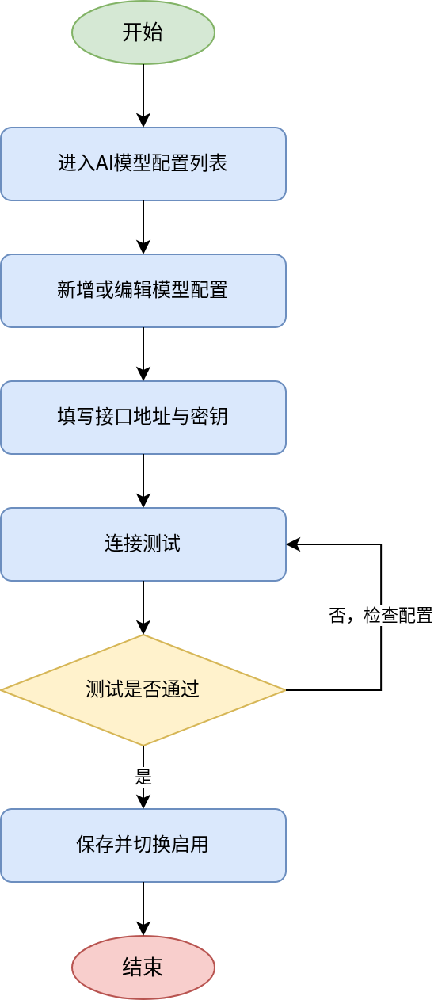

**（五）功能时序图**

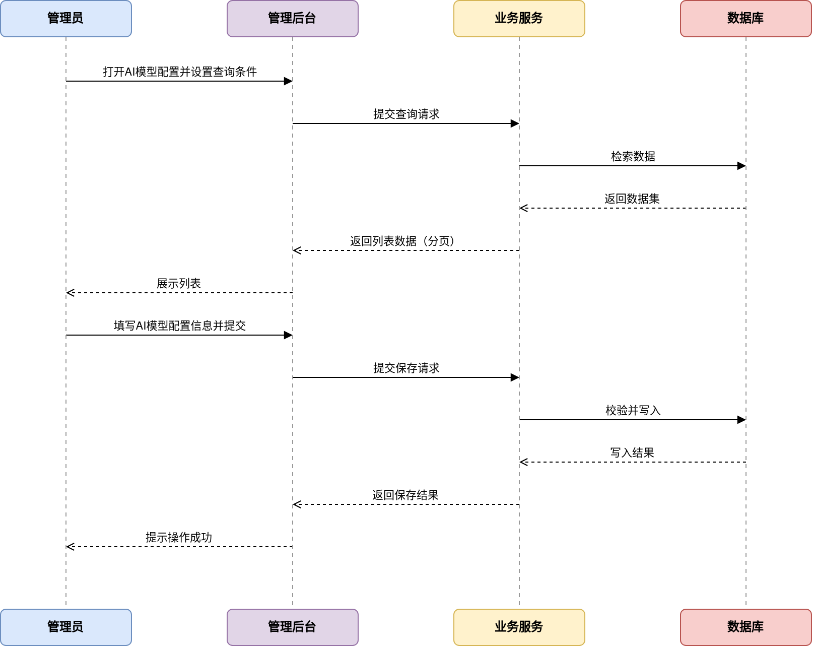

#### 3.5.13.3 数据字典

**（一）功能需求概述**

数据字典用于统一维护平台使用的系统枚举值，如题型、难度、事件类型等，管理员可按字典类型维护对应的字典项，为各业务模块提供一致的枚举值来源，避免枚举值分散维护、口径不一致。

**（二）功能设计**

**列表功能**

| 列名 | 字段类型 | 说明 |
|-----|---------|------|
| 字典类型 | 文本 | 如：题型、难度、事件类型等 |
| 字典项数量 | 数字 | 该字典类型下已配置的字典项数量，系统自动统计 |
| 操作 | 操作按钮 | 查看字典项（无权限时隐藏） |

分页默认每页10条，支持切换每页数量。列表为空时显示："暂无数据字典数据"。

**字典项管理**

点击"查看字典项"，进入该字典类型下的字典项列表。

| 列名 | 字段类型 | 说明 |
|-----|---------|------|
| 字典项名称 | 文本 | - |
| 字典项值 | 文本 | 供业务模块引用的枚举取值 |
| 排序 | 数字 | 控制字典项在业务模块中的展示顺序 |
| 状态 | 状态标签 | 启用 / 停用 |
| 操作 | 操作按钮 | 编辑、删除（无权限时隐藏） |

分页默认每页10条，支持切换每页数量。列表为空时显示："暂无字典项数据"。

**新增字典项功能**

点击"新增"，弹出编辑窗口，填写字典项信息。

| 字段名称 | 类型 | 长度限制 | 必填 | 默认值 | 说明 |
|---------|------|---------|------|-------|------|
| 字典项名称 | 文本输入 | ≤50字 | 是 | - | 同一字典类型下唯一 |
| 字典项值 | 文本输入 | ≤50字 | 是 | - | 同一字典类型下唯一 |
| 排序 | 数字输入 | - | 否 | 0 | 数值越小越靠前 |
| 状态 | 单选 | - | 是 | 启用 | 启用 / 停用 |

提交成功：显示"字典项新增成功"。
提交失败：保留填写内容，显示具体错误原因。

**编辑字典项功能**

点击"编辑"，弹出编辑窗口，自动填入当前记录数据，表单字段同新增。
提交成功：显示"字典项编辑成功"。

**删除字典项功能**

点击"删除"，弹出确认"确定要删除该字典项吗？删除后不可恢复"。
删除成功：显示"字典项删除成功"。
该字典项已被业务引用时，阻止删除，提示"该字典项已被引用，无法删除"。

**业务规则**

- 字典项名称、字典项值在同一字典类型下须唯一。新增/编辑时若重复，阻止提交，提示"该字典项已存在，请更换名称或值"。
- 字典项被业务模块引用时删除需先解除关联，阻止删除，提示"该字典项已被引用，无法删除"。
- 字典项状态变更为"停用"后，业务模块新建数据时不再展示该选项，历史已使用数据不受影响。

**边界与异常**

- **空数据**：字典类型列表无数据时，显示"暂无数据字典数据"；字典项列表无数据时，显示"暂无字典项数据"。
- **权限不足**：新增、编辑、删除按钮对无权限角色完全隐藏（不渲染，非禁用）；系统管理菜单对非系统管理员角色隐藏。

**（三）业务逻辑关联**

- 数据字典为题库管理、试卷管理、考试管理等各业务模块提供枚举值来源，如题型、难度、事件类型等选项均来源于本模块已启用的字典项。

**（四）用户操作流程图**

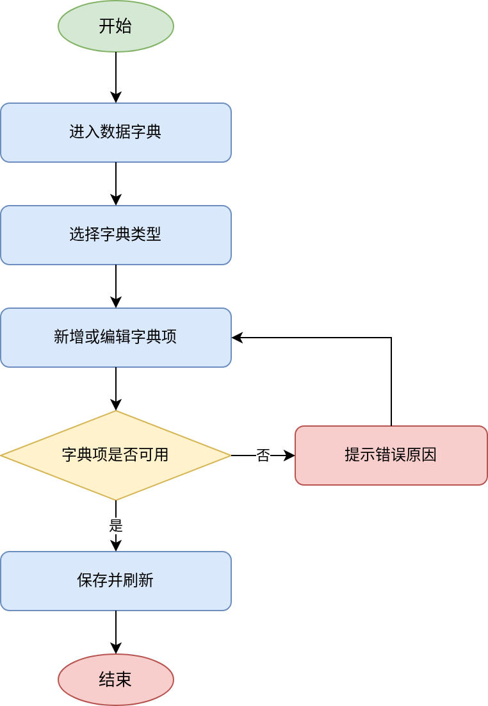

**（五）功能时序图**

#### 3.5.13.4 操作日志

**（一）功能需求概述**

操作日志记录全平台用户的关键操作行为，管理员可按操作人、操作类型、操作时间查询和追溯，为平台安全合规审计提供数据支撑。

**（二）功能设计**

**查询/筛选功能**

支持以下条件筛选，条件之间为"与"关系，点击搜索按钮触发查询：

| 筛选字段 | 类型 | 说明 |
|---------|------|------|
| 操作人 | 文本输入 | 支持模糊搜索 |
| 操作类型 | 单选 | 枚举值：新增 / 编辑 / 删除 / 登录 / 其他 |
| 操作时间 | 日期范围 | 选择开始和结束日期 |

**列表功能**

| 列名 | 字段类型 | 说明 |
|-----|---------|------|
| 操作人 | 文本 | 操作用户姓名 |
| 操作类型 | 文本 | 新增 / 编辑 / 删除 / 登录 / 其他 |
| 操作对象 | 文本 | 被操作的数据名称或对象 |
| 操作内容 | 文本 | 操作的具体描述 |
| 操作时间 | 日期时间 | 格式：YYYY-MM-DD HH:mm:ss |
| 来源地址 | 文本 | 操作发起的网络地址 |

分页默认每页10条，支持切换每页数量。列表为空时显示："暂无操作日志数据"。

操作日志仅支持查看，不提供编辑或删除入口。

**业务规则**

- 操作日志按系统配置的保留期限自动留存，超过保留期限的日志由系统自动清理。
- 操作日志由系统自动记录，不支持人工修改或删除，保障日志数据的完整性和可追溯性。

**边界与异常**

- **空数据**：列表无数据时，显示"暂无操作日志数据"。
- **权限不足**：操作日志菜单对无权限角色完全隐藏（不渲染，非禁用）；系统管理菜单对非系统管理员角色隐藏。

**（三）业务逻辑关联**

- 操作日志记录全平台各业务模块的关键操作行为，为系统管理员提供统一的审计追溯入口。

**（四）用户操作流程图**

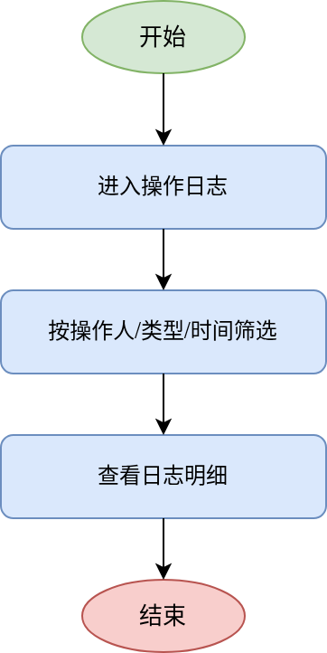

**（五）功能时序图**

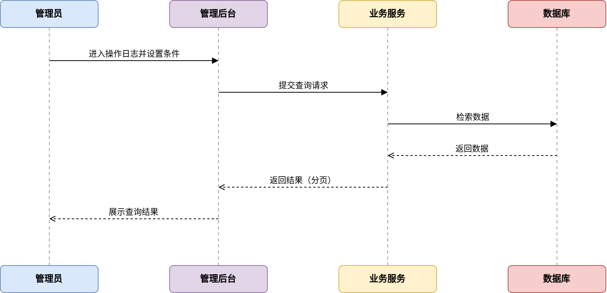

### 3.5.14 考生端（网页/桌面）

考生端供考生参加考试、开展练习、管理错题、查询成绩与证书，网页端与桌面端共用同一套考生业务功能。桌面端在防作弊能力上更强，考试过程中提供强制全屏、切屏检测、快捷键屏蔽等网页端不具备的防作弊手段，其余功能与网页端一致。

#### 3.5.14.1 考试

**（一）功能需求概述**

考试功能供考生查看可参加的考试并完成在线作答，覆盖身份核验、答题、防作弊监控、断线续考与交卷的完整考试流程，为考试成绩的公正性提供保障。

**（二）功能设计**

**考试列表**

| 列名 | 字段类型 | 说明 |
|-----|---------|------|
| 考试名称 | 文本 | - |
| 开始时间 | 日期时间 | - |
| 时长 | 文本 | 以分钟展示 |
| 考试状态 | 状态标签 | 枚举值：未开始/进行中/已结束 |
| 是否已交卷 | 状态标签 | 枚举值：未交卷/已交卷 |

列表为空时显示："暂无考试"。

**身份核验**

进入考试前，按该考试配置的防作弊策略进行身份核验；若考试开启人脸核身，考生需完成人脸核验并通过后才能进入考试，核验未通过则不可进入。

**在线答题**

进入考试后逐题展示题目供考生作答，同时展示倒计时显示剩余考试时间；答案在作答过程中实时自动保存；支持在题目导航中查看已答与未答的标记，用于快速定位题目。

**防作弊（桌面端强化）**

- 考试过程中强制保持全屏状态。
- 检测切换到考试窗口以外的操作（切屏），记录切屏次数并进行告警；切屏次数超过该考试允许的上限时，系统自动强制交卷。
- 屏蔽复制、粘贴操作以及快捷键操作。
- 考试开启考中人脸抓拍时，按设定频率定时对考生进行人脸抓拍。

**断线续考**

考试过程中发生断线，重新连接后自动恢复到断线前的答题进度与剩余时间，已作答内容保持不丢失。

**交卷**

支持手动交卷，交卷前弹出确认"确定交卷吗？交卷后不可修改"；考试时间到时系统自动交卷，交卷后不可再修改答案。

**业务规则**

- 考试未到配置的开始时间时，考生不可进入考试，提示"考试尚未开始"。
- 考生已完成交卷后不可重复进入该考试，提示"您已完成本场考试"。
- 考试中切屏次数超过该考试允许的上限时，系统自动强制交卷，提示"切屏次数超限，系统已自动交卷"。
- 身份核验未通过时，考生不可进入考试，提示"身份核验未通过，无法进入考试"。

**边界与异常**

- **空数据**：考试列表无可参加的考试时，显示"暂无考试"。
- **断线**：考试过程中发生断线，已作答内容自动保存，不因断线丢失。
- **权限不足**：非分配给当前考生的考试不在列表中展示。

**（三）业务逻辑关联**

- 考试列表数据来源于考试管理中已发布且已分配给该考生的考试。
- 身份核验方式、切屏检测上限、是否开启人脸核身及考中抓拍频率均来源于该考试的防作弊策略配置。
- 考试中产生的切屏告警、强制交卷等作弊相关事件，上报至监考中心，并记录为异常事件。

**（四）用户操作流程图**

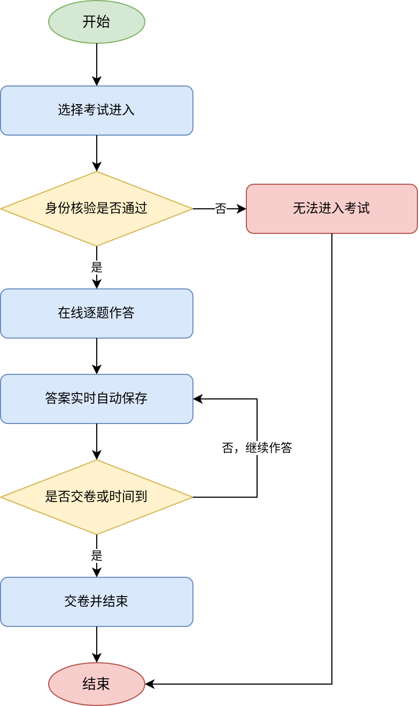

**（五）功能时序图**

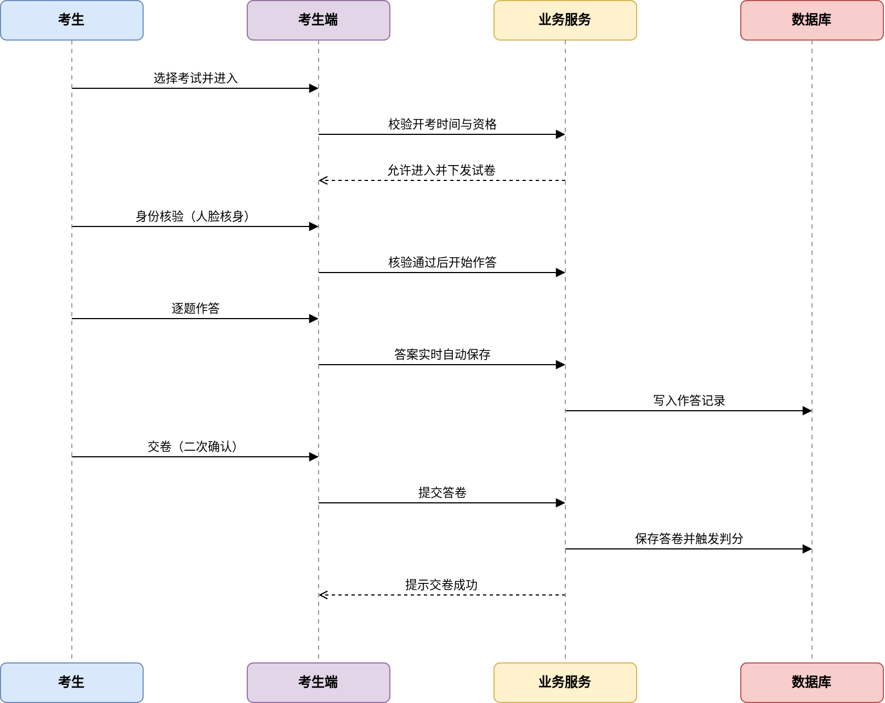

#### 3.5.14.2 练习

**（一）功能需求概述**

练习功能供考生按题库或知识点自主开展练习，作答后即时查看对错与解析，并可结合AI答疑与AI推题辅助巩固薄弱知识点。练习结果不计入考试成绩。

**（二）功能设计**

**练习列表**

支持以下条件筛选，条件之间为"与"关系，点击搜索按钮触发查询：

| 筛选字段 | 类型 | 说明 |
|---------|------|------|
| 题库 | 层级选择 | 来源于题库管理中已启用的题库 |
| 知识点 | 层级选择 | 来源于题库管理中已启用的知识点 |

**在线练习**

按所选题库或知识点范围逐题展示题目供考生作答，每题提交作答后即时显示该题的对错结果与答案解析。

**AI答疑**

针对当前作答的题目向AI提问，获取解答，依赖系统已配置可用的AI模型。

**AI推题**

根据考生在练习中暴露的薄弱知识点，推荐相关的练习题目。

**业务规则**

- AI答疑服务不可用时，提示"AI答疑暂不可用，请稍后重试"。
- 练习作答结果不计入考试成绩。

**边界与异常**

- **空数据**：所选题库或知识点范围内无题目时，显示"暂无练习题目"。
- **权限不足**：AI答疑、AI推题在系统未配置AI模型时对考生不可用。

**（三）业务逻辑关联**

- 练习题目来源于题库管理已启用的题库与知识点。
- AI答疑与AI推题依赖系统管理中的AI模型配置，未配置时相关功能不可用。
- 练习中产生的错题数据同步至错题本。

**（四）用户操作流程图**

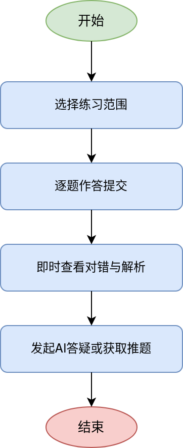

**（五）功能时序图**

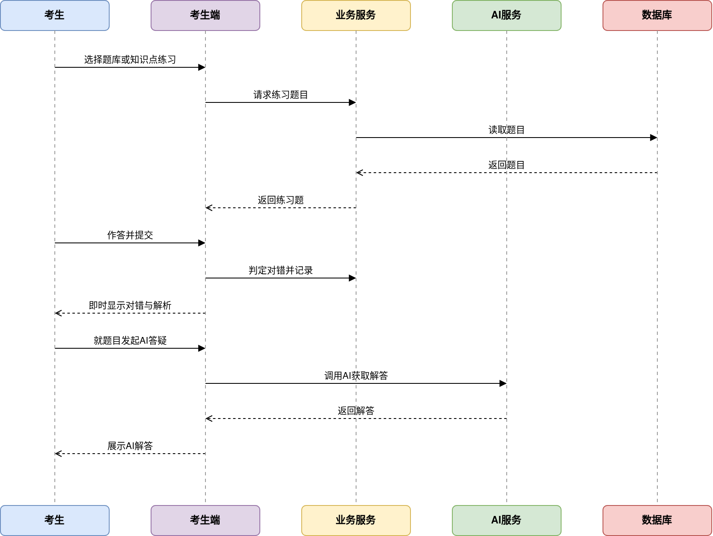

#### 3.5.14.3 错题本

**（一）功能需求概述**

错题本功能汇总考生在练习与考试中做错的题目，供考生集中巩固复习，并支持移除已掌握的错题，帮助考生跟踪自身薄弱环节。

**（二）功能设计**

**错题列表**

| 列名 | 字段类型 | 说明 |
|-----|---------|------|
| 题干 | 文本 | - |
| 所属知识点 | 文本 | 数据来源：题库管理中题目关联的知识点 |
| 错误次数 | 文本 | 系统自动统计 |
| 最近错误时间 | 日期时间 | 系统自动记录 |

列表为空时显示："暂无错题"。

**错题练习**

针对错题本中的题目重新作答，作答结果用于判断该题是否可移除。

**移除错题**

支持手动移除单条错题；错题重新作答连续答对达到设定次数后，系统自动移除该错题。

**业务规则**

- 同一题目在练习或考试中多次做错时，累计该题的错误次数。

**边界与异常**

- **空数据**：错题本无数据时，显示"暂无错题"。

**（三）业务逻辑关联**

- 错题数据来源于该考生在练习与考试中作答错误的题目。
- 错题本中题目移除后不再计入错误次数统计。

**（四）用户操作流程图**

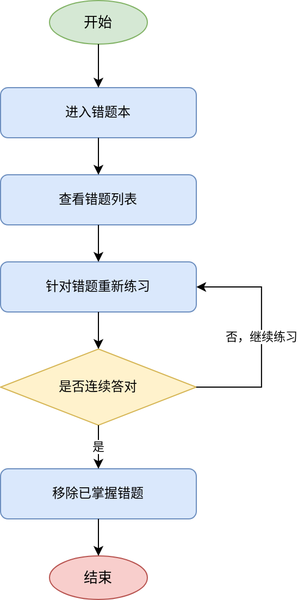

**（五）功能时序图**

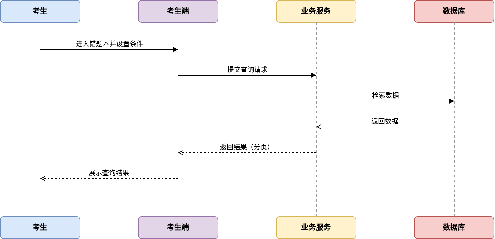

#### 3.5.14.4 成绩查询

**（一）功能需求概述**

成绩查询功能供考生查看已发布的历次考试成绩及作答详情，帮助考生了解自身考试结果与得分情况。

**（二）功能设计**

**成绩列表**

| 列名 | 字段类型 | 说明 |
|-----|---------|------|
| 考试名称 | 文本 | - |
| 成绩 | 文本 | 成绩未发布时显示"成绩待发布" |
| 是否通过 | 状态标签 | 枚举值：通过/未通过 |
| 考试时间 | 日期时间 | - |

列表为空时显示："暂无成绩记录"。

**成绩详情**

查看单次考试的作答情况与各题得分，仅在该场考试成绩发布后可查看。

**业务规则**

- 考试成绩未发布时，成绩列显示"成绩待发布"，且不可查看成绩详情。
- 考试结果为未通过时，在列表中标注"未通过"。

**边界与异常**

- **空数据**：考生无任何成绩记录时，显示"暂无成绩记录"。

**（三）业务逻辑关联**

- 成绩数据来源于阅卷中心已发布的成绩。
- 成绩详情中的各题得分数据来源于阅卷中心的评分结果。

**（四）用户操作流程图**

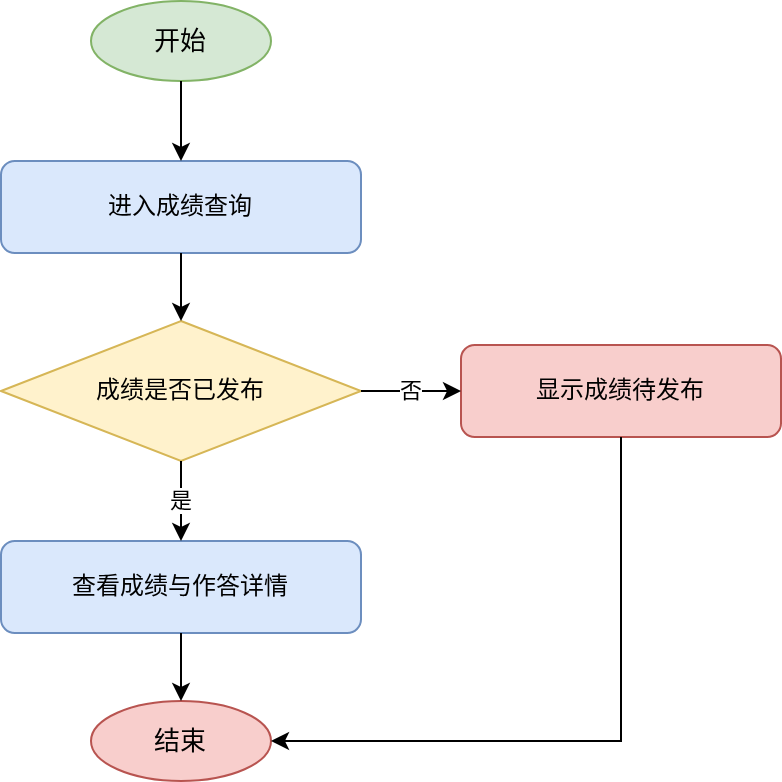

**（五）功能时序图**

#### 3.5.14.5 我的证书

**（一）功能需求概述**

我的证书功能供考生查看已获得的证书及其详情，支持下载证书，便于考生留存和使用考试合格凭证。

**（二）功能设计**

**证书列表**

| 列名 | 字段类型 | 说明 |
|-----|---------|------|
| 证书名称 | 文本 | - |
| 证书编号 | 文本 | 系统自动生成 |
| 颁发日期 | 日期 | - |
| 有效期至 | 日期 | - |
| 状态 | 状态标签 | 枚举值：有效/已过期/已作废 |

列表为空时显示："暂无证书"。

**证书详情**

查看证书内容与查验码，支持下载证书。

**业务规则**

- 证书超过有效期至日期后，状态标注"已过期"。
- 证书被作废后，状态标注"已作废"。

**边界与异常**

- **空数据**：考生无任何证书时，显示"暂无证书"。

**（三）业务逻辑关联**

- 证书数据来源于证书管理已颁发给该考生的证书。
- 证书状态（已过期、已作废）随证书管理中的证书状态变更同步更新。

**（四）用户操作流程图**

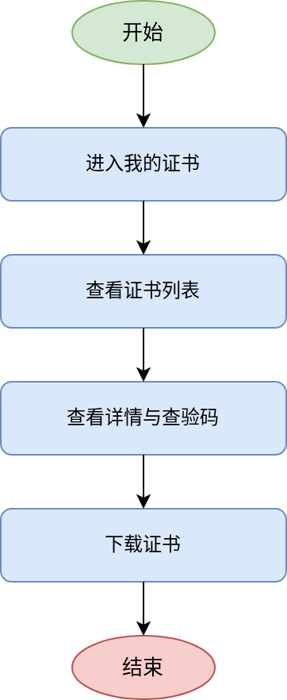

**（五）功能时序图**

### 3.5.15 监考端

监考端是独立的监考应用，供监考员在考试进行中实时监督分配给自己的考试，通过实时查看考生画面、接收异常告警并及时处置，保障考试过程的公平性和安全性。

#### 3.5.15.1 实时监控

**（一）功能需求概述**

实时监控功能供监考员集中查看分配给本人且正在进行的考试中全部在考考生的实时状态，支持查看单个考生详情、发送提醒并对确认违规的考生强制结束考试，保障监考过程及时有效。

**（二）功能设计**

**选择监考考试**

监考员进入后，展示分配给本人且状态为"进行中"的考试，来源于管理后台监考中心分配给该监考员的监考安排。监考员选择其中一场考试后进入该考试的监控。

**考生实时画面**

选择考试后，集中查看该考试全部在考考生的实时画面。

| 列名 | 字段类型 | 说明 |
|-----|---------|------|
| 考生姓名 | 文本 | 数据来源：考生报名信息 |
| 实时画面 | 音视频画面、屏幕画面 | 来源于考生端开启音视频监控和屏幕监控的考试 |

**考生详情查看**

点击单个考生，查看该考生的实时画面、答题进度、已触发的异常。

| 字段名称 | 说明 |
|---------|------|
| 实时画面 | 音视频画面和屏幕画面 |
| 答题进度 | 数据来源：考生端答题记录，实时更新 |
| 已触发异常 | 数据来源：该考生的异常事件记录，按发生时间排列 |

**远程提醒**

点击"提醒"，填写提醒内容，向指定考生发送文字提醒。

| 字段名称 | 类型 | 长度限制 | 必填 | 默认值 | 说明 |
|---------|------|---------|------|-------|------|
| 提醒内容 | 文本输入 | ≤200字 | 是 | - | - |

发送成功：提示"提醒已发送"。

**强制交卷**

点击"强制交卷"，弹出确认"确定强制该考生交卷吗？操作不可撤销"，确认后该考生立即结束考试。
强制交卷成功：提示"该考生已强制交卷"，系统自动记录该事件。

**业务规则**

- 监考员仅能监控分配给自己且正在进行的考试。无进行中的监考任务时，提示"暂无进行中的监考任务"。
- 强制交卷为不可撤销操作，须二次确认"确定强制该考生交卷吗？操作不可撤销"。
- 强制交卷后，考生端立即结束该考生的考试，系统自动记录本次强制交卷事件。

**边界与异常**

- **空数据**：无分配给本人的进行中考试时，显示"暂无进行中的监考任务"。
- **权限不足**：远程提醒、强制交卷等操作对无权限角色完全隐藏（不渲染，非禁用）。
- **网络中断**：考生实时画面连接中断时，提示"画面连接中断，正在重连"。

**（三）业务逻辑关联**

- 监考任务来源于管理后台监考中心的监考安排，需监考中心先完成分配。
- 考生实时画面来源于考生端开启音视频监控和屏幕监控的考试，需考生端已开启相应监控。
- 强制交卷及提醒事件同步至监考中心的异常事件台账。

**（四）用户操作流程图**

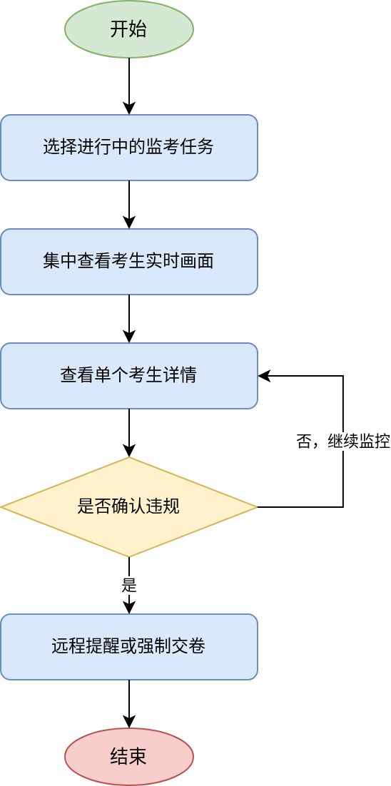

**（五）功能时序图**

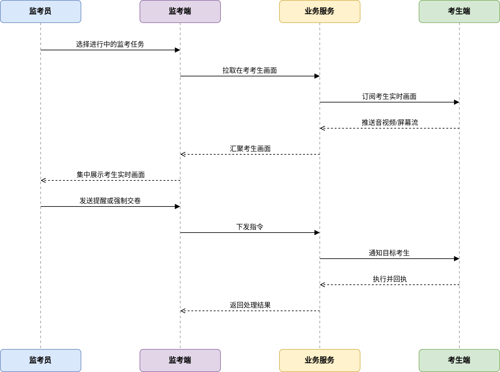

#### 3.5.15.2 异常事件

**（一）功能需求概述**

异常事件功能实时展示监考员所监控考试中考生触发的各类异常，支持监考员标记处理结果，确保违规行为得到及时记录和处置。

**（二）功能设计**

**异常事件流**

实时展示监控考试中考生触发的异常，按发生时间排列。

| 列名 | 字段类型 | 说明 |
|-----|---------|------|
| 考生姓名 | 文本 | - |
| 事件类型 | 状态标签 | 枚举值：切屏 / 离屏 / 人脸不匹配 / 多屏等，数据来源：考生端异常检测自动生成 |
| 发生时间 | 日期时间 | 系统自动记录 |
| 处理状态 | 状态标签 | 未处理 / 已关注 / 已提醒 / 已上报 |

列表为空时显示："暂无异常事件"。

**标记处理结果**

点击事件，标记该事件的处理结果。

| 字段名称 | 类型 | 必填 | 默认值 | 说明 |
|---------|------|------|-------|------|
| 处理结果 | 单选 | 是 | - | 枚举值：已关注 / 已提醒 / 已上报 |

标记成功：系统自动记录处理人与处理时间，事件处理状态更新。

**业务规则**

- 异常事件实时推送至监考员。
- 监考员标记处理结果后，系统自动记录处理人与处理时间。
- 处置与标记的事件同步至管理后台监考中心的异常事件台账。

**边界与异常**

- **空数据**：监控考试中无异常事件时，显示"暂无异常事件"。
- **权限不足**：标记处理结果操作对无权限角色完全隐藏（不渲染，非禁用）。

**（三）业务逻辑关联**

- 异常事件数据来源于实时监控中正在监控考试的考生触发记录。
- 监考员标记的处理结果及处理人、处理时间同步至管理后台监考中心的异常事件台账。

**（四）用户操作流程图**

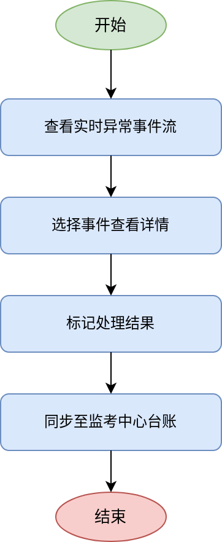

**（五）功能时序图**

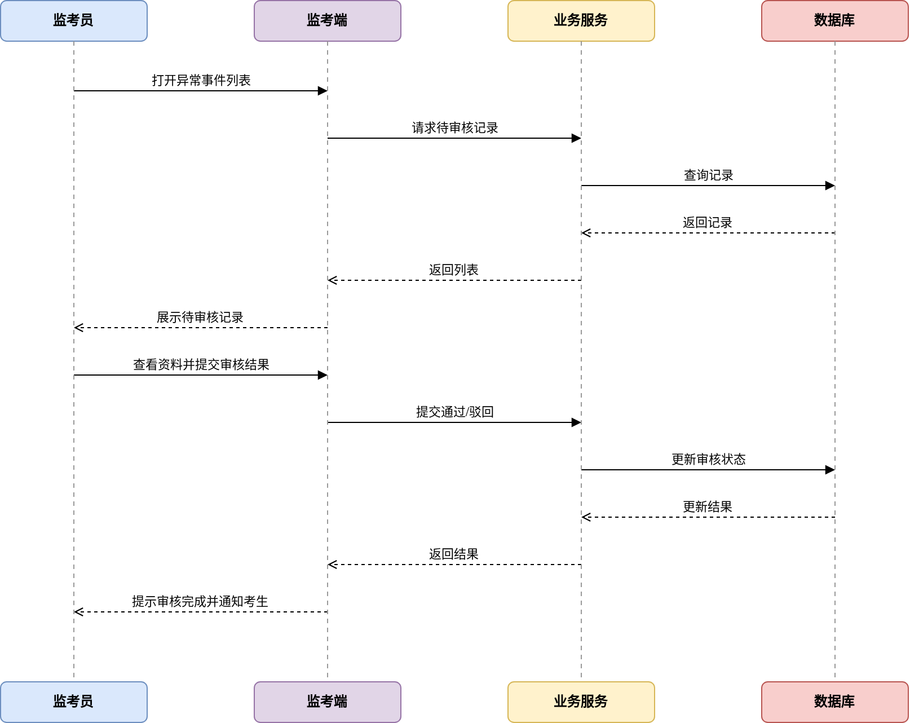

#### 3.5.15.3 录像回放

**（一）功能需求概述**

录像回放功能供监考员查看自己监考过的已结束考试中考生的录像，用于事后复核考生考试过程。

**（二）功能设计**

**查询/筛选功能**

支持以下条件筛选，条件之间为"与"关系，点击搜索按钮触发查询：

| 筛选字段 | 类型 | 说明 |
|---------|------|------|
| 考试 | 单选 | 来源于本人监考过的已结束考试 |
| 考生 | 文本输入 | 支持按姓名等关键词模糊搜索 |

**列表功能**

| 列名 | 字段类型 | 说明 |
|-----|---------|------|
| 考生姓名 | 文本 | - |
| 考试名称 | 文本 | - |
| 操作 | 操作按钮 | 回放 |

列表为空时显示："暂无录像数据"。

**回放功能**

点击"回放"，播放该考生的录像。

**业务规则**

- 监考员仅可回放自己监考过的考试录像。
- 未开启监控的考试无录像数据，选择该考试时提示"该考试未开启监控，无录像数据"。

**边界与异常**

- **空数据**：筛选结果无录像时，显示"暂无录像数据"。
- **未开启监控**：所选考试未开启监控时，提示"该考试未开启监控，无录像数据"。
- **权限不足**：回放操作对无权限角色完全隐藏（不渲染，非禁用）。

**（三）业务逻辑关联**

- 录像回放范围限定为监考员本人监考过的考试。
- 录像数据来源于开启监控考试中考生端的录制数据，未开启监控的考试无录像数据。

**（四）用户操作流程图**

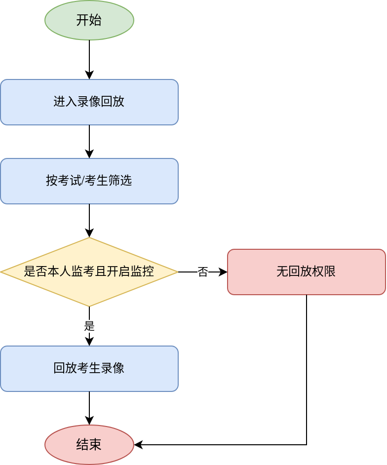

**（五）功能时序图**

### 3.5.16 移动端

移动端 App 供考生随时随地参加考试与在线练习，接收与考试相关的各类通知，并管理个人基本信息、成绩与证书。移动端以底部导航 Tab 为顶层结构，固定四个 Tab：首页、工作台、消息、我的。

#### 3.5.16.1 首页

**（一）功能需求概述**

首页用于考生快速了解待完成的考试安排和自身的考试与练习概况，作为进入其他功能的信息入口。

**（二）功能设计**

**待考提醒**

展示该考生待参加的考试与报考提醒。

| 字段名称 | 类型 | 说明 |
|---------|------|------|
| 考试名称 | 文本 | 数据来源：考试管理中已分配给该考生的考试 |
| 开始时间 | 文本 | 数据来源：考试管理中设置的考试起止时间 |
| 状态 | 状态标签 | 数据来源：系统根据当前时间与考试起止时间自动判定 |

**数据概览**

展示考生个人的考试与练习概况。

| 字段名称 | 类型 | 说明 |
|---------|------|------|
| 已参加考试数 | 数值 | 数据来源：该考生已交卷的考试记录统计 |
| 练习题数 | 数值 | 数据来源：该考生在线练习的作答记录统计 |
| 已获证书数 | 数值 | 数据来源：证书管理中已发放给该考生的证书统计 |
| 错题数 | 数值 | 数据来源：该考生错题本中的题目统计 |

**业务规则**

- 待考提醒中的考试状态由系统根据当前时间与考试起止时间自动判定，不支持人工调整。

**边界与异常**

- **空数据**：待考提醒无数据时，显示"暂无待考安排"。
- **权限不足**：无相关数据的考生，数据概览各项指标均显示为 0，不隐藏该区域。

**（三）业务逻辑关联**

- 待考提醒数据来源于考试管理中已发布且分配给该考生的考试。
- 数据概览中的各项统计来源于该考生的考试记录、练习记录、证书记录与错题本数据。

**（四）用户操作流程图**

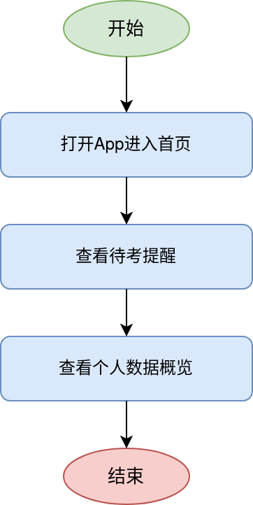

**（五）功能时序图**

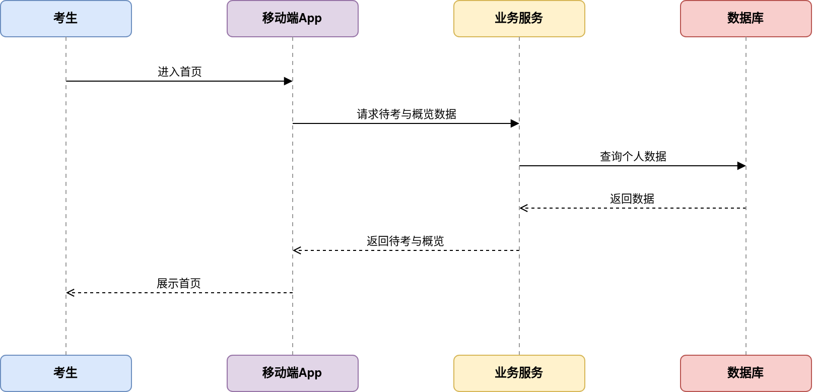

#### 3.5.16.2 工作台

**（一）功能需求概述**

工作台是考生完成考试与练习等核心业务操作的集中区域，涵盖参加考试、在线练习、AI答疑、错题回顾等功能。

**（二）功能设计**

**参加考试**

考生选择待参加的考试后进入作答。若考试开启人脸核身，需先完成身份核验方可进入。进入考试后在线作答，作答期间显示剩余时间倒计时，答案自动保存。作答完成后点击交卷，弹出确认"确定交卷吗？交卷后不可修改"，确认后完成交卷，交卷后不可再修改答案。作答期间系统检测切屏行为，切屏时记录告警。

**在线练习**

考生可按题库或知识点选择题目进行练习，作答后即时显示对错判断与解析内容。

**AI答疑**

考生可针对练习或考试中的题目向AI提问，获取解答内容。

**错题本**

考生可查看历次练习与考试中的错题，并对错题重新进行练习。

**拍照抓拍**

若考试配置要求进行身份留证，作答过程中按考试配置要求进行人脸抓拍并上传。

**业务规则**

- 考试未到设定的开始时间时，考生不可进入该考试，提示"考试尚未开始"。
- 考生已完成交卷的考试不可重复进入，提示"您已完成本场考试"。
- 考试开启人脸核身且核身未通过时，考生不可进入考试，提示"身份核验未通过，无法进入考试"。
- AI答疑服务不可用时，提示"AI答疑暂不可用，请稍后重试"。

**边界与异常**

- **空数据**：错题本无错题数据时，显示"暂无错题"。
- **权限不足**：未分配任何考试的考生，参加考试入口不展示可进入的考试。

**（三）业务逻辑关联**

- 参加考试的考试来源于考试管理中已发布且分配给该考生的考试。
- 在线练习的题目来源于题库管理。
- AI答疑功能依赖系统的AI模型配置。
- 考试过程中检测到的切屏等异常行为上报监考中心。

**（四）用户操作流程图**

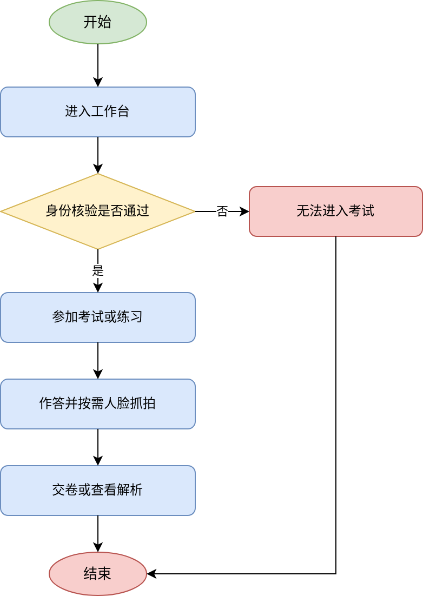

**（五）功能时序图**

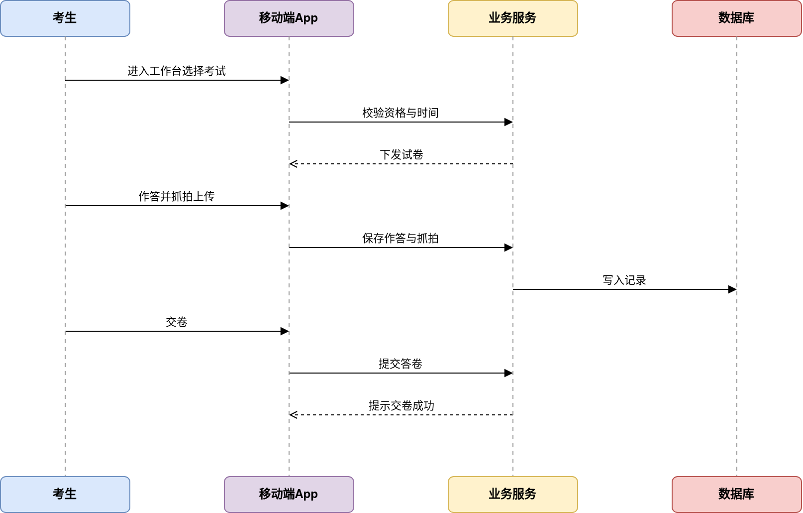

#### 3.5.16.3 消息

**（一）功能需求概述**

消息用于考生接收与查看考试通知、报考审核结果、成绩发布等系统消息。

**（二）功能设计**

**通知列表**

展示该考生收到的各类消息。

| 字段名称 | 类型 | 说明 |
|---------|------|------|
| 消息标题 | 文本 | 数据来源：系统通知内容 |
| 类型 | 状态标签 | 枚举值：考试通知/报考审核结果/成绩发布 |
| 时间 | 文本 | 数据来源：消息生成时间 |
| 已读/未读 | 状态标签 | 数据来源：系统根据考生查看记录自动判定 |

**消息详情**

考生点击列表中的消息可查看消息详情内容，查看后该消息标记为已读。

**业务规则**

- 新收到的消息默认标记为未读，考生查看消息详情后系统自动转为已读。

**边界与异常**

- **空数据**：通知列表无数据时，显示"暂无消息"。

**（三）业务逻辑关联**

- 消息来源于系统通知，包括考试通知、报考审核结果、成绩发布等。

**（四）用户操作流程图**

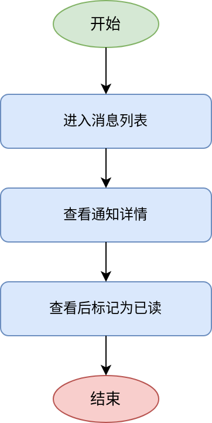

**（五）功能时序图**

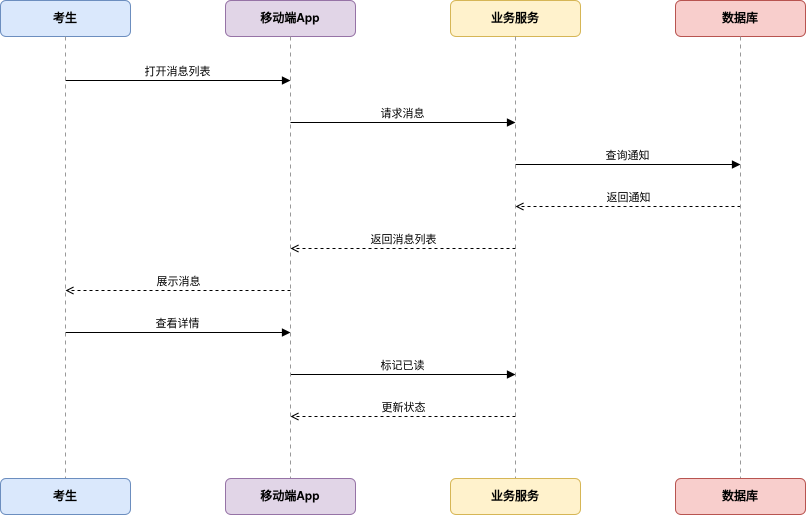

#### 3.5.16.4 我的

**（一）功能需求概述**

我的用于考生查看与维护个人基本信息，查看历次成绩与已获证书，并支持退出登录。

**（二）功能设计**

**个人信息**

考生可查看与编辑个人基本信息。

| 字段名称 | 类型 | 长度限制 | 必填 | 默认值 | 说明 |
|---------|------|---------|------|-------|------|
| 姓名 | 文本输入 | 2-20字 | 是 | - | - |
| 联系电话 | 文本输入 | 11位 | 是 | - | 需符合手机号格式 |
| 电子邮箱 | 文本输入 | 最多50字 | 否 | - | 需符合邮箱格式 |

**我的成绩**

考生可查看历次已发布的考试成绩。

**我的证书**

考生可查看已获得的证书。

| 字段名称 | 类型 | 说明 |
|---------|------|------|
| 名称 | 文本 | 数据来源：证书管理已发放给该考生的证书 |
| 编号 | 文本 | 数据来源：系统生成的证书唯一编号 |
| 有效期 | 文本 | 数据来源：证书管理设置的有效期 |
| 状态 | 状态标签 | 枚举值：有效/已过期 |

考生可查看证书对应的查验码，用于证书真伪核验。

**退出登录**

考生点击退出登录，弹出确认"确定退出登录吗？"，确认后退出当前账号。

**业务规则**

- 联系电话须符合手机号格式，电子邮箱须符合邮箱格式，不符合时阻止提交并提示具体错误原因。

**边界与异常**

- **空数据**：我的成绩无数据时，显示"暂无成绩"；我的证书无数据时，显示"暂无证书"。

**（三）业务逻辑关联**

- 我的成绩数据来源于阅卷中心已发布的成绩。
- 我的证书数据来源于证书管理。

**（四）用户操作流程图**

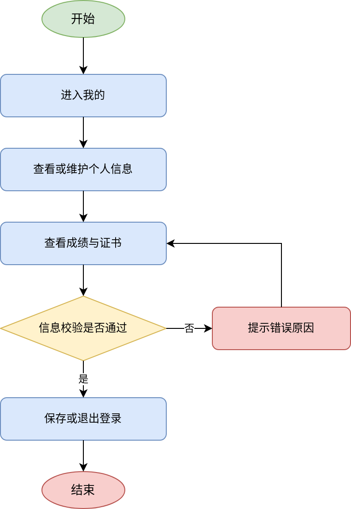

**（五）功能时序图**

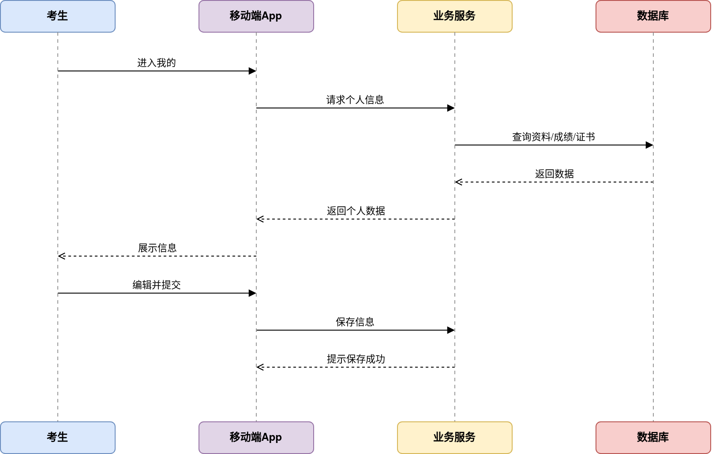

---

## 四、技术方案

### 4.1 技术架构

平台采用前后端分离架构，后端为单体模块化服务，对外提供统一接口，五个前端应用共用同一套业务数据。

**前端技术栈**：

- 管理后台、监考端、网页考生端：Vue 3 + TypeScript + Vite + Element Plus
- 桌面考试端：Electron 打包，具备强制全屏、切屏检测、快捷键屏蔽等强防作弊能力
- 移动端：Vue 3 + Capacitor，支持打包为移动应用

**后端技术栈**：

- 服务框架：NestJS（模块化组织，按业务模块划分）
- 数据访问：Prisma
- AI 能力：抽象为独立的 AI 服务模块，统一封装出题、组卷、阅卷、答疑、学情分析等能力，支持配置切换不同大模型服务商，密钥加密存储
- 实时监考：通过实时通信网关与缓存服务支撑监考端的画面查看与异常事件推送

**数据库与中间件**：

- 关系型数据库：MySQL，存储业务数据
- 缓存与队列：Redis，用于会话、实时消息、AI 长任务异步队列与削峰

**部署架构**：

- 各前端应用独立部署，后端服务与数据库、缓存分层部署
- AI 长任务（批量出题、整卷阅卷）通过异步队列执行，避免阻塞主服务

### 4.2 数据交互

- 前后端通过统一接口进行数据交互，采用标准数据格式，接口按业务模块划分
- 监考端的实时画面与异常告警通过实时通信方式传输
- AI 相关的长时任务采用异步处理，前端通过进度查询或实时推送获取处理进度
- 所有外部输入数据在服务端进行校验后再处理

### 4.3 外部系统集成

本期不涉及第三方业务系统集成。AI 大模型服务作为外部能力，通过 AI 抽象模块统一对接，支持按配置切换服务商。

### 4.4 安全方案

- **身份认证**：账号密码登录，登录态统一管理，密码加密存储
- **权限控制**：基于角色的访问控制（RBAC），接口与功能按角色权限校验，无权限操作对应角色完全隐藏
- **数据安全**：敏感数据（如AI模型密钥、用户密码）加密存储，传输采用加密协议
- **防作弊安全**：考试过程的身份核验、行为监控、录像留存，作弊事件全程留痕
- **审计**：关键操作记录操作日志，阅卷复核记录不可篡改删除

---

## 五、非功能需求

### 5.1 性能需求

- 页面加载时间 < 3 秒，常规接口响应时间 < 1 秒
- 支持考试高峰期的并发作答与提交，通过队列削峰保障批量交卷与批量阅卷的稳定
- AI 出题、整卷阅卷等长任务异步执行，不阻塞用户常规操作

### 5.2 安全需求

- 身份认证：账号密码登录，考试环节支持人脸核身
- 数据安全：敏感数据加密存储，传输使用加密协议
- 权限控制：基于角色的访问控制（RBAC）

### 5.3 可用性需求

- 系统可用性：99.9%
- 故障恢复：RTO < 1 小时，RPO < 15 分钟
- 数据备份：每日自动备份，考试与成绩数据重点保障
- 考试断线续考：考生断线重连后可恢复答题进度与剩余时间

### 5.4 兼容性需求

- 浏览器：Chrome、Firefox、Safari、Edge 最新版本
- 桌面端：Windows、macOS
- 移动端：主流 Android 与 iOS 设备
- 分辨率：桌面端 1920×1080、1366×768，移动端自适应

---

## 六、数据需求

### 6.1 数据字典

| 枚举类型 | 枚举值 | 说明 |
|---------|-------|------|
| 题型 | 单选题 | 只有一个正确答案的客观题 |
| ^ | 多选题 | 有多个正确答案的客观题 |
| ^ | 判断题 | 判断对错的客观题 |
| ^ | 填空题 | 填写空缺内容的客观题 |
| ^ | 问答题 | 简答形式的主观题 |
| ^ | 论述题 | 论述形式的主观题 |
| 题目状态 | 待审 | AI生成或导入的题目待人工审核 |
| ^ | 正式 | 审核通过，进入正式题库 |
| 试卷状态 | 草稿 | 试卷编辑中，可修改 |
| ^ | 已发布 | 试卷可被考试引用，不可修改 |
| 考试状态 | 未发布 | 考试创建后未发布，可编辑 |
| ^ | 已发布 | 考试已发布，考生可见 |
| ^ | 进行中 | 考试处于作答时间内 |
| ^ | 已结束 | 考试时间已过，进入阅卷 |
| 试卷类型 | 固定试卷 | 题目固定，手动组卷或AI组卷生成，所有考生卷面相同 |
| ^ | 随机试卷 | 配置抽题规则，考试时按规则为每位考生随机抽题 |
| 考生类型 | 内部考生 | 本组织员工，来源于用户管理，有系统账号 |
| ^ | 外部考生 | 外部单位人员，来源于外部考生管理，由系统生成考试账号 |
| 阅卷状态 | 待阅卷 | 尚未开始阅卷 |
| ^ | AI阅卷中 | 主观题AI阅卷进行中 |
| ^ | 待复核 | AI阅卷完成，待人工复核 |
| ^ | 已完成 | 阅卷与复核完成，成绩可发布 |
| 报考审核状态 | 待审核 | 报考已提交，待审核 |
| ^ | 已通过 | 审核通过，获得参考资格 |
| ^ | 已驳回 | 审核未通过 |
| 证书状态 | 有效 | 证书在有效期内且未作废 |
| ^ | 已过期 | 超过有效期 |
| ^ | 已作废 | 证书被作废 |
| 异常事件类型 | 切屏 | 切换到考试窗口以外 |
| ^ | 离屏 | 离开摄像头画面 |
| ^ | 人脸不匹配 | 人脸比对不通过 |
| ^ | 多屏 | 检测到多显示器 |
| ^ | 其他 | 其他异常行为 |
| 认证/证书模板状态 | 启用 | 可被引用 |
| ^ | 停用 | 不可被新引用 |

### 6.2 数据存储要求

- 考试与成绩数据长期保留，作为认证依据
- 监考录像按系统配置的保留期限留存，超期自动清理
- 操作日志按系统配置的保留期限留存
- 数据存储容量随题库规模与考试量增长评估，重要数据定期备份

---

## 八、项目实施与验收

### 8.1 实施阶段

1. **需求确认阶段**：需求评审、原型确认、需求基线锁定
2. **设计开发阶段**：详细设计、编码开发、AI能力集成、单元测试
3. **测试部署阶段**：功能测试、防作弊与AI能力专项测试、性能测试、用户验收测试、部署上线
4. **上线运行阶段**：试运行、问题修复、正式上线

### 8.2 系统培训服务

- **培训对象**：系统管理员、考务人员、阅卷老师、监考员
- **培训内容**：系统操作、题库与组卷、阅卷与复核、监考操作、AI功能使用
- **培训方式**：现场培训、在线培训、操作手册

### 8.3 验收标准

- **功能验收**：所有功能按SRS需求规格说明书实现，无P0/P1级缺陷
- **性能验收**：满足第五章非功能需求指标
- **专项验收**：AI出题/组卷/阅卷能力可用，防作弊手段生效，认证发证流程闭环
- **文档验收**：提供完整的技术文档和操作手册

---

## 九、附录

### 附录A：术语表

| 术语 | 说明 |
|-----|------|
| RBAC | 基于角色的访问控制（Role-Based Access Control） |
| RTO | 恢复时间目标（Recovery Time Objective） |
| RPO | 恢复点目标（Recovery Point Objective） |
| SRS | 软件需求规格说明书（Software Requirements Specification） |
| 客观题 | 有标准答案、可自动判分的题型（单选/多选/判断/填空） |
| 主观题 | 需评分标准评判的题型（问答/论述） |
| 组卷 | 将题目组织为试卷的过程 |
| 抽题规则 | 按题型、难度、知识点维度抽取题目的配置 |
| 人脸核身 | 通过人脸比对核验考生身份 |
| 切屏 | 考试中切换到考试窗口以外的操作 |

### 附录B：参考资料

- 智能AI考试平台设计方案 V1.0

