## 一、文档信息

| 项目名称 | 智能AI考试平台 |
|---------|-----------|
| 文档版本 | V1.2 |
| 编制日期 | 2026-07-19 |
| 编制人 | 项目组 |
| 审核人 | - |
| 批准人 | - |
| 客户单位 | - |
| 编制单位 | 智能AI考试平台项目组 |
| 适用范围 | 职业资格认证、企业培训考核、技能测评等在线考试与练习场景 |
| 核心目标 | 以人工智能赋能出题、组卷、阅卷全流程，覆盖多终端考试与认证发证 |
| 文档状态 | 草稿 |

**历史版本**

| 版本 | 日期 | 作者 | 更改说明 |
|-----|------|------|---------|
| V1.0 | 2026-07-11 | 项目组 | 初始版本 |
| V1.1 | 2026-07-18 | 项目组 | 考点管理提升为一级菜单；外部考生管理拆分为外部单位与外部考生两个二级菜单；证书管理精简为证书模板与证书发放记录（删除证书查验、改为自动发证） |
| V1.2 | 2026-07-19 | 项目组 | 按已实现功能反向同步：外部考生登录账号由准考证号改为手机号并补充批量删除/导入导出；"用户管理"并入"组织管理"（部门/人员/岗位三个子模块），后续模块顺延重编号；"角色管理"扩展为"权限管理"（角色管理+菜单管理）；AI模型配置服务商修正为OpenAI/Anthropic并调整表单字段；同步更新功能清单、页面清单、权限矩阵与总体架构 |
| V1.3 | 2026-07-19 | 项目组 | "题型管理""难度管理"本质为数据字典，取消其独立二级菜单与功能章节，题型、难度统一由系统管理-数据字典维护；题库管理下知识点分类顺延为3.5.1.2；同步更新菜单结构、页面清单、功能清单及题目管理/AI出题/随机试卷中题型、难度的数据来源引用 |
| V1.4 | 2026-07-19 | 项目组 | 明确"题库"为题目容器概念：题库管理二级菜单"题目管理"改为"题库列表"，先按业务主题维护题库（如安全教育题库、信息安全管理题库），再进入题库维护其题目；固定试卷手动组卷/AI组卷、随机试卷抽题规则均增加"题库范围"选择，选题与抽题限定在所选题库内；同步更新菜单结构、页面清单、功能清单、试卷管理与练习模块相关引用 |
| V1.5 | 2026-08-23 | 项目组 | 按已实现功能全文反向同步：删除监考中心、报表中心、考生端（网页/桌面）、监考端四个未实现模块的全部章节与引用；删除AI辅助出题、AI文档导入出题、AI生成解析、AI智能组卷、主观题AI阅卷、AI学情分析六项未实现功能，AI能力范围收敛为AI模型配置与移动端练习答疑；阅卷流程修正为客观题自动判分＋主观题人工评分，阅卷状态改为待批阅/已阅完；防作弊策略修正为考试策略（防切屏、题目乱序、操作限制、重考、提前进入、提前交卷、成绩与解析查看），删除人脸核身与音视频监控；新增练习管理章节（岗位练兵、自主练习）；题库与试卷补充共享设置（可见范围×共享级别）；移动端改为任务/首页/我的三个底部导航；终端由五端收敛为管理后台与移动端两端；同步更新项目目标、建设范围、角色定义、菜单结构、功能清单、页面清单、权限矩阵、技术方案、非功能需求、数据字典、验收标准与术语表 |

---

## 二、项目概述

### 2.1 项目背景

随着职业资格认证、企业技能培训、在线测评需求的持续增长，传统考试组织方式面临以下挑战：

1. **命题效率低、题库更新慢**：人工出题耗时耗力，题目质量参差不齐，难以快速扩充题库并保证覆盖各知识点。
2. **组卷依赖人工、难以兼顾均衡**：人工组卷需反复权衡题型、难度、知识点分布，效率低且不同卷面难度不一致。
3. **主观题阅卷成本高、标准不统一**：主观题依赖人工评卷，工作量大、周期长，且不同评卷人的评分尺度存在差异。
4. **在线考试作弊风险高**：远程考试缺乏有效的身份核验与行为监控手段，考试严肃性和公平性难以保障。
5. **多终端场景割裂**：考生在不同设备上的考试与练习体验不统一，缺乏一体化的平台支撑。

为解决上述问题，建设智能AI考试平台，通过标准化的题库与组卷管理、逐场可配的考试过程管控、贯通阅卷与发证的成绩流转，实现从命题到认证发证的一体化管理，提升考试组织效率与公平性。

### 2.2 项目建设目标

本项目旨在建设一套覆盖命题、考试、阅卷、认证发证全流程的在线考试与练习平台，实现以下目标：

1. **题库与组卷标准化**：统一维护题目与知识点分类，支持固定试卷与随机抽题两种组卷方式，为考试与练习提供可复用的题源。
2. **多终端一体化考试**：提供管理后台与移动端，满足考务人员集中管理、考生随时参加考试与练习的需求，数据统一管理。
3. **考试过程管控**：提供防切屏检测、题目乱序、操作限制、提前进入与提前交卷控制等策略，逐场独立配置，保障考试公平与严肃性。
4. **认证发证闭环管理**：支持资格认证项目管理、报考审核、考试通过后颁发电子证书，形成完整的认证业务闭环。
5. **岗位练兵与自主练习**：支持按岗位下发练习任务与考生自主选题练习，配合错题本与练习答疑，支撑日常技能训练。

### 2.3 项目建设范围

本项目建设范围包括：

**系统端**：

- 管理后台（Web应用）：面向管理与业务人员的全平台管理
- 移动端（移动应用）：面向考生的移动考试与练习

**功能模块**：

- 题库管理：题库、题目、知识点分类维护（题型、难度由数据字典统一维护）
- 试卷管理：固定试卷（手动组卷）与随机试卷（抽题规则）两种类型
- 考试管理：选择试卷创建考试、考生分配、考试策略配置
- 练习管理：岗位练兵任务下发、自主练习范围配置
- 阅卷中心：客观题自动判分、主观题人工评分、成绩发布与撤回
- 资格认证：认证项目、报考审核
- 证书管理：证书模板、证书发放记录
- 外部考生管理：外部单位与外部考生信息维护、考试账号生成
- 组织管理：部门管理、人员管理、岗位管理
- 考点管理、权限管理（角色管理、菜单管理）、系统管理（参数配置、AI模型配置、数据字典、操作日志）

**数据范围**：

- 题库数据、试卷数据、考试与答卷数据、练习与作答数据、成绩与证书数据、认证与报考数据、系统配置数据

**不包含的功能**：

- 线下考场硬件对接（如闸机、专用摄像头）：预留接口，后续迭代实现
- 第三方支付与收费：本期不含考试收费相关功能
- 实时监考与录像回放：本期不含监考人员实时监控、异常事件处置、录像回放功能
- 统计报表与学情分析：本期不含考试统计、成绩分析、学情分析报表功能
- 人脸核身与音视频监控：本期不含考生身份人脸核验、答题过程音视频与屏幕监控

### 2.4 业务流程图

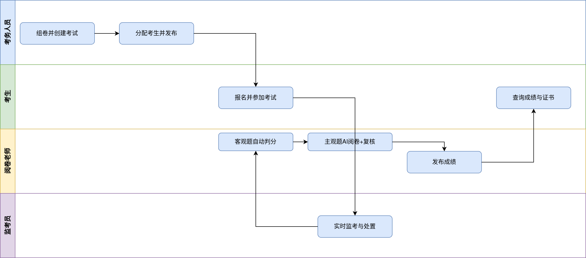

### 2.5 业务角色定义

| 角色名称 | 角色描述 | 主要职责 | 权限范围 |
|---------|---------|---------|---------|
| 系统管理员 | 负责平台配置与系统管理 | 组织与人员管理、角色与菜单权限配置、AI模型配置、系统参数维护 | 全部功能 |
| 考务人员 | 负责命题与考试组织 | 题库维护、组卷、创建考试、考生分配、练习任务下发、认证与证书管理 | 命题与考试组织相关功能 |
| 阅卷老师 | 负责主观题评卷 | 主观题人工评分、成绩发布与撤回 | 阅卷中心相关功能 |
| 内部考生 | 本组织内参加考试与练习的用户，来源于组织管理·人员管理 | 报考、参加考试、在线练习、查看成绩与证书 | 移动端相关功能 |
| 外部考生 | 外部单位参加考试的用户，来源于外部考生管理，由系统生成考试账号 | 参加考试、在线练习、查看成绩与证书 | 移动端相关功能 |

---

## 三、项目建设内容

### 3.1 总体功能架构

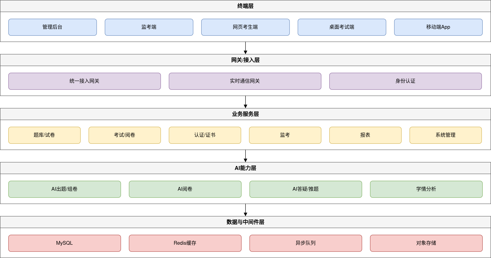

平台由两个终端与统一的业务服务组成，各终端共享同一套业务数据。菜单结构分端描述如下：

**PC 端（管理后台）**

- 题库管理（一级菜单）
  - 题库列表（二级菜单）
  - 知识点分类（二级菜单）
- 试卷管理（一级菜单）
- 考试管理（一级菜单）
- 练习管理（一级菜单）
- 阅卷中心（一级菜单）
- 资格认证（一级菜单）
  - 认证项目（二级菜单）
  - 报考审核（二级菜单）
- 证书管理（一级菜单）
  - 证书模板（二级菜单）
  - 证书发放（二级菜单）
- 外部考生管理（一级菜单）
  - 外部单位（二级菜单）
  - 外部考生（二级菜单）
- 组织管理（一级菜单）
  - 部门管理（二级菜单）
  - 人员管理（二级菜单）
  - 岗位管理（二级菜单）
- 考点管理（一级菜单）
- 权限管理（一级菜单）
  - 角色管理（二级菜单）
  - 菜单管理（二级菜单）
- 系统管理（一级菜单）
  - 参数配置（二级菜单）
  - AI模型配置（二级菜单）
  - 数据字典（二级菜单）
  - 操作日志（二级菜单）

**移动端**

- 任务（底部导航 Tab）
  - 考试列表
  - 考试详情
  - 在线答题
  - 考试结果
- 首页（底部导航 Tab）
  - 数据概览
  - 待考提醒
  - 快捷功能（岗位练兵、自主练习、错题本、我的成绩）
  - 消息入口
- 我的（底部导航 Tab）
  - 个人信息
  - 我的成绩
  - 我的证书
  - 退出登录

移动端的练习作答、错题本、消息列表、成绩明细、证书明细均由上述 Tab 内的入口进入，不单独占用底部导航位置。

### 3.2 需求功能清单

| 序号 | 业务需求 | 需求概述 | 优先级 |
|-----|---------|---------|-------|
| 1 | 用户身份认证 | 用户通过账号密码登录，不同角色拥有不同功能权限 | P0 |
| 2 | 题库管理 | 维护题库、题目、知识点分类，支持批量导入，作为组卷与练习的基础数据（题型、难度由数据字典统一维护） | P0 |
| 3 | 试卷管理 | 维护固定试卷与随机试卷（抽题规则），供创建考试选用 | P0 |
| 4 | 随机试卷抽题规则 | 选定题库范围后按题型、难度、知识点维度设置抽题数量与分值，考试时随机抽题 | P0 |
| 5 | 考试管理 | 选择试卷创建考试，分配考生，配置考试策略 | P0 |
| 6 | 练习管理 | 维护岗位练兵任务与自主练习范围，为考生练习提供题源与规则 | P1 |
| 7 | 客观题自动阅卷 | 交卷后按标准答案自动判分 | P0 |
| 8 | 主观题人工阅卷 | 阅卷老师按评分标准对主观题评分，保留评分记录 | P0 |
| 9 | 成绩发布管理 | 汇总总分后发布成绩，支持撤回已发布成绩 | P0 |
| 10 | 资格认证管理 | 维护认证项目，审核考生报考资格，关联对应考试 | P1 |
| 11 | 考试过程管控 | 通过防切屏检测、题目乱序、操作限制、提前进入与提前交卷控制保障考试公平 | P0 |
| 12 | 证书管理 | 维护证书模板，考生考试通过后颁发电子证书并留存发放记录 | P1 |
| 13 | 外部考生管理 | 维护外部单位及其考生信息并生成考试账号，供考试分配选用 | P1 |
| 14 | 在线考试 | 考生在线作答，支持倒计时、自动保存、断线续考 | P0 |
| 15 | 在线练习 | 考生按岗位练兵任务或自主选择范围练习，支持练习答疑与错题本 | P1 |
| 16 | 组织管理 | 维护部门层级、人员账号及归属、岗位序列等组织基础数据 | P1 |
| 17 | 考点管理 | 维护考点基础信息，供考试的考点安排选用 | P1 |
| 18 | 权限管理 | 维护角色与菜单权限，基于角色配置功能访问权限 | P0 |
| 19 | AI模型配置 | 配置并切换练习答疑所用的大模型及参数 | P1 |
| 20 | 系统管理 | 维护系统参数、数据字典，记录操作日志 | P1 |

### 3.3 页面功能清单

| 终端 | 一级菜单 | 二级菜单 | 子功能 | 功能描述 |
|-----|---------|---------|-------|---------|
| PC端 | 题库管理 | 题库列表 | 筛选 | 按题库名称、状态筛选题库 |
| ^ | ^ | ^ | 列表 | 分页展示题库列表（含题目数量统计） |
| ^ | ^ | ^ | 新增题库 | 新建题库，填写题库名称、编码、描述、状态 |
| ^ | ^ | ^ | 编辑题库 | 修改题库基本信息 |
| ^ | ^ | ^ | 删除题库 | 删除空题库（含题目或被引用时禁止删除） |
| ^ | ^ | ^ | 进入题库-题目筛选 | 在指定题库内按题干关键词、题型、难度、知识点筛选题目 |
| ^ | ^ | ^ | 进入题库-题目列表 | 分页展示该题库下的题目列表 |
| ^ | ^ | ^ | 进入题库-新增题目 | 在该题库内录入题目内容、选项、答案、解析、分类信息 |
| ^ | ^ | ^ | 进入题库-编辑题目 | 修改该题库内已有题目信息 |
| ^ | ^ | ^ | 进入题库-删除题目 | 删除该题库内指定题目 |
| ^ | ^ | ^ | 进入题库-批量导入 | 按模板向该题库批量导入题目 |
| ^ | ^ | ^ | 进入题库-共享设置 | 设置题库的可见范围与共享级别 |
| ^ | ^ | 知识点分类 | 列表 | 按层级查看知识点分类 |
| ^ | ^ | ^ | 新增 | 新增知识点分类 |
| ^ | ^ | ^ | 编辑 | 修改知识点分类 |
| ^ | ^ | ^ | 删除 | 删除知识点分类 |
| ^ | 试卷管理 | - | 筛选 | 按试卷名称、类型、状态筛选试卷 |
| ^ | ^ | - | 列表 | 分页展示固定试卷与随机试卷 |
| ^ | ^ | - | 新增固定试卷（手动组卷） | 选择题库范围后挑选具体题目组合为固定试卷并设置分值 |
| ^ | ^ | - | 共享设置 | 设置试卷的可见范围与共享级别 |
| ^ | ^ | - | 新增随机试卷（抽题规则） | 选择题库范围后按题型、难度、知识点维度设置抽题数量与分值 |
| ^ | ^ | - | 预览 | 查看试卷完整内容或抽题配置 |
| ^ | ^ | - | 编辑 | 修改试卷题目分值或抽题规则 |
| ^ | ^ | - | 删除 | 删除指定试卷 |
| ^ | 考试管理 | - | 筛选 | 按考试名称、状态、时间筛选考试 |
| ^ | ^ | - | 列表 | 分页展示考试列表 |
| ^ | ^ | - | 创建考试 | 选择一份试卷（固定或随机）创建考试，设置时间与时长 |
| ^ | ^ | - | 分配考生 | 为考试指定参加考试的内部与外部考生 |
| ^ | ^ | - | 配置考试策略 | 设置防切屏检测及允许次数、题目乱序、操作限制、重考次数、提前进入、提前交卷与成绩查看等策略 |
| ^ | ^ | - | 编辑 | 修改未开始考试的配置 |
| ^ | ^ | - | 发布 | 发布考试使考生可见 |
| ^ | ^ | - | 撤回 | 撤回未开始的考试 |
| ^ | ^ | - | 删除 | 删除指定考试 |
| ^ | 练习管理 | - | 岗位练兵-筛选 | 按练习名称、状态、开始日期范围筛选练习任务 |
| ^ | ^ | - | 岗位练兵-列表 | 分页展示练习任务列表（含练习题库、练习方式、题目数、参与人数） |
| ^ | ^ | - | 岗位练兵-创建练习 | 新建练习任务，设置练习题库、抽题规则、起止时间与参与人员 |
| ^ | ^ | - | 岗位练兵-编辑 | 修改未发布练习任务的配置 |
| ^ | ^ | - | 岗位练兵-详情 | 查看练习任务配置与参与人练习记录 |
| ^ | ^ | - | 岗位练兵-发布 | 发布练习任务使参与人可见 |
| ^ | ^ | - | 岗位练兵-撤回 | 撤回已发布的练习任务 |
| ^ | ^ | - | 岗位练兵-结束 | 提前结束进行中的练习任务 |
| ^ | ^ | - | 岗位练兵-删除/批量删除 | 删除单个或批量删除练习任务 |
| ^ | ^ | - | 自主练习-筛选 | 按题库名称、开放状态筛选可自主练习的题库 |
| ^ | ^ | - | 自主练习-列表 | 分页展示题库开放情况（含试题数、开放人数、考核点） |
| ^ | ^ | - | 自主练习-开放设置 | 设置题库的开放状态、开放人员范围与考核知识点 |
| ^ | 阅卷中心 | - | 筛选 | 按考试、阅卷状态筛选阅卷任务 |
| ^ | ^ | - | 列表 | 分页展示阅卷任务列表 |
| ^ | ^ | - | 客观题判分查看 | 查看客观题自动判分结果 |
| ^ | ^ | - | 主观题人工评分 | 按评分标准为主观题逐题评分 |
| ^ | ^ | - | 评分记录查看 | 查看评分人、时间与分值变更记录 |
| ^ | ^ | - | 成绩发布 | 汇总总分并发布成绩 |
| ^ | ^ | - | 成绩撤回 | 撤回已发布成绩 |
| ^ | 资格认证 | 认证项目 | 筛选 | 按认证名称、状态筛选认证项目 |
| ^ | ^ | ^ | 列表 | 分页展示认证项目列表 |
| ^ | ^ | ^ | 新增 | 新增认证项目并关联考试 |
| ^ | ^ | ^ | 编辑 | 修改认证项目信息 |
| ^ | ^ | ^ | 删除 | 删除认证项目 |
| ^ | ^ | 报考审核 | 列表 | 查看考生报考记录 |
| ^ | ^ | ^ | 审核 | 审核考生报考资格 |
| ^ | 证书管理 | 证书模板 | 列表 | 查看证书模板 |
| ^ | ^ | ^ | 新增 | 新增证书模板 |
| ^ | ^ | ^ | 编辑 | 修改证书模板 |
| ^ | ^ | ^ | 删除 | 删除证书模板 |
| ^ | ^ | 证书发放 | 列表 | 查看证书发放记录 |
| ^ | ^ | ^ | 查看/下载 | 查看并下载已发放的证书 |
| ^ | 外部考生管理 | 外部单位 | 筛选 | 按关键字（单位名称/编码）、状态筛选外部单位 |
| ^ | ^ | ^ | 列表 | 分页展示外部单位列表 |
| ^ | ^ | ^ | 新增 | 录入外部单位信息 |
| ^ | ^ | ^ | 编辑 | 修改外部单位信息 |
| ^ | ^ | ^ | 删除/批量删除 | 删除单个或批量删除外部单位 |
| ^ | ^ | ^ | 启用/停用 | 切换外部单位可用状态 |
| ^ | ^ | ^ | 导入/导出 | 按模板批量导入、按筛选条件导出外部单位 |
| ^ | ^ | 外部考生 | 筛选 | 按姓名、所属单位、手机号、账号状态筛选外部考生 |
| ^ | ^ | ^ | 列表 | 分页展示外部考生列表 |
| ^ | ^ | ^ | 新增 | 录入外部考生信息并以手机号生成考试账号 |
| ^ | ^ | ^ | 编辑 | 修改外部考生信息 |
| ^ | ^ | ^ | 删除/批量删除 | 删除单个或批量删除外部考生 |
| ^ | ^ | ^ | 导入/导出 | 按模板批量导入并生成账号、按筛选条件导出外部考生 |
| ^ | ^ | ^ | 重置密码 | 将外部考生考试账号密码重置为手机号后6位 |
| ^ | 组织管理 | 部门管理 | 列表 | 按层级查看部门 |
| ^ | ^ | ^ | 新增 | 新增部门或下级部门 |
| ^ | ^ | ^ | 编辑 | 修改部门信息 |
| ^ | ^ | ^ | 删除 | 删除部门 |
| ^ | ^ | 人员管理 | 筛选 | 按部门、姓名/账号/手机号、状态筛选人员 |
| ^ | ^ | ^ | 列表 | 分页展示人员列表 |
| ^ | ^ | ^ | 新增 | 新增人员并设置部门、岗位、角色 |
| ^ | ^ | ^ | 编辑 | 修改人员信息与归属 |
| ^ | ^ | ^ | 删除/批量删除 | 删除单个或批量删除人员 |
| ^ | ^ | ^ | 状态切换 | 切换人员启用/禁用状态 |
| ^ | ^ | 岗位管理 | 列表 | 按岗位名称查看岗位 |
| ^ | ^ | ^ | 新增 | 新增岗位 |
| ^ | ^ | ^ | 编辑 | 修改岗位信息 |
| ^ | ^ | ^ | 删除 | 删除岗位 |
| ^ | 考点管理 | - | 筛选 | 按考点名称、状态筛选考点 |
| ^ | ^ | - | 列表 | 分页展示考点列表 |
| ^ | ^ | - | 新增 | 新增考点 |
| ^ | ^ | - | 编辑 | 修改考点信息 |
| ^ | ^ | - | 删除/批量删除 | 删除单个或批量删除考点 |
| ^ | ^ | - | 启用/停用 | 切换考点可用状态 |
| ^ | 权限管理 | 角色管理 | 列表 | 按角色名称/标识、状态查看角色列表 |
| ^ | ^ | ^ | 新增 | 新增角色 |
| ^ | ^ | ^ | 编辑 | 修改角色信息 |
| ^ | ^ | ^ | 分配权限 | 以菜单树为角色勾选可访问的菜单与操作权限 |
| ^ | ^ | ^ | 删除 | 删除角色 |
| ^ | ^ | 菜单管理 | 列表 | 按菜单名称、类型查看菜单树 |
| ^ | ^ | ^ | 新增 | 新增目录/菜单/按钮节点 |
| ^ | ^ | ^ | 编辑 | 修改菜单节点信息 |
| ^ | ^ | ^ | 删除 | 删除菜单节点 |
| ^ | ^ | ^ | 显示切换 | 切换菜单在导航中的显示/隐藏 |
| ^ | 系统管理 | 参数配置 | 列表 | 查看与修改系统参数 |
| ^ | ^ | AI模型配置 | 列表 | 查看已配置的AI模型 |
| ^ | ^ | ^ | 新增 | 新增AI模型配置 |
| ^ | ^ | ^ | 编辑 | 修改模型参数与密钥 |
| ^ | ^ | ^ | 切换启用 | 切换当前启用的AI模型 |
| ^ | ^ | ^ | 连接测试 | 测试AI模型连通性 |
| ^ | ^ | 数据字典 | 列表 | 维护系统枚举字典 |
| ^ | ^ | 操作日志 | 列表 | 查看系统操作日志 |
| 移动端 | 任务 | - | 考试列表 | 按待考、已考完成两类查看可参加的考试 |
| ^ | ^ | - | 考试详情 | 查看考试时间、时长、总分、及格分与考前须知 |
| ^ | ^ | - | 在线答题 | 按题作答，展示剩余时间并自动保存作答进度 |
| ^ | ^ | - | 交卷 | 提交答卷，允许提前交卷时受最短作答时长限制 |
| ^ | ^ | - | 考试结果 | 查看本场得分与是否通过 |
| ^ | 首页 | - | 数据概览 | 查看已考次数、练习题量、证书获得数、错题数四项指标 |
| ^ | ^ | - | 待考提醒 | 查看即将开始的考试及距开考天数 |
| ^ | ^ | - | 快捷功能 | 进入岗位练兵、自主练习、错题本、我的成绩 |
| ^ | ^ | - | 消息入口 | 查看未读消息数并进入消息列表 |
| ^ | ^ | - | 消息列表 | 查看考试通知与提醒，进入消息详情 |
| ^ | ^ | - | 岗位练兵 | 选择已下发的练习任务并作答 |
| ^ | ^ | - | 自主练习 | 在允许范围内按题库、知识点自选范围并作答 |
| ^ | ^ | - | 练习答疑 | 就练习题目提问获取讲解 |
| ^ | ^ | - | 错题本 | 查看历史错题并再次练习 |
| ^ | 我的 | - | 个人信息 | 查看个人信息 |
| ^ | ^ | - | 编辑个人信息 | 修改本人可维护的信息项 |
| ^ | ^ | - | 我的成绩 | 查看历次考试成绩，进入成绩明细 |
| ^ | ^ | - | 成绩明细 | 查看单场考试各题得分与评分记录 |
| ^ | ^ | - | 我的证书 | 查看已获得的证书，进入证书明细 |
| ^ | ^ | - | 退出登录 | 退出当前账号 |

### 3.4 页面访问权限

| 功能模块 | 系统管理员 | 考务人员 | 阅卷老师 | 考生 |
|---------|-----------|---------|---------|------|
| 题库管理 | 全部权限 | 全部权限 | 无 | 无 |
| 试卷管理 | 全部权限 | 全部权限 | 无 | 无 |
| 考试管理 | 全部权限 | 全部权限 | 无 | 无 |
| 练习管理 | 全部权限 | 全部权限 | 无 | 无 |
| 阅卷中心 | 全部权限 | 查看 | 全部权限 | 无 |
| 资格认证 | 全部权限 | 全部权限 | 无 | 无 |
| 证书管理 | 全部权限 | 全部权限 | 无 | 无 |
| 外部考生管理 | 全部权限 | 全部权限 | 无 | 无 |
| 组织管理（部门/人员/岗位） | 全部权限 | 无 | 无 | 无 |
| 考点管理 | 全部权限 | 全部权限 | 无 | 无 |
| 权限管理（角色/菜单） | 全部权限 | 无 | 无 | 无 |
| 系统管理 | 全部权限 | 无 | 无 | 无 |
| 移动端（任务/首页/我的） | 无 | 无 | 无 | 全部权限 |

### 3.5 功能详细设计

### 3.5.1 题库管理

题库管理是命题的基础模块，按业务主题维护多个题库（如安全教育题库、信息安全管理题库），每个题库下包含若干题目，并维护题目所属的知识点分类体系，为组卷与练习提供题源。

#### 3.5.1.1 题库列表

**（一）功能需求概述**

题库列表用于维护平台的题库及其题目。**题库**是题目的容器，按业务主题划分（如"安全教育题库""信息安全管理题库"），每个题库下包含若干题目；管理员先在题库列表中维护题库，再进入指定题库维护其题目。题目支持人工录入和批量导入两种方式获取题源，并可按可见范围与共享级别控制题库的使用权限，为组卷与练习提供可靠的题库与题目数据支撑。

**（二）功能设计**

##### 一、题库列表

**查询/筛选功能**

支持以下条件筛选，条件之间为"与"关系，点击搜索按钮触发查询：

| 筛选字段 | 类型 | 说明 |
|---------|------|------|
| 题库名称 | 文本输入 | 支持模糊搜索 |
| 状态 | 单选 | 启用 / 停用 |

**列表功能**

| 列名 | 字段类型 | 说明 |
|-----|---------|------|
| 题库名称 | 文本 | 如：安全教育题库、信息安全管理题库 |
| 题库编码 | 文本 | 题库唯一标识 |
| 题目数量 | 数值 | 该题库下题目总数，系统自动统计 |
| 状态 | 状态标签 | 启用 / 停用 |
| 创建时间 | 日期时间 | 系统自动记录 |
| 操作 | 操作按钮 | 进入题库、编辑、删除（无权限时隐藏） |

分页默认每页10条，支持切换每页数量。列表为空时显示："暂无题库数据"。

**新增题库功能**

点击"新增题库"，弹出编辑窗口，填写题库信息。

| 字段名称 | 类型 | 长度限制 | 必填 | 默认值 | 说明 |
|---------|------|---------|------|-------|------|
| 题库名称 | 文本输入 | 2-50字 | 是 | - | 全局唯一 |
| 题库编码 | 文本输入 | ≤30字 | 否 | 系统生成 | 全局唯一，留空时系统自动生成 |
| 题库描述 | 多行文本 | ≤200字 | 否 | - | - |
| 状态 | 单选 | - | 是 | 启用 | 启用 / 停用 |

提交成功：新增题库成功。
提交失败：保留填写内容，显示具体错误原因。

**编辑题库功能**

点击"编辑"，弹出编辑窗口，自动填入当前记录数据，表单字段同新增。
提交成功：编辑题库成功。

**删除题库功能**

点击"删除"，弹出确认"确定删除该题库吗？"。
删除成功：删除题库成功。
该题库下存在题目时，阻止删除，提示"该题库下存在题目，请先清空题目后再删除"。
该题库被试卷（组卷/抽题规则）或练习引用时，阻止删除，提示"该题库已被试卷或练习引用，无法删除"。

**启用/停用**

题库停用后，组卷选题、随机试卷抽题、练习选择题库时均不展示该题库，历史已引用数据不受影响。

##### 二、题库内题目管理

在题库列表点击"进入题库"，进入该题库的题目管理页面，页面展示当前题库名称，以下所有题目操作的作用域均限定在当前题库内。

**查询/筛选功能**

支持以下条件筛选，条件之间为"与"关系，点击搜索按钮触发查询：

| 筛选字段 | 类型 | 说明 |
|---------|------|------|
| 题干关键词 | 文本输入 | 支持模糊搜索 |
| 题型 | 单选 | 来源于数据字典中"题型"已启用的字典项 |
| 难度 | 单选 | 来源于数据字典中"难度"已启用的字典项 |
| 知识点 | 层级选择 | 来源于知识点分类中已维护的知识点 |

**列表功能**

| 列名 | 字段类型 | 说明 |
|-----|---------|------|
| 题干摘要 | 文本 | - |
| 题型 | 文本 | - |
| 难度 | 文本 | - |
| 所属知识点 | 文本 | - |
| 题目状态 | 状态标签 | 正式 / 待审 |
| 创建时间 | 日期时间 | - |
| 操作 | 操作按钮 | 编辑、删除（无权限时隐藏） |

分页默认每页10条，支持切换每页数量。列表为空时显示："暂无题目数据"。

**新增功能**

点击"新增题目"，弹出编辑窗口，填写题目信息。

| 字段名称 | 类型 | 长度限制 | 必填 | 默认值 | 说明 |
|---------|------|---------|------|-------|------|
| 题干 | 多行文本 | - | 是 | - | - |
| 题型 | 单选 | - | 是 | - | 枚举值：单选题 / 多选题 / 判断题 / 填空题 / 问答题 / 论述题 |
| 选项 | 多行文本 | - | 客观题必填 | - | 仅单选题、多选题、判断题、填空题需填写 |
| 标准答案 | 文本输入 | - | 是 | - | - |
| 答案解析 | 多行文本 | - | 否 | - | - |
| 难度 | 单选 | - | 是 | - | 来源于数据字典中"难度"已启用的字典项 |
| 知识点 | 层级选择 | - | 是 | - | 来源于知识点分类中已维护的知识点 |
| 分值建议 | 数字输入 | - | 否 | - | - |

提交成功：新增题目成功。
提交失败：保留填写内容，显示具体错误原因。

**编辑功能**

点击"编辑"，弹出编辑窗口，自动填入当前记录数据，表单字段同新增。
提交成功：编辑题目成功。

**删除功能**

点击"删除"，弹出确认"确定删除该题目吗？"。
删除成功：删除题目成功。
该题目已被固定试卷引用时，阻止删除，提示"该题目已被试卷引用，无法删除"。

**批量导入功能**

点击"批量导入"，下载标准模板，按模板填写后上传文件，确认导入。
导入成功：提示"成功导入 X 道题目"。

**共享设置功能**

对指定题库设置可见范围与共享级别，控制其他人员能否看到并使用该题库。

| 字段名称 | 类型 | 长度限制 | 必填 | 默认值 | 说明 |
|---------|------|---------|------|-------|------|
| 可见范围 | 单选 | - | 是 | 仅自己 | 枚举值：仅自己 / 本部门 / 本公司 / 全部组织 |
| 共享级别 | 单选 | - | 是 | 可管理 | 枚举值：可管理 / 可查看 |

设置成功：提示"共享设置已保存"。

新建题库默认可见范围为"仅自己"，避免题库连同题目答案在创建时即对组织内其他人员可见。

**业务规则**

- 题目被固定试卷引用时，删除需先解除关联，提示"该题目已被试卷引用，无法删除"。
- 客观题（单选题、多选题、判断题、填空题）新增/编辑时选项为必填项；主观题（问答题、论述题）无需填写选项。
- 共享级别为"可查看"的题库，其他人员可将其用于组卷与抽题，但不可修改题库及其题目。
- 仅题库创建人与系统管理员可修改共享设置。

**边界与异常**

- **空数据**：列表无数据时，显示"暂无题目数据"。
- **权限不足**：新增、编辑、删除按钮对无权限角色完全隐藏（不渲染，非禁用）。
- **无管理权限**：对仅"可查看"级别的题库，题目的新增、编辑、删除入口不展示。

**（三）业务逻辑关联**

- 每道题目归属于唯一题库，题目的增删改、批量导入均在所属题库范围内进行。
- 题型数据来源于数据字典中"题型"已启用的字典项，字典项停用后手动录入不可选该题型。
- 难度数据来源于数据字典中"难度"已启用的字典项。
- 知识点数据来源于知识点分类中已维护的知识点。
- 正式状态的题目被固定试卷组卷选用，并作为随机试卷抽题规则的抽取题源；组卷与抽题均以题库为选题范围。
- 题库被试卷或练习引用后不可删除，题库下存在题目时不可删除。

**（四）用户操作流程图**

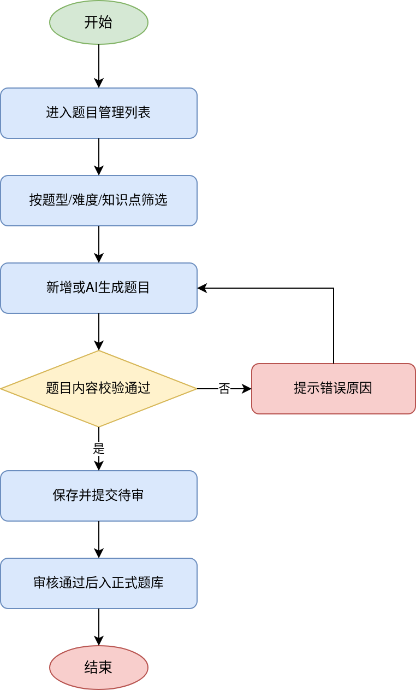

**（五）功能时序图**

#### 3.5.1.2 知识点分类

**（一）功能需求概述**

知识点分类用于按层级维护题目所属的知识点体系，为题库内题目的知识点字段和题目筛选提供分类依据。

**（二）功能设计**

**列表功能**

| 列名 | 字段类型 | 说明 |
|-----|---------|------|
| 分类名称 | 文本 | 按层级展示 |
| 上级分类 | 文本 | 顶级分类显示"-" |
| 操作 | 操作按钮 | 编辑、删除（无权限时隐藏） |

列表为空时显示："暂无分类数据"。

**新增功能**

点击"新增分类"，弹出编辑窗口，填写分类信息。

| 字段名称 | 类型 | 长度限制 | 必填 | 默认值 | 说明 |
|---------|------|---------|------|-------|------|
| 分类名称 | 文本输入 | ≤50字 | 是 | - | 同级分类下唯一 |
| 上级分类 | 层级选择 | - | 否 | - | 不选则为顶级分类 |

提交成功：新增分类成功。
提交失败：保留填写内容，显示具体错误原因。

**编辑功能**

点击"编辑"，弹出编辑窗口，自动填入当前记录数据，表单字段同新增。
提交成功：编辑分类成功。

**删除功能**

点击"删除"，弹出确认"确定删除该分类吗？"。
删除成功：删除分类成功。
该分类下存在子分类或关联题目时，阻止删除，提示"该分类下存在子分类或题目，无法删除"。

**业务规则**

- 分类名称在同级分类下唯一。新增/编辑时若重复，阻止提交，提示"分类【XXX】已存在，请更换名称"。
- 分类下存在子分类或关联题目时，删除需先解除关联，提示"该分类下存在子分类或题目，无法删除"。

**边界与异常**

- **空数据**：列表无数据时，显示"暂无分类数据"。
- **权限不足**：新增、编辑、删除按钮对无权限角色完全隐藏（不渲染，非禁用）。

**（三）业务逻辑关联**

- 知识点分类数据被题库内题目引用，作为题目知识点字段和题目筛选的层级选择来源。

**（四）用户操作流程图**

**（五）功能时序图**

### 3.5.2 试卷管理

试卷管理用于将题库中的题目组织为可用于考试的试卷。试卷分为两种类型：**固定试卷**（题目固定，通过手动组卷生成）和**随机试卷**（配置抽题规则，考试时按规则为每位考生随机抽题）。两类试卷统一在同一列表中维护，供考试管理直接选用。

**（一）功能需求概述**

试卷管理用于维护固定试卷与随机试卷，支持按名称、类型、状态查询已有试卷，通过手动组卷生成固定试卷，或通过配置抽题规则生成随机试卷，为考试安排提供可直接引用的试卷数据。

**（二）功能设计**

**查询/筛选功能**

支持以下条件筛选，条件之间为"与"关系，点击搜索按钮触发查询：

| 筛选字段 | 类型 | 说明 |
|---------|------|------|
| 试卷名称 | 文本输入 | 支持模糊搜索 |
| 试卷类型 | 单选 | 枚举值：固定试卷/随机试卷 |
| 试卷状态 | 单选 | 枚举值：草稿/已发布 |

**列表功能**

| 列名 | 字段类型 | 说明 |
|-----|---------|------|
| 试卷名称 | 文本 | - |
| 试卷类型 | 状态标签 | 固定试卷/随机试卷 |
| 总分 | 数值 | 固定试卷为各题分值之和；随机试卷为抽题规则各项分值合计，系统自动计算 |
| 题目数量 | 数值 | 固定试卷为实际题数；随机试卷为抽题规则的总抽取数量 |
| 时长建议 | 数值 | 单位：分钟 |
| 试卷状态 | 状态标签 | 草稿/已发布 |
| 创建时间 | 时间 | 系统自动记录 |
| 操作 | 操作按钮 | 预览、编辑（仅草稿状态可用）、删除（无权限时隐藏） |

分页默认每页10条，支持切换每页数量。列表为空时显示：暂无试卷数据。

**新增固定试卷（手动组卷）**

点击"手动组卷"进入新建试卷页面，先选择一个或多个题库，再从所选题库范围内挑选具体题目组合，逐题设置分值，并设置试卷名称与时长建议，生成固定试卷。

| 字段名称 | 类型 | 长度限制 | 必填 | 默认值 | 说明 |
|---------|------|---------|------|-------|------|
| 试卷名称 | 文本输入 | 2-50字 | 是 | - | - |
| 时长建议 | 数值输入 | - | 是 | - | 单位：分钟 |
| 题库范围 | 多选 | 至少1个 | 是 | - | 来源于题库管理中已启用的题库 |
| 题目选择 | 多选 | 至少1题 | 是 | - | 来源于所选题库范围内已启用的正式题目 |
| 每题分值 | 数值输入 | - | 是 | - | 逐题设置，用于计算试卷总分 |

提交成功：试卷创建成功。
提交失败：保留填写内容，显示具体错误原因。

**共享设置功能**

对指定试卷设置可见范围与共享级别，控制其他人员能否看到并使用该试卷。已发布的试卷仍可修改共享设置。

| 字段名称 | 类型 | 长度限制 | 必填 | 默认值 | 说明 |
|---------|------|---------|------|-------|------|
| 可见范围 | 单选 | - | 是 | 仅自己 | 枚举值：仅自己 / 本部门 / 本公司 / 全部组织 |
| 共享级别 | 单选 | - | 是 | 可管理 | 枚举值：可管理 / 可查看 |

设置成功：提示"共享设置已保存"。

新建试卷默认可见范围为"仅自己"，避免试卷连同题目答案在创建时即对组织内其他人员可见。
共享级别为"可查看"的试卷，其他人员可将其用于创建考试，但不可编辑、发布或删除该试卷。

**新增随机试卷（抽题规则）**

点击"新增随机试卷"进入新建试卷页面，设置试卷名称、时长建议，先选择抽题所用的题库范围，再按【题型 × 难度 × 知识点】维度逐条设置抽取数量与每题分值（如：单选题-简单-某知识点，抽5题每题2分）。考试时系统在所选题库范围内按此规则为每位考生随机抽题生成卷面。

| 字段名称 | 类型 | 长度限制 | 必填 | 默认值 | 说明 |
|---------|------|---------|------|-------|------|
| 试卷名称 | 文本输入 | 2-50字 | 是 | - | - |
| 时长建议 | 数值输入 | - | 是 | - | 单位：分钟 |
| 题库范围 | 多选 | 至少1个 | 是 | - | 来源于题库管理中已启用的题库，抽题在此范围内进行 |
| 抽题配置 | 列表添加 | 至少1条 | 是 | - | 逐条设置题型、难度、知识点及对应抽取数量与分值 |

抽题配置字段表：

| 字段名称 | 类型 | 长度限制 | 必填 | 默认值 | 说明 |
|---------|------|---------|------|-------|------|
| 题型 | 单选 | - | 是 | - | 来源于数据字典中"题型"已启用的字典项 |
| 难度 | 单选 | - | 是 | - | 来源于数据字典中"难度"已启用的字典项 |
| 知识点 | 单选 | - | 是 | - | 来源于知识点分类中已维护的知识点 |
| 抽取数量 | 数值输入 | - | 是 | - | 该题型/难度/知识点组合下抽取的题目数量 |
| 每题分值 | 数值输入 | - | 是 | - | 该组合下每道题的分值 |

提交成功：试卷创建成功。
提交失败：保留填写内容，显示具体错误原因。

**预览功能**

点击"预览"，固定试卷查看完整题目与答案；随机试卷查看抽题配置与预计卷面构成。

**编辑功能**

点击"编辑"（仅草稿状态可用），自动填入当前试卷数据：固定试卷填入题目与分值，随机试卷填入抽题配置，表单字段同对应的新增功能。
提交成功：试卷修改成功。

**删除功能**

点击"删除"，弹出确认"确定删除该试卷吗？"。
删除成功：删除成功。
有关联数据时阻止删除，提示"该试卷已被考试引用，无法删除"。

**业务规则**

- 固定试卷总分等于各题分值之和；随机试卷总分等于抽题规则各项（抽取数量×每题分值）之和，保存前系统自动校验。固定试卷题目为空时阻止保存，提示"请至少添加一道题目"；随机试卷抽题配置为空时阻止保存，提示"请至少添加一条抽题配置"。
- 随机试卷某题型/难度/知识点组合下可用题目数量不足抽取数量时，保存或使用时提示"[题型/难度/知识点]可用题目不足，请调整抽取数量或补充题目"。
- 试卷被考试引用后不可删除，提示"该试卷已被考试引用，无法删除"。
- 试卷状态为已发布时，题目、分值与抽题配置不可编辑，编辑入口不可用。

**边界与异常**

- **空数据**：列表无数据时，显示"暂无试卷数据"。
- **权限不足**：新增、编辑、删除按钮对无权限角色完全隐藏（不渲染，非禁用）。
- **无管理权限**：对仅"可查看"级别的试卷，编辑、发布、删除入口不展示。
- **随机试卷可用题目不足**：保存或使用时校验各维度可用题目数量，不足时阻止提交，提示"[题型/难度/知识点]可用题目不足，请调整抽取数量或补充题目"。

**（三）业务逻辑关联**

- 固定试卷与随机试卷均先指定题库范围，固定试卷的题目、随机试卷抽题配置的题源均限定在所选题库范围内；题型/难度来源于数据字典，知识点来源于知识点分类
- 试卷被考试管理引用后，删除需先解除关联
- 随机试卷在考试时按抽题规则从所选题库范围内实时抽取题目，为每位考生生成不同卷面
- 试卷引用的题库不可被删除
- 试卷状态影响考试创建时可选试卷的范围

**（四）用户操作流程图**

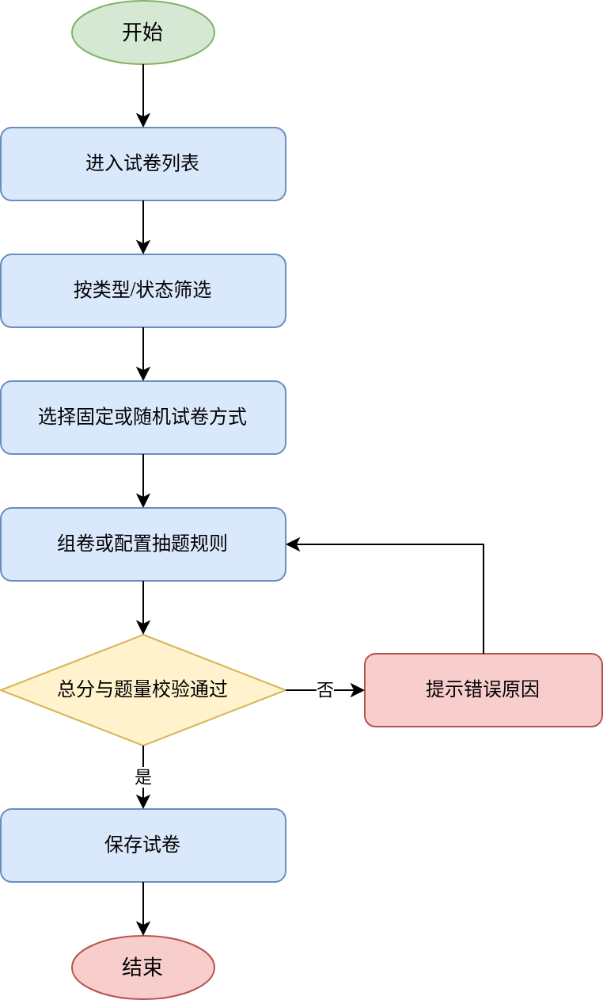

**（五）功能时序图**

### 3.5.3 考试管理

**（一）功能需求概述**

考试管理用于创建并组织考试，为考试选择一份试卷（固定试卷或随机试卷），并可为考试分配考生范围、配置防作弊策略，是连接命题与考试执行的核心环节。

**（二）功能设计**

**查询/筛选功能**

支持以下条件筛选，条件之间为"与"关系，点击搜索按钮触发查询：

| 筛选字段 | 类型 | 说明 |
|---------|------|------|
| 考试名称 | 文本输入 | 支持模糊搜索 |
| 考试状态 | 单选 | 枚举值：未发布/已发布/进行中/已结束 |
| 考试时间 | 日期范围 | 选择开始和结束日期 |

**列表功能**

| 列名 | 字段类型 | 说明 |
|-----|---------|------|
| 考试名称 | 文本 | - |
| 试卷 | 文本 | 展示所选试卷名称及类型（固定/随机） |
| 考试时间 | 文本 | 展示开始时间至结束时间 |
| 时长 | 文本 | 单位：分钟 |
| 参考人数 | 文本 | 已分配考生的数量 |
| 考试状态 | 状态标签 | 未发布/已发布/进行中/已结束 |
| 操作 | 操作按钮 | 编辑、发布、撤回、删除（按状态和权限显隐） |

分页默认每页10条，支持切换每页数量。列表为空时显示：暂无考试数据。

**创建考试**

点击"新增"进入创建考试页面，分为基本信息、选择试卷、分配考生、防作弊策略四部分填写。

*基本信息*

| 字段名称 | 类型 | 长度限制 | 必填 | 默认值 | 说明 |
|---------|------|---------|------|-------|------|
| 考试名称 | 文本输入 | ≤50字 | 是 | - | - |
| 考试说明 | 文本输入 | ≤500字 | 否 | - | - |
| 开始时间 | 日期时间选择 | - | 是 | - | - |
| 结束时间 | 日期时间选择 | - | 是 | - | 必须晚于开始时间 |
| 考试时长 | 数字输入 | - | 是 | - | 单位：分钟 |
| 及格分数 | 数字输入 | - | 是 | - | - |

*选择试卷*

| 字段名称 | 类型 | 长度限制 | 必填 | 默认值 | 说明 |
|---------|------|---------|------|-------|------|
| 试卷 | 单选 | - | 是 | - | 来源于试卷管理中已发布的试卷，可选固定试卷或随机试卷；固定试卷所有考生卷面相同，随机试卷按抽题规则为每位考生随机抽题 |
| 关联认证项目 | 单选 | - | 否 | - | 来源于资格认证中已启用的认证项目 |

*分配考生*

| 字段名称 | 类型 | 长度限制 | 必填 | 默认值 | 说明 |
|---------|------|---------|------|-------|------|
| 考生类型 | 单选 | - | 是 | 内部考生 | 枚举值：内部考生/外部考生，可同时添加两类考生 |
| 内部考生范围 | 层级多选 | - | 否 | - | 来源于组织管理中已启用的组织部门及组织管理·人员管理中已启用的内部考生，支持按组织、部门或人员选择 |
| 外部考生范围 | 多选 | - | 否 | - | 来源于外部考生管理中已启用的外部考生，支持按所属单位或人员选择 |

*考试策略*

| 字段名称 | 类型 | 长度限制 | 必填 | 默认值 | 说明 |
|---------|------|---------|------|-------|------|
| 防切屏检测 | 开关 | - | 否 | 关闭 | 开启后记录切屏行为并告警，超过允许次数强制交卷 |
| 允许切屏次数 | 数字输入 | - | 防切屏检测开启时必填 | 0 | 0 表示首次切屏即强制交卷 |
| 题目乱序 | 开关 | - | 否 | 关闭 | 开启后为每位考生打乱题目顺序与选项顺序 |
| 操作限制 | 开关 | - | 否 | 关闭 | 开启后禁止复制粘贴、禁止右键、禁止多屏 |
| 最多重考次数 | 数字输入 | - | 否 | 0 | 0 表示不允许重考 |
| 允许提前进入分钟数 | 数字输入 | - | 否 | 0 | 0 表示不允许提前进入考场 |
| 开考前签署承诺书 | 开关 | - | 否 | 关闭 | 开启后考生需先签署考试承诺书方可开考 |
| 允许提前交卷 | 开关 | - | 否 | 开启 | 关闭后考生须作答至考试结束 |
| 最短作答时长 | 数字输入 | - | 否 | 0 | 单位：分钟，允许提前交卷时生效，0 表示不限制 |
| 显示剩余时间 | 开关 | - | 否 | 开启 | 关闭后作答期间不展示倒计时 |
| 允许查看成绩 | 开关 | - | 否 | 开启 | 关闭后考生不可查询本场成绩 |
| 允许查看答案与解析 | 开关 | - | 否 | 关闭 | 开启后考生可在考后查看正确答案与解析 |

防切屏检测、题目乱序、操作限制默认关闭，避免在无需严格管控的场合对正常作答造成干扰。

提交成功：创建考试成功。提交失败：保留填写内容，显示具体错误原因。

**编辑功能**

点击"编辑"，自动填入当前考试数据，表单字段同创建考试。仅未发布状态的考试可编辑。
提交成功：编辑考试成功。

**发布功能**

点击"发布"，考试状态变更为已发布，考生可见并可参加。

**撤回功能**

点击"撤回"，考试状态变更为未发布。仅未开始的考试可撤回。

**删除功能**

点击"删除"，弹出确认"确定删除该考试吗？"。
删除成功：删除考试成功。
已发布或进行中的考试不可删除，提示"考试已发布，无法删除，请先撤回"。

**业务规则**

- 结束时间必须晚于开始时间。保存时若不满足，阻止保存，提示"结束时间必须晚于开始时间"。
- 所选试卷为随机试卷时，若其抽题规则的可用题目数量不足，阻止发布，提示"随机试卷可用题目不足，无法发布考试"。
- 已发布或进行中的考试不可删除。删除时若命中该状态，阻止删除，提示"考试已发布，无法删除，请先撤回"。
- 考试到达开始时间后自动变更为进行中状态；到达结束时间后自动变更为已结束状态，并触发阅卷流程。
- 发布考试前必须已分配考生。发布时若未分配任何考生，阻止发布，提示"请先分配考生"。

**边界与异常**

- **空数据**：列表无数据时，显示"暂无考试数据"
- **权限不足**：创建、编辑、删除按钮对无权限角色完全隐藏（不渲染，非禁用）
- **考生未分配**：发布时若未分配任何考生，阻止发布，提示"请先分配考生"

**（三）业务逻辑关联**

- 试卷数据（固定试卷与随机试卷）来源于试卷管理中已发布的试卷，需先在试卷管理中完成试卷维护
- 内部考生范围数据来源于组织管理的组织部门数据和组织管理·人员管理的内部考生数据；外部考生范围数据来源于外部考生管理，需先完成相应维护
- 关联认证项目数据来源于资格认证模块中已启用的认证项目
- 考试结束后，考试数据流向阅卷中心，触发阅卷流程

**（四）用户操作流程图**

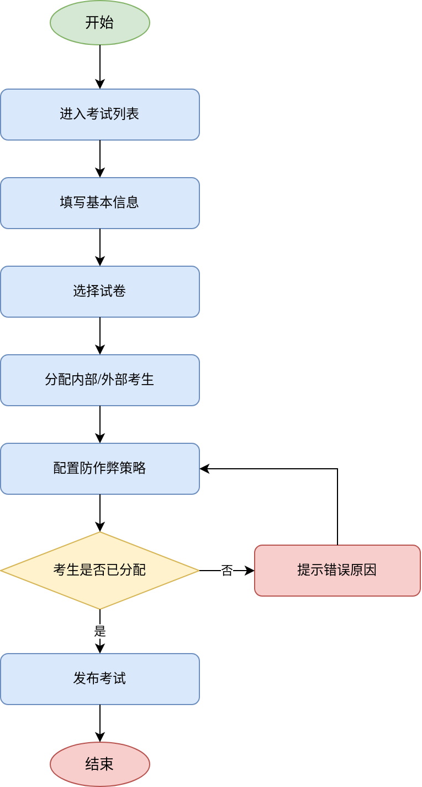

**（五）功能时序图**

### 3.5.4 练习管理

练习管理用于组织考生的日常练习，分为两种形态：**岗位练兵**由管理员指定练习内容与参与人员，考生在移动端收到任务后按要求完成；**自主练习**由管理员开放题库并授权范围，考生自行选择题库随时练习。两者在同一页面内分区维护。

#### 3.5.4.1 岗位练兵

**（一）功能需求概述**

岗位练兵用于按岗位或人员范围下发定向练习任务，管理员设定练习题库、抽题方式与起止时间并指定参与人员，考生按任务要求完成练习，帮助组织有计划地开展技能训练。

**（二）功能设计**

**查询/筛选功能**

支持以下条件筛选，条件之间为"与"关系，点击搜索按钮触发查询：

| 筛选字段 | 类型 | 说明 |
|---------|------|------|
| 练习名称 | 文本输入 | 支持模糊搜索 |
| 状态 | 单选 | 枚举值：未发布 / 已发布 / 进行中 / 已结束 |
| 开始日期 | 日期范围 | 选择开始和结束日期 |

**列表功能**

| 列名 | 字段类型 | 说明 |
|-----|---------|------|
| 练习名称 | 文本 | - |
| 练习编号 | 文本 | 留空新增时由系统自动生成 |
| 练习题库 | 文本 | 来源于题库管理中已授权的题库 |
| 练习方式 | 文本 | 全库顺序练 / 按规则抽题 |
| 题目数 | 数字 | - |
| 练习时间 | 日期时间 | 未设置时长时显示"不限时" |
| 参与人数 | 数字 | - |
| 状态 | 状态标签 | 未发布 / 已发布 / 进行中 / 已结束 |
| 操作 | 操作按钮 | 详情、编辑、发布、撤回、结束、删除（按状态和权限显隐） |

分页默认每页10条，支持切换每页数量。
支持批量勾选，勾选后显示批量删除按钮（含已选数量）。
列表为空时显示：暂无练习数据。

**创建练习功能**

点击"创建练习"进入新建练习页面，分区填写基础信息、练习题库与抽题方式、参与人员。

*基础信息*

| 字段名称 | 类型 | 长度限制 | 必填 | 默认值 | 说明 |
|---------|------|---------|------|-------|------|
| 练习名称 | 文本输入 | 2-50字 | 是 | - | - |
| 练习编号 | 文本输入 | ≤30字 | 否 | - | 留空时由系统自动生成 |
| 练习说明 | 多行文本 | ≤200字 | 否 | - | - |
| 练习时间 | 日期时间范围 | - | 否 | - | 留空表示不限时，考生随时可练 |
| 自动结束 | 开关 | - | 否 | 开启 | 开启后到达结束时间自动转为已结束 |

*练习题库与抽题方式*

| 字段名称 | 类型 | 长度限制 | 必填 | 默认值 | 说明 |
|---------|------|---------|------|-------|------|
| 练习题库 | 多选 | 至少1个 | 是 | - | 来源于题库管理中当前用户可使用的题库 |
| 练习方式 | 单选 | - | 是 | 全库顺序练 | 枚举值：全库顺序练（按题库顺序练完全部题目，支持断点续练）/ 按规则抽题（每次按规则抽取） |
| 抽题规则 | 规则明细 | 至少1条 | 练习方式为按规则抽题时必填 | - | 按题型、难度、知识点维度逐条设置抽取数量，知识点可不限 |

*参与人员*

| 字段名称 | 类型 | 长度限制 | 必填 | 默认值 | 说明 |
|---------|------|---------|------|-------|------|
| 参与范围 | 单选 | - | 是 | - | 按部门或按人员指定参与范围 |
| 参与人员 | 多选 | 至少1人 | 是 | - | 来源于组织管理·人员管理中已启用的内部考生与外部考生管理中已启用的外部考生 |

提交成功：练习创建成功，状态为"未发布"。
提交失败：保留填写内容，显示具体错误原因。

**编辑功能**

点击"编辑"，自动填入当前练习数据，表单字段同创建练习。仅未发布状态的练习可编辑。
提交成功：编辑练习成功。

**详情功能**

点击"详情"查看练习配置与参与人练习记录，分区展示练习基本配置、抽题规则、参与人员及各自的练习进度与正确率。

**发布功能**

对未发布状态的练习点击"发布"，发布后参与人员在移动端可见该练习任务。
发布成功：提示"练习已发布"。

**撤回功能**

对已发布且尚未开始的练习点击"撤回"，弹出确认"确定撤回该练习吗？撤回后参与人员将不可见"，确认后状态回退为"未发布"。
撤回成功：提示"练习已撤回"。

**结束功能**

对进行中的练习点击"结束"，弹出确认"确定提前结束该练习吗？结束后参与人员不可再作答"，确认后状态变更为"已结束"。
结束成功：提示"练习已结束"。

**删除功能**

点击"删除"，弹出确认"确定删除该练习吗？"。
删除成功：提示"删除成功"。
进行中的练习不可删除，提示"练习进行中，无法删除"。

**业务规则**

- 练习名称在系统内全局唯一。新增/编辑时若重复，阻止提交，提示"练习名称已存在"。
- 练习编号留空时由系统自动生成，生成后全局唯一且不可修改。
- 仅未发布状态的练习可编辑与删除；已发布且未开始的练习可撤回；进行中的练习可提前结束。
- 练习方式为"按规则抽题"时至少配置一条抽题规则，未配置时阻止提交，提示"按规则抽题需至少配置一条抽题规则"。
- 每条抽题规则必须选择题型，未选择时阻止提交，提示"第 N 条抽题规则未选择题型"。
- 抽题数量超出所选题库对应维度的可用题量时阻止提交，提示"可用题目不足，请调整抽取数量或补充题目"。
- 练习时间留空表示不限时，参与人员在练习发布后可随时作答。
- 到达练习结束时间且开启自动结束时，练习状态自动变更为"已结束"。

**边界与异常**

- **空数据**：列表无数据时，显示"暂无练习数据"。
- **权限不足**：创建练习、编辑、发布、撤回、结束、删除按钮对无权限角色完全隐藏（不渲染，非禁用）。
- **参与人员为空**：未选择任何参与人员时阻止提交，提示"请至少选择一名参与人员"。

**（三）业务逻辑关联**

- 练习题库来源于题库管理，题库需先完成维护并对当前用户可用；题库共享级别为"可查看"时仍可用于练习组题。
- 题型、难度来源于数据字典中已启用的字典项，知识点来源于知识点分类中已维护的知识点。
- 参与人员来源于组织管理·人员管理中已启用的内部考生与外部考生管理中已启用的外部考生。
- 练习发布后参与人员在移动端首页快捷功能进入岗位练兵作答，作答数据回流至本模块的练习记录。

**（四）用户操作流程图**

**（五）功能时序图**

#### 3.5.4.2 自主练习

**（一）功能需求概述**

自主练习用于按题库维度开放练习范围，管理员设定题库的开放状态、开放对象与可练知识点，考生自行选择题库随时练习，不设内容指定与完成时限，满足日常自我巩固的需要。

**（二）功能设计**

**查询/筛选功能**

支持以下条件筛选，条件之间为"与"关系，点击搜索按钮触发查询：

| 筛选字段 | 类型 | 说明 |
|---------|------|------|
| 题库名称 | 文本输入 | 支持模糊搜索 |
| 开放状态 | 单选 | 枚举值：已开放 / 未开放 |

**列表功能**

| 列名 | 字段类型 | 说明 |
|-----|---------|------|
| 题库名称 | 文本 | 来源于题库管理中已维护的题库 |
| 创建人 | 文本 | 无值显示"-" |
| 试题数 | 数字 | 该题库下的题目数量 |
| 开放人数 | 数字 | 开放对象为全员开放时显示全员 |
| 考核点 | 数字 | 已设定的可练知识点数量，未设定表示不限 |
| 开放状态 | 状态标签 | 已开放 / 未开放 |
| 操作 | 操作按钮 | 开放设置（无权限时隐藏） |

分页默认每页10条，支持切换每页数量。
列表为空时显示：暂无题库数据。

**开放设置功能**

对指定题库点击"开放设置"，设置该题库的自主练习开放规则。

| 字段名称 | 类型 | 长度限制 | 必填 | 默认值 | 说明 |
|---------|------|---------|------|-------|------|
| 开放状态 | 开关 | - | 是 | 未开放 | 未开放时该题库不出现在考生的自主练习范围内 |
| 开放对象 | 单选 | - | 是 | 全员开放 | 枚举值：全员开放 / 指定员工 |
| 指定人员 | 多选 | 至少1人 | 开放对象为指定员工时必填 | - | 来源于组织管理·人员管理中已启用的人员 |
| 可练知识点 | 层级多选 | - | 否 | - | 留空表示不限，可练该题库全部题目 |
| 单次题数上限 | 数字输入 | - | 否 | - | 留空表示不限 |
| 允许反复练习 | 开关 | - | 否 | 开启 | 关闭后同一题目练过不再出现 |
| 单题展示对错 | 开关 | - | 否 | 开启 | 开启后每题作答即时展示对错 |
| 展示答案 | 开关 | - | 否 | 开启 | 开启后考生可查看正确答案 |
| 展示解析 | 开关 | - | 否 | 开启 | 开启后考生可查看答案解析 |

设置成功：提示"开放设置已保存"。
提交失败：保留填写内容，显示具体错误原因。

**业务规则**

- 开放状态为"未开放"的题库不出现在考生的自主练习可选范围内。
- 开放对象为"指定员工"时必须选择至少一名人员，未选择时阻止提交，提示"请至少选择一名人员"。
- 可练知识点留空表示不限，考生可练该题库下全部题目；已设定时仅可练所选知识点下的题目。
- 关闭"允许反复练习"后，考生已练过的题目不再出现在后续练习中。

**边界与异常**

- **空数据**：列表无数据时，显示"暂无题库数据"。
- **权限不足**：开放设置按钮对无权限角色完全隐藏（不渲染，非禁用）。
- **题库无题目**：题库下无题目时不可开放，提示"该题库暂无题目，无法开放"。

**（三）业务逻辑关联**

- 题库与题目来源于题库管理，题库需先完成维护；题库共享级别为"可查看"时仍可开放用于自主练习。
- 可练知识点来源于知识点分类中已维护的知识点。
- 指定人员来源于组织管理·人员管理中已启用的人员。
- 开放后考生在移动端首页快捷功能进入自主练习，按开放范围自选题库与知识点作答，作答数据回流至练习记录。

**（四）用户操作流程图**

**（五）功能时序图**

### 3.5.5 阅卷中心

**（一）功能需求概述**

阅卷中心用于对考试答卷进行评分。客观题在考生交卷后由系统自动判分，主观题由阅卷老师按评分标准逐题评分，评分过程留痕，最终汇总客观题与主观题得分形成总分并发布，供考生查询。

**（二）功能设计**

**查询/筛选功能**

支持以下条件筛选，条件之间为"与"关系，点击搜索按钮触发查询：

| 筛选字段 | 类型 | 说明 |
|---------|------|------|
| 考试名称 | 文本输入 | 支持模糊搜索 |
| 阅卷状态 | 单选 | 枚举值：待批阅 / 已阅完 |
| 考生关键词 | 文本输入 | 支持模糊搜索 |

**阅卷任务列表**

| 列名 | 字段类型 | 说明 |
|-----|---------|------|
| 考试名称 | 文本 | - |
| 考生 | 文本 | - |
| 题型构成 | 文本 | 展示该答卷客观题、主观题的题量构成 |
| 客观题得分 | 数字 | 系统自动判分汇总，未交卷时显示"-" |
| 主观题得分 | 数字 | 人工评分后的汇总分，未完成阅卷时显示"-" |
| 总分 | 数字 | 系统自动计算：客观题得分 + 主观题得分，成绩未发布时显示"-" |
| 阅卷状态 | 状态标签 | 待批阅 / 已阅完 |
| 操作 | 操作按钮 | 进入批阅、查看评分记录、发布成绩、撤回成绩（按状态和权限显隐） |

分页默认每页10条，支持切换每页数量。列表为空时显示："暂无阅卷任务"。

**客观题判分查看**

考生交卷后，系统即时按标准答案自动完成客观题判分，无需人工触发。查看时展示每道客观题的得分和对错结果。

| 列名 | 字段类型 | 说明 |
|-----|---------|------|
| 题号 | 数字 | - |
| 考生答案 | 文本 | - |
| 标准答案 | 文本 | 数据来源：题库中该题配置的标准答案 |
| 得分 | 数字 | 系统自动判分 |
| 对错 | 状态标签 | 正确 / 错误 |

**主观题人工评分**

进入批阅后，阅卷老师对该答卷的主观题逐题评分。评分时可对照题目配置的评分标准与参考答案。

| 字段名称 | 类型 | 长度限制 | 必填 | 默认值 | 说明 |
|---------|------|---------|------|-------|------|
| 题号 | 只读 | - | - | - | 系统按卷面顺序展示 |
| 考生答案 | 只读 | - | - | - | 考生该题作答内容 |
| 评分标准 | 只读 | - | - | - | 来源于题库中该题配置的评分标准 |
| 本题分值 | 只读 | - | - | - | 来源于试卷中该题设定的分值 |
| 评分 | 数字输入 | 0 至本题分值 | 是 | - | 超出本题分值时阻止提交 |
| 评语 | 多行文本 | ≤500字 | 否 | - | 阅卷老师填写的评分说明 |

逐题评分可分次进行，未评完的答卷保持"待批阅"，全部主观题评分完成后阅卷状态变更为"已阅完"。

提交成功：提示"评分已保存"。
提交失败：保留填写内容，显示具体错误原因。

**评分记录查看**

查看某答卷的完整评分历史，记录不可删除、不可篡改。

| 字段名称 | 类型 | 说明 |
|---------|------|------|
| 评分人 | 文本 | 系统自动记录 |
| 评分时间 | 日期时间 | 系统自动记录 |
| 题号 | 数字 | 系统自动记录 |
| 变更前分数 | 数字 | 首次评分时为空 |
| 变更后分数 | 数字 | 系统自动记录 |
| 评语 | 文本 | 阅卷老师填写内容的留存 |

**成绩发布**

客观题得分与主观题最终得分汇总为总分。点击"发布成绩"，弹出确认"成绩发布后不可修改，确定要发布吗？"，确认后完成发布，考生可查询。
发布成功：提示"成绩发布成功"。

**成绩撤回**

对已发布成绩的答卷，点击"撤回成绩"，弹出确认"确定撤回该成绩吗？撤回后考生将无法查询"，确认后成绩撤回，阅卷状态回退为"已阅完"，考生不可再查询该成绩。
撤回成功：提示"成绩已撤回"。

**业务规则**

- 客观题在考生交卷后由系统自动判分，无需人工干预。
- 主观题必须全部完成人工评分后，该答卷才能发布成绩，未完成时阻止发布，提示"存在未完成阅卷的主观题，无法发布成绩"。
- 单题评分不得超出该题在试卷中设定的分值，超出时阻止提交，提示"评分不能超过本题分值"。
- 阅卷老师提交评分时，必须记录评分人、评分时间、变更前分数、变更后分数，评分记录不可删除。
- 成绩发布后不可修改，如需修改需撤回成绩，提示"成绩已发布，如需修改请先撤回"。

**边界与异常**

- **空数据**：阅卷任务列表无数据时，显示"暂无阅卷任务"。
- **权限不足**：进入批阅、成绩发布、成绩撤回按钮对无权限角色完全隐藏（不渲染，非禁用）。
- **全客观题答卷**：答卷不含主观题时，交卷后直接进入"已阅完"，无需人工评分即可发布成绩。

**（三）业务逻辑关联**

- 阅卷任务来源于考试管理中已结束的考试答卷。
- 评分标准与本题分值来源于题库管理中的题目配置与试卷管理中的分值设定。
- 成绩发布后数据流向证书管理，用于判断是否达到发证条件。

**（四）用户操作流程图**

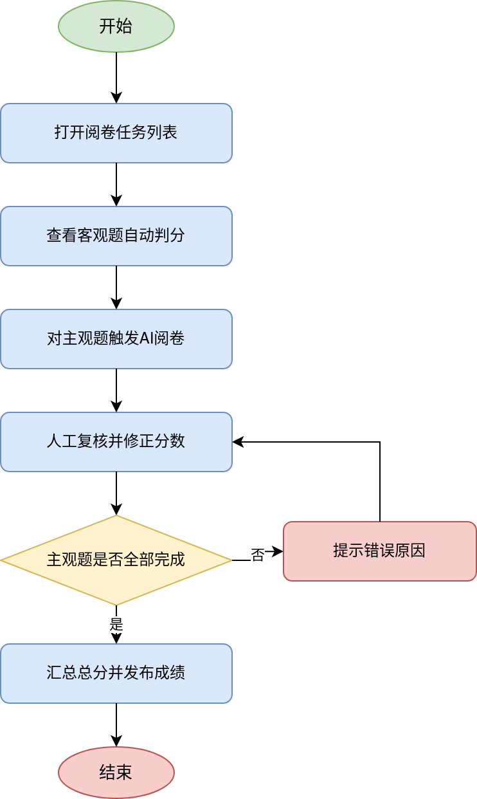

**（五）功能时序图**

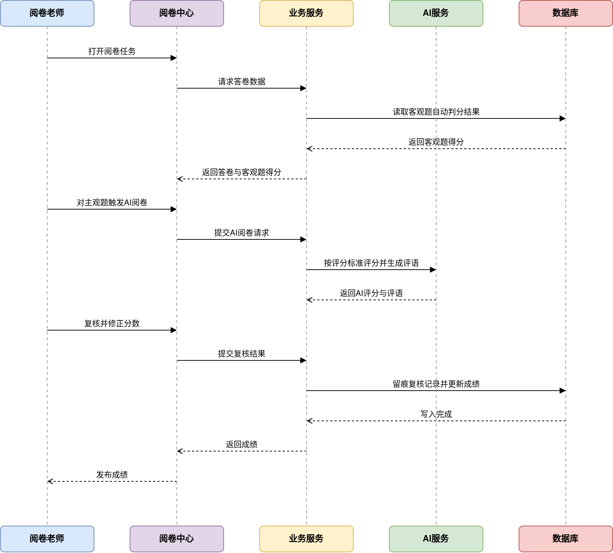

### 3.5.6 资格认证

资格认证用于管理各类资格认证项目，考生报考认证项目经资格审核通过后获得对应考试的参考资格，考试通过后按认证项目配置的证书模板与有效期获得证书。

#### 3.5.6.1 认证项目

**（一）功能需求概述**

认证项目功能用于维护各类资格认证项目的基本信息、关联考试和证书配置，为考生报考、资格审核及后续发证提供基础数据支撑。

**（二）功能设计**

**查询/筛选功能**

支持以下条件筛选，条件之间为"与"关系，点击搜索按钮触发查询：

| 筛选字段 | 类型 | 说明 |
|---------|------|------|
| 认证名称 | 文本输入 | 支持模糊搜索 |
| 状态 | 单选 | 枚举值：启用/停用 |

**列表功能**

| 列名 | 字段类型 | 说明 |
|-----|---------|------|
| 认证名称 | 文本 | - |
| 关联考试 | 文本 | 数据来源：新增认证项目时选择 |
| 报考条件说明 | 文本 | 无值显示"-" |
| 有效期(月) | 文本 | 数据来源：新增认证项目时填写 |
| 认证状态 | 状态标签 | 启用/停用 |
| 创建时间 | 文本 | 系统自动记录 |
| 操作 | 操作按钮 | 编辑、启用/停用、删除（无权限时隐藏） |

分页默认每页10条，支持切换每页数量。列表为空时显示：暂无认证项目数据。

**新增功能**

点击"新增"，弹出编辑窗口，填写认证项目信息。

| 字段名称 | 类型 | 长度限制 | 必填 | 默认值 | 说明 |
|---------|------|---------|------|-------|------|
| 认证名称 | 文本输入 | ≤50字 | 是 | - | 全局唯一 |
| 认证说明 | 文本输入 | ≤500字 | 否 | - | - |
| 关联考试 | 单选 | - | 是 | - | 来源于考试管理中已发布的考试 |
| 报考条件说明 | 文本输入 | ≤500字 | 否 | - | - |
| 证书有效期(月) | 数字输入 | - | 是 | - | 单位为月 |
| 关联证书模板 | 单选 | - | 是 | - | 来源于证书管理中已启用的证书模板 |

提交成功：新增认证项目成功。提交失败：保留填写内容，显示具体错误原因。

**编辑功能**

点击"编辑"，自动填入当前记录数据，表单字段同新增。
提交成功：编辑认证项目成功。

**删除功能**

点击"删除"，弹出确认"确定要删除该认证项目吗？删除后不可恢复"。
删除成功：删除认证项目成功。
该认证项目下存在报考记录时阻止删除，提示"该认证项目下存在报考记录，无法删除"。

**启用/停用功能**

点击"启用"或"停用"，切换认证项目状态。

**业务规则**

- 认证名称在系统内全局唯一。新增/编辑时若重复，阻止提交，提示"认证名称已存在，请更换名称"。
- 认证项目停用后，考生不可再报考该认证项目，提示"该认证项目已停用，暂不可报考"；已提交的报考记录不受影响，按原流程继续审核。
- 认证项目下存在报考记录时不可删除，提示"该认证项目下存在报考记录，无法删除"。

**边界与异常**

- **空数据**：认证项目列表无数据时，显示"暂无认证项目数据"。
- **权限不足**：新增、编辑、删除、启用/停用按钮对无权限角色完全隐藏（不渲染，非禁用）。

**（三）业务逻辑关联**

- 关联考试数据来源于考试管理中已发布的考试。
- 关联证书模板数据来源于证书管理中已启用的证书模板。
- 认证项目状态和证书配置为报考审核、证书发放提供基础数据依据。

**（四）用户操作流程图**

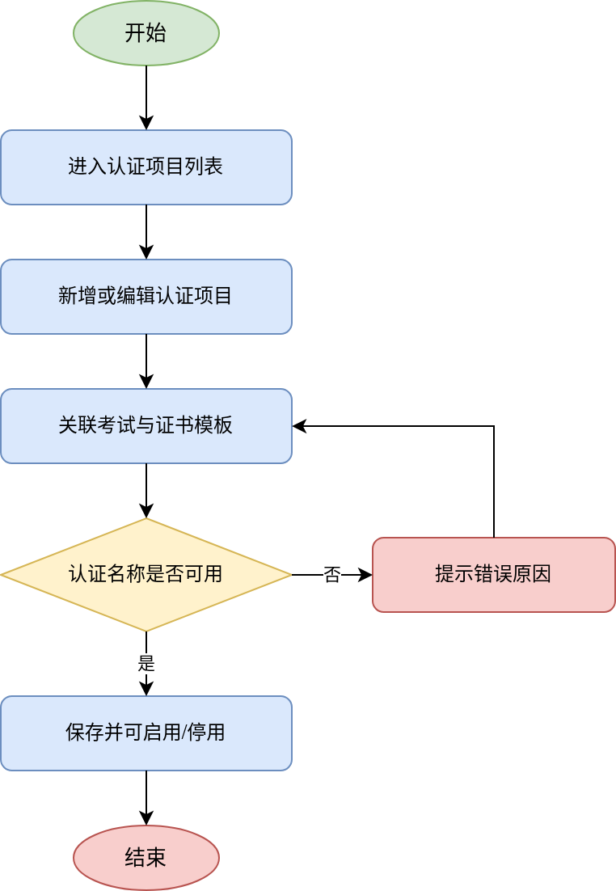

**（五）功能时序图**

#### 3.5.6.2 报考审核

**（一）功能需求概述**

报考审核功能用于审核考生的认证项目报考申请，审核通过后考生获得对应考试的参考资格，为资格认证流程提供把关环节。

**（二）功能设计**

**查询/筛选功能**

支持以下条件筛选，条件之间为"与"关系，点击搜索按钮触发查询：

| 筛选字段 | 类型 | 说明 |
|---------|------|------|
| 认证项目 | 单选 | 来源于认证项目中已配置的认证项目 |
| 审核状态 | 单选 | 枚举值：待审核/已通过/已驳回 |
| 考生关键词 | 文本输入 | 支持模糊搜索 |

**列表功能**

| 列名 | 字段类型 | 说明 |
|-----|---------|------|
| 考生姓名 | 文本 | 数据来源：考生提交报考时关联 |
| 报考认证项目 | 文本 | 数据来源：考生提交报考时选择 |
| 报考时间 | 文本 | 系统自动记录 |
| 审核状态 | 状态标签 | 待审核/已通过/已驳回 |
| 审核人 | 文本 | 数据来源：审核操作时自动记录，无值显示"-" |
| 操作 | 操作按钮 | 审核（无权限时隐藏） |

分页默认每页10条，支持切换每页数量。列表为空时显示：暂无报考记录。

**审核功能**

点击"审核"，查看考生报考资料，选择通过或驳回。驳回时需填写驳回原因。

审核通过：审核通过成功，考生获得对应考试的参考资格。
审核驳回：审核驳回成功，提示考生"您的报考已被驳回，原因：[驳回原因]"。

**业务规则**

- 审核通过后，考生获得对应认证项目关联考试的参考资格。
- 审核驳回时必须填写驳回原因，驳回后提示考生"您的报考已被驳回，原因：[驳回原因]"。
- 已通过审核的报考记录不可重复审核，提示"该报考已审核通过，无需重复操作"。

**边界与异常**

- **空数据**：报考记录列表无数据时，显示"暂无报考记录"。
- **权限不足**：审核按钮对无权限角色完全隐藏（不渲染，非禁用）。

**（三）业务逻辑关联**

- 报考记录数据来源于考生提交的报考申请，关联认证项目中已配置的认证项目。
- 审核通过赋予考生对应考试的参考资格，影响考试管理中的考生范围。
- 考生通过考试后，依据认证项目配置的证书模板与有效期，流向证书管理完成发证。

**（四）用户操作流程图**

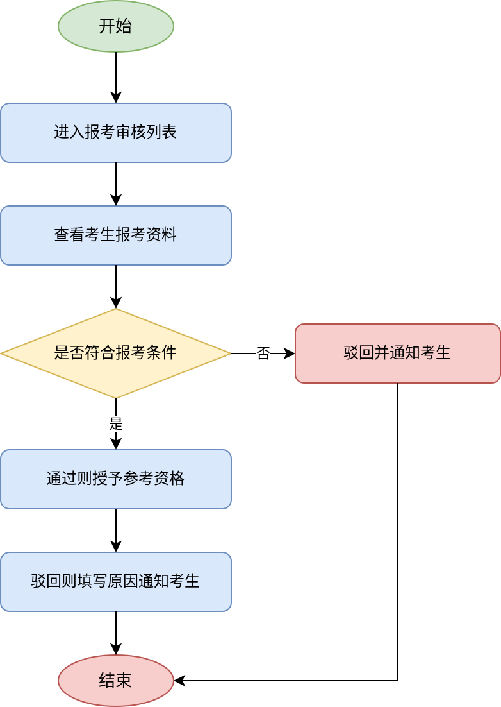

**（五）功能时序图**

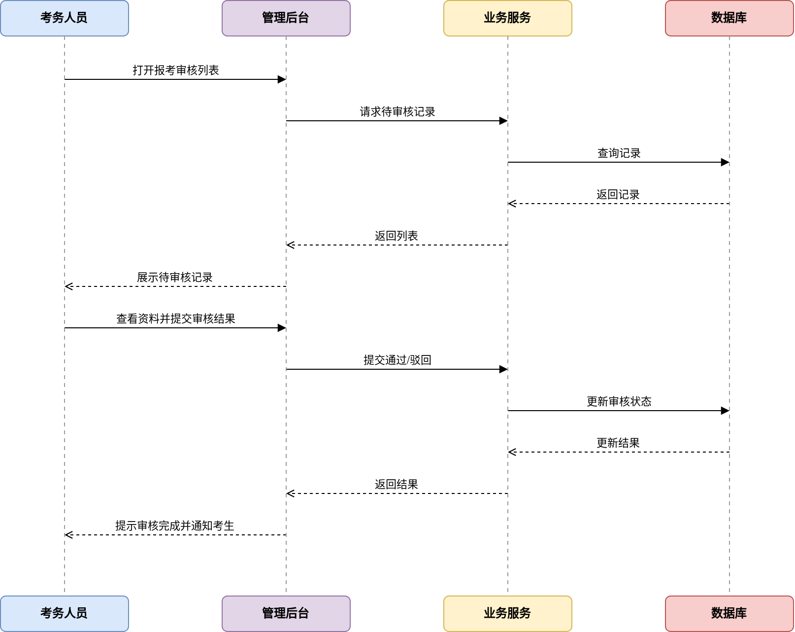

### 3.5.7 证书管理

证书管理用于维护证书模板，并为通过考试且审核通过的考生自动颁发电子证书、留存证书发放记录。本模块承接资格认证的报考审核结果和阅卷中心的考试成绩，是认证项目全流程的最后一环。

#### 3.5.7.1 证书模板

**（一）功能需求概述**

证书模板管理用于统一维护证书的版式内容和编号规则，为证书发放提供模板依据，确保同一认证项目颁发的证书内容和编号规范一致。

**（二）功能设计**

**查询/筛选功能**

支持以下条件筛选，条件之间为"与"关系，点击搜索按钮触发查询：

| 筛选字段 | 类型 | 说明 |
|---------|------|------|
| 模板名称 | 文本输入 | 支持模糊搜索 |
| 状态 | 单选 | 枚举值：启用 / 停用 |

**列表功能**

| 列名 | 字段类型 | 说明 |
|-----|---------|------|
| 模板名称 | 文本 | - |
| 适用认证项目 | 文本 | 数据来源：被认证项目引用后自动关联；未被引用时显示"-" |
| 模板状态 | 状态标签 | 启用 / 停用 |
| 创建时间 | 日期时间 | 系统自动记录 |
| 操作 | 操作按钮 | 编辑、启用/停用、删除（无权限时隐藏） |

分页默认每页10条，支持切换每页数量。列表为空时显示：暂无证书模板数据。

**新增功能**

点击"新增模板"，弹出编辑窗口，填写模板信息。

| 字段名称 | 类型 | 长度限制 | 必填 | 默认值 | 说明 |
|---------|------|---------|------|-------|------|
| 模板名称 | 文本输入 | ≤50字 | 是 | - | 系统内唯一 |
| 证书标题 | 文本输入 | ≤100字 | 是 | - | 证书正文主标题 |
| 颁发机构名称 | 文本输入 | ≤100字 | 是 | - | - |
| 证书说明文案 | 多行文本 | ≤500字 | 否 | - | 证书正文说明性内容 |
| 印章图片 | 图片上传 | 单张≤5MB | 否 | - | 用于证书上的机构印章展示 |
| 编号规则 | 文本输入 | ≤50字 | 是 | - | 证书编号生成规则，如"年份+流水号" |

提交成功：新增证书模板成功。
提交失败：保留填写内容，显示具体错误原因。

**编辑功能**

点击"编辑"，弹出编辑窗口，自动填入当前记录数据，表单字段同新增。
提交成功：编辑证书模板成功。

**删除功能**

点击"删除"，弹出确认"确定要删除该证书模板吗？删除后不可恢复。"。
删除成功：删除证书模板成功。
该证书模板已被认证项目引用时阻止删除，提示"该证书模板已被认证项目引用，无法删除"。

**启用/停用功能**

点击"启用"或"停用"，切换模板状态。停用确认："停用后该模板将无法用于新的认证项目配置，确定停用吗？"
停用成功：证书模板已停用。

**业务规则**

- 模板名称在系统内全局唯一。新增/编辑时若重复，阻止提交，提示"模板名称已存在，请更换"。
- 证书模板被认证项目引用时不可删除，阻止删除操作，提示"该证书模板已被认证项目引用，无法删除"。
- 模板停用后，不可再用于新的认证项目配置；已引用该模板的认证项目正常使用，不受影响。

**边界与异常**

- **空数据**：列表无数据时，显示"暂无证书模板数据"。
- **权限不足**：新增、编辑、删除、启用/停用按钮对无权限角色完全隐藏（不渲染，非禁用）。

**（三）业务逻辑关联**

- 证书模板被资格认证的认证项目引用，作为该认证项目发证时的证书内容和编号规则依据。
- 证书模板的编号规则被证书发放引用，用于生成证书编号。

**（四）用户操作流程图**

**（五）功能时序图**

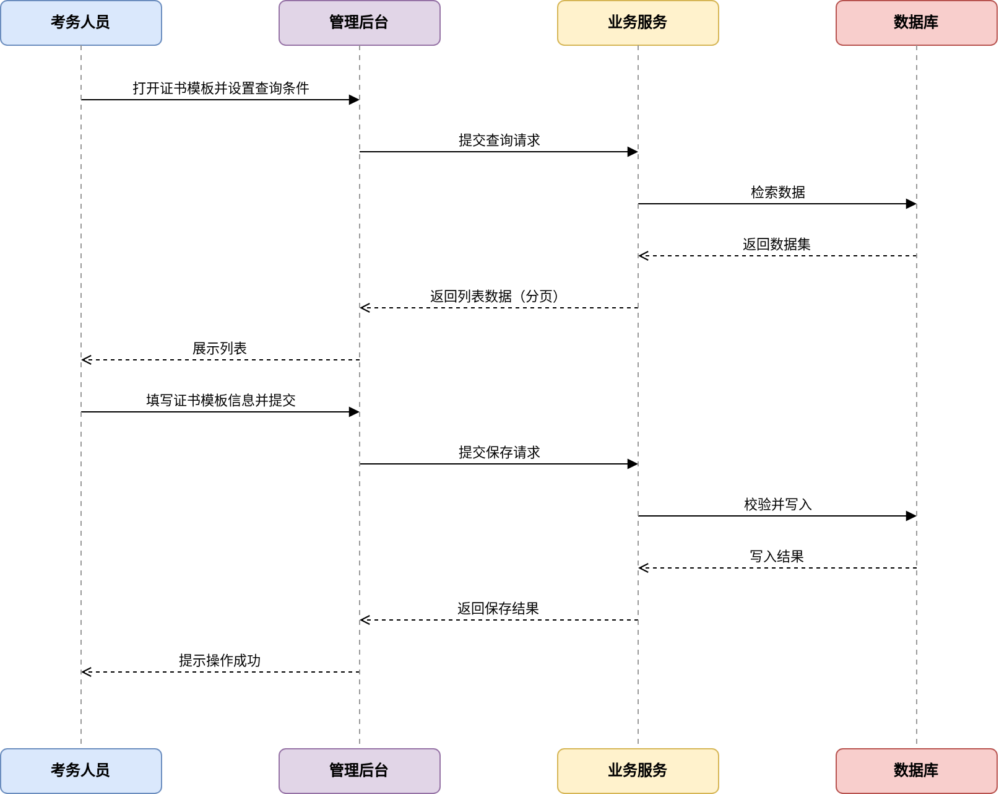

#### 3.5.7.2 证书发放

**（一）功能需求概述**

证书发放用于留存并展示已颁发的电子证书发放记录。考生通过考试且报考审核通过后，系统按对应证书模板的编号规则自动生成唯一证书编号并颁发证书，管理人员在本功能中查询、查看和下载已发放的证书记录。

**（二）功能设计**

**查询/筛选功能**

支持以下条件筛选，条件之间为"与"关系，点击搜索按钮触发查询：

| 筛选字段 | 类型 | 说明 |
|---------|------|------|
| 认证项目 | 单选 | 来源于资格认证中已配置的认证项目 |
| 考生关键词 | 文本输入 | 支持按考生姓名模糊搜索 |
| 证书状态 | 单选 | 枚举值：有效 / 已过期 |

**列表功能**

| 列名 | 字段类型 | 说明 |
|-----|---------|------|
| 证书编号 | 文本 | 系统按模板编号规则自动生成，全局唯一 |
| 考生姓名 | 文本 | - |
| 认证项目 | 文本 | - |
| 颁发日期 | 日期 | 系统自动发证时记录 |
| 有效期至 | 日期 | 系统自动计算：颁发日期 + 认证项目配置的有效期月数 |
| 证书状态 | 状态标签 | 有效 / 已过期 |
| 操作 | 操作按钮 | 查看、下载（无权限时隐藏） |

分页默认每页10条，支持切换每页数量。列表为空时显示：暂无证书发放记录。

**查看/下载功能**

点击"查看"，展示证书完整内容。点击"下载"，将证书保存为文件。

**业务规则**

- 考生达到及格分数且报考审核通过后，系统自动为其颁发证书，无需人工操作；未达条件的考生不生成证书记录。
- 证书编号由系统按证书模板的编号规则自动生成，系统内全局唯一。
- 证书有效期由系统根据认证项目配置的有效期月数自动计算：有效期至 = 颁发日期 + 有效期月数。
- 证书当前日期超过有效期至时，证书状态自动显示为"已过期"。

**边界与异常**

- **空数据**：列表无数据时，显示"暂无证书发放记录"。
- **权限不足**：查看、下载按钮对无权限角色完全隐藏（不渲染，非禁用）。

**（三）业务逻辑关联**

- 证书发放依赖阅卷中心的考试成绩，只有达到及格分数的考生才自动发证。
- 证书发放依赖资格认证的报考审核结果，只有审核通过的考生才自动发证。
- 证书有效期依据认证项目中配置的有效期月数计算。
- 证书编号规则来源于证书模板管理。
- 考生获得证书后，可在考生端"我的证书"中查看已获证书。

**（四）用户操作流程图**

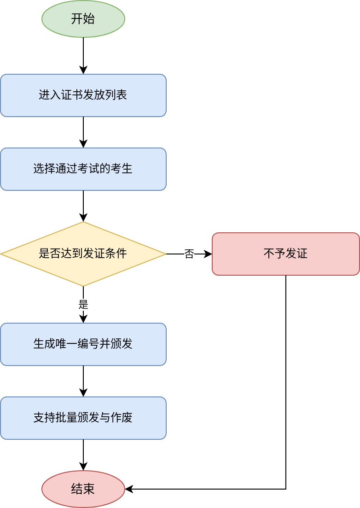

**（五）功能时序图**

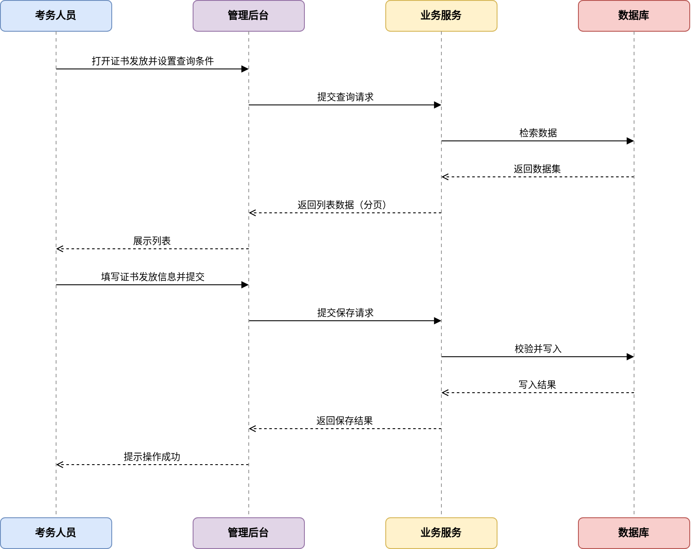

### 3.5.8 外部考生管理

外部考生管理用于维护参加考试的外部单位及其考生信息，并为外部考生生成考试账号。外部单位是外部考生的归属组织，外部考生录入时从已启用的外部单位中选择所属单位。外部考生以手机号作为考试账号登录考生端参加考试，与来源于组织管理·人员管理的内部考生共同构成考试的考生来源。

#### 3.5.8.1 外部单位

**（一）功能需求概述**

外部单位用于维护参加考试的外部组织信息（如合作企业、院校、分厂等），为外部考生录入时提供可选的所属单位范围，是外部考生管理的基础数据来源。

**（二）功能设计**

**查询/筛选功能**

支持以下条件筛选，条件之间为"与"关系，点击搜索按钮触发查询：

| 筛选字段 | 类型 | 说明 |
|---------|------|------|
| 关键字 | 文本输入 | 支持按单位名称或单位编码模糊搜索，两者任一匹配即命中 |
| 状态 | 单选 | 枚举值：启用/停用 |

**列表功能**

| 列名 | 字段类型 | 说明 |
|-----|---------|------|
| 单位名称 | 文本 | - |
| 单位编码 | 文本 | 无值显示"-" |
| 联系人 | 文本 | 无值显示"-" |
| 联系电话 | 文本 | 无值显示"-" |
| 单位地址 | 文本 | 无值显示"-" |
| 状态 | 状态标签 | 启用 / 停用 |
| 创建时间 | 日期时间 | 系统自动记录 |
| 操作 | 操作按钮 | 编辑、启用/停用、删除（无权限时隐藏） |

分页默认每页10条，支持切换每页数量。有删除权限时支持批量勾选，勾选后可进行批量删除。列表为空时显示："暂无外部单位数据"。

**新增功能**

点击"新增"，弹出编辑窗口，填写外部单位信息。

| 字段名称 | 类型 | 长度限制 | 必填 | 默认值 | 说明 |
|---------|------|---------|------|-------|------|
| 单位名称 | 文本输入 | ≤100字 | 是 | - | 系统内唯一 |
| 单位编码 | 文本输入 | ≤30字 | 否 | - | 填写时系统内唯一 |
| 联系人 | 文本输入 | ≤50字 | 否 | - | - |
| 联系电话 | 文本输入 | ≤11位 | 否 | - | 填写时需符合手机号格式 |
| 单位地址 | 文本输入 | ≤200字 | 否 | - | - |
| 备注 | 多行文本 | ≤200字 | 否 | - | - |
| 状态 | 单选 | - | 是 | 启用 | 枚举值：启用/停用 |

提交成功：新增外部单位成功。
提交失败：保留填写内容，显示具体错误原因。

**编辑功能**

点击"编辑"，弹出编辑窗口，自动填入当前记录数据，表单字段同新增。
提交成功：编辑外部单位成功。

**删除功能**

点击"删除"，弹出确认"确定删除该外部单位吗？删除后不可恢复"。
删除成功：删除外部单位成功。
该外部单位已被外部考生引用时，阻止删除，提示"该单位已被外部考生引用，无法删除"。

**批量删除功能**

勾选多条记录后点击"批量删除"，弹出确认"确定删除选中的 {N} 个外部单位吗？删除后不可恢复"。
批量删除成功：提示"已删除 {N} 个外部单位"。
选中记录中任一单位已被外部考生引用时，同样阻止删除，提示"该单位已被外部考生引用，无法删除"。

**启用/停用功能**

点击"启用"，状态变更为"启用"，提示"启用成功"。
点击"停用"，状态变更为"停用"，提示"停用成功"。停用后该单位不再出现在外部考生的所属单位可选范围中。

**导出功能**

点击"导出"，将当前筛选条件下的全量外部单位数据导出为文件。
导出成功：提示"已导出 {N} 个外部单位"。
当前筛选条件下没有数据时，阻止导出，提示"当前筛选条件下没有可导出的数据"。

**批量导入功能**

点击"批量导入"，下载标准模板，按模板填写后上传单个文件，确认导入。模板列：单位名称、单位编码、联系人、联系电话、单位地址、备注。

导入时逐行校验，跳过校验不通过的行并展示明细：
- 部分成功：提示"成功导入 {success} 个，跳过 {failed} 行，详见下方明细"。
- 全部成功：提示"成功导入 {success} 个外部单位"。

**业务规则**

- 单位名称在系统内全局唯一。新增/编辑时若重复，阻止提交，提示"单位【XXX】已存在，请更换名称"。
- 单位编码填写时在系统内唯一。新增/编辑时若重复，阻止提交，提示"单位编码【XXX】已存在，请更换"。
- 联系电话填写时须符合11位手机号格式。
- 外部单位已被外部考生引用（存在归属于该单位的外部考生）时不可删除，单条删除与批量删除均校验此规则，阻止删除，提示"该单位已被外部考生引用，无法删除"。
- 外部单位停用后，外部考生新增/编辑时的所属单位选择范围中不再展示该单位；已关联该单位的历史外部考生数据不受影响。
- 导出按当前筛选条件全量导出，不受分页限制。

**边界与异常**

- **空数据**：列表无数据时，显示"暂无外部单位数据"。
- **权限不足**：新增、编辑、删除、启用/停用按钮对无权限角色完全隐藏（不渲染，非禁用）。
- **导出无数据**：当前筛选条件下没有可导出的数据时，提示"当前筛选条件下没有可导出的数据"。
- **导入空文件**：上传文件内容为空时，阻止导入，提示"文件内容为空，请按模板填写后再导入"。
- **导入多文件**：仅支持上传单个文件，多选时提示"仅支持上传单个文件，请先移除已选择的文件"。

**（三）业务逻辑关联**

- 外部考生（3.5.8.2）新增/编辑时的所属单位字段，来源于本模块中已启用的外部单位。
- 外部单位停用后，外部考生录入时的所属单位可选范围自动排除该单位。
- 外部单位被外部考生引用时，删除需先解除关联（即先转移或清空相关外部考生的所属单位）。

**（四）用户操作流程图**

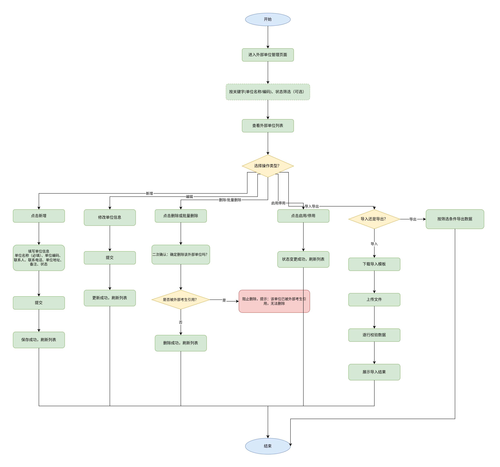

**（五）功能时序图**

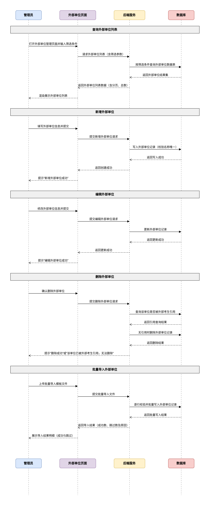

#### 3.5.8.2 外部考生

**（一）功能需求概述**

外部考生用于维护外部单位参加考试的考生信息，并为其生成以手机号为登录账号的考试账号。外部考生使用该账号登录考生端参加考试，与来源于组织管理·人员管理的内部考生共同构成考试的考生来源。

**（二）功能设计**

**查询/筛选功能**

支持以下条件筛选，条件之间为"与"关系，点击搜索按钮触发查询：

| 筛选字段 | 类型 | 说明 |
|---------|------|------|
| 姓名 | 文本输入 | 支持模糊搜索 |
| 所属单位 | 可搜索下拉 | 来源于外部单位中已启用的单位，支持按名称搜索，精确匹配 |
| 手机号 | 文本输入 | 支持模糊搜索 |
| 账号状态 | 单选 | 枚举值：启用/停用 |

**列表功能**

| 列名 | 字段类型 | 说明 |
|-----|---------|------|
| 姓名 | 文本 | - |
| 手机号 | 文本 | 考试账号登录名，系统内唯一 |
| 所属单位 | 文本 | 无值显示"-" |
| 证件号 | 文本 | 无值显示"-" |
| 电子邮箱 | 文本 | 无值显示"-" |
| 账号状态 | 状态标签 | 启用 / 停用 |
| 创建时间 | 日期时间 | 系统自动记录 |
| 操作 | 操作按钮 | 编辑、启用/停用、重置密码、删除（无权限时隐藏） |

分页默认每页10条，支持切换每页数量。支持批量勾选，勾选后可进行批量删除。列表为空时显示："暂无外部考生数据"。

**新增功能**

点击"新增"，弹出编辑窗口，填写外部考生信息。提交后系统以手机号为登录账号生成考试账号。

| 字段名称 | 类型 | 长度限制 | 必填 | 默认值 | 说明 |
|---------|------|---------|------|-------|------|
| 姓名 | 文本输入 | 2-20字 | 是 | - | - |
| 手机号 | 文本输入 | ≤11位 | 是 | - | 考试账号登录名，系统内唯一，需符合手机号格式 |
| 所属单位 | 单选 | - | 是 | - | 来源于外部单位中已启用的单位 |
| 证件号 | 文本输入 | ≤30字 | 是 | - | 用于身份核验的证件号码 |
| 密码 | 文本输入 | 6-20字 | 否 | 留空时取手机号后6位 | 仅新增时可填写，编辑时不展示 |
| 电子邮箱 | 文本输入 | ≤50字 | 否 | - | 需符合邮箱格式 |

提交成功：提示"新增成功，考试账号已生成"。提交失败：保留填写内容，显示具体错误原因。

**编辑功能**

点击"编辑"，弹出编辑窗口，自动填入当前记录数据，表单字段同新增（不含密码字段），手机号可修改，修改后仍须系统内唯一。
提交成功：编辑外部考生成功。

**删除功能**

点击"删除"，弹出确认"确定删除该外部考生吗？删除后其考试账号一并失效"。
删除成功：删除外部考生成功。

**批量删除功能**

勾选多条记录后点击"批量删除"，弹出确认"确定删除选中的 {N} 名外部考生吗？删除后其考试账号一并失效"。
批量删除成功：提示"已删除 {N} 名外部考生"。

**启用/停用功能**

点击"启用"，状态变更为"启用"，提示"启用成功"。
点击"停用"，状态变更为"停用"，提示"停用成功"。账号停用后该考生无法登录考生端。

**重置密码功能**

点击"重置密码"，弹出确认"确定重置【{姓名}】的考试账号密码吗？"。
重置成功：将密码重置为该考生手机号后6位，提示"密码已重置为：{密码}"。

**导出功能**

点击"导出"，将当前筛选条件下的全量外部考生数据导出为文件。
导出成功：提示"已导出 {N} 名外部考生"。
当前筛选条件下没有数据时，阻止导出，提示"当前筛选条件下没有可导出的数据"。

**批量导入功能**

点击"批量导入"，下载标准模板，按模板填写后上传单个文件，确认导入。模板列：姓名、所属单位（填写单位名称，按名称匹配已启用的外部单位）、证件号、联系电话、电子邮箱。导入的每名考生统一以手机号后6位作为初始密码生成考试账号。

导入时逐行校验，跳过校验不通过的行并展示明细：
- 部分成功：提示"成功导入 {success} 名，跳过 {failed} 行，详见下方明细"。
- 全部成功：提示"成功导入 {success} 名外部考生，账号已生成"。

**业务规则**

- 手机号即为登录账号，在系统内全局唯一。新增/编辑/导入时若重复，阻止提交，提示"手机号【XXX】已被注册，请更换"。
- 所属单位须为外部单位中已启用的单位。选择已停用或不存在的单位时，阻止提交，提示"所属单位不存在或已停用，请重新选择"。
- 新增时密码留空，系统默认取手机号后6位作为初始密码。
- 重置密码固定将密码重置为该考生手机号后6位，非随机生成。
- 外部考生账号停用后，该考生无法登录考生端。

**边界与异常**

- **空数据**：列表无数据时，显示"暂无外部考生数据"。
- **权限不足**：新增、编辑、删除、启用/停用、重置密码按钮对无权限角色完全隐藏（不渲染，非禁用）。
- **导出无数据**：当前筛选条件下没有可导出的数据时，提示"当前筛选条件下没有可导出的数据"。
- **导入空文件**：上传文件内容为空时，阻止导入，提示"文件内容为空，请按模板填写后再导入"。
- **导入多文件**：仅支持上传单个文件，多选时提示"仅支持上传单个文件，请先移除已选择的文件"。

**（三）业务逻辑关联**

- 外部考生的所属单位来源于外部单位（3.5.8.1）中已启用的单位。
- 外部考生生成的考试账号（手机号+密码）供其登录考生端参加考试。
- 外部考生与组织管理·人员管理中的内部考生共同构成考试管理中考生分配的可选范围。
- 外部考生的考试成绩与证书同内部考生一样，流向阅卷中心与证书管理。

**（四）用户操作流程图**

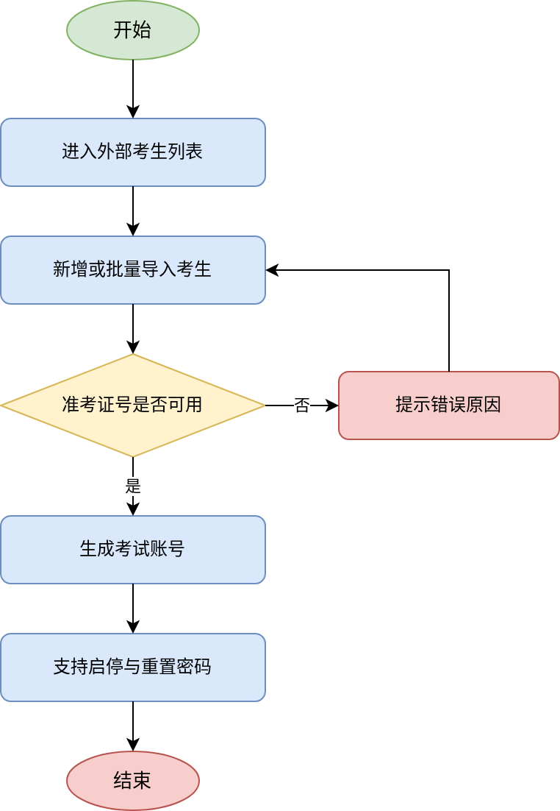

**（五）功能时序图**

### 3.5.9 组织管理

组织管理用于统一维护单位的组织结构（部门层级）、人员账号及归属、岗位序列三类基础数据，为人员的部门归属、角色权限分配、考试考生分配范围等提供基础支撑。下设部门管理、人员管理、岗位管理三个功能。

#### 3.5.9.1 部门管理

**（一）功能需求概述**

部门管理用于按层级维护单位的部门结构，支持新增下级部门、编辑和删除部门，为人员管理中人员的所属部门提供统一的可选范围。

**（二）功能设计**

**查询/筛选功能**

支持以下条件筛选，条件之间为"与"关系：

| 筛选字段 | 类型 | 说明 |
|---------|------|------|
| 部门名称 | 文本输入 | 支持模糊搜索，在已加载的部门数据中过滤 |

**列表功能**

按层级展示部门，支持逐级展开/收起下级部门。

| 列名 | 字段类型 | 说明 |
|-----|---------|------|
| 部门名称 | 文本 | 按层级展示，支持逐级展开/收起下级部门 |
| 类型 | 状态标签 | 枚举值：省公司/分公司/部门 |
| 负责人 | 文本 | 未填写时留空展示 |
| 排序 | 数字 | - |
| 更新时间 | 日期时间 | 系统自动记录 |
| 操作 | 操作按钮 | 新增下级、编辑、删除（无权限时隐藏） |

列表为空时呈现为空列表。

**新增功能**

点击"新增"，弹出编辑窗口，填写部门信息；点击列表中某行的"新增下级"，弹出编辑窗口并自动将该行部门填入上级部门。

| 字段名称 | 类型 | 长度限制 | 必填 | 默认值 | 说明 |
|---------|------|---------|------|-------|------|
| 部门名称 | 文本输入 | - | 是 | - | - |
| 上级部门 | 层级选择 | - | 否 | 顶级 | 来源于本模块中已有的部门，不选表示新增为顶级部门 |
| 部门类型 | 单选 | - | 是 | - | 枚举值：省公司/分公司/部门 |
| 负责人 | 文本输入 | - | 否 | - | - |
| 联系电话 | 文本输入 | - | 否 | - | - |
| 排序 | 数字输入 | - | 否 | 0 | - |

提交成功：新增成功。
提交失败：保留填写内容，显示具体错误原因。
必填校验：部门名称未填写时提示"请输入部门名称"；部门类型未选择时提示"请选择部门类型"。

**编辑功能**

点击"编辑"，弹出编辑窗口，自动填入当前记录数据，表单字段同新增。编辑时上级部门的可选范围自动排除该部门自身及其所有下级部门。
提交成功：更新成功。

**删除功能**

点击"删除"，弹出确认『确定要删除部门"{部门名称}"吗？』。
删除成功：删除成功。
删除失败：删除失败。

**业务规则**

- 编辑部门时，上级部门的可选范围递归排除该部门自身及其所有下级部门，防止形成循环的层级关系。

**边界与异常**

- **空数据**：列表无数据时，呈现为空列表。
- **列表加载失败**：加载部门列表时发生异常，提示"加载部门列表失败"。
- **权限不足**：新增下级、编辑、删除按钮对无权限角色完全隐藏（不渲染，非禁用）。

**（三）业务逻辑关联**

- 部门数据被人员管理引用，作为人员所属部门字段的可选范围。

**（四）用户操作流程图**

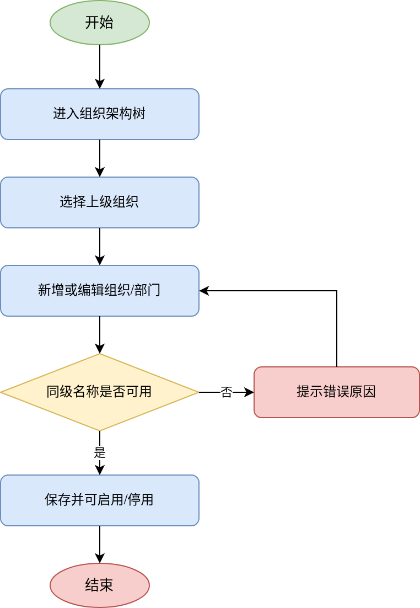

**（五）功能时序图**

#### 3.5.9.2 人员管理

**（一）功能需求概述**

人员管理用于维护单位内部人员的账号、所属部门、岗位与角色归属，是内部考生来源、权限分配和登录鉴权的基础，为登录鉴权、功能授权和考试考生分配范围提供数据支撑。

**（二）功能设计**

**查询/筛选功能**

支持以下条件筛选，条件之间为"与"关系，点击搜索按钮触发查询：

| 筛选字段 | 类型 | 说明 |
|---------|------|------|
| 所属部门 | 层级选择 | 来源于部门管理中已录入的部门，点选某部门按该部门精确过滤，点选"全部"取消筛选 |
| 员工查询 | 文本输入 | 支持按姓名、账号、手机号任一字段模糊搜索 |
| 员工状态 | 单选 | 枚举值：启用/禁用，可清空 |

**列表功能**

| 列名 | 字段类型 | 说明 |
|-----|---------|------|
| 姓名 | 文本 | - |
| 账号 | 文本 | 登录账号，编辑时不可修改 |
| 所属部门 | 文本 | 未选择时显示"-" |
| 岗位 | 文本 | 未选择时显示"-" |
| 角色 | 文本 | 可关联多个角色，逗号分隔展示，未分配时显示"-" |
| 手机号 | 文本 | 脱敏展示 |
| 状态 | 开关 | 启用/禁用，点击即时切换，切换失败自动回滚为切换前状态 |
| 创建时间 | 日期时间 | 系统自动记录 |
| 操作 | 操作按钮 | 编辑、删除（无权限时隐藏） |

支持多选，勾选后可进行批量删除。分页每页10/20/50/100条可切换。列表为空时呈现为空列表。

**新增功能**

点击"新增"，弹出编辑窗口，填写人员信息。

| 字段名称 | 类型 | 长度限制 | 必填 | 默认值 | 说明 |
|---------|------|---------|------|-------|------|
| 姓名 | 文本输入 | ≤20字 | 是 | - | - |
| 账号 | 文本输入 | - | 是 | - | 登录账号 |
| 密码 | 文本输入 | - | 是 | - | 仅新增时填写 |
| 手机号 | 文本输入 | ≤11字 | 否 | - | - |
| 所属部门 | 层级选择 | - | 是 | - | 来源于部门管理中已录入的部门 |
| 岗位 | 单选 | - | 否 | - | 来源于岗位管理中已录入的岗位 |
| 角色 | 多选 | - | 否 | - | 来源于角色管理中已配置的角色，可关联多个角色 |
| 邮箱 | 文本输入 | - | 否 | - | 填写时校验邮箱格式 |

提交成功：新增成功。
提交失败：保留填写内容，显示具体错误原因。
必填校验：姓名未填写时提示"请输入姓名"；账号未填写时提示"请输入账号"；所属部门未选择时提示"请选择部门"；邮箱格式不正确时提示"邮箱格式不正确"。

**编辑功能**

点击"编辑"，弹出编辑窗口，自动填入当前记录数据，表单字段同新增，不含密码字段，账号不可修改。
提交成功：更新成功。

**删除功能**

点击"删除"，弹出确认『确定要删除用户"{姓名或账号}"吗？』。
删除成功：删除成功。

**批量删除功能**

勾选多行后点击"批量删除"，弹出确认『确定要删除选中的 {N} 个用户吗？』。
删除成功：批量删除成功。
未勾选任何行时，批量删除按钮为禁用状态。

**状态切换功能**

点击状态开关，即时切换该人员的启用/禁用状态。
切换成功：状态更新成功。
切换失败：开关自动回滚为切换前状态。

**业务规则**

- 系统内置一个超级管理员账号，删除或批量删除时若选中包含该账号，整体拒绝操作，提示"超级管理员不允许删除"。
- 人员被禁用后不可登录，登录时提示"用户已被禁用"。
- 角色为多选，一个人员可同时关联多个角色。
- 账号在编辑时不可修改。
- 邮箱仅在填写时校验格式，格式不正确时提示"邮箱格式不正确"。

**边界与异常**

- **空数据**：列表无数据时，呈现为空列表。
- **未勾选批量操作**：未勾选任何行时，批量删除按钮禁用。
- **状态切换失败**：切换失败时自动回滚为切换前状态。
- **权限不足**：新增、编辑、删除、批量删除、状态切换按钮对无权限角色完全隐藏（不渲染，非禁用）。

**（三）业务逻辑关联**

- 所属部门数据来源于部门管理中已录入的部门。
- 岗位数据来源于岗位管理中已录入的岗位。
- 角色数据来源于权限管理·角色管理中已配置的角色，人员的角色决定其可访问的功能范围，与权限矩阵联动。
- 人员中的内部考生与外部考生管理中的外部考生，共同构成考试管理中考生分配的可选范围。

**（四）用户操作流程图**

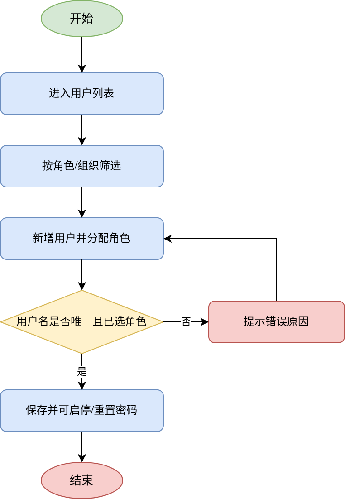

**（五）功能时序图**

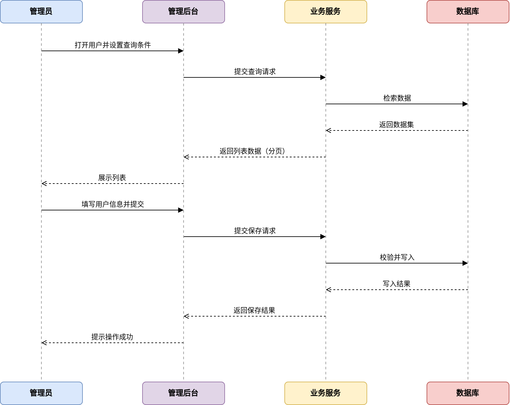

#### 3.5.9.3 岗位管理

**（一）功能需求概述**

岗位管理用于维护单位的岗位序列，为人员管理中人员的岗位字段提供统一的可选范围。

**（二）功能设计**

**查询/筛选功能**

支持以下条件筛选，条件之间为"与"关系，点击搜索按钮触发查询：

| 筛选字段 | 类型 | 说明 |
|---------|------|------|
| 岗位名称 | 文本输入 | 支持模糊搜索 |

**列表功能**

| 列名 | 字段类型 | 说明 |
|-----|---------|------|
| 岗位名称 | 文本 | - |
| 岗位描述 | 文本 | 内容超长时省略展示，悬停显示完整内容 |
| 排序 | 数字 | - |
| 创建时间 | 日期时间 | - |
| 操作 | 操作按钮 | 编辑、删除（无权限时隐藏） |

列表为空时呈现为空列表。

**新增功能**

点击"新增"，弹出编辑窗口，填写岗位信息。

| 字段名称 | 类型 | 长度限制 | 必填 | 默认值 | 说明 |
|---------|------|---------|------|-------|------|
| 岗位名称 | 文本输入 | ≤50字 | 是 | - | 系统内唯一 |
| 岗位描述 | 多行文本 | ≤200字 | 否 | - | - |
| 排序 | 数字输入 | 0~9999 | 否 | 0 | - |

提交成功：新增成功。
提交失败：保留填写内容，显示具体错误原因。
必填校验：岗位名称未填写时提示"请输入岗位名称"。

**编辑功能**

点击"编辑"，弹出编辑窗口，自动填入当前记录数据，表单字段同新增。
提交成功：更新成功。

**删除功能**

点击"删除"，弹出确认『确定要删除岗位"{岗位名称}"吗？』。
删除成功：删除成功。
删除失败：删除失败。

**业务规则**

- 岗位名称在系统内唯一，新增/编辑时若重复，阻止提交。

**边界与异常**

- **空数据**：列表无数据时，呈现为空列表。
- **列表加载失败**：加载岗位列表时发生异常，提示"加载岗位列表失败"。
- **权限不足**：新增、编辑、删除按钮对无权限角色完全隐藏（不渲染，非禁用）。

**（三）业务逻辑关联**

- 岗位数据被人员管理引用，作为人员岗位字段的可选范围。

**（四）用户操作流程图**

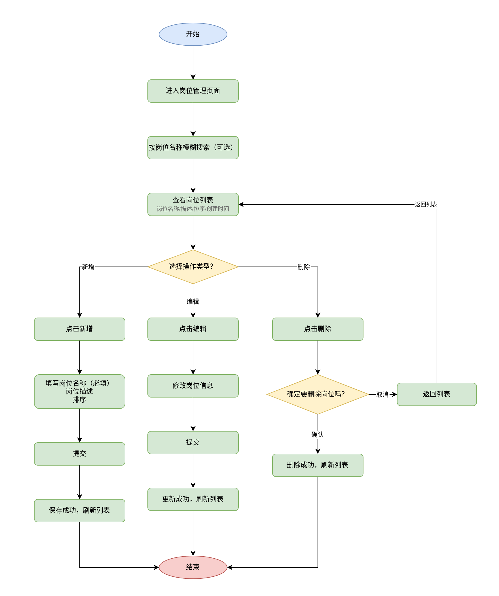

**（五）功能时序图**

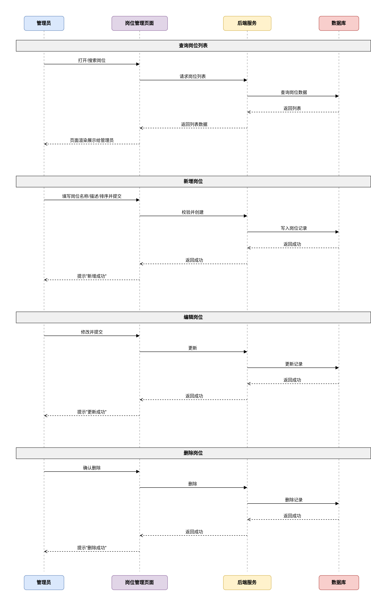

### 3.5.10 考点管理

**（一）功能需求概述**

考点管理功能用于维护平台的考点基础信息，支持按考点名称、状态查询，为考试管理中的考点安排提供基础数据。

**（二）功能设计**

**查询/筛选功能**

支持以下条件筛选，条件之间为"与"关系，点击搜索按钮触发查询：

| 筛选字段 | 类型 | 说明 |
|---------|------|------|
| 考点名称 | 文本输入 | 支持模糊搜索 |
| 状态 | 单选 | 枚举值：启用/停用 |

**列表功能**

| 列名 | 字段类型 | 说明 |
|-----|---------|------|
| 考点名称 | 文本 | - |
| 考点地址 | 文本 | 无值显示"-" |
| 容纳人数 | 数字 | 无值显示"-" |
| 状态 | 状态标签 | 启用 / 停用 |
| 操作 | 操作按钮 | 编辑、启用/停用、删除（无权限时隐藏） |

分页默认每页10条，支持切换每页数量。支持批量勾选，勾选后可进行批量删除。列表为空时显示："暂无考点数据"。

**新增功能**

点击"新增"，弹出编辑窗口，填写考点信息。

| 字段名称 | 类型 | 长度限制 | 必填 | 默认值 | 说明 |
|---------|------|---------|------|-------|------|
| 考点名称 | 文本输入 | ≤50字 | 是 | - | - |
| 考点地址 | 多行文本 | ≤200字 | 是 | - | - |
| 容纳人数 | 数字输入 | - | 否 | - | 正整数，最小为1 |
| 联系人 | 文本输入 | ≤50字 | 否 | - | - |
| 联系电话 | 文本输入 | ≤11位 | 否 | - | 填写时需符合手机号格式 |
| 状态 | 单选 | - | 是 | 启用 | 枚举值：启用/停用 |

提交成功：新增考点成功。提交失败：保留填写内容，显示具体错误原因。

**编辑功能**

点击"编辑"，弹出编辑窗口，自动填入当前记录数据，表单字段同新增。
提交成功：编辑考点成功。

**删除功能**

点击"删除"，弹出确认"确定要删除该考点吗？删除后不可恢复"。
删除成功：删除考点成功。
考点被考试引用时阻止删除，提示"该考点已被考试引用，无法删除"。

**批量删除功能**

勾选多条记录后点击"批量删除"，弹出确认"确定要删除选中的 {N} 个考点吗？删除后不可恢复"。
批量删除成功：提示"已删除 {N} 个考点"。
选中记录中任一考点已被考试引用时，同样阻止删除，提示"该考点已被考试引用，无法删除"。

**启用/停用功能**

点击"启用"，状态变更为"启用"，提示"启用成功"。
点击"停用"，状态变更为"停用"，提示"停用成功"。停用后该考点不再出现在考试安排的可选范围中。

**业务规则**

- 联系电话填写时须符合11位手机号格式。
- 考点被考试管理引用时不可删除，单条删除与批量删除均校验此规则，阻止删除，提示"该考点已被考试引用，无法删除"。

**边界与异常**

- **空数据**：考点列表无数据时，显示"暂无考点数据"。
- **权限不足**：新增、编辑、删除、启用/停用按钮对无权限角色完全隐藏（不渲染，非禁用）。

**（三）业务逻辑关联**

- 考点数据被考试管理引用，用于考试的考点安排。

**（四）用户操作流程图**

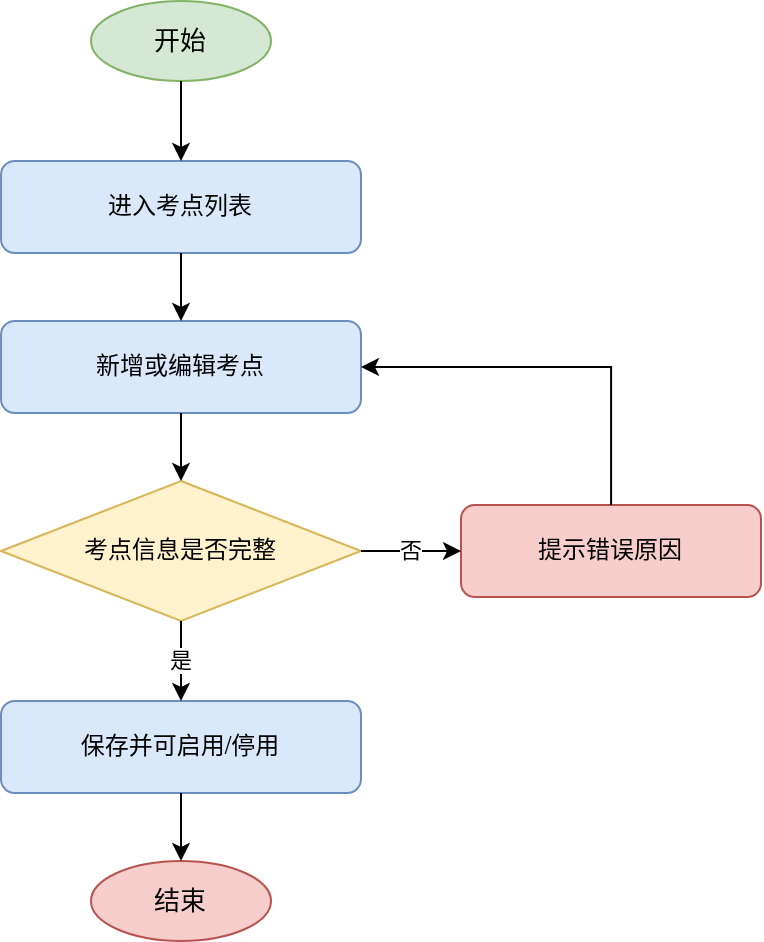

**（五）功能时序图**

### 3.5.11 权限管理

权限管理用于统一维护平台的角色与菜单权限。角色管理定义角色并为其分配可访问的菜单与操作权限，菜单管理维护系统的菜单与权限点数据，二者共同支撑基于角色的功能访问控制（RBAC）。

#### 3.5.11.1 角色管理

**（一）功能需求概述**

角色管理用于维护平台的角色及其名称、标识、备注等基本信息，并为每个角色分配可访问的菜单与操作权限，是人员管理中角色归属和全平台功能访问控制的基础。

**（二）功能设计**

**查询/筛选功能**

支持以下条件筛选，条件之间为"与"关系，点击搜索按钮触发查询：

| 筛选字段 | 类型 | 说明 |
|---------|------|------|
| 角色名称/标识关键字 | 文本输入 | 支持模糊搜索，同时匹配角色名称或角色标识，命中任一项即返回结果 |
| 角色状态 | 单选 | 枚举值：启用/禁用，可清空 |

**列表功能**

| 列名 | 字段类型 | 说明 |
|-----|---------|------|
| ID | 数字 | 系统自动生成 |
| 名称 | 文本 | - |
| 标识 | 文本 | 新增/编辑时填写，无值显示空白 |
| 备注 | 文本 | 新增/编辑时填写，无值显示空白，超长内容省略展示，悬停查看完整内容 |
| 创建时间 | 日期时间 | 系统自动记录 |
| 操作 | 操作按钮 | 编辑、分配权限、删除（无权限时隐藏） |

分页默认每页10条，支持切换每页数量。列表为空时呈现为空列表。

**新增功能**

点击"新增角色"，弹出编辑窗口，填写角色信息。

| 字段名称 | 类型 | 长度限制 | 必填 | 默认值 | 说明 |
|---------|------|---------|------|-------|------|
| 角色标识 | 文本输入 | - | 否 | - | 系统内唯一 |
| 角色名称 | 文本输入 | - | 是 | - | - |
| 备注 | 多行文本 | - | 否 | - | - |
| 状态 | 单选 | - | 是 | 启用 | 枚举值：启用/禁用 |

提交成功："新增成功"。
提交失败：保留填写内容，提示"操作失败"。

**编辑功能**

点击"编辑"，弹出编辑窗口，自动填入当前角色数据，表单字段同新增。
提交成功："更新成功"。
提交失败：保留填写内容，提示"操作失败"。

**删除功能**

点击"删除"，弹出确认"确定要删除该角色吗？"。
删除成功："删除成功"。
删除失败：显示接口返回的具体错误原因，无具体原因时显示"删除失败"。
取消删除不提示。

**分配权限功能**

点击"分配权限"，弹出编辑窗口，以菜单树形式展示菜单管理中的全部菜单节点（目录、菜单、按钮三类节点同层级展示，含已设为隐藏的菜单），逐项带勾选框；打开时自动填入该角色当前已分配的菜单（自动勾选对应节点）。支持整体全选/取消全选（含部分选中状态），支持整体展开/折叠全部节点。

提交时，系统将已勾选节点与因其子节点被勾选而处于部分选中状态的上级节点一并保存，即勾选某个子节点时会自动为其上级目录一同建立访问权限。树中"按钮"类型节点的勾选即代表该角色获得对应的操作权限。

保存成功："分配权限成功"。
保存失败："分配权限失败"。
打开分配权限时获取菜单或已分配数据失败："获取权限数据失败"。

**业务规则**

- 角色标识为选填项，在系统内全局唯一。新增/编辑时若重复，阻止提交，按系统统一的重复数据处理机制提示"数据已存在（唯一约束冲突）"。
- 分配权限保存成功后，该角色下所有用户的可访问功能范围随之更新。
- 分配权限的菜单树包含已设为隐藏的菜单节点，隐藏菜单同样可被勾选纳入角色权限范围。

**边界与异常**

- **空数据**：列表无数据时，呈现为空列表。
- **权限不足**：编辑、分配权限、删除按钮对无权限角色完全隐藏（不渲染，非禁用）。
- **取消删除**：取消操作不提示。

**（三）业务逻辑关联**

- 角色被人员管理中的用户角色字段引用；人员管理选择角色时不按角色状态过滤，即使角色已被禁用，仍可在人员管理中被选用。
- 分配权限页面展示的菜单数据来源于菜单管理中的全部菜单节点（含隐藏菜单）。
- 角色的权限配置结果决定该角色下用户可访问的功能范围。

**（四）用户操作流程图**

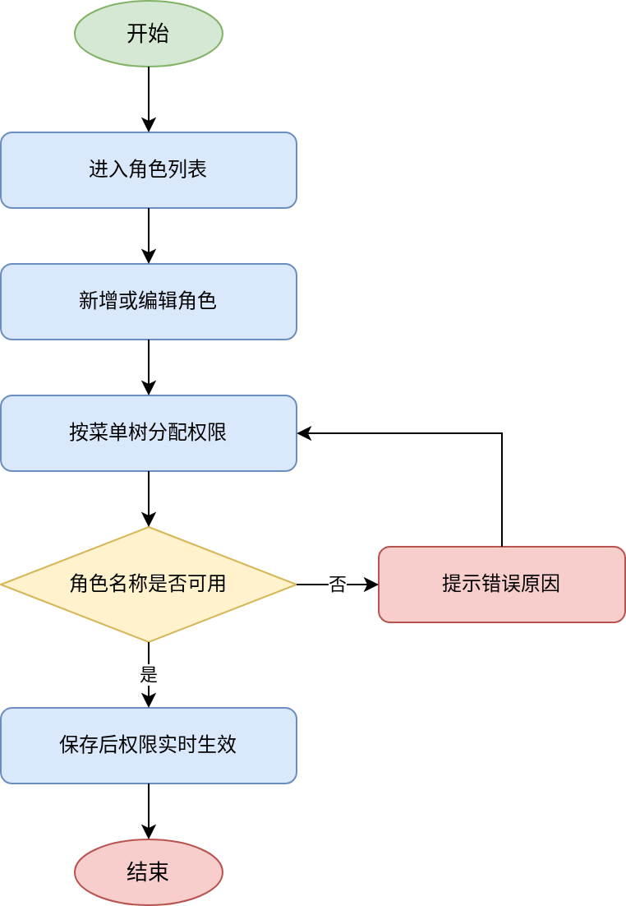

**（五）功能时序图**

#### 3.5.11.2 菜单管理

**（一）功能需求概述**

菜单管理用于维护系统的菜单结构与操作权限点，菜单节点分为目录、菜单、按钮三种类型，按层级组织；为角色管理的分配权限提供全部可勾选的菜单与权限点来源，同时控制系统导航菜单的显示范围。

**（二）功能设计**

**查询/筛选功能**

支持以下条件筛选，条件之间为"与"关系，在已加载的菜单数据中过滤：

| 筛选字段 | 类型 | 说明 |
|---------|------|------|
| 菜单名称 | 文本输入 | 支持模糊搜索，在已加载的菜单数据中过滤；命中的节点保留其下级节点 |
| 菜单类型 | 单选 | 枚举值：目录/菜单/按钮，在已加载的菜单数据中过滤 |

**列表功能**

| 列名 | 字段类型 | 说明 |
|-----|---------|------|
| 菜单名称 | 文本 | 按层级缩进展示，支持逐级展开与收起 |
| 类型 | 状态标签 | 目录/菜单/按钮 |
| 图标 | 文本 | 新增/编辑时填写，无值显示空白 |
| 权限标识 | 文本 | 如"sys:menu:list"，新增/编辑时填写，无值显示空白 |
| 排序 | 数字 | 新增/编辑时填写 |
| 更新时间 | 日期时间 | 系统自动记录 |
| 显示 | 开关 | 显示/隐藏，切换后立即生效 |
| 操作 | 操作按钮 | 新增、编辑、删除（无权限时隐藏） |

列表上方提供整体展开、折叠按钮，用于批量展开或收起全部菜单节点。列表为空时呈现为空列表。

**新增功能**

点击列表上方的"新增"，弹出编辑窗口，创建顶级菜单节点；点击某菜单节点对应的"新增"，弹出编辑窗口创建其下级节点，上级菜单字段自动填入该节点。

| 字段名称 | 类型 | 长度限制 | 必填 | 默认值 | 说明 |
|---------|------|---------|------|-------|------|
| 菜单类型 | 单选 | - | 是 | 菜单 | 枚举值：目录/菜单/按钮 |
| 菜单名称 | 文本输入 | - | 是 | - | - |
| 上级菜单 | 层级选择 | - | 否 | - | 来源于本模块中已有的目录与菜单节点，不含按钮节点；不选则为顶级节点 |
| 路由路径 | 文本输入 | - | 否 | - | 菜单类型为目录或菜单时展示 |
| 组件路径 | 文本输入 | - | 否 | - | 菜单类型为菜单时展示 |
| 菜单图标 | 文本输入 | - | 否 | - | 菜单类型为目录或菜单时展示 |
| 权限标识 | 文本输入 | - | 否 | - | 始终展示，如"sys:menu:list" |
| 排序 | 数字输入 | 0-9999 | 否 | 0 | 数值越小越靠前 |
| 是否显示 | 单选 | - | 是 | 显示 | 枚举值：显示/隐藏 |
| 缓存 | 单选 | - | 否 | 是 | 菜单类型为菜单时展示，枚举值：是/否 |

提交成功："新增成功"。
提交失败：保留填写内容，提示"操作失败"。

**编辑功能**

点击"编辑"，弹出编辑窗口，自动填入当前节点数据，表单字段同新增。
提交成功："更新成功"。
提交失败：保留填写内容，提示"操作失败"。

**删除功能**

点击"删除"，弹出确认"确定要删除该菜单吗？"。
删除成功："删除成功"。
删除失败：显示接口返回的具体错误原因，无具体原因时显示"删除失败"。
取消删除不提示。

**显示切换功能**

在列表中直接切换"显示"开关，即时生效，无需二次确认。
切换成功："状态更新成功"。
切换失败："状态更新失败"，开关状态自动回退为切换前的值。

**业务规则**

- 按钮类型节点只能挂在目录或菜单节点下。新增/编辑时上级菜单的可选范围排除按钮类型节点。
- 按钮类型节点承载具体操作的权限点，会与目录、菜单节点一同出现在角色管理·分配权限的菜单树中，供角色勾选。
- 按钮类型节点存在两种来源：管理员手动新增，或系统启动时按各功能模块声明的操作权限自动登记补全；列表中两种来源的节点不做区分标记。
- 菜单显示状态设为"隐藏"后，该菜单不在系统导航中展示，但仍完整出现在角色管理·分配权限的菜单树中，可被勾选纳入角色权限。

**边界与异常**

- **空数据**：列表无数据时，呈现为空列表。
- **权限不足**：新增、编辑、删除按钮对无权限角色完全隐藏（不渲染，非禁用）。
- **取消删除**：取消操作不提示。
- **显示切换失败**：开关状态自动回退为切换前的值，并提示"状态更新失败"。

**（三）业务逻辑关联**

- 菜单管理维护的全部菜单节点（含隐藏菜单）供角色管理·分配权限使用，作为角色可勾选的权限范围来源。
- 部分按钮类型节点由系统按各功能模块声明的操作权限自动登记补全，无需逐条手动录入。
- 上级菜单的选择范围来源于本模块中已有的目录与菜单节点，不含按钮节点。

**（四）用户操作流程图**

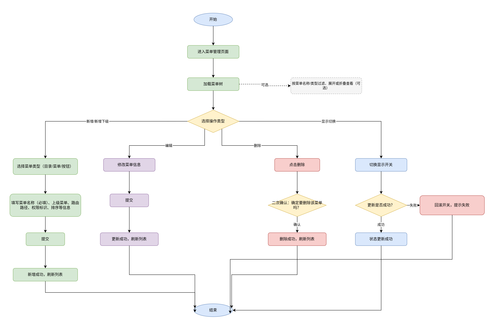

**（五）功能时序图**

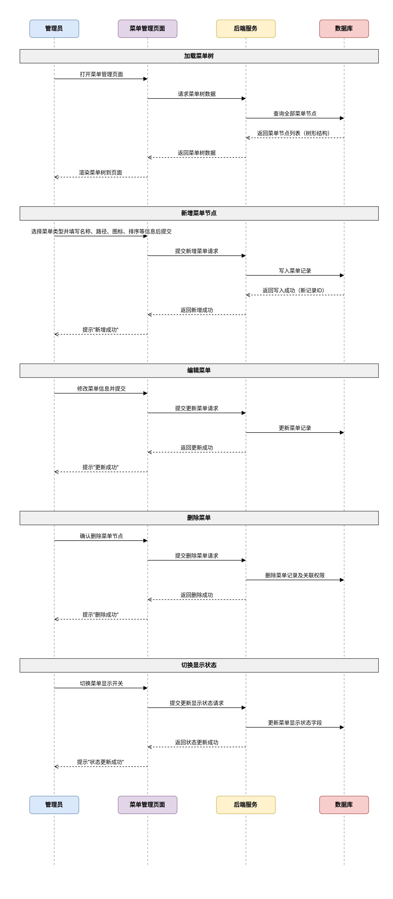

### 3.5.12 系统管理

系统管理用于维护平台运行所需的基础配置，包括系统参数、AI模型配置、数据字典和操作日志，为出题、组卷、阅卷、学情分析、答疑等业务功能提供统一的配置支撑。系统管理仅系统管理员可访问，其他角色菜单入口隐藏。

#### 3.5.12.1 参数配置

**（一）功能需求概述**

参数配置用于维护平台运行相关的可配置系统参数，管理员通过调整参数值控制交卷提醒、密码强度、日志保留期限等系统行为，无需改动系统即可适应业务变化。

**（二）功能设计**

**列表功能**

| 列名 | 字段类型 | 说明 |
|-----|---------|------|
| 参数名称 | 文本 | 如：考试自动交卷提前提醒时间(分钟)、登录密码最小长度、操作日志保留期限(天) |
| 参数值 | 文本 | 当前生效的参数取值 |
| 参数说明 | 文本 | 说明该参数的用途及取值范围 |
| 操作 | 操作按钮 | 编辑（无权限时隐藏） |

分页默认每页10条，支持切换每页数量。列表为空时显示："暂无参数配置数据"。

**编辑功能**

点击"编辑"，弹出编辑窗口，填写新的参数值，表单字段为参数值单项。
提交成功：显示"参数配置已更新"。
提交失败：保留填写内容，显示具体错误原因。

**业务规则**

- 参数值须符合该参数预设的数据类型与取值范围。提交时若超出允许范围，阻止提交，提示"参数值超出允许范围"。

**边界与异常**

- **空数据**：参数列表无数据时，显示"暂无参数配置数据"。
- **权限不足**：编辑按钮对无权限角色完全隐藏（不渲染，非禁用）；系统管理菜单对非系统管理员角色隐藏。

**（三）业务逻辑关联**

- 操作日志保留期限(天)参数被系统管理·操作日志引用，用于控制日志的自动清理时长。
- 考试自动交卷提前提醒时间(分钟)参数被移动端在线答题引用，用于控制交卷提醒的触发时机。

**（四）用户操作流程图**

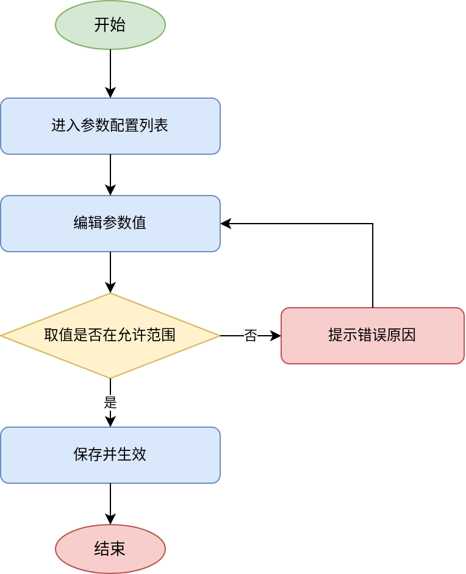

**（五）功能时序图**

#### 3.5.12.2 AI模型配置

**（一）功能需求概述**

AI模型配置用于维护平台对接的AI模型服务，管理员可新增、编辑、删除模型配置，并指定当前启用的模型。出题、组卷、阅卷、学情分析、答疑等AI功能统一使用当前启用的模型配置，实现模型服务的统一管理和便捷切换。

**（二）功能设计**

**列表功能**

| 列名 | 字段类型 | 说明 |
|-----|---------|------|
| 配置名称 | 文本 | - |
| 模型服务商 | 文本 | 枚举值：OpenAI / Anthropic |
| 模型名称 | 文本 | - |
| 启用状态 | 状态标签 | 启用 / 停用，全局仅一项处于启用状态 |
| 连接状态 | 状态标签 | 正常 / 异常 / 未测试，由连接测试结果更新，新建配置默认"未测试" |
| 操作 | 操作按钮 | 编辑、删除、启用/停用、连接测试（无权限时隐藏） |

分页默认每页10条，支持切换每页数量。列表为空时显示："暂无AI模型配置数据"。

**新增功能**

点击"新增"，弹出编辑窗口，填写模型配置信息。

| 字段名称 | 类型 | 长度限制 | 必填 | 默认值 | 说明 |
|---------|------|---------|------|-------|------|
| 配置名称 | 文本输入 | ≤50字 | 是 | - | 全局唯一 |
| 模型服务商 | 单选 | - | 是 | - | 枚举值：OpenAI / Anthropic，切换服务商时自动预填该服务商的默认接口地址 |
| 接口地址 | 文本输入 | ≤200字 | 是 | - | 需符合网址格式，切换模型服务商后自动预填对应默认值，可修改 |
| 密钥 | 密码输入 | ≤200字 | 是 | - | 加密保存，保存后脱敏展示，仅显示部分字符 |
| 模型名称 | 文本输入 | ≤100字 | 是 | - | 如：gpt-4o、claude-sonnet-4-20250514 |

提交成功：显示"AI模型配置新增成功"。
提交失败：保留填写内容，显示具体错误原因。

**编辑功能**

点击"编辑"，弹出编辑窗口，自动填入当前记录数据，密钥字段展示脱敏值且留空表示不修改密钥，表单字段同新增。
提交成功：显示"AI模型配置编辑成功"。

**删除功能**

点击"删除"，弹出确认"确定要删除该配置吗？删除后不可恢复"。
删除成功：显示"AI模型配置删除成功"。
该配置为当前启用模型时，阻止删除，提示"该配置为当前启用模型，无法删除"。

**切换启用功能**

点击"启用"，将该配置设为当前启用模型，原启用配置自动变更为停用状态。
切换成功：显示"已切换为当前启用模型"。

**连接测试功能**

点击"连接测试"，系统使用当前配置信息尝试连接对应模型服务，并将结果更新至连接状态列。
连接测试成功：连接状态更新为"正常"。
连接测试失败：连接状态更新为"异常"，提示"连接测试失败，请检查配置"。

**业务规则**

- 同一时刻仅允许一个AI模型配置处于启用状态。切换启用某配置时，原启用配置自动变更为停用状态。
- 密钥加密保存，界面展示时脱敏，仅显示部分字符，不展示完整密钥；编辑时密钥留空表示不修改原密钥。
- 新建配置在完成首次连接测试前，连接状态显示为"未测试"。
- 连接测试失败时，提示"连接测试失败，请检查配置"，连接状态标记为"异常"。
- 删除当前启用的配置时，阻止删除，提示"该配置为当前启用模型，无法删除"，须先切换启用其他配置。

**边界与异常**

- **空数据**：列表无数据时，显示"暂无AI模型配置数据"。
- **权限不足**：新增、编辑、删除、启用/停用、连接测试按钮对无权限角色完全隐藏（不渲染，非禁用）；系统管理菜单对非系统管理员角色隐藏。

**（三）业务逻辑关联**

- 当前启用的AI模型配置被移动端练习答疑引用，切换启用配置后练习答疑立即使用新配置。

**（四）用户操作流程图**

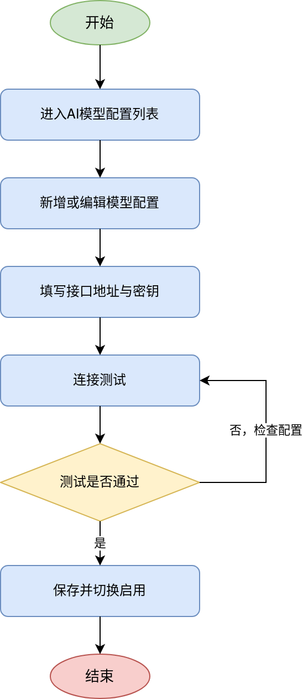

**（五）功能时序图**

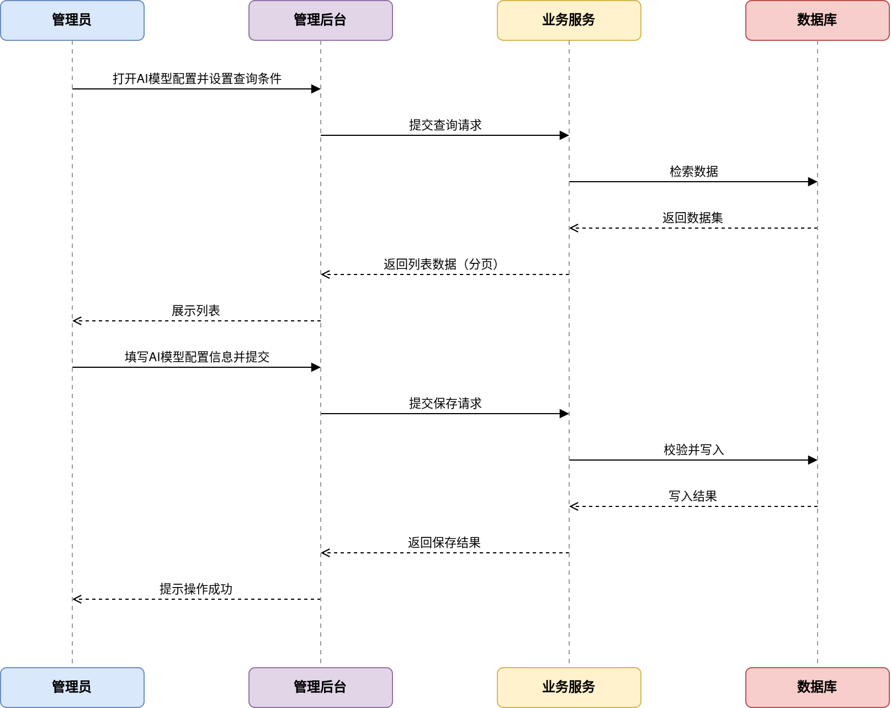

#### 3.5.12.3 数据字典

**（一）功能需求概述**

数据字典用于统一维护平台使用的系统枚举值，如题型、难度、事件类型等，管理员可按字典类型维护对应的字典项，为各业务模块提供一致的枚举值来源，避免枚举值分散维护、口径不一致。

**（二）功能设计**

**列表功能**

| 列名 | 字段类型 | 说明 |
|-----|---------|------|
| 字典类型 | 文本 | 如：题型、难度、事件类型等 |
| 字典项数量 | 数字 | 该字典类型下已配置的字典项数量，系统自动统计 |
| 操作 | 操作按钮 | 查看字典项（无权限时隐藏） |

分页默认每页10条，支持切换每页数量。列表为空时显示："暂无数据字典数据"。

**字典项管理**

点击"查看字典项"，进入该字典类型下的字典项列表。

| 列名 | 字段类型 | 说明 |
|-----|---------|------|
| 字典项名称 | 文本 | - |
| 字典项值 | 文本 | 供业务模块引用的枚举取值 |
| 排序 | 数字 | 控制字典项在业务模块中的展示顺序 |
| 状态 | 状态标签 | 启用 / 停用 |
| 操作 | 操作按钮 | 编辑、删除（无权限时隐藏） |

分页默认每页10条，支持切换每页数量。列表为空时显示："暂无字典项数据"。

**新增字典项功能**

点击"新增"，弹出编辑窗口，填写字典项信息。

| 字段名称 | 类型 | 长度限制 | 必填 | 默认值 | 说明 |
|---------|------|---------|------|-------|------|
| 字典项名称 | 文本输入 | ≤50字 | 是 | - | 同一字典类型下唯一 |
| 字典项值 | 文本输入 | ≤50字 | 是 | - | 同一字典类型下唯一 |
| 排序 | 数字输入 | - | 否 | 0 | 数值越小越靠前 |
| 状态 | 单选 | - | 是 | 启用 | 启用 / 停用 |

提交成功：显示"字典项新增成功"。
提交失败：保留填写内容，显示具体错误原因。

**编辑字典项功能**

点击"编辑"，弹出编辑窗口，自动填入当前记录数据，表单字段同新增。
提交成功：显示"字典项编辑成功"。

**删除字典项功能**

点击"删除"，弹出确认"确定要删除该字典项吗？删除后不可恢复"。
删除成功：显示"字典项删除成功"。
该字典项已被业务引用时，阻止删除，提示"该字典项已被引用，无法删除"。

**业务规则**

- 字典项名称、字典项值在同一字典类型下须唯一。新增/编辑时若重复，阻止提交，提示"该字典项已存在，请更换名称或值"。
- 字典项被业务模块引用时删除需先解除关联，阻止删除，提示"该字典项已被引用，无法删除"。
- 字典项状态变更为"停用"后，业务模块新建数据时不再展示该选项，历史已使用数据不受影响。

**边界与异常**

- **空数据**：字典类型列表无数据时，显示"暂无数据字典数据"；字典项列表无数据时，显示"暂无字典项数据"。
- **权限不足**：新增、编辑、删除按钮对无权限角色完全隐藏（不渲染，非禁用）；系统管理菜单对非系统管理员角色隐藏。

**（三）业务逻辑关联**

- 数据字典为题库管理、试卷管理、考试管理等各业务模块提供枚举值来源，如题型、难度、事件类型等选项均来源于本模块已启用的字典项。

**（四）用户操作流程图**

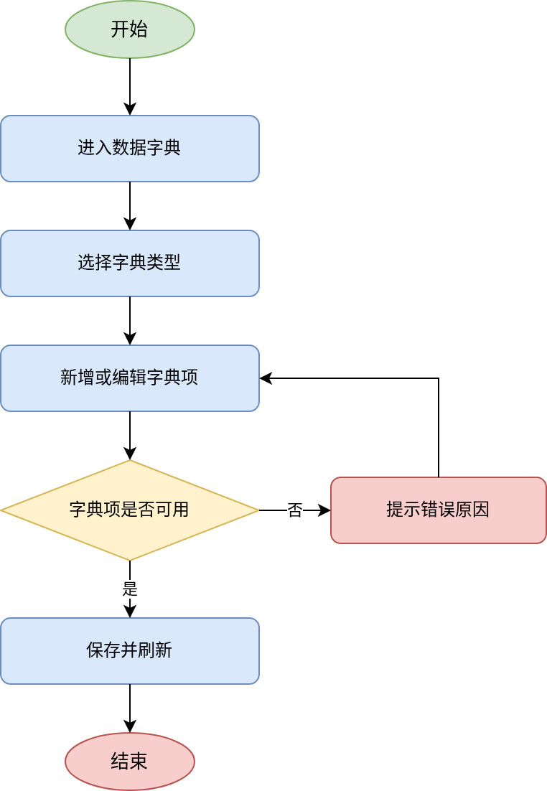

**（五）功能时序图**

#### 3.5.12.4 操作日志

**（一）功能需求概述**

操作日志记录全平台用户的关键操作行为，管理员可按操作人、操作类型、操作时间查询和追溯，为平台安全合规审计提供数据支撑。

**（二）功能设计**

**查询/筛选功能**

支持以下条件筛选，条件之间为"与"关系，点击搜索按钮触发查询：

| 筛选字段 | 类型 | 说明 |
|---------|------|------|
| 操作人 | 文本输入 | 支持模糊搜索 |
| 操作类型 | 单选 | 枚举值：新增 / 编辑 / 删除 / 登录 / 其他 |
| 操作时间 | 日期范围 | 选择开始和结束日期 |

**列表功能**

| 列名 | 字段类型 | 说明 |
|-----|---------|------|
| 操作人 | 文本 | 操作用户姓名 |
| 操作类型 | 文本 | 新增 / 编辑 / 删除 / 登录 / 其他 |
| 操作对象 | 文本 | 被操作的数据名称或对象 |
| 操作内容 | 文本 | 操作的具体描述 |
| 操作时间 | 日期时间 | 格式：YYYY-MM-DD HH:mm:ss |
| 来源地址 | 文本 | 操作发起的网络地址 |

分页默认每页10条，支持切换每页数量。列表为空时显示："暂无操作日志数据"。

操作日志仅支持查看，不提供编辑或删除入口。

**业务规则**

- 操作日志按系统配置的保留期限自动留存，超过保留期限的日志由系统自动清理。
- 操作日志由系统自动记录，不支持人工修改或删除，保障日志数据的完整性和可追溯性。

**边界与异常**

- **空数据**：列表无数据时，显示"暂无操作日志数据"。
- **权限不足**：操作日志菜单对无权限角色完全隐藏（不渲染，非禁用）；系统管理菜单对非系统管理员角色隐藏。

**（三）业务逻辑关联**

- 操作日志记录全平台各业务模块的关键操作行为，为系统管理员提供统一的审计追溯入口。

**（四）用户操作流程图**

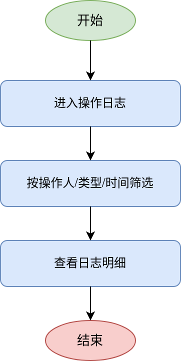

**（五）功能时序图**

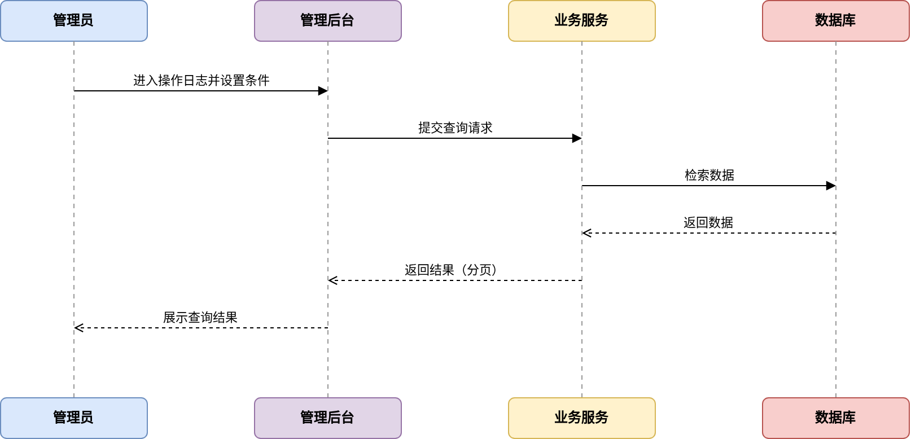

### 3.5.13 移动端

移动端供考生随时随地参加考试与在线练习，查看与考试相关的通知，并管理个人基本信息、成绩与证书。移动端以底部导航 Tab 为顶层结构，包含三个 Tab：任务、首页、我的。练习作答、消息列表、成绩明细、证书明细均由 Tab 内的入口进入。

#### 3.5.13.1 任务

**（一）功能需求概述**

任务用于集中展示考生可参加与已完成的考试，考生从这里进入考试详情、完成作答并查看本场结果，是考生参加考试的主入口。

**（二）功能设计**

**考试列表**

按待考、已完成两类分区展示考试。

| 列名 | 字段类型 | 说明 |
|-----|---------|------|
| 考试名称 | 文本 | - |
| 考试时间 | 日期时间 | 展示开始与结束时间 |
| 考试时长 | 数字 | 单位：分钟 |
| 状态 | 状态标签 | 未开始 / 进行中 / 已结束 |
| 距开考 | 文本 | 未开始的考试展示剩余天数 |

列表为空时显示：暂无考试。

**考试详情**

展示考试基本信息与考前须知，确认后进入作答。

| 字段名称 | 类型 | 说明 |
|---------|------|------|
| 考试名称 | 文本 | - |
| 考试时间 | 日期时间 | 展示开始与结束时间 |
| 考试时长 | 数字 | 单位：分钟 |
| 总分 | 数字 | - |
| 及格分 | 数字 | - |
| 题目数 | 数字 | - |
| 考前须知 | 文本 | 展示本场考试的作答要求与策略说明 |

未到允许进入时间时不可进入，提示"考试尚未开始"。

**在线答题**

考生逐题作答，作答期间按考试策略展示剩余时间倒计时，答案自动保存。
开启防切屏检测时，检测到切屏行为即记录告警并提示"检测到切屏行为（第 N 次，超过 M 次将强制交卷）"；超出允许次数时提示"切屏次数已超出限制，正在强制交卷"并强制交卷。
开启题目乱序时，每位考生的题目顺序与选项顺序各不相同。
开启操作限制时，作答期间禁止复制粘贴。

**交卷**

作答完成后点击交卷，弹出确认"确定交卷吗？交卷后不可修改"，确认后完成交卷，交卷后不可再修改答案。
考试时间结束时自动交卷，未作答题目按0分计。

**考试结果**

交卷后展示本场结果。成绩未发布或考试策略不允许查看成绩时，仅提示已交卷，不展示分数。

| 字段名称 | 类型 | 说明 |
|---------|------|------|
| 考试名称 | 文本 | - |
| 总分 | 数字 | 成绩已发布且允许查看时展示 |
| 得分 | 数字 | 成绩已发布且允许查看时展示 |
| 是否通过 | 状态标签 | 通过 / 未通过 |

**业务规则**

- 未到考试允许进入时间时不可进入作答，提示"考试尚未开始"；考试策略设置了允许提前进入分钟数时，可在开考前该时长内进入。
- 考试策略要求开考前签署承诺书时，考生须先签署方可进入作答。
- 考试策略不允许提前交卷时，交卷入口在考试结束前不可用；允许提前交卷且设有最短作答时长时，未达该时长不可交卷，提示"未达最短作答时长，暂不可交卷"。
- 作答答案实时自动保存，中途退出或断线后重新进入可恢复作答进度与剩余时间。
- 考试时间结束时系统自动交卷，未作答题目按0分计。
- 考试策略允许重考且未超出最多重考次数时，已完成的考试可再次进入作答。
- 成绩未发布或考试策略不允许查看成绩时，考试结果不展示分数。

**边界与异常**

- **空数据**：无可参加考试时显示"暂无考试"。
- **考试已结束**：进入已结束且未参加的考试时，提示"考试已结束"，不可作答。
- **重考次数用尽**：超出最多重考次数时不可再次作答，提示"已达重考次数上限"。

**（三）业务逻辑关联**

- 考试与考生分配来源于考试管理，考生仅可看到本人被分配的考试。
- 卷面题目来源于试卷管理，随机试卷按抽题规则为每位考生独立抽题。
- 作答期间的策略约束来源于考试管理中该场考试的考试策略配置。
- 交卷后答卷流向阅卷中心，成绩发布后回流至本模块与我的·我的成绩。

**（四）用户操作流程图**

**（五）功能时序图**

#### 3.5.13.2 首页

**（一）功能需求概述**

首页是考生进入移动端后的默认落地页，集中展示个人练习与考试概况、临近的待考提醒，并提供练习、错题、成绩等常用功能的快捷入口与消息查看入口。

**（二）功能设计**

**数据概览**

展示当前考生的四项累计指标。

| 字段名称 | 类型 | 说明 |
|---------|------|------|
| 已考次数 | 数字 | 本人已完成的考试场次 |
| 练习题量 | 数字 | 本人累计练习的题目数量 |
| 证书获得 | 数字 | 本人已获得的证书数量 |
| 错题数 | 数字 | 本人错题本中的题目数量 |

**待考提醒**

展示临近的待参加考试，含考试名称、开始时间与距开考天数，点击进入考试详情。
无待考时显示：暂无待考。

**快捷功能**

提供四个常用功能入口：岗位练兵、自主练习、错题本、我的成绩。

**消息入口**

展示未读消息数量，点击进入消息列表。

**消息列表**

分页展示与本人相关的考试通知与提醒。

| 列名 | 字段类型 | 说明 |
|-----|---------|------|
| 消息标题 | 文本 | 未读消息带未读标识 |
| 消息时间 | 日期时间 | - |

点击进入消息详情查看完整内容，查看后标记为已读。
列表为空时显示：暂无消息。

**岗位练兵**

展示已下发给本人的练习任务，含练习名称、练习时间、题目数与完成进度，点击进入作答。
练习不限时的任务不展示时间限制。
无任务时显示：暂无练习任务。

**自主练习**

在管理员开放的范围内自选练习范围后作答。

| 字段名称 | 类型 | 长度限制 | 必填 | 默认值 | 说明 |
|---------|------|---------|------|-------|------|
| 练习题库 | 单选 | - | 是 | - | 来源于自主练习中已对本人开放的题库 |
| 练习知识点 | 多选 | - | 否 | - | 来源于所选题库已设定的可练知识点，未设定时可练全部题目 |
| 练习题数 | 数字输入 | 不超过单次题数上限 | 否 | - | 题库设有单次题数上限时不可超出 |

**练习作答**

考生逐题作答。按题库开放设置，作答后可即时展示对错、正确答案与解析。
答错的题目自动进入错题本。

**练习答疑**

作答过程中可就当前题目提问，获取知识点与解题思路的讲解。答疑以引导理解为目的，不直接给出选项答案。

**错题本**

展示本人历史错题，含题干摘要与所属题库，支持再次练习。答对后可从错题本移除。
无错题时显示：暂无错题。

**业务规则**

- 数据概览与待考提醒仅统计与展示当前登录考生本人的数据。
- 自主练习仅可选择已对本人开放的题库；题库开放对象为"指定员工"时，仅被指定人员可见该题库。
- 题库设有单次题数上限时，练习题数不可超出该上限。
- 题库关闭"允许反复练习"时，本人已练过的题目不再出现在后续练习中。
- 答错的题目自动加入错题本，同一题目重复答错不重复计入。
- 练习答疑以讲解知识点与解题思路为目的，不直接给出正确选项。

**边界与异常**

- **空数据**：无待考时显示"暂无待考"；无练习任务时显示"暂无练习任务"；无错题时显示"暂无错题"；无消息时显示"暂无消息"。
- **无可练题库**：管理员未开放任何题库时，自主练习提示"暂无可练题库"。
- **答疑不可用**：练习答疑服务不可用时，提示"答疑暂不可用，请稍后重试"。

**（三）业务逻辑关联**

- 练习任务来源于练习管理·岗位练兵中已发布且本人在参与范围内的任务。
- 自主练习的可选题库与知识点、单次题数上限、答案与解析展示规则来源于练习管理·自主练习的开放设置。
- 练习答疑依赖系统管理·AI模型配置中当前启用的模型配置。
- 消息内容来源于与本人相关的考试与练习通知。
- 数据概览中的证书数量来源于证书管理中已发放给本人的证书。

**（四）用户操作流程图**

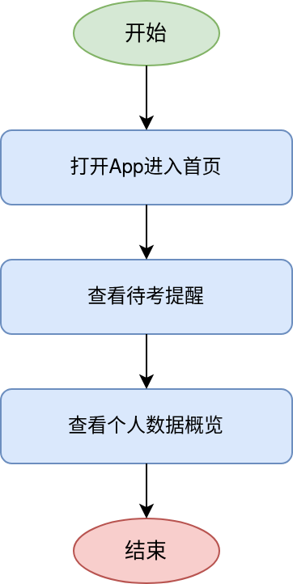

**（五）功能时序图**

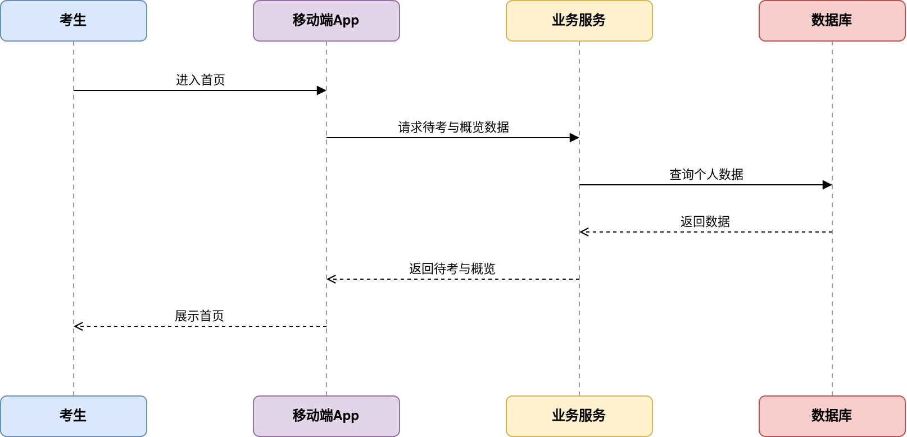

#### 3.5.13.3 我的

**（一）功能需求概述**

我的用于考生查看与维护个人基本信息，并集中查询本人的历次考试成绩与已获得的证书。

**（二）功能设计**

**个人信息**

展示当前登录考生的基本信息。

| 字段名称 | 类型 | 说明 |
|---------|------|------|
| 姓名 | 文本 | - |
| 所属单位 | 文本 | 内部考生展示所属部门，外部考生展示所属外部单位 |
| 手机号 | 文本 | - |
| 账号 | 文本 | - |

**编辑个人信息**

点击进入编辑页面，修改本人可维护的信息项。

| 字段名称 | 类型 | 长度限制 | 必填 | 默认值 | 说明 |
|---------|------|---------|------|-------|------|
| 姓名 | 文本输入 | 2-20字 | 是 | 自动填入已有数据 | - |
| 手机号 | 文本输入 | 11位 | 是 | 自动填入已有数据 | 需符合手机号格式 |

提交成功：提示"保存成功"。
提交失败：保留填写内容，显示具体错误原因。

**我的成绩**

分页展示本人历次考试成绩，仅展示成绩已发布且考试策略允许查看的考试。

| 列名 | 字段类型 | 说明 |
|-----|---------|------|
| 考试名称 | 文本 | - |
| 考试时间 | 日期时间 | - |
| 得分 | 数字 | - |
| 是否通过 | 状态标签 | 通过 / 未通过 |

列表为空时显示：暂无成绩。

**成绩明细**

点击某条成绩进入明细，展示该场考试的总分、得分、是否通过与各题得分情况。考试策略允许查看答案与解析时，可查看正确答案与解析。

| 字段名称 | 类型 | 说明 |
|---------|------|------|
| 题号 | 数字 | - |
| 题目类型 | 文本 | - |
| 本题分值 | 数字 | - |
| 本人得分 | 数字 | - |
| 评语 | 文本 | 主观题有评语时展示 |

**我的证书**

分页展示本人已获得的证书，含证书名称、证书编号、发放时间与有效期，点击进入证书明细查看完整内容。
列表为空时显示：暂无证书。

**退出登录**

点击"退出登录"，弹出确认"确定退出登录吗？"，确认后退出当前账号并返回登录页。

**业务规则**

- 个人信息与成绩、证书均仅展示当前登录考生本人的数据。
- 手机号需符合格式要求，格式不正确时阻止提交，提示"请输入正确的手机号"。
- 成绩未发布或考试策略不允许查看成绩时，该场考试不出现在我的成绩列表中。
- 考试策略不允许查看答案与解析时，成绩明细不展示正确答案与解析。

**边界与异常**

- **空数据**：无成绩时显示"暂无成绩"；无证书时显示"暂无证书"。
- **登录态失效**：登录态失效时返回登录页，提示"登录已过期，请重新登录"。

**（三）业务逻辑关联**

- 内部考生的个人信息来源于组织管理·人员管理，外部考生的个人信息来源于外部考生管理。
- 成绩来源于阅卷中心已发布的答卷成绩，展示范围受考试管理中该场考试的考试策略约束。
- 证书来源于证书管理·证书发放中已发放给本人的证书。

**（四）用户操作流程图**

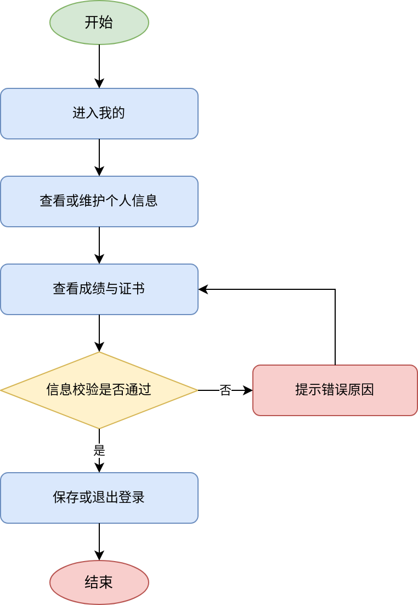

**（五）功能时序图**

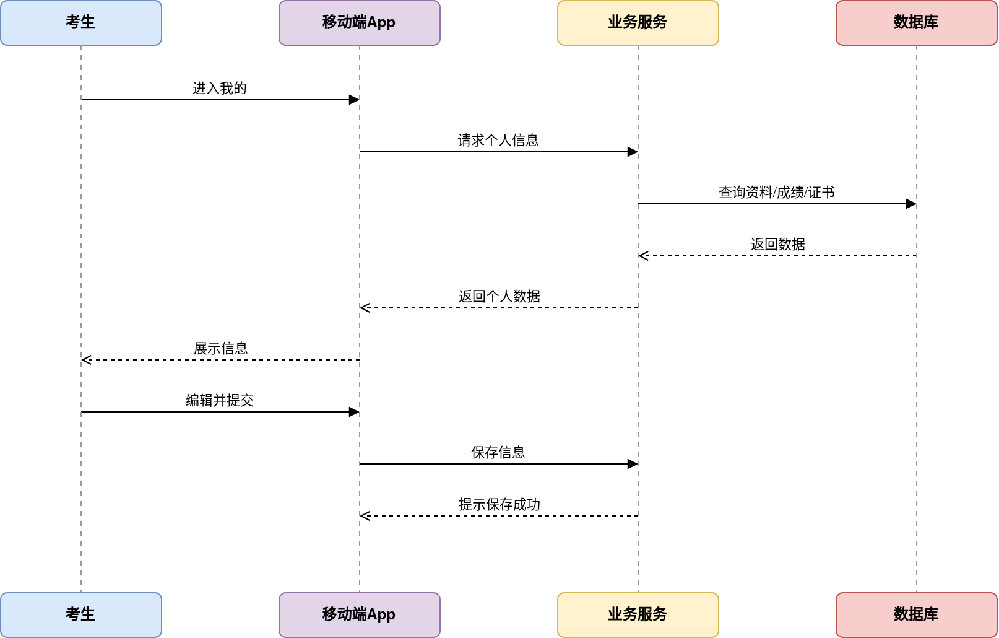

---

## 四、技术方案

### 4.1 技术架构

平台采用前后端分离架构，后端为单体模块化服务，对外提供统一接口，两个前端应用共用同一套业务数据。

**前端技术栈**：

- 管理后台：Vue 3 + TypeScript + Vite + Element Plus
- 移动端：Vue 3 + Vite + Vant

**后端技术栈**：

- 服务框架：NestJS（模块化组织，按业务模块划分）
- 数据访问：Prisma
- AI 能力：统一封装大模型调用能力供练习答疑使用，支持按配置切换服务商，密钥加密存储

**数据库与中间件**：

- 关系型数据库：MySQL，存储业务数据
- 缓存：Redis，用于会话与登录态管理

**部署架构**：

- 两个前端应用由统一网关托管并按域名分流，后端服务与数据库、缓存分层部署
- 数据库结构变更在服务启动时自动执行，具备幂等性

### 4.2 数据交互

- 前后端通过统一接口进行数据交互，采用标准数据格式，接口按业务模块划分
- 管理端与考生端接口分别独立鉴权，考生端仅可访问本人相关数据
- 所有外部输入数据在服务端进行校验后再处理

### 4.3 外部系统集成

本期不涉及第三方业务系统集成。AI 大模型服务作为外部能力统一对接，支持按配置切换服务商。

### 4.4 安全方案

- **身份认证**：账号密码登录，登录态统一管理，密码加密存储
- **权限控制**：基于角色的访问控制（RBAC），接口与功能按角色权限校验，无权限操作对应角色完全隐藏
- **数据安全**：敏感数据（如AI模型密钥、用户密码）加密存储，密钥在展示时脱敏，传输采用加密协议
- **考试过程管控**：按场次配置的防切屏检测、题目乱序、操作限制在作答期间生效，切屏行为记录留痕
- **审计**：关键操作记录操作日志，阅卷评分记录不可篡改删除

---

## 五、非功能需求

### 5.1 性能需求

- 页面加载时间 < 3 秒，常规接口响应时间 < 1 秒
- 支持考试高峰期的并发作答与提交，保障批量交卷的稳定
- 作答答案实时保存，保存过程不阻断考生继续作答

### 5.2 安全需求

- 身份认证：账号密码登录，管理端与考生端登录态独立管理
- 数据安全：敏感数据加密存储，传输使用加密协议
- 权限控制：基于角色的访问控制（RBAC）

### 5.3 可用性需求

- 系统可用性：99.9%
- 故障恢复：RTO < 1 小时，RPO < 15 分钟
- 数据备份：每日自动备份，考试与成绩数据重点保障
- 考试断线续考：考生断线重连后可恢复答题进度与剩余时间

### 5.4 兼容性需求

- 浏览器：Chrome、Firefox、Safari、Edge 最新版本
- 移动端：主流 Android 与 iOS 设备的浏览器
- 分辨率：管理后台 1920×1080、1366×768，移动端自适应

---

## 六、数据需求

### 6.1 数据字典

| 枚举类型 | 枚举值 | 说明 |
|---------|-------|------|
| 题型 | 单选题 | 只有一个正确答案的客观题 |
| ^ | 多选题 | 有多个正确答案的客观题 |
| ^ | 判断题 | 判断对错的客观题 |
| ^ | 填空题 | 填写空缺内容的客观题 |
| ^ | 问答题 | 简答形式的主观题 |
| ^ | 论述题 | 论述形式的主观题 |
| 可见范围 | 仅自己 | 仅创建人可见 |
| ^ | 本部门 | 创建人所在部门可见 |
| ^ | 本公司 | 创建人所在公司可见 |
| ^ | 全部组织 | 全部组织可见 |
| 共享级别 | 可管理 | 可查看并可编辑、删除 |
| ^ | 可查看 | 仅可查看与引用，不可编辑、删除 |
| 试卷状态 | 草稿 | 试卷编辑中，可修改 |
| ^ | 已发布 | 试卷可被考试引用，不可修改 |
| 考试状态 | 未发布 | 考试创建后未发布，可编辑 |
| ^ | 已发布 | 考试已发布，考生可见 |
| ^ | 进行中 | 考试处于作答时间内 |
| ^ | 已结束 | 考试时间已过，进入阅卷 |
| 试卷类型 | 固定试卷 | 题目固定，手动组卷生成，所有考生卷面相同 |
| ^ | 随机试卷 | 配置抽题规则，考试时按规则为每位考生随机抽题 |
| 考生类型 | 内部考生 | 本组织员工，来源于组织管理·人员管理，有系统账号 |
| ^ | 外部考生 | 外部单位人员，来源于外部考生管理，由系统生成考试账号 |
| 阅卷状态 | 待批阅 | 存在尚未评分的主观题 |
| ^ | 已阅完 | 主观题全部评分完成，成绩可发布 |
| 练习状态 | 未发布 | 练习创建后未发布，可编辑 |
| ^ | 已发布 | 练习已发布，参与人员可见 |
| ^ | 进行中 | 练习处于作答时间内 |
| ^ | 已结束 | 练习时间已过或已提前结束 |
| 练习方式 | 全库顺序练 | 按题库顺序练完全部题目，支持断点续练 |
| ^ | 按规则抽题 | 按题型、难度、知识点配置抽题数量，每次抽取 |
| 自主练习开放对象 | 全员开放 | 全部人员可练 |
| ^ | 指定员工 | 仅被指定人员可练 |
| 报考审核状态 | 待审核 | 报考已提交，待审核 |
| ^ | 已通过 | 审核通过，获得参考资格 |
| ^ | 已驳回 | 审核未通过 |
| 证书状态 | 有效 | 证书在有效期内 |
| ^ | 已过期 | 超过有效期 |
| 认证/证书模板状态 | 启用 | 可被引用 |
| ^ | 停用 | 不可被新引用 |

### 6.2 数据存储要求

- 考试与成绩数据长期保留，作为认证依据
- 答卷与评分记录长期保留，评分记录不可篡改删除
- 操作日志按系统配置的保留期限留存
- 数据存储容量随题库规模与考试量增长评估，重要数据定期备份

---

## 八、项目实施与验收

### 8.1 实施阶段

1. **需求确认阶段**：需求评审、原型确认、需求基线锁定
2. **设计开发阶段**：详细设计、编码开发、单元测试
3. **测试部署阶段**：功能测试、考试过程管控专项测试、性能测试、用户验收测试、部署上线
4. **上线运行阶段**：试运行、问题修复、正式上线

### 8.2 系统培训服务

- **培训对象**：系统管理员、考务人员、阅卷老师
- **培训内容**：系统操作、题库与组卷、考试组织、阅卷与成绩发布、练习任务下发
- **培训方式**：现场培训、在线培训、操作手册

### 8.3 验收标准

- **功能验收**：所有功能按SRS需求规格说明书实现，无P0/P1级缺陷
- **性能验收**：满足第五章非功能需求指标
- **专项验收**：考试过程管控策略生效，阅卷与成绩发布流程闭环，认证发证流程闭环
- **文档验收**：提供完整的技术文档和操作手册

---

## 九、附录

### 附录A：术语表

| 术语 | 说明 |
|-----|------|
| RBAC | 基于角色的访问控制（Role-Based Access Control） |
| RTO | 恢复时间目标（Recovery Time Objective） |
| RPO | 恢复点目标（Recovery Point Objective） |
| SRS | 软件需求规格说明书（Software Requirements Specification） |
| 客观题 | 有标准答案、可自动判分的题型（单选/多选/判断/填空） |
| 主观题 | 需评分标准评判的题型（问答/论述） |
| 组卷 | 将题目组织为试卷的过程 |
| 抽题规则 | 按题型、难度、知识点维度抽取题目的配置 |
| 切屏 | 考试中切换到考试窗口以外的操作 |
| 岗位练兵 | 由管理员指定内容与参与人员并下发的定向练习 |
| 自主练习 | 由管理员开放题库范围后，考生自行选择内容的练习 |

### 附录B：参考资料

- 智能AI考试平台设计方案 V1.0

