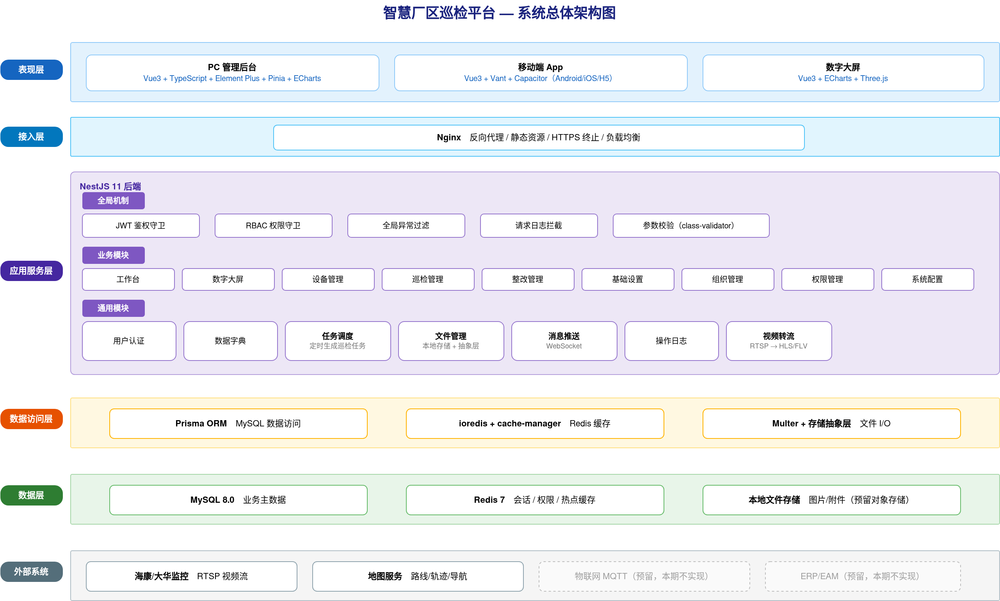
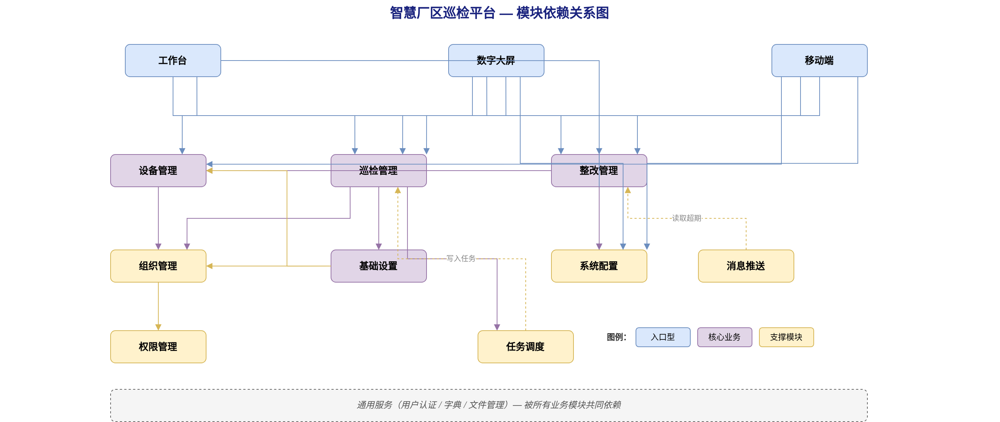
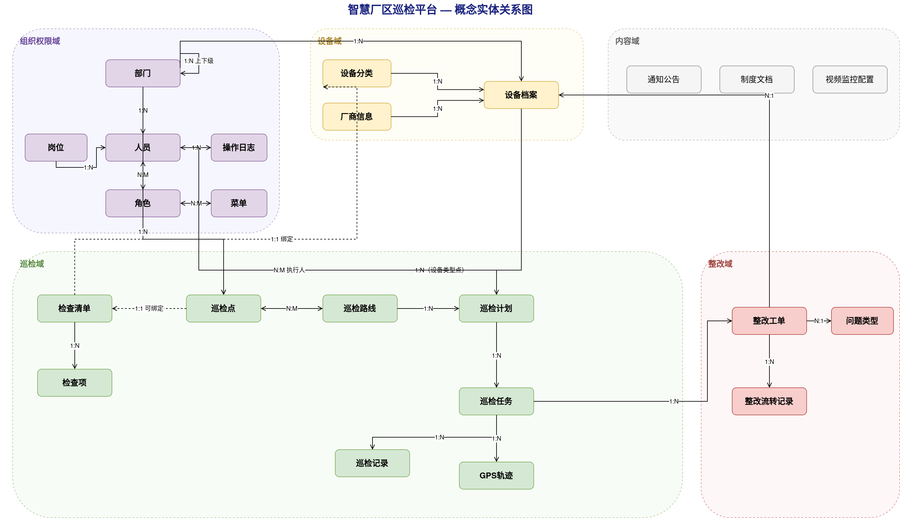
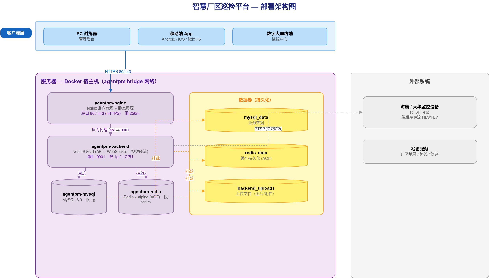

# 一、文档信息

| 项目名称 | 智慧厂区巡检平台 |
|---------|-----------|
| 文档版本 | V1.0 |
| 编制日期 | 2026-06-20 |
| 编制人 | AgentPM |
| 关联需求文档 | 20260620-PM能源科技智慧厂区巡检平台-SRS需求规格说明书-V1.4.md |
| 客户单位 | PM能源科技 |
| 编制单位 | AgentPM |
| 文档状态 | 草稿 |

**历史版本**

| 版本 | 日期 | 作者 | 更改说明 |
|-----|------|------|---------|
| V1.0 | 2026-06-20 | AgentPM | 初始版本，基于 SRS V1.4 生成 |

---

# 二、引言

## 2.1 编写目的

本概要设计说明书在《智慧厂区巡检平台 SRS 需求规格说明书 V1.4》的基础上，从系统架构视角描述平台的总体设计方案，明确系统分层、功能模块划分、核心数据实体、接口分组、技术选型和部署形态，作为详细设计（LLD）与编码实现的依据。

预期读者为系统架构师、技术负责人和各端开发组长，帮助其在动手实现前对系统的整体结构、模块边界和协作关系形成统一认识。本文档写到"模块／实体／接口分组"级，字段级表结构、单接口明细和代码实现属于详细设计范畴，不在此处展开。

## 2.2 设计依据

- 《智慧厂区巡检平台 SRS 需求规格说明书 V1.4》（功能需求、非功能需求、数据需求、接口需求的唯一依据）
- 项目实际代码工程现状（PC 管理后台、移动端 App、后端服务的技术栈与已有模块结构）
- 《工业企业安全生产标准化基本规范》（GB/T 33000）
- 《信息安全技术 网络安全等级保护基本要求》（GB/T 22239）

## 2.3 术语与缩略语

| 术语 | 说明 |
|-----|------|
| HLD | 概要设计说明书（High-Level Design） |
| LLD | 详细设计说明书（Low-Level Design） |
| SRS | 软件需求规格说明书（Software Requirements Specification） |
| RBAC | 基于角色的访问控制（Role-Based Access Control） |
| JWT | JSON Web Token，无状态身份认证令牌 |
| ORM | 对象关系映射（Object-Relational Mapping） |
| REST | 表述性状态转移，HTTP API 设计风格 |
| WebSocket | 全双工实时通信协议 |
| RTSP | 实时流传输协议，用于视频监控接入 |
| HLS/FLV | 流媒体传输格式，用于浏览器端视频播放 |
| NFC | 近场通信，用于巡检点签到 |
| GPS | 全球定位系统，用于巡检轨迹记录和签到 |

---

# 三、系统总体设计

## 3.1 系统定位

智慧厂区巡检平台是一套面向能源行业厂区的设备巡检数字化管理系统，由 PC 管理后台、移动端 App 和数字大屏三端组成，服务于系统管理员、业务主管、业务主办、巡检员、整改人员五类角色，提供巡检任务自动生成与执行、问题整改闭环跟踪、厂区运行态势实时监控三项核心业务能力。

## 3.2 系统边界

| 边界项 | 说明 |
|-------|------|
| 系统职责 | PC 管理后台（设备/巡检/整改/组织权限管理、数字大屏）、移动端 App（现场巡检执行、整改处理、消息查看，支持 Android/iOS/H5）、数字大屏（设备状态、视频监控、实时轨迹、巡检统计、异常告警的实时展示） |
| 不在范围 | 设备物联网实时数据采集（预留 MQTT 接口，本期不实现）；与 ERP/EAM 等外部系统数据对接（预留 RESTful 接口，本期不实现） |
| 外部系统 | 海康威视/大华监控设备（RTSP 视频流接入，经后端转流后在大屏播放）；地图服务（巡检路线预览、实时轨迹与导航）；移动设备 GPS/NFC 能力（巡检签到与轨迹记录） |

## 3.3 系统总体架构图

系统采用前后端分离的分层架构，自上而下分为表现层、接入层、应用服务层、数据访问层、数据层五层，并与外部系统通过标准协议集成。

- **表现层**：PC 管理后台（Element Plus）、移动端 App（Vant + Capacitor）、数字大屏（ECharts + Three.js）三类客户端，分别面向不同使用场景。
- **接入层**：Nginx 负责反向代理、静态资源分发、HTTPS 终止与负载均衡，是所有客户端请求的统一入口。
- **应用服务层**：基于 NestJS 11 构建，全局机制（JWT 鉴权、RBAC 权限、异常过滤、日志拦截、参数校验）横切所有请求；业务模块按业务域划分；通用模块（用户认证、字典、任务调度、文件管理、消息推送、操作日志、视频转流）为业务模块提供共性支撑。
- **数据访问层**：Prisma ORM 访问 MySQL，ioredis + cache-manager 访问 Redis，Multer 配合存储抽象层处理文件 I/O。
- **数据层**：MySQL 8.0 存储业务主数据，Redis 7 缓存会话/权限/热点数据，本地文件系统存储图片与附件（预留对象存储扩展）。

# 四、应用架构

## 4.1 分层设计

系统按职责划分为五层，无独立网关层——鉴权与权限控制通过 NestJS 全局守卫（Guard）在应用服务层统一处理。

| 分层 | 职责 | 关键技术 |
|------|------|---------|
| 表现层 | PC 管理后台与数字大屏的页面渲染、移动端 App 界面与交互 | Vue 3 + TypeScript + Element Plus（PC）；Vue 3 + Vant + Capacitor（移动端）；ECharts + Three.js（大屏） |
| 应用服务层 | RESTful API 提供、请求路由、DTO 校验、响应转换、全局鉴权与权限守卫、异常过滤、定时任务、实时推送 | NestJS 11（Controller / Service / Guard / Filter / Interceptor / Gateway） |
| 数据访问层 | 数据库 ORM 操作、缓存读写、文件存储 I/O | Prisma 6（MySQL）、ioredis + cache-manager（Redis）、Multer + 存储抽象层 |
| 数据层 | 业务数据持久化、缓存、文件存储 | MySQL 8.0、Redis 7、本地文件系统 |

## 4.2 功能模块划分

模块按业务域划分，业务模块对应 SRS 功能需求，通用模块为全系统提供共性能力。

| 模块 | 职责 | 对应SRS功能 | 依赖模块 |
|-----|------|-----------|---------|
| 工作台 | 待办聚合、统计图表、公告与文档入口 | 3.5.1 | 巡检管理、整改管理、系统配置 |
| 数字大屏 | 设备状态、视频监控、实时轨迹、巡检统计、异常告警 | 3.5.2 | 设备管理、巡检管理、整改管理、系统配置 |
| 设备管理 | 设备档案、设备分类、厂商信息维护及导入导出 | 3.5.3 | 组织管理、基础设置 |
| 巡检管理 | 巡检计划配置、任务自动生成与手动创建、状态跟踪 | 3.5.4 | 基础设置、组织管理、任务调度 |
| 整改管理 | 整改工单全生命周期（审核→整改→复核）、统计分析 | 3.5.5 | 设备管理、组织管理、系统配置 |
| 基础设置 | 巡检点、巡检路线、检查清单配置 | 3.5.6 | 设备管理、组织管理 |
| 组织管理 | 部门树、人员账号、岗位管理 | 3.5.7 | 权限管理 |
| 权限管理 | 角色管理、菜单管理、RBAC 权限分配 | 3.5.8 | 组织管理 |
| 系统配置 | 基础参数、问题类型、视频监控配置、通知公告、制度文档 | 3.5.9 | 文件管理 |
| 移动端 | 首页待办与巡检执行、工作台、消息、我的 | 3.5.10 | 巡检管理、整改管理、设备管理、系统配置 |
| 用户认证（通用） | 登录、JWT 颁发与验证、密码重置、Token 刷新 | 4.3 | 组织管理 |
| 字典（通用） | 系统数据字典管理 | 6.1 | — |
| 任务调度（通用） | 定时生成巡检任务、超期状态自动变更 | 3.5.4、5.3 | 巡检管理 |
| 文件管理（通用） | 文件上传/下载/预览，本地存储 + 存储抽象层 | 3.5.9.5 等 | — |
| 消息推送（通用） | WebSocket 实时通知、超期预警推送 | 3.5.10.3、4.2 | 巡检管理、整改管理 |
| 视频转流（通用） | RTSP 视频流转码为 HLS/FLV 供浏览器播放 | 3.5.2、7.1 | 系统配置 |
| 操作日志（通用） | 记录登录日志与关键操作日志 | 4.3 | — |

**模块划分依据：** 按业务域划分业务模块，与 SRS 功能模块一一对应，便于需求追溯；将鉴权、字典、文件、消息、日志等跨模块共性能力下沉为通用模块，避免重复建设。

## 4.3 模块依赖关系

模块依赖为单向，无循环依赖。入口型模块（工作台、数字大屏、移动端）依赖核心业务模块；核心业务模块（设备、巡检、整改）依赖基础设置与组织管理；组织管理单向依赖权限管理；任务调度向巡检管理写入任务，消息推送从巡检/整改管理读取超期数据；所有业务模块共同依赖通用服务（用户认证、字典、文件管理）。

# 五、数据架构

## 5.1 核心业务实体

系统核心业务实体按组织权限、设备、巡检、整改、内容五个业务域归类如下。

| 实体 | 业务含义 | 关联实体 | 关系类型 |
|-----|---------|---------|---------|
| 部门 | 企业组织单元，树形结构（省公司/分厂/部门） | 部门（自关联）、人员、设备档案、巡检点 | 1:N |
| 人员 | 系统账号，承载组织归属与角色 | 部门、岗位、角色、操作日志 | N:1（部门/岗位）、N:M（角色） |
| 岗位 | 职责描述，作为人员属性 | 人员 | 1:N |
| 角色 | 功能权限集合 | 人员、菜单 | N:M |
| 菜单 | 功能导航与权限节点 | 角色 | N:M |
| 操作日志 | 用户登录与关键操作记录 | 人员 | N:1 |
| 设备分类 | 设备分类树（多级） | 设备档案、检查清单 | 1:N（设备）、1:1（清单绑定） |
| 厂商信息 | 设备供应商 | 设备档案 | 1:N |
| 设备档案 | 厂区设备基本信息、状态、图片、附件 | 设备分类、厂商、部门、巡检点、整改工单 | N:1 |
| 巡检点 | 需到达并检查的物理位置（区域/设备类型） | 部门、设备档案、检查清单、巡检路线 | N:1（部门）、N:M（路线） |
| 巡检路线 | 由多个巡检点按顺序组成的路径 | 巡检点、巡检计划 | N:M（点）、1:N（计划） |
| 检查清单 | 检查项模板 | 设备分类、巡检点、检查项 | 1:N（检查项） |
| 检查项 | 清单内单个检查任务（正常异常/数值/文字/拍照） | 检查清单 | N:1 |
| 巡检计划 | 周期性巡检任务配置（每日/每周/每月） | 巡检路线、人员、巡检任务 | N:M（执行人员）、1:N（任务） |
| 巡检任务 | 单次巡检工单，含状态流转 | 巡检计划、执行人、巡检记录、GPS轨迹、整改工单 | N:1（计划）、1:N（记录/轨迹/工单） |
| 巡检记录 | 任务执行中的点位签到与检查结果 | 巡检任务、巡检点 | N:1 |
| GPS轨迹 | 任务执行中周期上报的位置点 | 巡检任务 | N:1 |
| 整改工单 | 问题整改全生命周期记录 | 设备档案、问题类型、人员、整改流转记录 | N:1（设备/类型）、1:N（流转） |
| 整改流转记录 | 工单每次状态变更的操作记录 | 整改工单 | N:1 |
| 问题类型 | 整改工单分类（含默认审核人） | 整改工单 | 1:N |
| 通知公告 | 系统公告（草稿/发布/撤回） | — | 独立 |
| 制度文档 | 企业制度文件 | — | 独立 |
| 视频监控配置 | 监控设备连接信息 | — | 独立 |

## 5.2 概念实体关系图

## 5.3 存储选型

| 存储类型 | 选型 | 承载数据 | 理由 |
|---------|------|---------|------|
| 关系数据库 | MySQL 8.0 | 全部业务实体、关系、流水数据 | 业务数据结构化程度高、事务一致性要求强，Prisma 对 MySQL 支持成熟 |
| 缓存 | Redis 7 | 用户会话与 Token、权限数据、字典、数字大屏高频统计 | 降低数据库压力，支撑大屏 30 秒刷新与高并发查询；支持 Token 黑名单与会话管理 |
| 文件存储 | 本地文件系统（Docker 数据卷） | 设备图片/附件、公告附件、制度文档、用户头像、系统 Logo | 本期数据量可控，本地存储成本低；通过存储抽象层封装，预留对象存储（MinIO/云存储）平滑切换能力 |

# 六、接口架构

## 6.1 接口分组

接口按业务模块分组，统一前缀 `/api/v1/`。对外接口供 PC 与移动端调用，对内接口供系统内部（如健康检查、定时任务）使用。

| 接口分组 | 所属模块 | 对外/对内 | 协议 |
|---------|---------|----------|------|
| 认证接口 | 用户认证 | 对外 | REST |
| 用户/角色/菜单/部门/岗位 | 组织管理、权限管理 | 对外 | REST |
| 设备档案/分类/厂商 | 设备管理 | 对外 | REST |
| 巡检点/路线/检查清单 | 基础设置 | 对外 | REST |
| 巡检计划/任务/记录 | 巡检管理 | 对外 | REST |
| 整改工单/流转/统计 | 整改管理 | 对外 | REST |
| 问题类型/公告/文档/视频监控/参数 | 系统配置 | 对外 | REST |
| 字典 | 字典 | 对外 | REST |
| 文件上传/下载/预览 | 文件管理 | 对外 | REST |
| GPS 轨迹上报 | 巡检管理 | 对外（移动端） | REST |
| 视频流地址 | 视频转流 | 对外 | REST（返回 HLS/FLV 地址） |
| 实时消息推送 | 消息推送 | 对外 | WebSocket |
| 健康检查 | 系统支撑 | 对内 | REST |

## 6.2 接口协议

| 协议 | 适用场景 |
|------|---------|
| REST（HTTP/HTTPS + JSON） | 全部 CRUD 操作；数字大屏 30 秒轮询；移动端 GPS 轨迹 30 秒上报。统一响应格式 `{ code, message, data }`，分页格式 `{ total, pageNum, pageSize, list }` |
| WebSocket | 实时消息推送：整改工单状态变更通知、巡检/整改超期预警 |
| 定时任务（@nestjs/schedule） | 巡检计划按周期自动生成任务；超期任务状态自动流转 |

## 6.3 第三方集成

| 外部系统 | 集成方式 | 用途 |
|---------|---------|------|
| 海康/大华监控设备 | RTSP 拉流 + 后端转流为 HLS/FLV | 数字大屏视频监控画面播放 |
| 地图服务 | 前端集成地图 SDK | 巡检路线预览、实时轨迹展示、移动端导航 |
| 物联网 MQTT | 预留标准 MQTT 接口 | 设备传感器实时数据接入（本期不实现） |
| ERP/EAM | 预留 RESTful 接口 | 企业资产管理系统数据同步（本期不实现） |

# 七、技术架构

| 层 | 技术选型 | 选型理由 |
|----|---------|---------|
| 前端（PC） | Vue 3 + TypeScript + Vite 7 + Element Plus + Pinia + ECharts | 组件化开发效率高，TypeScript 保障类型安全，Element Plus 提供完善的中后台组件，ECharts 支撑统计图表与大屏 |
| 前端（移动端） | Vue 3 + Vant 4 + Capacitor 8 | Vant 为移动端组件库，Capacitor 支持一套代码打包为 Android/iOS 原生应用及 H5，满足多端分发 |
| 后端框架 | NestJS 11（TypeScript） | 模块化架构 + 依赖注入 + 装饰器驱动，提供 Guard/Filter/Interceptor/Gateway 等企业级能力，前后端语言统一 |
| ORM | Prisma 6 | 类型安全的数据访问，统一管理数据模型与数据库迁移，参数化查询天然防 SQL 注入 |
| 数据库 | MySQL 8.0 | 成熟的关系型数据库，满足业务数据的结构化存储与事务要求 |
| 缓存 | Redis 7（ioredis） | 高性能内存缓存，承载会话、权限、字典与高频统计数据 |
| 鉴权 | JWT（@nestjs/jwt）+ Passport + bcrypt | 无状态认证便于水平扩展；access/refresh 双 Token 机制；bcrypt 加密存储密码 |
| 文件存储 | 本地文件系统（Multer）+ 存储抽象层 | 本期本地存储成本低，抽象层预留对象存储切换能力 |
| 任务调度 | @nestjs/schedule + cron | 实现巡检计划周期性自动生成任务与超期状态变更 |
| 实时通信 | WebSocket（@nestjs/websockets） | 站内实时消息推送与超期预警 |
| 视频转流 | 流媒体转码（RTSP → HLS/FLV） | RTSP 无法在浏览器直接播放，后端转流后供大屏播放 |
| API 文档 | Swagger（@nestjs/swagger） | 接口文档自动生成，便于前后端协作 |
| 部署 | Docker + Nginx | 容器化部署保障环境一致性，Nginx 处理静态资源与反向代理 |

# 八、部署架构

## 8.1 部署形态

系统采用前后端分离 + Docker Compose 容器编排，单机部署四个容器，同属 `agentpm` bridge 网络。环境划分为开发环境（docker-compose.dev.yaml）与生产环境（docker-compose.yaml）。

| 容器 | 镜像 | 职责 | 资源限制 |
|------|------|------|---------|
| agentpm-nginx | 自定义前端镜像 | 反向代理 + PC/移动端静态资源 + HTTPS 终止 | 256m |
| agentpm-backend | 自定义后端镜像 | NestJS API 服务（含 WebSocket 与视频转流），监听 9001 | 1g / 1 CPU |
| agentpm-mysql | mysql:8.0 | 业务数据持久化 | 1g |
| agentpm-redis | redis:7-alpine | 缓存（AOF 持久化） | 512m |

数据持久化通过 mysql_data、redis_data、backend_uploads 三个 Docker 数据卷实现；HTTPS 由 Nginx 挂载证书目录，暴露 80/443 端口。

## 8.2 部署架构图

## 8.3 高可用与扩展策略

- 容器配置 `restart: unless-stopped` 自动重启，结合健康检查保障服务可用性。
- 后端无状态设计（会话存于 Redis），可通过增加 backend 实例水平扩展，由 Nginx 负载均衡。
- MySQL 主从复制、定时备份（每日备份保留 30 天）、对象存储切换为部署阶段的扩展项，由存储抽象层与配置预留支撑。

# 九、非功能性设计

将 SRS 第五章非功能需求逐条映射到架构应对策略。

| SRS非功能需求 | 指标 | 架构应对策略 |
|-------------|------|------------|
| 性能 — 首屏/页面 | 首屏<3s，切换<1s | Vite 构建分包 + Gzip 压缩 + Nginx 静态缓存 + 路由懒加载 |
| 性能 — 普通查询 | <500ms | MySQL 索引优化 + Redis 缓存高频数据 + Prisma 分页 |
| 性能 — 复杂统计 | <3s | 统计查询索引 + Redis 结果缓存（大屏刷新周期内复用） |
| 性能 — 并发 | 100 并发在线 | NestJS 异步非阻塞 + Redis 缓存降库压 + 后端可水平扩展 |
| 安全 — 认证 | JWT + 自动刷新 | @nestjs/jwt + Passport-JWT，access/refresh 双 Token |
| 安全 — 权限 | RBAC 接口级校验 | 全局权限守卫 + 权限码装饰器；角色-菜单关联控制功能权限，角色-部门关联控制数据权限 |
| 安全 — 防攻击 | 防 SQL注入/XSS/CSRF | Prisma 参数化查询 + class-validator 校验 + CORS 配置 |
| 安全 — 数据 | 密码加密、HTTPS | bcrypt 加密存储 + Nginx HTTPS 传输加密 |
| 安全 — 审计 | 日志保留180天 | 操作日志模块记录登录与关键操作，配合定时清理 |
| 可用性 | 99.5% | 容器自动重启 + 健康检查 + Redis AOF + MySQL 数据卷持久化 |
| 可用性 — 容灾 | RTO<2h，RPO<1h | MySQL 定时备份策略（部署阶段落实） |
| 可用性 — 离线 | 移动端离线缓存 | Capacitor 本地存储缓存检查清单，网络恢复后自动同步 |
| 兼容性 — 浏览器 | 主流浏览器最新版 | Vue 3 + Vite ESM 构建，Element Plus 兼容主流浏览器 |
| 兼容性 — 移动端 | iOS 12+/Android 8+ | Capacitor 跨平台打包 + postcss-pxtorem 屏幕适配 |
| 兼容性 — 大屏 | 1920×1080 / 4K | ECharts 自适应 resize + 视口相对布局 |

# 十、公共机制设计

- **统一鉴权**：全局 JWT 守卫拦截请求校验 Token，登录态存于 Redis，支持 access/refresh 双 Token 与 Token 失效控制。
- **统一权限**：基于 RBAC，全局权限守卫结合权限码装饰器做接口级校验；角色关联菜单控制功能权限，角色关联部门控制数据范围（全部/本部门/本人）。
- **统一异常处理**：全局异常过滤器捕获异常并转换为统一响应格式 `{ code, message, data }`，前端按 code 展示提示。
- **统一日志**：请求日志拦截器记录访问链路，操作日志模块记录登录与关键操作，满足审计要求。
- **缓存策略**：会话、权限、字典、大屏统计等高频数据缓存于 Redis，设置合理过期时间，数据变更时主动失效。
- **文件上传**：通过文件管理模块统一处理上传、下载、预览，存储抽象层封装本地存储，预留对象存储切换。
- **实时推送**：消息推送模块通过 WebSocket 向在线用户推送工单状态变更与超期预警。
- **定时任务**：任务调度模块按巡检计划周期自动生成巡检任务，并周期性扫描超期任务自动流转状态。

