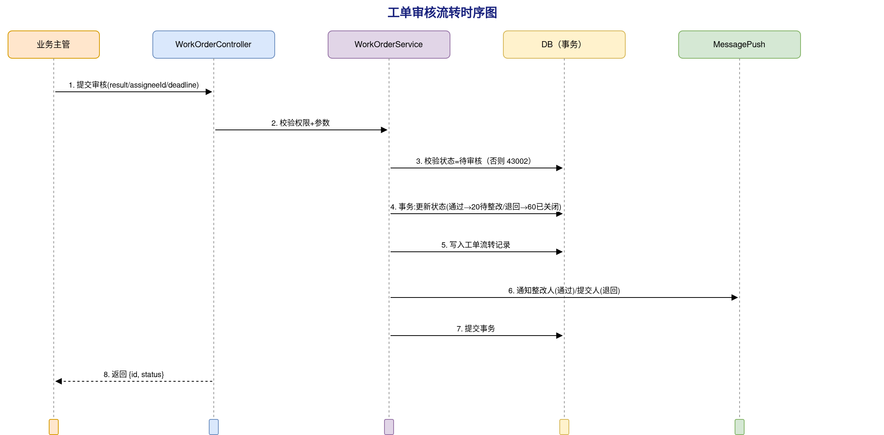
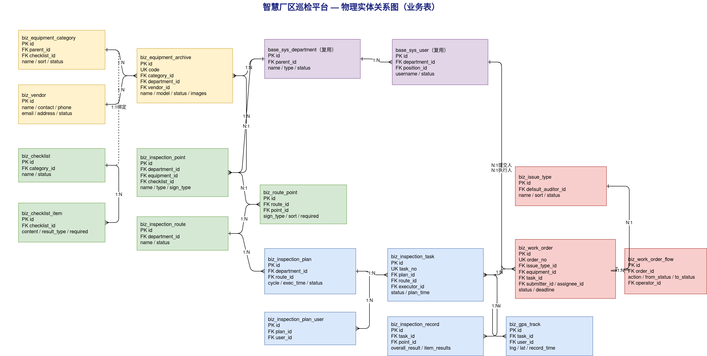

# 一、文档信息

| 项目名称 | 智慧厂区巡检平台 |
|---------|-----------|
| 文档版本 | V1.0 |
| 编制日期 | 2026-06-20 |
| 编制人 | AgentPM |
| 关联需求文档 | 20260620-PM能源科技智慧厂区巡检平台-SRS需求规格说明书-V1.4.md |
| 关联概要设计 | 20260620-PM能源科技智慧厂区巡检平台-概要设计说明书-V1.0.md |
| 客户单位 | PM能源科技 |
| 编制单位 | AgentPM |
| 文档状态 | 草稿 |

**历史版本**

| 版本 | 日期 | 作者 | 更改说明 |
|-----|------|------|---------|
| V1.0 | 2026-06-20 | AgentPM | 初始版本，基于 SRS V1.4 与 HLD V1.0 生成 |

---

# 二、引言

## 2.1 编写目的

本详细设计说明书在《智慧厂区巡检平台 HLD 概要设计说明书 V1.0》的基础上，将各功能模块细化到可直接指导编码的实现级设计，包括模块类结构、数据库物理表结构、API 接口契约、安全设计与可追溯矩阵。预期读者为后端与前端开发工程师。

本项目后端采用 NestJS 11 + Prisma 6，本文档的数据模型与命名遵循项目既有工程约定（Prisma 模型 PascalCase，物理表 snake_case 带 `base_`/业务前缀，应用层字段 camelCase）。当前业务代码尚未开发，本文档为正向设计，作为后续编码的唯一依据。

## 2.2 设计依据

- 《智慧厂区巡检平台 HLD 概要设计说明书 V1.0》（模块划分、数据架构、接口架构、技术选型）
- 《智慧厂区巡检平台 SRS 需求规格说明书 V1.4》（功能需求、数据字典、非功能需求）
- 项目既有工程约定（`server/prisma/schema.prisma` 中 `Sys*` 系统模型的命名与字段风格）
- 数据库设计规范、后端 RESTful 规范、安全规范

## 2.3 全局约定

贯穿所有模块的通用约定，各模块不再重复。

### 2.3.1 统一响应格式

所有接口返回统一结构，列表接口数据体为分页结构：

```typescript
interface ApiResponse<T> {
  code: number       // 0=成功，非0=业务错误码
  success: boolean
  message: string
  data?: T
  timestamp: number
}

interface PageResponse<T> {
  list: T[]
  total: number
  page: number
  pageSize: number
}
```

### 2.3.2 公共字段约定

所有业务表统一包含以下字段（沿用项目 Prisma 既有风格，非模板默认的 `created_at`）：

| 应用层字段 | 类型 | 说明 |
|-----------|------|------|
| id | Int 自增 | 主键 |
| createTime | DateTime | 创建时间，默认当前时间 |
| updateTime | DateTime | 更新时间，自动更新 |
| createBy | Int? | 创建人ID（审计，可空） |
| updateBy | Int? | 更新人ID（审计，可空） |
| tenantId | Int? | 租户ID（多租户隔离，可空） |

> 状态字段统一为 `status Int @default(1)`，1=启用/正常，0=停用/禁用。软删除按状态标记，不物理删除关键业务数据。

### 2.3.3 命名规范

- Prisma 模型：PascalCase（如 `EquipmentArchive`）；物理表：snake_case 带业务前缀（如 `biz_equipment_archive`）。
- 应用层字段 camelCase；外键字段以 `Id` 结尾（如 `categoryId`）并建索引。
- 接口路径 RESTful，统一前缀 `/api/v1/`，资源名用复数小写中划线（如 `/api/v1/equipment-categories`）。

### 2.3.4 错误码规范

| 区段 | 含义 |
|------|------|
| 0 | 成功 |
| 401xx | 鉴权类（未登录、Token失效） |
| 403xx | 权限类（越权） |
| 4xxxx | 业务错误（按模块分段，见各接口） |
| 500xx | 系统错误 |

模块业务错误码分段：设备 41xxx、巡检 42xxx、整改 43xxx、基础设置 44xxx、组织权限 45xxx、系统配置 46xxx。

### 2.3.5 鉴权与权限约定

- 采用 JWT（access + refresh 双 Token），access Token 默认 2 小时，refresh 默认 15 天。
- 全局 `AuthGuard` 校验登录态，全局 `PermsGuard` 结合 `@Perms('资源:动作')` 装饰器做接口级权限校验。
- 数据权限按角色配置（全部/本部门/本人），在 Service 查询层注入部门范围过滤。
- 密码 bcrypt 哈希存储；改密后 `passwordV` 自增使旧 Token 失效。

# 三、模块详细设计

本章按业务域逐模块展开类设计、核心流程与异常处理。CRUD 类操作（增删改查、导入导出、启用停用）为各模块共性，统一遵循三层结构（Controller 接收校验 → Service 业务事务 → Prisma 数据访问），仅对含状态流转、跨模块协作或复杂规则的核心流程展开时序与步骤。

## 3.1 设备管理 详细设计

**模块职责：** 维护设备档案、设备分类、厂商信息三类基础数据，为巡检计划配置、检查清单绑定、整改工单记录提供设备主数据（对应 HLD 设备管理模块，SRS 3.5.3）。

**核心类/服务设计：**

| 类/服务名 | 职责 | 关键方法 |
|----------|------|---------|
| EquipmentController | 设备档案请求接收、参数校验、权限拦截 | list / detail / create / update / remove / batchRemove / export / import |
| EquipmentService | 设备档案业务逻辑、编号唯一校验、分类/部门/厂商关联校验、事务控制 | list / create / update / remove / batchRemove / parseImport / buildExport |
| EquipmentCategoryService | 设备分类树管理、清单绑定、分类删除关联保护 | tree / create / update / remove / bindChecklist / import / export |
| VendorService | 厂商信息管理、被设备引用时删除保护 | list / create / update / remove / batchRemove |

**类图：** 

**核心业务流程 — 新增设备档案：**

时序图：

处理步骤：
1. Controller 接收 body，校验必填（设备名称、编号、分类、所属单位、状态）与长度。
2. Service 校验设备编号全局唯一：按 `code` 查询，存在则抛业务错误 `41001`。
3. 校验关联有效性：分类、所属部门为启用状态，厂商存在（若填写）。
4. 开启事务：写入 `biz_equipment_archive`，图片/附件 URL 列表以 JSON 存储。
5. 记录 `createBy` 为当前用户，提交事务，返回新建记录 ID。

**业务规则：**

- 设备编号全局唯一，新增/编辑重复时阻止提交，提示「设备编号【XXX】已存在，请更换」。
- 设备状态为「停用」后，该设备对应的巡检点在巡检计划配置时不可选（由巡检管理查询时过滤）。

**异常处理：**

| 异常场景 | 处理策略 | 错误反馈 |
|---------|---------|---------|
| 必填校验失败 | 拒绝请求 | 400 + 字段错误 |
| 设备编号重复 | 中止 | 41001「设备编号【XXX】已存在，请更换」 |
| 关联分类/部门已停用 | 中止 | 41002「所选分类或单位不可用」 |
| 删除厂商时被设备引用 | 中止 | 41003「该厂商已被【设备名】等 X 台设备引用，无法删除」 |
| 删除分类时下有设备 | 中止 | 41004「该分类下有 X 台设备，请先将设备调整至其他分类」 |
| 导入数据格式错误 | 逐行校验，整体回滚 | 41005 + 具体错误行号与原因 |

## 3.2 巡检管理 详细设计

**模块职责：** 管理巡检计划与巡检任务。业务主办配置周期性计划，系统按周期自动生成任务并推送巡检员；管理人员跟踪任务状态与巡检记录（对应 HLD 巡检管理模块，SRS 3.5.4）。

**核心类/服务设计：**

| 类/服务名 | 职责 | 关键方法 |
|----------|------|---------|
| InspectionPlanController | 计划请求接收、参数校验 | list / detail / create / update / remove / toggleStatus / managePersonnel |
| InspectionPlanService | 计划业务逻辑、路线时段冲突校验、启停控制 | create / update / remove / enable / disable / updatePersonnel |
| InspectionTaskController | 任务请求接收 | list / detail / create / record |
| InspectionTaskService | 任务生成、状态流转、巡检记录组装 | manualCreate / queryDetail / loadRecord |
| TaskGenerationJob | 定时调度，按计划周期生成任务、扫描超期 | generateByPlan / scanTimeout |

**类图：** 

**核心业务流程 — 巡检计划自动生成任务：**

时序图：

处理步骤：
1. `TaskGenerationJob` 由 `@nestjs/schedule` 按 cron 周期触发（每日扫描）。
2. 查询所有启用状态且在有效期内的巡检计划，按执行周期（每日/每周/每月）与执行时间判断当日是否应生成。
3. 对命中的计划，按其巡检方式（按路线/按巡检点）与执行人员，逐人生成 `biz_inspection_task` 记录，初始状态「待执行」，任务编号 `XJ+日期+序号`。
4. 通过消息推送模块向执行人推送「您有新的巡检任务」。
5. 计划停用后不再生成新任务，已生成的待执行任务不受影响。

**核心业务流程 — 新增计划路线时段冲突校验：**

处理步骤：
1. Service 接收计划数据，校验基础信息、巡检内容、执行人员、巡检设置四步必填。
2. 查询同一路线在所选时间段内是否已有启用计划，存在则抛 `42001`「该路线在所选时间段内已有计划，请调整时间或路线」。
3. 校验通过后写入 `biz_inspection_plan` 及关联执行人中间表 `biz_inspection_plan_user`。

**巡检任务状态机：**

| 当前状态 | 触发条件 | 流转至 | 系统动作 |
|---------|---------|-------|---------|
| 待执行 | 巡检员首次签到 | 进行中 | 记录实际开始时间，通知管理人员 |
| 待执行 | 超过计划时间未开始 | 已超期 | 定时任务自动流转，推送提醒 |
| 进行中 | 完成所有检查点并提交 | 已完成 | 记录完成时间，生成巡检记录 |
| 进行中 | 超过计划时间未完成 | 已超期 | 定时任务自动流转，推送提醒 |

**异常处理：**

| 异常场景 | 处理策略 | 错误反馈 |
|---------|---------|---------|
| 路线时段冲突 | 中止 | 42001「该路线在所选时间段内已有计划，请调整时间或路线」 |
| 编辑/删除已启用计划 | 拒绝 | 42002「已启用的计划不可编辑或删除，请先停用」 |
| 巡检内容引用已停用路线/巡检点 | 中止 | 42003「所选路线或巡检点不可用」 |
| 任务超期 | 定时流转 | 推送「巡检任务【任务名称】已超期，请及时处理」 |

## 3.3 整改管理 详细设计

**模块职责：** 管理整改工单全生命周期（提交→审核→整改→复核→关闭）与统计分析。全程留痕，每次状态变更记录流转记录（对应 HLD 整改管理模块，SRS 3.5.5）。

**核心类/服务设计：**

| 类/服务名 | 职责 | 关键方法 |
|----------|------|---------|
| WorkOrderController | 工单请求接收、操作权限拦截 | list / detail / audit / startRectify / submitRectify / review / export |
| WorkOrderService | 工单状态流转、流转记录写入、通知触发、事务控制 | create / audit / startRectify / submitRectify / review / closeOrReturn |
| WorkOrderFlowService | 流转记录管理 | appendFlow / queryFlowByOrder |
| StatisticsService | 整改统计分析（趋势、类型分布、效率、部门） | trend / typeDistribution / efficiency / byDepartment |

**类图：** 

**核心业务流程 — 工单审核流转：**

时序图：

处理步骤：
1. Controller 校验当前用户具备审核权限（业务主管），工单状态为「待审核」。
2. Service 开启事务：审核通过则更新状态为「待整改」，写入整改人、整改截止时间；退回则状态为「已关闭」。
3. 写入 `biz_work_order_flow` 流转记录（操作人、操作时间、操作意见、原因）。
4. 通过消息推送通知：通过→通知整改人「您有新的整改任务待处理」；退回→通知提交人「您的整改工单已被退回，原因：[退回原因]」。
5. 提交事务。状态机非法流转（如非待审核工单调用审核）抛 `43002`。

**工单状态机：**

| 当前状态 | 触发条件 | 流转至 | 系统动作 |
|---------|---------|-------|---------|
| 待审核 | 审核通过并指派整改人 | 待整改 | 通知整改人 |
| 待审核 | 退回 | 已关闭 | 通知提交人（含退回原因） |
| 待整改 | 整改人开始整改 | 整改中 | 记录整改开始时间 |
| 整改中 | 提交整改结果 | 待复核 | 通知原提交人复核 |
| 整改中 | 超过截止时间未提交 | 整改中（超期标记） | 每日通知整改人与管理人员 |
| 待复核 | 复核通过 | 已完成 | 关闭工单，记录完成时间 |
| 待复核 | 复核不通过 | 待整改 | 通知整改人重新整改（含原因） |

**异常处理：**

| 异常场景 | 处理策略 | 错误反馈 |
|---------|---------|---------|
| 非法状态流转 | 中止 | 43002「当前工单状态不允许该操作」 |
| 审核通过未指派整改人/截止时间 | 拒绝 | 43003「请指派整改人并设置整改截止时间」 |
| 问题类型已停用 | 中止 | 43004「所选问题类型不可用」 |
| 已完成/已关闭工单再次操作 | 拒绝 | 43005「工单已结束，如需重新处理请新建工单」 |
| 无审核权限调用审核 | 拒绝 | 40300 权限不足 |

## 3.4 基础设置 详细设计

**模块职责：** 维护巡检点、巡检路线、检查清单三类巡检基础配置，为巡检计划与移动端执行提供数据（对应 HLD 基础设置模块，SRS 3.5.6）。

**核心类/服务设计：**

| 类/服务名 | 职责 | 关键方法 |
|----------|------|---------|
| InspectionPointService | 巡检点管理、签到方式与GPS校验、删除关联保护 | list / create / update / remove / toggleStatus / import / export |
| InspectionRouteService | 路线管理、巡检点排序、删除关联保护 | list / create / update / remove / preview |
| ChecklistService | 检查清单与检查项管理、设备分类绑定、删除关联保护 | list / create / update / remove / import / export |

**类图：** 

**核心业务流程 — 配置巡检路线：**

处理步骤：
1. Service 校验路线名称、所属部门，巡检点列表至少 1 个。
2. 巡检点按所属部门过滤，校验所选巡检点为启用状态且不重复。
3. 开启事务：写入 `biz_inspection_route`，按顺序写入关联中间表 `biz_route_point`（含签到方式、顺序、是否必须）。
4. 提交事务。

**业务规则：**

- 巡检点类型为「设备」时关联设备必填且只能选启用设备；签到方式为「GPS」时坐标必填，纬度 -90~90、经度 -180~180。
- 检查项结果类型为「数值」时需配置单位与正常范围，移动端填写超范围自动标记异常。
- 检查清单可绑定设备分类，巡检点也可直接绑定清单，巡检点直接绑定优先级高于分类绑定。

**异常处理：**

| 异常场景 | 处理策略 | 错误反馈 |
|---------|---------|---------|
| 删除被路线引用的巡检点 | 中止 | 44001「该巡检点已被路线【路线名】引用，请先解除关联」 |
| 删除被计划引用的路线 | 中止 | 44002「该路线已被巡检计划【计划名】引用，请先解除关联」 |
| 删除被设备分类绑定的清单 | 中止 | 44003「该清单已与设备分类【分类名】关联，请先解除绑定」 |
| 路线巡检点为空 | 拒绝 | 44004「请至少添加一个巡检点」 |
| GPS 坐标越界 | 拒绝 | 44005「GPS 坐标超出有效范围」 |

## 3.5 组织管理 详细设计

**模块职责：** 维护部门树、人员账号、岗位，为权限分配与任务指派提供组织数据（对应 HLD 组织管理模块，SRS 3.5.7）。复用项目既有 `SysDepartment` / `SysUser` / `SysPosition` 模型。

**核心类/服务设计：**

| 类/服务名 | 职责 | 关键方法 |
|----------|------|---------|
| DepartmentService | 部门树管理、类型层级校验、删除关联保护 | tree / create / update / remove / toggleStatus |
| UserService | 人员账号管理、工号唯一、角色分配、重置密码、导入导出 | list / create / update / remove / toggleStatus / resetPwd / import / export |
| PositionService | 岗位管理、名称唯一 | list / create / update / remove |

**类图：** 

**核心业务流程 — 新增人员账号：**

处理步骤：
1. 校验姓名、工号、手机号必填，手机号格式校验。
2. 工号全局唯一校验，重复抛 `45001`。
3. 开启事务：写入 `base_sys_user`（密码 bcrypt 哈希，初始密码为手机号后 6 位），写入用户-角色中间表。
4. 提交事务。

**业务规则：**

- 部门类型决定层级：省公司 > 分厂 > 部门；省公司下可建分厂和部门，分厂下只能建部门。
- 重置密码后密码为手机号后 6 位，`passwordV` 自增使旧 Token 失效。
- 停用账号后无法登录，已有待办与指派记录不受影响。

**异常处理：**

| 异常场景 | 处理策略 | 错误反馈 |
|---------|---------|---------|
| 工号重复 | 中止 | 45001「工号【XXX】已存在，请更换」 |
| 手机号格式错误 | 拒绝 | 45002「请输入正确的手机号格式」 |
| 删除有关联人员的部门 | 中止 | 45003「该部门下有 X 名人员，请先将人员调整至其他部门」 |
| 岗位名称重复 | 中止 | 45004「岗位名称已存在」 |

## 3.6 权限管理 详细设计

**模块职责：** 管理角色与菜单，实现 RBAC 功能权限与数据权限分配（对应 HLD 权限管理模块，SRS 3.5.8）。复用项目既有 `SysRole` / `SysMenu` 及关联模型。

**核心类/服务设计：**

| 类/服务名 | 职责 | 关键方法 |
|----------|------|---------|
| RoleService | 角色管理、菜单权限分配、数据权限、内置角色保护 | list / create / update / remove / assignPerms / setDataScope |
| MenuService | 菜单树管理（目录/菜单/按钮）、删除关联保护 | tree / create / update / remove |

**类图：** 

**核心业务流程 — 分配角色权限：**

处理步骤：
1. 校验角色存在、勾选菜单非空。
2. 开启事务：清空该角色原有 `base_sys_role_menu` 关联，按勾选重新写入。
3. 提交事务，提示「权限已更新，已登录用户需重新登录后生效」（依赖 `passwordV` 或权限缓存刷新机制）。

**业务规则：**

- 系统内置角色（系统管理员）不可删除。
- 数据权限范围：全部数据/本部门数据/本人数据，在各业务 Service 查询层注入过滤条件。
- 菜单分目录、菜单、按钮三类；菜单类必填访问地址，按钮类配权限编码。

**异常处理：**

| 异常场景 | 处理策略 | 错误反馈 |
|---------|---------|---------|
| 删除内置角色 | 拒绝 | 45101「系统内置角色不可删除」 |
| 保存角色未勾选菜单 | 拒绝 | 45102「请至少选择一个菜单权限」 |
| 删除被角色关联的菜单 | 中止 | 45103「该菜单已被 X 个角色关联，请先解除关联」 |

## 3.7 系统配置 详细设计

**模块职责：** 维护基础参数、问题类型、视频监控配置、通知公告、制度文档五类系统级配置（对应 HLD 系统配置模块，SRS 3.5.9）。

**核心类/服务设计：**

| 类/服务名 | 职责 | 关键方法 |
|----------|------|---------|
| BaseConfigService | 系统参数（名称/Logo/时区/日期格式）配置 | get / save |
| IssueTypeService | 问题类型管理、默认审核人、启停 | list / create / update / remove / toggleStatus |
| VideoMonitorService | 监控设备连接配置、连接测试 | list / create / update / remove / testConnection |
| AnnouncementService | 公告发布/撤回/草稿状态管理 | list / create / update / publish / withdraw / remove |
| DocumentService | 制度文档上传、分类、预览下载 | list / upload / update / remove / preview |

**类图：** 

**核心业务流程 — 视频监控连接测试与转流：**

处理步骤：
1. 校验监控设备 IP、端口、用户名、密码必填。
2. 后端发起 RTSP 探测，成功提示「连接成功」，失败提示「连接失败，请检查配置信息」。
3. 大屏播放时，视频转流模块将 RTSP 转码为 HLS/FLV，返回可播放地址供前端播放器加载。

**公告状态机：**

| 当前状态 | 触发条件 | 流转至 | 系统动作 |
|---------|---------|-------|---------|
| 草稿 | 发布 | 已发布 | 工作台/移动端首页实时展示 |
| 已发布 | 撤回 | 已撤回 | 从工作台/首页移除 |
| 已撤回 | 编辑后发布 | 已发布 | 重新展示 |

**异常处理：**

| 异常场景 | 处理策略 | 错误反馈 |
|---------|---------|---------|
| 系统名称为空 | 拒绝 | 46001「请填写系统名称」 |
| Logo 超 2MB / 格式错 | 拒绝 | 46002「图片大小不能超过 2MB」/「只能上传 PNG/JPG」 |
| 删除已发布公告 | 拒绝 | 46003「请先撤回公告再删除」 |
| 停用问题类型后被工单提交引用 | 查询过滤 | 提交时不可选 |
| 文档超 50MB / 格式不支持 | 拒绝 | 46004「文件大小不能超过 50MB」/「不支持该文件格式」 |

## 3.8 工作台与数字大屏 详细设计

**模块职责：** 工作台聚合当前用户待办、统计图表、公告与文档；数字大屏实时展示设备状态、视频监控、实时轨迹、巡检统计、异常告警（对应 HLD 工作台、数字大屏模块，SRS 3.5.1、3.5.2）。两者均为只读聚合，不产生新业务数据。

**核心类/服务设计：**

| 类/服务名 | 职责 | 关键方法 |
|----------|------|---------|
| WorkbenchService | 跨模块聚合当前用户待办与统计 | todoList / statistics / latestAnnouncements / documents |
| DashboardService | 大屏数据聚合，结果走 Redis 缓存（30秒） | factoryMap / equipmentStatus / inspectionStat / alarmList / videoChannels |

**类图：** 

**核心业务流程 — 大屏数据聚合与缓存：**

处理步骤：
1. 前端按 30 秒轮询请求各大屏数据接口。
2. Service 先查 Redis 缓存键（如 `dashboard:equipment_status`），命中直接返回。
3. 未命中则聚合查询设备/巡检/整改数据，写入 Redis 设 30 秒过期，返回结果。
4. 视频监控画面实时播放，不走 30 秒缓存。

**业务规则：**

- 工作台待办仅展示当前用户相关的整改审核/执行/复核与待执行巡检任务；距截止不足 24 小时高亮。
- 大屏设备异常数 = 存在未处理整改工单或巡检异常记录的设备数；厂区状态由异常设备数与巡检进度计算。
- 异常告警按时间倒序，最多 10 条，点击跳工单台账。

**异常处理：**

| 异常场景 | 处理策略 | 错误反馈 |
|---------|---------|---------|
| 聚合查询失败 | 降级返回空 + 提示 | 前端显示「数据加载失败，请刷新重试」 |
| 视频设备离线 | 标记离线 | 前端显示「设备离线」 |

## 3.9 移动端 详细设计

**模块职责：** 面向现场作业的移动端 App，含首页（待办+巡检执行下钻）、工作台（发起整改/工单台账/设备/任务/统计）、消息、我的四个 Tab（对应 HLD 移动端模块，SRS 3.5.10）。移动端复用 PC 端业务接口，差异在数据范围（仅当前用户相关）与执行流程。

**核心类/服务设计：**

移动端为前端应用（Vue 3 + Vant + Capacitor），后端复用巡检管理、整改管理、设备管理、系统配置等模块接口，新增以下移动端专用服务：

| 类/服务名 | 职责 | 关键方法 |
|----------|------|---------|
| MobileInspectionService | 巡检执行：检查点签到、检查清单提交、轨迹上报 | checkIn / submitChecklist / reportTrack / playback |
| MobileWorkOrderService | 移动端发起整改、查询本人相关工单 | createByMobile / myOrders |
| GpsTrackService | GPS 轨迹存储与回放 | append / queryByTask |

**类图：** 

**核心业务流程 — 巡检执行签到与提交：**

时序图：

处理步骤：
1. 巡检员从首页待办点击巡检任务进入执行流程，任务首次签到时任务状态由「待执行」流转「进行中」。
2. 到达检查点签到：扫码/NFC 校验检查点标识；GPS 签到校验当前位置距检查点 ≤50 米，超出抛 `42101`。
3. 逐项填写检查清单，必填项未完成不可提交当前点，提示「请完成所有必填检查项后再提交」。
4. 检查项异常可发起整改工单，自动关联当前巡检任务，同步至整改管理。
5. 全程每 30 秒上报 GPS 位置写入 `biz_gps_track`，所有检查点完成后提交，任务流转「已完成」并生成巡检记录。

**业务规则：**

- GPS 签到有效范围 50 米；离线时检查清单本地缓存，网络恢复后自动同步。
- 设备类型检查点签到后按关联清单加载检查项；移动端设备管理仅查看与上报异常，不可新增/编辑设备。
- 工单台账仅展示当前用户作为提交人、整改人或复核人的工单。

**异常处理：**

| 异常场景 | 处理策略 | 错误反馈 |
|---------|---------|---------|
| GPS 超出有效范围 | 阻止签到 | 42101「当前位置距检查点超出有效范围，无法签到」 |
| 定位失败 | GPS 签到不可用 | 「无法获取当前位置，请检查定位权限后重试」 |
| 必填检查项未填 | 阻止提交 | 「请完成所有必填检查项后再提交」 |
| 提交时网络中断 | 保留本地数据 | 「提交失败，请检查网络后重试」 |
| 发起整改时问题类型为空 | 阻止提交 | 「暂无可用问题类型，请联系管理员配置」 |

# 四、数据库物理设计

## 4.1 物理实体关系图



## 4.2 数据表清单

系统复用项目既有 `base_*` 系统表（用户、角色、菜单、部门、岗位、参数、日志、字典等），本章重点设计 `biz_*` 业务表。所有表含公共字段 `id / createTime / updateTime / createBy / updateBy / tenantId`。

| 序号 | 表名 | 业务含义 | 所属模块 |
|-----|------|---------|---------|
| 1 | biz_equipment_category | 设备分类（树形） | 设备管理 |
| 2 | biz_vendor | 厂商信息 | 设备管理 |
| 3 | biz_equipment_archive | 设备档案 | 设备管理 |
| 4 | biz_inspection_point | 巡检点 | 基础设置 |
| 5 | biz_inspection_route | 巡检路线 | 基础设置 |
| 6 | biz_route_point | 路线-巡检点关联 | 基础设置 |
| 7 | biz_checklist | 检查清单 | 基础设置 |
| 8 | biz_checklist_item | 检查项 | 基础设置 |
| 9 | biz_inspection_plan | 巡检计划 | 巡检管理 |
| 10 | biz_inspection_plan_user | 计划-执行人关联 | 巡检管理 |
| 11 | biz_inspection_task | 巡检任务 | 巡检管理 |
| 12 | biz_inspection_record | 巡检记录（点位签到+检查结果） | 巡检管理 |
| 13 | biz_gps_track | GPS 轨迹点 | 巡检管理 |
| 14 | biz_work_order | 整改工单 | 整改管理 |
| 15 | biz_work_order_flow | 工单流转记录 | 整改管理 |
| 16 | biz_issue_type | 问题类型 | 系统配置 |
| 17 | biz_announcement | 通知公告 | 系统配置 |
| 18 | biz_document | 制度文档 | 系统配置 |
| 19 | biz_video_monitor | 视频监控配置 | 系统配置 |
| 20 | base_sys_param | 系统参数（复用，扩展系统名称/Logo等） | 系统配置 |

> 组织（部门/人员/岗位）、权限（角色/菜单）直接复用 `base_sys_department` / `base_sys_user` / `base_sys_position` / `base_sys_role` / `base_sys_menu` 及关联表，字段见既有 schema，本文档不重复 DDL，仅在可追溯矩阵中标注。

## 4.3 表结构详细设计

> 表结构以应用层 camelCase 字段表达，物理列名由 Prisma `@map` 映射为 snake_case。DDL 以 MySQL 物理列名给出。

#### 4.3.1 biz_equipment_category（设备分类）

**字段：** id、parentId（父分类，顶级为空）、name（分类名称）、checklistId（绑定检查清单，可空）、sort（排序）、status、公共字段。

**索引：** PRIMARY(id)、idx_category_parent(parentId)、idx_category_checklist(checklistId)。

**关系：** fk 自关联 parentId→id（树形）；checklistId→biz_checklist.id（N:1，绑定）。

```sql
CREATE TABLE `biz_equipment_category` (
  `id` INT AUTO_INCREMENT PRIMARY KEY COMMENT '主键ID',
  `parent_id` INT NULL COMMENT '父分类ID，顶级为空',
  `name` VARCHAR(50) NOT NULL COMMENT '分类名称',
  `checklist_id` INT NULL COMMENT '绑定检查清单ID',
  `sort` INT NOT NULL DEFAULT 0 COMMENT '排序',
  `status` TINYINT NOT NULL DEFAULT 1 COMMENT '状态 1=启用 0=停用',
  `tenant_id` INT NULL COMMENT '租户ID',
  `create_by` INT NULL COMMENT '创建人ID',
  `update_by` INT NULL COMMENT '更新人ID',
  `create_time` DATETIME DEFAULT CURRENT_TIMESTAMP COMMENT '创建时间',
  `update_time` DATETIME DEFAULT CURRENT_TIMESTAMP ON UPDATE CURRENT_TIMESTAMP COMMENT '更新时间',
  KEY `idx_category_parent` (`parent_id`),
  KEY `idx_category_checklist` (`checklist_id`)
) ENGINE=InnoDB DEFAULT CHARSET=utf8mb4 COMMENT='设备分类';
```

#### 4.3.2 biz_vendor（厂商信息）

**字段：** id、name（厂商名称）、contact（联系人）、phone（联系电话）、email、address、remark、status、公共字段。

**索引：** PRIMARY(id)、idx_vendor_name(name)。

```sql
CREATE TABLE `biz_vendor` (
  `id` INT AUTO_INCREMENT PRIMARY KEY COMMENT '主键ID',
  `name` VARCHAR(100) NOT NULL COMMENT '厂商名称',
  `contact` VARCHAR(50) NULL COMMENT '联系人',
  `phone` VARCHAR(20) NULL COMMENT '联系电话',
  `email` VARCHAR(100) NULL COMMENT '邮箱',
  `address` VARCHAR(200) NULL COMMENT '地址',
  `remark` VARCHAR(500) NULL COMMENT '备注',
  `status` TINYINT NOT NULL DEFAULT 1 COMMENT '状态 1=启用 0=停用',
  `tenant_id` INT NULL COMMENT '租户ID',
  `create_by` INT NULL COMMENT '创建人ID',
  `update_by` INT NULL COMMENT '更新人ID',
  `create_time` DATETIME DEFAULT CURRENT_TIMESTAMP COMMENT '创建时间',
  `update_time` DATETIME DEFAULT CURRENT_TIMESTAMP ON UPDATE CURRENT_TIMESTAMP COMMENT '更新时间',
  KEY `idx_vendor_name` (`name`)
) ENGINE=InnoDB DEFAULT CHARSET=utf8mb4 COMMENT='厂商信息';
```

#### 4.3.3 biz_equipment_archive（设备档案）

**字段：** id、name、code（设备编号，唯一）、categoryId、model（型号）、departmentId（所属单位）、installDate（安装日期）、status（1=正常 2=维修中 0=停用）、vendorId、techParams（技术参数）、images（图片URL，JSON）、attachments（附件，JSON）、location（安装位置）、公共字段。

**索引：** PRIMARY(id)、uk_equipment_code(code) 唯一、idx_equipment_category(categoryId)、idx_equipment_dept(departmentId)、idx_equipment_vendor(vendorId)。

**关系：** categoryId→biz_equipment_category.id；departmentId→base_sys_department.id；vendorId→biz_vendor.id（均 N:1）。

```sql
CREATE TABLE `biz_equipment_archive` (
  `id` INT AUTO_INCREMENT PRIMARY KEY COMMENT '主键ID',
  `name` VARCHAR(50) NOT NULL COMMENT '设备名称',
  `code` VARCHAR(30) NOT NULL COMMENT '设备编号，全局唯一',
  `category_id` INT NOT NULL COMMENT '设备分类ID',
  `model` VARCHAR(50) NULL COMMENT '设备型号',
  `department_id` INT NOT NULL COMMENT '所属单位（部门）ID',
  `install_date` DATE NULL COMMENT '安装日期',
  `status` TINYINT NOT NULL DEFAULT 1 COMMENT '状态 1=正常 2=维修中 0=停用',
  `vendor_id` INT NULL COMMENT '关联厂商ID',
  `tech_params` VARCHAR(500) NULL COMMENT '技术参数',
  `images` JSON NULL COMMENT '设备图片URL列表',
  `attachments` JSON NULL COMMENT '相关附件列表',
  `location` VARCHAR(200) NULL COMMENT '安装位置',
  `tenant_id` INT NULL COMMENT '租户ID',
  `create_by` INT NULL COMMENT '创建人ID',
  `update_by` INT NULL COMMENT '更新人ID',
  `create_time` DATETIME DEFAULT CURRENT_TIMESTAMP COMMENT '创建时间',
  `update_time` DATETIME DEFAULT CURRENT_TIMESTAMP ON UPDATE CURRENT_TIMESTAMP COMMENT '更新时间',
  UNIQUE KEY `uk_equipment_code` (`code`),
  KEY `idx_equipment_category` (`category_id`),
  KEY `idx_equipment_dept` (`department_id`),
  KEY `idx_equipment_vendor` (`vendor_id`)
) ENGINE=InnoDB DEFAULT CHARSET=utf8mb4 COMMENT='设备档案';
```

#### 4.3.4 biz_inspection_point（巡检点）

**字段：** id、name、type（1=区域 2=设备）、equipmentId（设备类型关联设备，可空）、departmentId（所属部门）、signType（1=扫码 2=NFC 3=GPS）、gpsCoord（GPS坐标，GPS签到必填）、checklistId（关联检查清单，可空）、remark、status、公共字段。

**索引：** PRIMARY(id)、idx_point_dept(departmentId)、idx_point_equipment(equipmentId)、idx_point_checklist(checklistId)。

```sql
CREATE TABLE `biz_inspection_point` (
  `id` INT AUTO_INCREMENT PRIMARY KEY COMMENT '主键ID',
  `name` VARCHAR(50) NOT NULL COMMENT '巡检点名称',
  `type` TINYINT NOT NULL DEFAULT 1 COMMENT '类型 1=区域 2=设备',
  `equipment_id` INT NULL COMMENT '关联设备ID（设备类型）',
  `department_id` INT NOT NULL COMMENT '所属部门ID',
  `sign_type` TINYINT NOT NULL DEFAULT 1 COMMENT '签到方式 1=扫码 2=NFC 3=GPS',
  `gps_coord` VARCHAR(50) NULL COMMENT 'GPS坐标 纬度,经度',
  `checklist_id` INT NULL COMMENT '关联检查清单ID',
  `remark` VARCHAR(200) NULL COMMENT '备注',
  `status` TINYINT NOT NULL DEFAULT 1 COMMENT '状态 1=启用 0=停用',
  `tenant_id` INT NULL COMMENT '租户ID',
  `create_by` INT NULL COMMENT '创建人ID',
  `update_by` INT NULL COMMENT '更新人ID',
  `create_time` DATETIME DEFAULT CURRENT_TIMESTAMP COMMENT '创建时间',
  `update_time` DATETIME DEFAULT CURRENT_TIMESTAMP ON UPDATE CURRENT_TIMESTAMP COMMENT '更新时间',
  KEY `idx_point_dept` (`department_id`),
  KEY `idx_point_equipment` (`equipment_id`),
  KEY `idx_point_checklist` (`checklist_id`)
) ENGINE=InnoDB DEFAULT CHARSET=utf8mb4 COMMENT='巡检点';
```

#### 4.3.5 biz_inspection_route（巡检路线）

**字段：** id、name、departmentId、description、status、公共字段。

```sql
CREATE TABLE `biz_inspection_route` (
  `id` INT AUTO_INCREMENT PRIMARY KEY COMMENT '主键ID',
  `name` VARCHAR(50) NOT NULL COMMENT '路线名称',
  `department_id` INT NOT NULL COMMENT '所属部门ID',
  `description` VARCHAR(200) NULL COMMENT '路线描述',
  `status` TINYINT NOT NULL DEFAULT 1 COMMENT '状态 1=启用 0=停用',
  `tenant_id` INT NULL COMMENT '租户ID',
  `create_by` INT NULL COMMENT '创建人ID',
  `update_by` INT NULL COMMENT '更新人ID',
  `create_time` DATETIME DEFAULT CURRENT_TIMESTAMP COMMENT '创建时间',
  `update_time` DATETIME DEFAULT CURRENT_TIMESTAMP ON UPDATE CURRENT_TIMESTAMP COMMENT '更新时间',
  KEY `idx_route_dept` (`department_id`)
) ENGINE=InnoDB DEFAULT CHARSET=utf8mb4 COMMENT='巡检路线';
```

#### 4.3.6 biz_route_point（路线-巡检点关联）

**字段：** id、routeId、pointId、signType（覆盖巡检点默认签到方式）、sort（顺序）、required（是否必须）、公共字段。

**索引：** PRIMARY(id)、idx_rp_route(routeId)、idx_rp_point(pointId)。唯一约束 uk_rp(routeId,pointId) 防同路线重复添加同巡检点。

```sql
CREATE TABLE `biz_route_point` (
  `id` INT AUTO_INCREMENT PRIMARY KEY COMMENT '主键ID',
  `route_id` INT NOT NULL COMMENT '巡检路线ID',
  `point_id` INT NOT NULL COMMENT '巡检点ID',
  `sign_type` TINYINT NOT NULL COMMENT '签到方式 1=扫码 2=NFC 3=GPS',
  `sort` INT NOT NULL DEFAULT 0 COMMENT '顺序',
  `required` TINYINT NOT NULL DEFAULT 1 COMMENT '是否必须 1=是 0=否',
  `tenant_id` INT NULL COMMENT '租户ID',
  `create_by` INT NULL COMMENT '创建人ID',
  `update_by` INT NULL COMMENT '更新人ID',
  `create_time` DATETIME DEFAULT CURRENT_TIMESTAMP COMMENT '创建时间',
  `update_time` DATETIME DEFAULT CURRENT_TIMESTAMP ON UPDATE CURRENT_TIMESTAMP COMMENT '更新时间',
  UNIQUE KEY `uk_rp` (`route_id`,`point_id`),
  KEY `idx_rp_point` (`point_id`)
) ENGINE=InnoDB DEFAULT CHARSET=utf8mb4 COMMENT='路线-巡检点关联';
```

#### 4.3.7 biz_checklist（检查清单）

**字段：** id、name、categoryId（绑定设备分类，可空）、status、公共字段。

```sql
CREATE TABLE `biz_checklist` (
  `id` INT AUTO_INCREMENT PRIMARY KEY COMMENT '主键ID',
  `name` VARCHAR(50) NOT NULL COMMENT '清单名称',
  `category_id` INT NULL COMMENT '绑定设备分类ID',
  `status` TINYINT NOT NULL DEFAULT 1 COMMENT '状态 1=启用 0=停用',
  `tenant_id` INT NULL COMMENT '租户ID',
  `create_by` INT NULL COMMENT '创建人ID',
  `update_by` INT NULL COMMENT '更新人ID',
  `create_time` DATETIME DEFAULT CURRENT_TIMESTAMP COMMENT '创建时间',
  `update_time` DATETIME DEFAULT CURRENT_TIMESTAMP ON UPDATE CURRENT_TIMESTAMP COMMENT '更新时间',
  KEY `idx_checklist_category` (`category_id`)
) ENGINE=InnoDB DEFAULT CHARSET=utf8mb4 COMMENT='检查清单';
```

#### 4.3.8 biz_checklist_item（检查项）

**字段：** id、checklistId、content（检查内容）、standard（检查标准）、resultType（1=正常异常 2=数值 3=文字 4=拍照）、unit（数值类单位）、normalRange（正常范围）、required（是否必填）、sort、公共字段。

**索引：** PRIMARY(id)、idx_item_checklist(checklistId)。

```sql
CREATE TABLE `biz_checklist_item` (
  `id` INT AUTO_INCREMENT PRIMARY KEY COMMENT '主键ID',
  `checklist_id` INT NOT NULL COMMENT '检查清单ID',
  `content` VARCHAR(100) NOT NULL COMMENT '检查内容',
  `standard` VARCHAR(200) NULL COMMENT '检查标准',
  `result_type` TINYINT NOT NULL DEFAULT 1 COMMENT '结果类型 1=正常异常 2=数值 3=文字 4=拍照',
  `unit` VARCHAR(20) NULL COMMENT '数值单位',
  `normal_range` VARCHAR(50) NULL COMMENT '正常范围',
  `required` TINYINT NOT NULL DEFAULT 1 COMMENT '是否必填 1=是 0=否',
  `sort` INT NOT NULL DEFAULT 0 COMMENT '顺序',
  `tenant_id` INT NULL COMMENT '租户ID',
  `create_by` INT NULL COMMENT '创建人ID',
  `update_by` INT NULL COMMENT '更新人ID',
  `create_time` DATETIME DEFAULT CURRENT_TIMESTAMP COMMENT '创建时间',
  `update_time` DATETIME DEFAULT CURRENT_TIMESTAMP ON UPDATE CURRENT_TIMESTAMP COMMENT '更新时间',
  KEY `idx_item_checklist` (`checklist_id`)
) ENGINE=InnoDB DEFAULT CHARSET=utf8mb4 COMMENT='检查项';
```

#### 4.3.9 biz_inspection_plan（巡检计划）

**字段：** id、name、departmentId、inspectType（1=按路线 2=按巡检点）、routeId（按路线时）、pointIds（按巡检点时，JSON）、cycle（1=每日 2=每周 3=每月）、execTime（执行时间配置）、startDate、endDate（可空=长期）、timeoutMin（超时分钟，0=不限）、timeoutHandle（1=通知 2=自动关闭 3=不处理）、requirePhoto、requireRemark、status、remark、公共字段。

**索引：** PRIMARY(id)、idx_plan_dept(departmentId)、idx_plan_route(routeId)。

```sql
CREATE TABLE `biz_inspection_plan` (
  `id` INT AUTO_INCREMENT PRIMARY KEY COMMENT '主键ID',
  `name` VARCHAR(50) NOT NULL COMMENT '计划名称',
  `department_id` INT NOT NULL COMMENT '所属单位（部门）ID',
  `inspect_type` TINYINT NOT NULL DEFAULT 1 COMMENT '巡检方式 1=按路线 2=按巡检点',
  `route_id` INT NULL COMMENT '巡检路线ID（按路线）',
  `point_ids` JSON NULL COMMENT '巡检点ID列表（按巡检点）',
  `cycle` TINYINT NOT NULL DEFAULT 1 COMMENT '执行周期 1=每日 2=每周 3=每月',
  `exec_time` VARCHAR(50) NOT NULL COMMENT '执行时间配置',
  `start_date` DATE NOT NULL COMMENT '计划开始日期',
  `end_date` DATE NULL COMMENT '计划结束日期，空=长期',
  `timeout_min` INT NOT NULL DEFAULT 120 COMMENT '超时时间(分钟) 0=不限',
  `timeout_handle` TINYINT NOT NULL DEFAULT 1 COMMENT '超时处理 1=通知 2=自动关闭 3=不处理',
  `require_photo` TINYINT NOT NULL DEFAULT 0 COMMENT '必须拍照 1=是 0=否',
  `require_remark` TINYINT NOT NULL DEFAULT 0 COMMENT '必须填备注 1=是 0=否',
  `status` TINYINT NOT NULL DEFAULT 0 COMMENT '状态 1=启用 0=停用',
  `remark` VARCHAR(200) NULL COMMENT '备注',
  `tenant_id` INT NULL COMMENT '租户ID',
  `create_by` INT NULL COMMENT '创建人ID',
  `update_by` INT NULL COMMENT '更新人ID',
  `create_time` DATETIME DEFAULT CURRENT_TIMESTAMP COMMENT '创建时间',
  `update_time` DATETIME DEFAULT CURRENT_TIMESTAMP ON UPDATE CURRENT_TIMESTAMP COMMENT '更新时间',
  KEY `idx_plan_dept` (`department_id`),
  KEY `idx_plan_route` (`route_id`)
) ENGINE=InnoDB DEFAULT CHARSET=utf8mb4 COMMENT='巡检计划';
```

#### 4.3.10 biz_inspection_plan_user（计划-执行人关联）

**字段：** id、planId、userId、公共字段。索引 idx_pu_plan(planId)、idx_pu_user(userId)，唯一 uk_pu(planId,userId)。

```sql
CREATE TABLE `biz_inspection_plan_user` (
  `id` INT AUTO_INCREMENT PRIMARY KEY COMMENT '主键ID',
  `plan_id` INT NOT NULL COMMENT '巡检计划ID',
  `user_id` INT NOT NULL COMMENT '执行人ID',
  `tenant_id` INT NULL COMMENT '租户ID',
  `create_by` INT NULL COMMENT '创建人ID',
  `update_by` INT NULL COMMENT '更新人ID',
  `create_time` DATETIME DEFAULT CURRENT_TIMESTAMP COMMENT '创建时间',
  `update_time` DATETIME DEFAULT CURRENT_TIMESTAMP ON UPDATE CURRENT_TIMESTAMP COMMENT '更新时间',
  UNIQUE KEY `uk_pu` (`plan_id`,`user_id`),
  KEY `idx_pu_user` (`user_id`)
) ENGINE=InnoDB DEFAULT CHARSET=utf8mb4 COMMENT='计划-执行人关联';
```

#### 4.3.11 biz_inspection_task（巡检任务）

**字段：** id、taskNo（任务编号 XJ+日期+序号，唯一）、name、source（1=计划生成 2=手动创建）、planId（可空）、routeId、executorId（执行人）、planTime（计划时间）、startTime（实际开始）、finishTime（实际完成）、status（0=待执行 1=进行中 2=已完成 3=已超期）、公共字段。

**索引：** PRIMARY(id)、uk_task_no(taskNo)、idx_task_executor(executorId)、idx_task_plan(planId)。status 低区分度不单独建索引，作复合查询条件。

```sql
CREATE TABLE `biz_inspection_task` (
  `id` INT AUTO_INCREMENT PRIMARY KEY COMMENT '主键ID',
  `task_no` VARCHAR(30) NOT NULL COMMENT '任务编号 XJ+日期+序号',
  `name` VARCHAR(50) NOT NULL COMMENT '任务名称',
  `source` TINYINT NOT NULL DEFAULT 1 COMMENT '来源 1=计划生成 2=手动创建',
  `plan_id` INT NULL COMMENT '巡检计划ID',
  `route_id` INT NULL COMMENT '巡检路线ID',
  `executor_id` INT NOT NULL COMMENT '执行人ID',
  `plan_time` DATETIME NOT NULL COMMENT '计划执行时间',
  `start_time` DATETIME NULL COMMENT '实际开始时间',
  `finish_time` DATETIME NULL COMMENT '实际完成时间',
  `status` TINYINT NOT NULL DEFAULT 0 COMMENT '状态 0=待执行 1=进行中 2=已完成 3=已超期',
  `tenant_id` INT NULL COMMENT '租户ID',
  `create_by` INT NULL COMMENT '创建人ID',
  `update_by` INT NULL COMMENT '更新人ID',
  `create_time` DATETIME DEFAULT CURRENT_TIMESTAMP COMMENT '创建时间',
  `update_time` DATETIME DEFAULT CURRENT_TIMESTAMP ON UPDATE CURRENT_TIMESTAMP COMMENT '更新时间',
  UNIQUE KEY `uk_task_no` (`task_no`),
  KEY `idx_task_executor` (`executor_id`),
  KEY `idx_task_plan` (`plan_id`)
) ENGINE=InnoDB DEFAULT CHARSET=utf8mb4 COMMENT='巡检任务';
```

#### 4.3.12 biz_inspection_record（巡检记录）

**字段：** id、taskId、pointId、signTime（签到时间）、overallResult（1=正常 2=异常）、itemResults（检查项填写结果，JSON：项ID/结果/数值/文字/照片/是否异常）、remark、公共字段。

**索引：** PRIMARY(id)、idx_record_task(taskId)、idx_record_point(pointId)。

```sql
CREATE TABLE `biz_inspection_record` (
  `id` INT AUTO_INCREMENT PRIMARY KEY COMMENT '主键ID',
  `task_id` INT NOT NULL COMMENT '巡检任务ID',
  `point_id` INT NOT NULL COMMENT '巡检点ID',
  `sign_time` DATETIME NULL COMMENT '签到时间',
  `overall_result` TINYINT NULL COMMENT '整体结果 1=正常 2=异常',
  `item_results` JSON NULL COMMENT '检查项填写结果',
  `remark` VARCHAR(500) NULL COMMENT '备注',
  `tenant_id` INT NULL COMMENT '租户ID',
  `create_by` INT NULL COMMENT '创建人ID',
  `update_by` INT NULL COMMENT '更新人ID',
  `create_time` DATETIME DEFAULT CURRENT_TIMESTAMP COMMENT '创建时间',
  `update_time` DATETIME DEFAULT CURRENT_TIMESTAMP ON UPDATE CURRENT_TIMESTAMP COMMENT '更新时间',
  KEY `idx_record_task` (`task_id`),
  KEY `idx_record_point` (`point_id`)
) ENGINE=InnoDB DEFAULT CHARSET=utf8mb4 COMMENT='巡检记录';
```

#### 4.3.13 biz_gps_track（GPS轨迹点）

**字段：** id、taskId、userId、lng（经度）、lat（纬度）、recordTime（采集时间）、公共字段。索引 idx_track_task(taskId)。

```sql
CREATE TABLE `biz_gps_track` (
  `id` BIGINT AUTO_INCREMENT PRIMARY KEY COMMENT '主键ID',
  `task_id` INT NOT NULL COMMENT '巡检任务ID',
  `user_id` INT NOT NULL COMMENT '巡检员ID',
  `lng` DECIMAL(10,7) NOT NULL COMMENT '经度',
  `lat` DECIMAL(10,7) NOT NULL COMMENT '纬度',
  `record_time` DATETIME NOT NULL COMMENT '采集时间',
  `tenant_id` INT NULL COMMENT '租户ID',
  `create_by` INT NULL COMMENT '创建人ID',
  `update_by` INT NULL COMMENT '更新人ID',
  `create_time` DATETIME DEFAULT CURRENT_TIMESTAMP COMMENT '创建时间',
  `update_time` DATETIME DEFAULT CURRENT_TIMESTAMP ON UPDATE CURRENT_TIMESTAMP COMMENT '更新时间',
  KEY `idx_track_task` (`task_id`)
) ENGINE=InnoDB DEFAULT CHARSET=utf8mb4 COMMENT='GPS轨迹点';
```

#### 4.3.14 biz_work_order（整改工单）

**字段：** id、orderNo（工单编号 WD+日期+序号，唯一）、issueTypeId、equipmentId（可空）、taskId（来源巡检任务，可空）、description、images（现场照片，JSON）、submitterId、auditorId、assigneeId、deadline、status（10=待审核 20=待整改 30=整改中 40=待复核 50=已完成 60=已关闭）、公共字段。

**索引：** PRIMARY(id)、uk_order_no(orderNo)、idx_wo_submitter(submitterId)、idx_wo_assignee(assigneeId)、idx_wo_type(issueTypeId)。

```sql
CREATE TABLE `biz_work_order` (
  `id` INT AUTO_INCREMENT PRIMARY KEY COMMENT '主键ID',
  `order_no` VARCHAR(30) NOT NULL COMMENT '工单编号 WD+日期+序号',
  `issue_type_id` INT NOT NULL COMMENT '问题类型ID',
  `equipment_id` INT NULL COMMENT '关联设备ID',
  `task_id` INT NULL COMMENT '来源巡检任务ID',
  `description` VARCHAR(500) NOT NULL COMMENT '问题描述',
  `images` JSON NULL COMMENT '现场照片URL列表',
  `submitter_id` INT NOT NULL COMMENT '提交人ID',
  `auditor_id` INT NULL COMMENT '审核人ID',
  `assignee_id` INT NULL COMMENT '整改人ID',
  `deadline` DATETIME NULL COMMENT '整改截止时间',
  `status` TINYINT NOT NULL DEFAULT 10 COMMENT '状态 10=待审核 20=待整改 30=整改中 40=待复核 50=已完成 60=已关闭',
  `tenant_id` INT NULL COMMENT '租户ID',
  `create_by` INT NULL COMMENT '创建人ID',
  `update_by` INT NULL COMMENT '更新人ID',
  `create_time` DATETIME DEFAULT CURRENT_TIMESTAMP COMMENT '创建时间',
  `update_time` DATETIME DEFAULT CURRENT_TIMESTAMP ON UPDATE CURRENT_TIMESTAMP COMMENT '更新时间',
  UNIQUE KEY `uk_order_no` (`order_no`),
  KEY `idx_wo_submitter` (`submitter_id`),
  KEY `idx_wo_assignee` (`assignee_id`),
  KEY `idx_wo_type` (`issue_type_id`)
) ENGINE=InnoDB DEFAULT CHARSET=utf8mb4 COMMENT='整改工单';
```

#### 4.3.15 biz_work_order_flow（工单流转记录）

**字段：** id、orderId、action（操作类型）、fromStatus、toStatus、operatorId、opinion（意见/原因）、images（整改照片，JSON）、公共字段。索引 idx_flow_order(orderId)。

```sql
CREATE TABLE `biz_work_order_flow` (
  `id` INT AUTO_INCREMENT PRIMARY KEY COMMENT '主键ID',
  `order_id` INT NOT NULL COMMENT '整改工单ID',
  `action` VARCHAR(20) NOT NULL COMMENT '操作类型',
  `from_status` TINYINT NULL COMMENT '原状态',
  `to_status` TINYINT NOT NULL COMMENT '目标状态',
  `operator_id` INT NOT NULL COMMENT '操作人ID',
  `opinion` VARCHAR(500) NULL COMMENT '操作意见/原因',
  `images` JSON NULL COMMENT '整改照片URL列表',
  `tenant_id` INT NULL COMMENT '租户ID',
  `create_by` INT NULL COMMENT '创建人ID',
  `update_by` INT NULL COMMENT '更新人ID',
  `create_time` DATETIME DEFAULT CURRENT_TIMESTAMP COMMENT '创建时间',
  `update_time` DATETIME DEFAULT CURRENT_TIMESTAMP ON UPDATE CURRENT_TIMESTAMP COMMENT '更新时间',
  KEY `idx_flow_order` (`order_id`)
) ENGINE=InnoDB DEFAULT CHARSET=utf8mb4 COMMENT='工单流转记录';
```

#### 4.3.16 biz_issue_type（问题类型）

**字段：** id、name、defaultAuditorId（可空）、sort、status、公共字段。

```sql
CREATE TABLE `biz_issue_type` (
  `id` INT AUTO_INCREMENT PRIMARY KEY COMMENT '主键ID',
  `name` VARCHAR(50) NOT NULL COMMENT '类型名称',
  `default_auditor_id` INT NULL COMMENT '默认审核人ID',
  `sort` INT NOT NULL DEFAULT 0 COMMENT '排序',
  `status` TINYINT NOT NULL DEFAULT 1 COMMENT '状态 1=启用 0=停用',
  `tenant_id` INT NULL COMMENT '租户ID',
  `create_by` INT NULL COMMENT '创建人ID',
  `update_by` INT NULL COMMENT '更新人ID',
  `create_time` DATETIME DEFAULT CURRENT_TIMESTAMP COMMENT '创建时间',
  `update_time` DATETIME DEFAULT CURRENT_TIMESTAMP ON UPDATE CURRENT_TIMESTAMP COMMENT '更新时间'
) ENGINE=InnoDB DEFAULT CHARSET=utf8mb4 COMMENT='问题类型';
```

#### 4.3.17 biz_announcement（通知公告）

**字段：** id、title、content（富文本）、attachments（JSON）、status（0=草稿 1=已发布 2=已撤回）、publishTime、公共字段。

```sql
CREATE TABLE `biz_announcement` (
  `id` INT AUTO_INCREMENT PRIMARY KEY COMMENT '主键ID',
  `title` VARCHAR(100) NOT NULL COMMENT '公告标题',
  `content` TEXT NOT NULL COMMENT '公告内容（富文本）',
  `attachments` JSON NULL COMMENT '附件URL列表',
  `status` TINYINT NOT NULL DEFAULT 0 COMMENT '状态 0=草稿 1=已发布 2=已撤回',
  `publish_time` DATETIME NULL COMMENT '发布时间',
  `tenant_id` INT NULL COMMENT '租户ID',
  `create_by` INT NULL COMMENT '创建人ID',
  `update_by` INT NULL COMMENT '更新人ID',
  `create_time` DATETIME DEFAULT CURRENT_TIMESTAMP COMMENT '创建时间',
  `update_time` DATETIME DEFAULT CURRENT_TIMESTAMP ON UPDATE CURRENT_TIMESTAMP COMMENT '更新时间'
) ENGINE=InnoDB DEFAULT CHARSET=utf8mb4 COMMENT='通知公告';
```

#### 4.3.18 biz_document（制度文档）

**字段：** id、name、category、fileUrl、fileType（pdf/word/excel）、fileSize、公共字段。

```sql
CREATE TABLE `biz_document` (
  `id` INT AUTO_INCREMENT PRIMARY KEY COMMENT '主键ID',
  `name` VARCHAR(100) NOT NULL COMMENT '文档名称',
  `category` VARCHAR(50) NULL COMMENT '文档分类',
  `file_url` VARCHAR(255) NOT NULL COMMENT '文件URL',
  `file_type` VARCHAR(20) NOT NULL COMMENT '文件类型 pdf/word/excel',
  `file_size` INT NULL COMMENT '文件大小(字节)',
  `tenant_id` INT NULL COMMENT '租户ID',
  `create_by` INT NULL COMMENT '创建人ID',
  `update_by` INT NULL COMMENT '更新人ID',
  `create_time` DATETIME DEFAULT CURRENT_TIMESTAMP COMMENT '创建时间',
  `update_time` DATETIME DEFAULT CURRENT_TIMESTAMP ON UPDATE CURRENT_TIMESTAMP COMMENT '更新时间'
) ENGINE=InnoDB DEFAULT CHARSET=utf8mb4 COMMENT='制度文档';
```

#### 4.3.19 biz_video_monitor（视频监控配置）

**字段：** id、name、ip、port、username、password（加密存储）、brand、公共字段。

```sql
CREATE TABLE `biz_video_monitor` (
  `id` INT AUTO_INCREMENT PRIMARY KEY COMMENT '主键ID',
  `name` VARCHAR(100) NOT NULL COMMENT '设备名称',
  `ip` VARCHAR(50) NOT NULL COMMENT 'IP地址',
  `port` INT NOT NULL COMMENT '端口',
  `username` VARCHAR(50) NOT NULL COMMENT '登录用户名',
  `password` VARCHAR(255) NOT NULL COMMENT '登录密码（加密存储）',
  `brand` VARCHAR(100) NULL COMMENT '品牌型号',
  `tenant_id` INT NULL COMMENT '租户ID',
  `create_by` INT NULL COMMENT '创建人ID',
  `update_by` INT NULL COMMENT '更新人ID',
  `create_time` DATETIME DEFAULT CURRENT_TIMESTAMP COMMENT '创建时间',
  `update_time` DATETIME DEFAULT CURRENT_TIMESTAMP ON UPDATE CURRENT_TIMESTAMP COMMENT '更新时间'
) ENGINE=InnoDB DEFAULT CHARSET=utf8mb4 COMMENT='视频监控配置';
```

## 4.4 数据字典（枚举）

| 枚举类型 | 值 | 说明 |
|---------|----|----|
| 设备状态 status | 1 / 2 / 0 | 正常 / 维修中 / 停用 |
| 巡检点类型 type | 1 / 2 | 区域 / 设备 |
| 签到方式 signType | 1 / 2 / 3 | 扫码 / NFC / GPS |
| 检查结果类型 resultType | 1 / 2 / 3 / 4 | 正常异常 / 数值 / 文字 / 拍照 |
| 执行周期 cycle | 1 / 2 / 3 | 每日 / 每周 / 每月 |
| 超时处理 timeoutHandle | 1 / 2 / 3 | 通知提醒 / 自动关闭任务 / 不处理 |
| 任务来源 source | 1 / 2 | 计划生成 / 手动创建 |
| 任务状态 status | 0 / 1 / 2 / 3 | 待执行 / 进行中 / 已完成 / 已超期 |
| 工单状态 status | 10 / 20 / 30 / 40 / 50 / 60 | 待审核 / 待整改 / 整改中 / 待复核 / 已完成 / 已关闭 |
| 公告状态 status | 0 / 1 / 2 | 草稿 / 已发布 / 已撤回 |
| 部门类型 deptType | 1 / 2 / 3 | 省公司 / 分厂 / 部门 |
| 数据权限 dataScope | 1 / 2 / 3 | 全部数据 / 本部门数据 / 本人数据 |
| 通用状态 status | 1 / 0 | 启用 / 停用 |


# 五、API 详细设计

## 5.1 通用规范

统一响应格式与通用错误码见 2.3 全局约定。所有列表接口支持分页参数 `page`（默认1）、`pageSize`（默认10）；写操作需登录并校验权限码，权限码格式 `资源:动作`。

**通用错误码：**

| HTTP | code | message | 场景 |
|------|------|---------|------|
| 401 | 40100 | 未登录或登录已失效 | 鉴权失败 |
| 403 | 40300 | 权限不足 | 越权访问 |
| 400 | 40000 | 参数校验失败 | 请求参数不合法 |
| 500 | 50000 | 服务器内部错误 | 系统异常 |

## 5.2 接口清单

各业务模块遵循统一 RESTful CRUD 模式，列表 GET、详情 GET/:id、创建 POST、更新 PUT/:id、删除 DELETE/:id、批量删除 DELETE、导入 POST/import、导出 GET/export。下表列出全部接口及权限码。

| 序号 | 方法 | 路径 | 用途 | 权限码 | 所属模块 |
|-----|------|------|------|-------|---------|
| 1 | POST | /api/v1/auth/login | 登录 | 公开 | 用户认证 |
| 2 | POST | /api/v1/auth/refresh | 刷新Token | 公开 | 用户认证 |
| 3 | POST | /api/v1/auth/logout | 登出 | 登录 | 用户认证 |
| 4 | GET | /api/v1/equipment-categories | 分类树 | category:list | 设备管理 |
| 5 | POST | /api/v1/equipment-categories | 新增分类 | category:create | 设备管理 |
| 6 | PUT | /api/v1/equipment-categories/:id | 编辑分类 | category:update | 设备管理 |
| 7 | DELETE | /api/v1/equipment-categories/:id | 删除分类 | category:delete | 设备管理 |
| 8 | POST | /api/v1/equipment-categories/:id/checklist | 绑定清单 | category:bind | 设备管理 |
| 9 | GET/POST | /api/v1/equipment-categories/export·import | 导入导出 | category:export·import | 设备管理 |
| 10 | GET | /api/v1/vendors | 厂商列表 | vendor:list | 设备管理 |
| 11 | POST/PUT/DELETE | /api/v1/vendors[/:id] | 厂商增改删 | vendor:create·update·delete | 设备管理 |
| 12 | GET/POST | /api/v1/vendors/export·import | 导入导出 | vendor:export·import | 设备管理 |
| 13 | GET | /api/v1/equipment | 设备列表 | equipment:list | 设备管理 |
| 14 | GET | /api/v1/equipment/:id | 设备详情 | equipment:detail | 设备管理 |
| 15 | POST/PUT/DELETE | /api/v1/equipment[/:id] | 设备增改删 | equipment:create·update·delete | 设备管理 |
| 16 | DELETE | /api/v1/equipment | 批量删除 | equipment:delete | 设备管理 |
| 17 | GET/POST | /api/v1/equipment/export·import | 导入导出 | equipment:export·import | 设备管理 |
| 18 | GET | /api/v1/inspection-points | 巡检点列表 | point:list | 基础设置 |
| 19 | POST/PUT/DELETE | /api/v1/inspection-points[/:id] | 增改删 | point:create·update·delete | 基础设置 |
| 20 | PUT | /api/v1/inspection-points/:id/status | 启停 | point:update | 基础设置 |
| 21 | GET/POST | /api/v1/inspection-points/export·import | 导入导出 | point:export·import | 基础设置 |
| 22 | GET | /api/v1/routes | 路线列表 | route:list | 基础设置 |
| 23 | POST/PUT/DELETE | /api/v1/routes[/:id] | 增改删 | route:create·update·delete | 基础设置 |
| 24 | GET | /api/v1/routes/:id/preview | 地图预览 | route:detail | 基础设置 |
| 25 | GET | /api/v1/checklists | 清单列表 | checklist:list | 基础设置 |
| 26 | POST/PUT/DELETE | /api/v1/checklists[/:id] | 增改删 | checklist:create·update·delete | 基础设置 |
| 27 | GET/POST | /api/v1/checklists/export·import | 导入导出 | checklist:export·import | 基础设置 |
| 28 | GET | /api/v1/inspection-plans | 计划列表 | plan:list | 巡检管理 |
| 29 | GET | /api/v1/inspection-plans/:id | 计划详情 | plan:detail | 巡检管理 |
| 30 | POST/PUT/DELETE | /api/v1/inspection-plans[/:id] | 增改删 | plan:create·update·delete | 巡检管理 |
| 31 | PUT | /api/v1/inspection-plans/:id/status | 启停 | plan:update | 巡检管理 |
| 32 | PUT | /api/v1/inspection-plans/:id/personnel | 管理执行人 | plan:personnel | 巡检管理 |
| 33 | GET | /api/v1/inspection-tasks | 任务列表 | task:list | 巡检管理 |
| 34 | GET | /api/v1/inspection-tasks/:id | 任务详情 | task:detail | 巡检管理 |
| 35 | POST | /api/v1/inspection-tasks | 手动创建任务 | task:create | 巡检管理 |
| 36 | POST | /api/v1/inspection-tasks/:id/sign | 检查点签到 | task:execute | 巡检管理 |
| 37 | POST | /api/v1/inspection-tasks/:id/record | 提交检查清单 | task:execute | 巡检管理 |
| 38 | POST | /api/v1/inspection-tasks/:id/track | GPS轨迹上报 | task:execute | 巡检管理 |
| 39 | GET | /api/v1/inspection-tasks/:id/track | 轨迹回放 | task:detail | 巡检管理 |
| 40 | GET | /api/v1/work-orders | 工单列表 | workorder:list | 整改管理 |
| 41 | GET | /api/v1/work-orders/:id | 工单详情 | workorder:detail | 整改管理 |
| 42 | POST | /api/v1/work-orders | 发起整改 | workorder:create | 整改管理 |
| 43 | POST | /api/v1/work-orders/:id/audit | 审核工单 | workorder:audit | 整改管理 |
| 44 | POST | /api/v1/work-orders/:id/start | 开始整改 | workorder:rectify | 整改管理 |
| 45 | POST | /api/v1/work-orders/:id/submit | 提交整改结果 | workorder:rectify | 整改管理 |
| 46 | POST | /api/v1/work-orders/:id/review | 复核工单 | workorder:review | 整改管理 |
| 47 | GET | /api/v1/work-orders/export | 导出工单 | workorder:export | 整改管理 |
| 48 | GET | /api/v1/statistics/* | 整改统计分析 | statistics:view | 整改管理 |
| 49 | GET/POST/PUT/DELETE | /api/v1/issue-types[/:id] | 问题类型 | issuetype:* | 系统配置 |
| 50 | GET/POST/PUT/DELETE | /api/v1/announcements[/:id] | 公告管理 | announcement:* | 系统配置 |
| 51 | POST | /api/v1/announcements/:id/publish·withdraw | 发布/撤回 | announcement:publish | 系统配置 |
| 52 | GET/POST/PUT/DELETE | /api/v1/documents[/:id] | 制度文档 | document:* | 系统配置 |
| 53 | GET/POST/PUT/DELETE | /api/v1/video-monitors[/:id] | 视频监控配置 | monitor:* | 系统配置 |
| 54 | POST | /api/v1/video-monitors/:id/test | 连接测试 | monitor:test | 系统配置 |
| 55 | GET/PUT | /api/v1/params | 系统参数 | param:* | 系统配置 |
| 56 | GET | /api/v1/workbench/* | 工作台聚合 | 登录 | 工作台 |
| 57 | GET | /api/v1/dashboard/* | 数字大屏聚合 | dashboard:view | 数字大屏 |
| 58 | GET/POST/PUT/DELETE | /api/v1/departments·users·positions·roles·menus | 组织权限 | 各模块权限码 | 组织/权限 |
| 59 | POST | /api/v1/users/:id/reset-password | 重置密码 | user:reset | 组织管理 |
| 60 | POST | /api/v1/files/upload | 文件上传 | 登录 | 文件管理 |

## 5.3 接口详细设计

> CRUD 类接口（列表/详情/新增/编辑/删除/导入导出）遵循统一模式：列表带分页与筛选、返回 `PageResponse<T>`；写操作返回受影响记录或 ID；删除前做关联保护校验。本节仅对含状态流转、跨模块协作或复杂校验的代表接口展开。

### 5.3.1 登录 — POST /api/v1/auth/login

- **用途：** 用户名密码登录，签发双 Token。
- **鉴权：** 公开。

**请求参数：**

| 参数 | 位置 | 类型 | 必填 | 说明 | 校验 |
|-----|------|------|------|------|------|
| username | body | string | 是 | 用户名/工号 | 非空 |
| password | body | string | 是 | 密码 | 非空 |
| captcha | body | string | 是 | 图形验证码 | 非空 |

**成功响应：** `data: { accessToken, refreshToken, user: { id, name, roles, perms } }`

**错误码：**

| 场景 | HTTP | code | message |
|-----|------|------|---------|
| 用户名或密码错误 | 400 | 40010 | 用户名或密码错误 |
| 验证码错误 | 400 | 40011 | 验证码错误或已过期 |
| 账号已停用 | 403 | 40012 | 您的账号已被停用，请联系管理员 |

### 5.3.2 审核工单 — POST /api/v1/work-orders/:id/audit

- **用途：** 业务主管审核整改工单，通过则指派整改人并流转待整改，退回则关闭。
- **鉴权：** 需登录，权限码 `workorder:audit`。

**请求参数：**

| 参数 | 位置 | 类型 | 必填 | 说明 | 校验 |
|-----|------|------|------|------|------|
| id | path | number | 是 | 工单ID | - |
| result | body | string | 是 | pass/reject | 枚举 |
| opinion | body | string | 否 | 审核意见 | ≤500字 |
| assigneeId | body | number | 通过时必填 | 整改人ID | - |
| deadline | body | datetime | 通过时必填 | 整改截止时间 | 晚于当前 |

**成功响应：** `data: { id, status }`（通过→20待整改，退回→60已关闭）

**错误码：**

| 场景 | HTTP | code | message |
|-----|------|------|---------|
| 工单非待审核状态 | 400 | 43002 | 当前工单状态不允许该操作 |
| 通过未指派整改人/截止时间 | 400 | 43003 | 请指派整改人并设置整改截止时间 |
| 无审核权限 | 403 | 40300 | 权限不足 |

- **事务/幂等：** 状态更新、流转记录写入、通知触发在同一事务；以工单当前状态为前置条件，重复审核因状态已变更被 43002 拦截。

### 5.3.3 新增巡检计划 — POST /api/v1/inspection-plans

- **用途：** 创建周期性巡检计划，校验路线时段冲突。
- **鉴权：** 需登录，权限码 `plan:create`。

**请求参数（关键）：**

| 参数 | 位置 | 类型 | 必填 | 说明 | 校验 |
|-----|------|------|------|------|------|
| name | body | string | 是 | 计划名称 | 2-50字 |
| departmentId | body | number | 是 | 所属单位 | 启用部门 |
| inspectType | body | number | 是 | 1=按路线 2=按巡检点 | 枚举 |
| routeId | body | number | 按路线必填 | 巡检路线 | 启用路线 |
| pointIds | body | number[] | 按巡检点必填 | 巡检点列表 | 启用巡检点 |
| executorIds | body | number[] | 是 | 执行人员 | 非空 |
| cycle | body | number | 是 | 1日/2周/3月 | 枚举 |
| execTime | body | string | 是 | 执行时间配置 | 按周期格式 |
| startDate | body | date | 是 | 开始日期 | - |
| timeoutMin | body | number | 否 | 超时分钟，默认120 | ≥0 |

**成功响应：** `data: { id }`

**错误码：**

| 场景 | HTTP | code | message |
|-----|------|------|---------|
| 路线时段冲突 | 400 | 42001 | 该路线在所选时间段内已有计划，请调整时间或路线 |
| 路线/巡检点已停用 | 400 | 42003 | 所选路线或巡检点不可用 |

- **事务/幂等：** 计划主记录与执行人关联表在同一事务写入。

### 5.3.4 检查点签到 — POST /api/v1/inspection-tasks/:id/sign

- **用途：** 巡检员到达检查点签到，首次签到将任务流转「进行中」。
- **鉴权：** 需登录，权限码 `task:execute`。

**请求参数：**

| 参数 | 位置 | 类型 | 必填 | 说明 | 校验 |
|-----|------|------|------|------|------|
| id | path | number | 是 | 任务ID | 本人任务 |
| pointId | body | number | 是 | 巡检点ID | 属于该任务 |
| signType | body | number | 是 | 1扫码 2NFC 3GPS | 枚举 |
| signData | body | string | 扫码/NFC必填 | 二维码/NFC标识 | 匹配巡检点 |
| lng/lat | body | number | GPS必填 | 当前经纬度 | 距点≤50米 |

**成功响应：** `data: { recordId, taskStatus }`

**错误码：**

| 场景 | HTTP | code | message |
|-----|------|------|---------|
| GPS超出有效范围 | 400 | 42101 | 当前位置距检查点超出有效范围，无法签到 |
| 签到标识不匹配 | 400 | 42102 | 签到失败，请确认在正确的检查点 |
| 非本人任务 | 403 | 40300 | 权限不足 |

### 5.3.5 提交检查清单 — POST /api/v1/inspection-tasks/:id/record

- **用途：** 提交某检查点的检查项填写结果，含必填校验与异常自动判定。
- **鉴权：** 需登录，权限码 `task:execute`。

**请求参数：**

| 参数 | 位置 | 类型 | 必填 | 说明 | 校验 |
|-----|------|------|------|------|------|
| id | path | number | 是 | 任务ID | 本人任务 |
| pointId | body | number | 是 | 巡检点ID | 已签到 |
| itemResults | body | object[] | 是 | 各检查项结果 | 必填项齐全 |
| remark | body | string | 否 | 备注 | ≤500字 |

**成功响应：** `data: { recordId, overallResult }`（数值超正常范围自动标记异常）

**错误码：**

| 场景 | HTTP | code | message |
|-----|------|------|---------|
| 必填检查项未填 | 400 | 42103 | 请完成所有必填检查项后再提交 |
| 未签到先提交 | 400 | 42104 | 请先完成检查点签到 |

- **事务/幂等：** 检查记录写入与任务完成度更新在同一事务；全部检查点完成时任务流转「已完成」并汇总生成巡检记录。

# 六、安全设计

| 安全维度 | 设计 |
|---------|------|
| 身份认证 | JWT 双 Token（access 2h / refresh 15天）；密码 bcrypt 哈希存储；改密后 `passwordV` 自增使旧 Token 失效；登录失败不区分用户名/密码错误以防枚举 |
| 权限控制 | 全局 `AuthGuard` 校验登录态 + 全局 `PermsGuard` 结合 `@Perms('资源:动作')` 做接口级校验；前端按权限码隐藏无权操作入口（不渲染） |
| 数据权限 | 角色配置数据范围（全部/本部门/本人），在 Service 查询层注入部门范围过滤，防止越权查看他部门数据 |
| 输入校验 | DTO 层 class-validator 白名单校验类型/长度/格式；外部输入（导入文件、URL参数）使用前校验 |
| 防注入 | Prisma 参数化查询天然防 SQL 注入；富文本内容输出前转义防 XSS |
| 敏感数据 | 密码不对外返回（select 白名单排除）；视频监控密码加密存储；手机号列表展示按需脱敏；传输全程 HTTPS |
| 文件安全 | 上传校验类型白名单与大小限制（图片≤10MB，文档≤50MB）；文件存储与 Web 根隔离，下载经鉴权 |
| 操作审计 | 登录日志（时间/IP/设备）与关键操作日志记录于 `base_sys_log`，保留 180 天 |
| 越权防护 | 移动端工单/任务接口校验资源归属（仅本人相关），防止水平越权 |

# 七、可追溯矩阵

> 设计要素到上游 HLD 模块 / SRS 功能的追溯，确保无遗漏、无多余。

| 设计要素 | 类型 | 追溯来源（HLD模块 / SRS功能） |
|---------|------|---------------------------|
| biz_equipment_category / vendor / equipment_archive | 表 | 设备管理 / SRS 3.5.3 |
| biz_inspection_point / route / route_point / checklist / checklist_item | 表 | 基础设置 / SRS 3.5.6 |
| biz_inspection_plan / plan_user / task / record / gps_track | 表 | 巡检管理 / SRS 3.5.4、3.5.10 |
| biz_work_order / work_order_flow | 表 | 整改管理 / SRS 3.5.5、3.5.10 |
| biz_issue_type / announcement / document / video_monitor | 表 | 系统配置 / SRS 3.5.9 |
| base_sys_department / user / position（复用） | 表 | 组织管理 / SRS 3.5.7 |
| base_sys_role / menu（复用） | 表 | 权限管理 / SRS 3.5.8 |
| /api/v1/equipment* | 接口 | 设备管理 / SRS 3.5.3 |
| /api/v1/inspection-points·routes·checklists | 接口 | 基础设置 / SRS 3.5.6 |
| /api/v1/inspection-plans·tasks | 接口 | 巡检管理 / SRS 3.5.4 |
| /api/v1/inspection-tasks/:id/sign·record·track | 接口 | 巡检管理（移动端执行）/ SRS 3.5.10 |
| /api/v1/work-orders·/audit·/start·/submit·/review | 接口 | 整改管理 / SRS 3.5.5 |
| /api/v1/statistics/* | 接口 | 整改管理（统计分析）/ SRS 3.5.5 |
| /api/v1/issue-types·announcements·documents·video-monitors·params | 接口 | 系统配置 / SRS 3.5.9 |
| /api/v1/workbench/* | 接口 | 工作台 / SRS 3.5.1 |
| /api/v1/dashboard/* | 接口 | 数字大屏 / SRS 3.5.2 |
| /api/v1/auth/* | 接口 | 用户认证 / SRS 4.3 |
| 巡检任务状态机 | 流程 | 巡检管理 / SRS 3.5.4 |
| 整改工单状态机 | 流程 | 整改管理 / SRS 3.5.5 |
| 公告状态机 | 流程 | 系统配置 / SRS 3.5.9.4 |
| TaskGenerationJob 定时生成任务 | 流程 | 巡检管理 / SRS 3.5.4（自动生成） |
| 视频转流 RTSP→HLS/FLV | 机制 | 数字大屏 / SRS 3.5.2、7.1 |
| WebSocket 消息推送 | 机制 | 消息推送 / SRS 3.5.10.3、4.2 |
